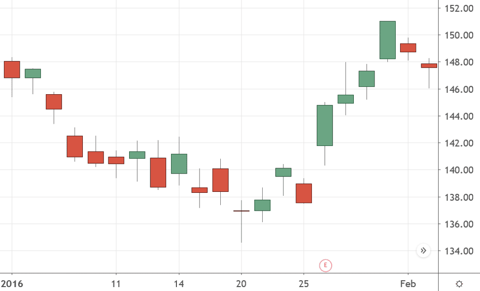

## Table of Contents

## What is the plus-tick rule?

The plus-tick rule is a regulation that was used in the stock market to control short selling. It said that a stock could only be sold short if the last price movement of the stock was upward. This meant that if a stock's price was going down, you couldn't sell it short until it went up a little bit first.

The rule was put in place to prevent short sellers from making the price of a stock fall too quickly. It was thought that this would help keep the market stable. The plus-tick rule was removed in 2007, but some people think it should come back because they believe it would help stop big drops in stock prices.

## Why was the plus-tick rule originally implemented?

The plus-tick rule was originally implemented to slow down how fast stock prices could fall. People were worried that short sellers could make stock prices drop too quickly, which could scare other investors and cause panic in the market. By only allowing short selling when a stock's price had just gone up a little bit, the rule tried to keep the market more stable and prevent big, sudden drops in stock prices.

The rule was seen as a way to protect investors and keep the stock market from getting too wild. It was thought that if short sellers had to wait for a small upward movement before they could sell, it would give the market a chance to calm down and find a more balanced price. This was important because a stable market helps everyone feel more confident about investing.

## How does the plus-tick rule affect stock trading?

The plus-tick rule makes it harder for people to sell stocks short. Short selling is when someone borrows a stock and sells it, hoping to buy it back later at a lower price. With the plus-tick rule, you can only do this if the stock's price just went up a little bit. This rule slows down how fast stock prices can fall because it stops people from selling short when the price is already going down.

This rule helps keep the stock market more stable. When stock prices fall too fast, it can scare other investors and cause panic. By making people wait for a small upward movement before they can sell short, the plus-tick rule gives the market time to calm down. This can help prevent big, sudden drops in stock prices and make investors feel more confident about the market.

## When was the plus-tick rule in effect in the United States?

The plus-tick rule was used in the United States from 1938 until 2007. It was made to stop stock prices from falling too fast. The rule said that you could only sell a stock short if its price had just gone up a little bit. This was to keep the market stable and stop big drops in stock prices.

The rule was taken away in 2007 because some people thought it was not needed anymore. But after it was gone, some big drops in stock prices happened, like in 2008. This made some people think that bringing back the plus-tick rule might help keep the market more stable.

## What led to the repeal of the plus-tick rule?

The plus-tick rule was taken away in 2007 because some people thought it was not needed anymore. They believed that the rule made it harder for the market to work well. They said that the rule stopped short sellers from doing their job, which is to help find the right price for stocks. They thought that without the rule, the market would be more free and work better.

But after the rule was gone, some big drops in stock prices happened, like in 2008. This made some people think that the plus-tick rule might have been helpful after all. They believed that the rule could have stopped the market from falling too fast and kept things more stable. Even though the rule was taken away, some people still think it should come back to help keep the market calm and protect investors.

## How did the repeal of the plus-tick rule impact the stock market?

When the plus-tick rule was taken away in 2007, it made it easier for people to sell stocks short. This meant that short sellers could sell stocks even when the price was going down, which could make the price fall faster. Some people thought this would help the market work better because it let short sellers do their job of finding the right price for stocks. But others were worried that without the rule, the market might become less stable.

After the rule was gone, there were some big drops in stock prices, like in 2008. Some people thought that the plus-tick rule might have helped stop these big drops. They believed that the rule could have slowed down how fast prices fell and kept the market more calm. Even though the rule was taken away, some people still think it should come back to help protect investors and keep the market stable.

## What are the arguments in favor of reinstating the plus-tick rule?

Some people want to bring back the plus-tick rule because they think it would help keep the stock market more stable. They believe that without the rule, short sellers can make stock prices fall too fast. This can scare other investors and cause big drops in the market. The plus-tick rule would make short sellers wait for a small upward movement before they can sell, which could slow down how fast prices fall and give the market time to calm down.

Others argue that the plus-tick rule would protect investors. When stock prices drop quickly, it can be hard for people to know what to do. The rule could help stop these big, sudden drops and make investors feel more confident about the market. By making it harder for short sellers to push prices down, the plus-tick rule could help keep the market more balanced and protect people's investments.

## What are the arguments against the plus-tick rule?

Some people think the plus-tick rule is not a good idea because it can make the market less free. They say that the rule stops short sellers from doing their job, which is to help find the right price for stocks. Without the rule, short sellers can sell stocks whenever they want, which can help the market work better. They believe that letting short sellers do their job without the rule can make the market more fair and efficient.

Others argue that the plus-tick rule might not even work well to stop big drops in stock prices. They say that even with the rule, the market can still have big drops. They think that other things, like how well companies are doing or what's happening in the economy, are more important for stock prices than the plus-tick rule. They believe that trying to control short selling with the rule might not be the best way to keep the market stable.

## How does the plus-tick rule compare to other short-selling regulations?

The plus-tick rule is one way to control short selling, but there are other rules too. One of these is the uptick rule, which is similar to the plus-tick rule. The uptick rule says you can only sell a stock short if the last price change was an increase. The difference is that the plus-tick rule looks at the last price movement, while the uptick rule looks at the last price change. Both rules try to stop stock prices from falling too fast by making short sellers wait for a small upward movement.

Another rule is the circuit breaker rule. This rule stops trading for a while if a stock's price falls a lot in a short time. It gives the market a break to calm down and can help stop big drops in stock prices. Unlike the plus-tick rule, which only affects short selling, the circuit breaker rule stops all trading. Both rules aim to keep the market stable, but they do it in different ways. The plus-tick rule focuses on short selling, while the circuit breaker rule stops all trading to give the market a chance to recover.

## What are the potential effects of the plus-tick rule on market volatility?

The plus-tick rule can help lower market volatility by making it harder for short sellers to push stock prices down quickly. When the rule is in place, short sellers have to wait for a small upward movement in a stock's price before they can sell it short. This slows down how fast prices can fall because it stops people from selling short when the price is already going down. By making short sellers wait, the rule gives the market time to calm down and find a more balanced price. This can help stop big, sudden drops in stock prices and make the market more stable.

On the other hand, some people think the plus-tick rule might not be the best way to control market volatility. They say that the rule can make the market less free because it stops short sellers from doing their job of finding the right price for stocks. Without the rule, short sellers can sell stocks whenever they want, which can help the market work better. Some also argue that even with the plus-tick rule, the market can still have big drops. They believe that other things, like how well companies are doing or what's happening in the economy, are more important for stock prices than the plus-tick rule. So, the rule might not be as effective at controlling market volatility as some people think.

## Can the plus-tick rule be applied to markets other than stocks?

The plus-tick rule can be used in other markets besides stocks, like futures and options. These markets also have short selling, where people sell something they don't own, hoping to buy it back later at a lower price. The plus-tick rule would work the same way in these markets, making people wait for a small upward movement before they can sell short. This could help slow down how fast prices fall and keep these markets more stable.

But using the plus-tick rule in other markets might not be as helpful as it is in the stock market. Each market is different, and what works for stocks might not work as well for futures or options. Some people think that the rule could make these markets less free and stop short sellers from doing their job of finding the right price. So, while the plus-tick rule could be used in other markets, it might not be the best way to keep them stable.

## What are the current alternatives to the plus-tick rule in managing short selling?

Instead of the plus-tick rule, there are other ways to manage short selling today. One way is the uptick rule, which is similar to the plus-tick rule. The uptick rule says you can only sell a stock short if the last price change was an increase. This rule tries to stop stock prices from falling too fast by making short sellers wait for a small upward movement. Another way is the circuit breaker rule, which stops trading for a while if a stock's price falls a lot in a short time. This gives the market a break to calm down and can help stop big drops in stock prices.

There are also rules about how much short selling can happen. For example, some markets have rules that say you can't short sell more than a certain amount of a stock. This is to stop too much short selling from making prices fall too fast. Another rule is that short sellers have to tell the market how many shares they are selling short. This helps everyone know what's going on and can make the market more fair. These rules all try to keep the market stable and protect investors, but they do it in different ways than the plus-tick rule.

## References & Further Reading

[1]: ["The Uptick Rule: Should We Bring It Back?"](https://www.investopedia.com/terms/u/uptickrule.asp) by Amy Fontinelle, Investopedia

[2]: Hill, Joanne, & Ready, Mark. "The impact of the uptick rule on market order stock prices." Journal of Financial Economics, 1991.

[3]: [SEC Release No. 34-55970; File No. S7-21-06](https://www.sec.gov/files/rules/final/2007/34-55970.pdf) - U.S. Securities and Exchange Commission documentation on the removal of the original uptick rule.

[4]: Diether, Karl B., Lee, Kuan-Hui, & Werner, Ingrid M. "It's SHO Time! Short-Sale Price Tests and Market Quality." Journal of Finance, 2009.

[5]: ["Algorithmic Trading and DMA: An Introduction to Direct Access Trading Strategies"](https://www.amazon.com/Algorithmic-Trading-DMA-introduction-strategies/dp/0956399207) by Barry Johnson

[6]: Haoxiang Zhu, Albert Menkveld, & Thomas George, "Does the Uptick Rule Really Make a Difference? The Impact of Short-Sales Constraints on Operating Performance." American Economic Review, 2012.