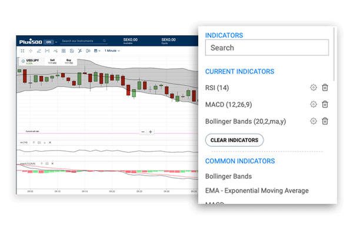

## Table of Contents

## What is Plus500 and how does it work?

Plus500 is an online trading platform that lets people trade things like stocks, forex, and commodities without actually owning them. It's called CFD trading, which stands for Contract for Difference. This means you can make money if the price of something goes up or down, without having to buy or sell the actual thing.

When you use Plus500, you open an account and put some money in it. Then, you can choose what you want to trade. The platform shows you the current prices and lets you decide if you think the price will go up or down. If you're right, you make money. If you're wrong, you lose money. It's important to be careful because trading can be risky, and you could lose more than you put in if you're not careful.

## What are the basic trading strategies for beginners on Plus500?

For beginners on Plus500, one simple strategy is to start with trend following. This means you watch the market to see if prices are going up or down over time. If you see a clear trend, like prices going up, you can buy a CFD hoping the price will keep going up. If the trend is going down, you can sell a CFD hoping the price will keep falling. It's important to use stop-loss orders to limit how much you can lose if the trend changes suddenly.

Another basic strategy is to use support and resistance levels. These are price points where the market often stops and changes direction. If a price often stops going down at a certain level, that's called support. If it often stops going up at a certain level, that's called resistance. You can buy near support levels, hoping the price will bounce back up, or sell near resistance levels, hoping the price will drop back down. Again, using stop-loss orders can help protect your money if the market moves against you.

Lastly, beginners might try a strategy called [scalping](/wiki/gamma-scalping), which involves making lots of small trades to take advantage of small price changes. You might buy and sell quickly, trying to make a little profit each time. This can be exciting but also risky, so it's good to start with small amounts of money until you get the hang of it. Remember, no matter which strategy you use, always be ready to learn and adjust as you gain more experience.

## How can I manage risk when trading on Plus500?

Managing risk when trading on Plus500 is really important to protect your money. One way to do this is by using stop-loss orders. A stop-loss order is like a safety net that automatically closes your trade if the price moves against you by a certain amount. This helps limit how much you can lose on a single trade. Another way to manage risk is by not putting all your money into one trade. It's better to spread your money across different trades, so if one goes wrong, you still have other chances to make money.

It's also a good idea to only trade with money you can afford to lose. Trading can be risky, and you might lose more than you expect, so never use money you need for important things like bills or rent. Lastly, keep learning and stay updated on the markets. The more you know, the better you can predict what might happen and make smarter trading decisions. Remember, it's okay to take breaks if trading starts to feel too stressful.

## What are the key technical indicators used in Plus500 trading?

When trading on Plus500, some key technical indicators that traders use are moving averages, the Relative Strength Index (RSI), and the Moving Average Convergence Divergence (MACD). Moving averages help you see the general direction of the market by smoothing out price data over time. For example, a simple moving average might show you the average price over the last 50 days. If the price is above this average, it might mean the market is going up, and if it's below, it might mean the market is going down. The RSI measures how fast and how much a price is changing to see if a market is overbought or oversold. If the RSI is over 70, it might mean the market is overbought and could go down soon. If it's under 30, it might mean the market is oversold and could go up soon.

Another important indicator is the MACD, which helps you see the relationship between two moving averages of a security's price. The MACD line is the difference between a fast moving average and a slow moving average. When the MACD line crosses above the signal line, it might be a good time to buy, and when it crosses below, it might be a good time to sell. These indicators can help you make better trading decisions by giving you more information about what the market might do next. But remember, no indicator is perfect, and it's always good to use them along with other tools and your own research.

## How do I use fundamental analysis in Plus500 trading?

Fundamental analysis in Plus500 trading means looking at the real value of a company or asset, not just its price. You do this by checking things like how much money the company makes, its debts, and what's happening in the world that could affect it. For example, if you're trading stocks, you might look at a company's earnings reports, news about the industry, and even big events like elections or natural disasters. This helps you decide if a stock is a good buy or if it's overpriced.

When using [fundamental analysis](/wiki/fundamental-analysis) on Plus500, you can make better guesses about where prices might go in the future. If you think a company's earnings will go up because of good news, you might buy its stock, hoping the price will rise. On the other hand, if you see bad news that could hurt a company's profits, you might sell its stock before the price drops. Remember, fundamental analysis works best when you combine it with technical analysis, which looks at price patterns and trends, to get a fuller picture of what might happen next in the market.

## What are advanced trading strategies for experienced users on Plus500?

For experienced users on Plus500, one advanced trading strategy is called "hedging." This means you open two trades at the same time that go in opposite directions. For example, you might buy a stock and also buy a put option on the same stock. If the stock price goes up, you make money on the stock, but if it goes down, you make money on the option. This can help you protect your money from big losses, but it also means you might make less profit because you're paying for both trades.

Another strategy is "swing trading," where you try to catch big moves in the market over a few days or weeks. You use both technical and fundamental analysis to find the right times to buy and sell. You look for patterns in the price charts and also keep an eye on news that could affect the market. This strategy needs a lot of patience and careful planning, but it can lead to bigger profits if you get it right.

## How can I use leverage effectively on Plus500?

Leverage on Plus500 lets you trade with more money than you actually have in your account. It's like borrowing money from the platform to make bigger trades. If you think the price of something will go up, you can use leverage to buy more of it than you could with just your own money. If you're right and the price goes up, you can make a lot more money than if you had just used your own money. But, it's really important to be careful because if the price goes down, you can lose a lot more money too. That's why it's good to start with small amounts of leverage until you get used to how it works.

Using leverage effectively means understanding how much risk you're taking. A good way to do this is by setting stop-loss orders, which automatically close your trade if the price moves against you too much. This can help you limit your losses if things don't go as planned. Also, don't use too much leverage at once. It's better to spread it out over different trades so you're not risking everything on one big bet. Remember, leverage can help you make more money, but it can also make you lose more, so always think carefully before you use it.

## What are the common pitfalls to avoid when trading on Plus500?

One common pitfall to avoid when trading on Plus500 is overtrading. This happens when you make too many trades, hoping to make quick profits. It can lead to big losses because you might not have time to think carefully about each trade. Another mistake is not using stop-loss orders. These orders help you limit how much you can lose on a trade, so if you don't use them, you could lose a lot more money than you planned.

Another pitfall is using too much leverage. Leverage lets you trade with more money than you have, but it can also make your losses bigger if the market moves against you. It's important to use leverage carefully and not to risk more than you can afford to lose. Also, don't ignore the importance of doing your research. Trading without understanding the market and the assets you're trading can lead to bad decisions and losses. Always take the time to learn and stay updated on what's happening in the markets.

## How do I develop a personalized trading plan on Plus500?

To develop a personalized trading plan on Plus500, start by setting clear goals for what you want to achieve. Think about how much money you want to make and how much risk you're willing to take. It's important to be realistic and not expect to get rich quickly. Once you have your goals, decide which markets you want to trade in, like stocks, [forex](/wiki/forex-system), or commodities. Then, choose the trading strategies that fit your goals and the amount of time you can spend on trading. You might want to use a mix of technical and fundamental analysis to make your decisions.

Next, set up rules for managing your money. Decide how much of your money you'll use for each trade and always use stop-loss orders to limit your losses. It's also a good idea to keep a trading journal where you write down your trades, what you learned, and how you can do better next time. This helps you see what works and what doesn't. Remember, your trading plan should be flexible. As you learn more and the market changes, you might need to adjust your plan. The key is to keep learning and stay disciplined, so you can make smart trading decisions on Plus500.

## What role does market sentiment play in Plus500 trading strategies?

Market sentiment is how people feel about the market. It can be positive, negative, or neutral. On Plus500, understanding market sentiment can help you make better trading decisions. If most people feel good about the market, they might buy more, which can push prices up. If they feel bad, they might sell more, which can push prices down. You can check market sentiment by looking at news, social media, and what other traders are doing on Plus500.

Using market sentiment in your trading strategy means you can try to follow the crowd or go against it. If you see that everyone is buying a certain stock because they feel good about it, you might want to buy it too, hoping the price will keep going up. But if you think the market is too excited and the price might drop soon, you could sell the stock instead. It's important to use market sentiment along with other tools like technical and fundamental analysis to make the best trading decisions on Plus500.

## How can I backtest and optimize my trading strategies on Plus500?

Backtesting and optimizing your trading strategies on Plus500 means you look at how your strategy would have worked in the past. You can do this by using historical data to see if your strategy would have made money or lost money. Plus500 doesn't have a built-in tool for [backtesting](/wiki/backtesting), so you might need to use other software or websites that let you do this. You can find historical price data for the markets you trade on Plus500 and then use that data to test your strategy. This helps you see if your strategy is good or if you need to change it.

Once you've backtested your strategy, you can start optimizing it. This means you try to make your strategy even better by changing things like when you buy or sell, how much money you use, or what indicators you look at. You can keep testing different versions of your strategy with the historical data to see which one works best. Remember, just because a strategy worked well in the past doesn't mean it will work well in the future, so always keep learning and adjusting your strategy as you go.

## What are the latest trends and tools for expert traders on Plus500?

Expert traders on Plus500 are increasingly using [algorithmic trading](/wiki/algorithmic-trading) tools to automate their strategies. These tools use computer programs to make trades based on set rules, which can help traders take advantage of market opportunities faster than they could on their own. Many experts also use advanced charting software that's not built into Plus500 but can be used alongside it. These charts give more detailed technical analysis, helping traders spot trends and patterns that might be hard to see with the basic tools on the platform.

Another trend among expert traders is the use of social trading features. While Plus500 doesn't have its own social trading platform, many experts use third-party services to follow and copy the trades of successful traders. This can help them learn new strategies and improve their own trading. Additionally, there's a growing interest in using sentiment analysis tools, which look at news and social media to gauge how people feel about the market. By understanding market sentiment, expert traders can make more informed decisions about when to buy or sell.

## References & Further Reading

[1]: Bergstra, J., Bardenet, R., Bengio, Y., & Kégl, B. (2011). ["Algorithms for Hyper-Parameter Optimization."](https://papers.nips.cc/paper/4443-algorithms-for-hyper-parameter-optimization) Advances in Neural Information Processing Systems 24.

[2]: ["Advances in Financial Machine Learning"](https://www.amazon.com/Advances-Financial-Machine-Learning-Marcos/dp/1119482089) by Marcos Lopez de Prado

[3]: ["Evidence-Based Technical Analysis: Applying the Scientific Method and Statistical Inference to Trading Signals"](https://www.amazon.com/Evidence-Based-Technical-Analysis-Scientific-Statistical/dp/0470008741) by David Aronson

[4]: ["Machine Learning for Algorithmic Trading"](https://github.com/stefan-jansen/machine-learning-for-trading) by Stefan Jansen

[5]: ["Quantitative Trading: How to Build Your Own Algorithmic Trading Business"](https://www.amazon.com/Quantitative-Trading-Build-Algorithmic-Business/dp/0470284889) by Ernest P. Chan