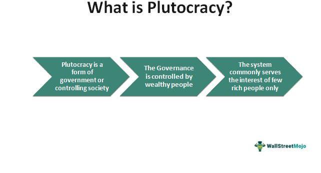

The article focuses on the intersection between political systems, particularly plutocracy, and the concept of algorithmic trading. This intersection is crucial in understanding how financial markets and technological advancements are influenced by the distribution of wealth and power. Plutocracy, a term used to describe a political system where the wealthy hold significant control over government decisions, impacts the economic landscape by shaping policies that may favor affluent individuals and corporations.

Algorithmic trading involves the use of computer algorithms to automatically execute trades based on pre-determined criteria. It is a method that leverages advanced technology and vast datasets to optimize the trading process, often making it faster and more efficient than traditional trading methods. Understanding these key terms is essential for grasping how these systems interact to affect global financial markets.



This article examines how plutocratic influences can affect the development and application of algorithmic trading. The wealthy often have greater access to cutting-edge technology and resources, giving them a competitive edge in financial markets. This concentration of power and economic advantage might not only lead to increased market volatility but also exacerbate economic inequality on a global scale. These are critical considerations that can shape future international economic policies and regulatory frameworks.

By exploring these topics, the article aims to shed light on the implications of plutocracy in financial regulations and market dynamics, encouraging readers to contemplate the balance between technological innovation and ethical governance.

## Table of Contents

## Understanding Plutocracy: Definition and Characteristics

Plutocracy is a form of governance where a society is predominantly controlled by its wealthiest members. The term is derived from the Greek words "ploutos" meaning wealth and "kratos" meaning power or rule. Unlike other political systems, such as oligarchy where power rests with a small group of individuals regardless of wealth, or democracy which theoretically empowers the broader populace, plutocracies emphasize wealth as the primary source of authority. This concentration of power often manifests in policy-making that favors the economic interests of the wealthy, potentially at the expense of the broader population.

One distinguishing feature of plutocracy is its permeation through both formal and informal political structures. Financial resources enable the wealthy to influence government decisions by funding political campaigns, lobbying, and shaping public opinion via media ownership. This mechanism stands in contrast to meritocracies, where power is theoretically distributed based on ability and achievement rather than economic status.

Historically, the Roman Empire exhibited elements of plutocracy, particularly during its later period. The Roman Senate was often dominated by wealthy patricians, whose influence stemmed from substantial landholdings and control over economic resources. Wealth disparity facilitated political dominance, allowing the affluent class to consolidate power through legislative and military means.

In contemporary times, the United States is frequently cited as exhibiting plutocratic tendencies. This is not to say that the United States is a pure plutocracy; rather, it presents elements where wealth influences political dynamics. The vast financial capabilities of certain individuals and corporations allow them disproportionately to influence legislation and public policy through significant election campaign contributions and lobbying efforts. This influence raises concerns about equity in representation and decision-making processes within the democratic framework.

Plutocracy differs significantly from oligarchy, although the two can overlap. Oligarchy is defined by rule by a few, regardless of whether they are wealthy, whereas plutocracy specifically highlights the affluent as those wielding control. In contrast, democracy aims for a broader, participatory method of governance, ideally allowing all citizens a voice in the electoral process and legislative affairs. However, when democracies exhibit plutocratic trends, it often calls into question the effectiveness of their democratic integrity. 

These distinctions emphasize the pivotal role wealth plays in political systems, and understanding these dynamics is crucial for analyzing how economic power impacts governance. Historical examples and modern implications demonstrate that the balance of wealth and power continues to shape political landscapes, raising discussions around equity and the sustainability of democratic principles.

## Examples of Countries with Plutocratic Influences

Plutocracy, a system of governance dominated by the wealthy, finds various manifestations across historical and contemporary societies. The United States often emerges as a prominent example of a nation where wealth and political power intersect significantly. The influence of substantial financial contributions on political campaigns and policy-making exemplifies how affluent individuals and corporations can shape national governance. The U.S. Supreme Court's decision in Citizens United v. Federal Election Commission in 2010, which allowed unlimited political spending by corporations and unions, underscores the power dynamics favoring the wealthy and illustrates the permeation of plutocratic elements within its democratic framework.

Beyond the United States, ancient Rome serves as a historical exemplar of a plutocratic society. The concentration of wealth and land among a small elite gave them substantial influence over political decisions. Wealthy families in Rome wielded power not only in economic terms but also through political positions and military command, demonstrating a stark intersection of wealth and governance. This concentration of power contributed to social stratification and played a role in the eventual fall of the Roman Republic.

Similarly, city-states during the Renaissance, such as Venice and Florence, exhibited plutocratic characteristics. In Venice, the ruling class, known as the patriciate, consisted of wealthy merchants whose economic power allowed them to control the political apparatus of the city-state. This created a governance system where economic interests dominated political decision-making, often at the expense of broader democratic participation.

The implications of plutocracy on national governance are profound. When wealth dictates political outcomes, policy-making often skews towards the interests of the few, potentially leading to increased economic inequality and social stratification. This influence can also hinder efforts toward more equitable economic and social policies, as the priorities of the elite may not align with those of the broader populace.

Overall, the historical and contemporary examples of plutocratic influences highlight the potential challenges in maintaining balanced governance structures when wealth is concentrated among a powerful minority. Such dynamics necessitate constant scrutiny and regulatory efforts to ensure that political systems remain representative and equitable.

## Algorithmic Trading: Overview and How It Works

Algorithmic trading, often abbreviated as algo trading, refers to the use of computer algorithms to execute and manage trades in financial markets. These algorithms make trading decisions at speeds and frequencies beyond human capability, an essential advantage in the fast-paced world of modern finance. The growing importance of [algorithmic trading](/wiki/algorithmic-trading) can be attributed to its efficiency, ability to minimize human errors, and potential for enhanced market [liquidity](/wiki/liquidity-risk-premium) and reduced transaction costs.

**Basic Principles of Algorithmic Trading:**

At its core, algorithmic trading involves pre-programmed instructions that define criteria for trading actions such as timing, price, and quantity. These algorithms leverage mathematical models and statistical analysis to predict market movements and execute trades accordingly. A basic algorithmic trading strategy might look like this:

1. **Define Objectives:** Specify the goal of the trading strategy—whether it’s pursuing arbitrage, trend following, or market making.

2. **Set Parameters:** Establish trade conditions, such as technical indicators that signal buy or sell opportunities. For example, a moving average crossover system reacts to the convergence of shorter-term and longer-term moving averages.

3. **Implement Logic:** Develop the logic to dictate actions based on specific market conditions, such as executing a buy order when the fast-moving average crosses above the slow-moving average.

4. **Backtesting:** Test the strategy against historical market data to evaluate its potential performance and adjust parameters as necessary.

A simple Python implementation of a moving average crossover strategy might look like:

```python
import pandas as pd

def moving_average_crossover(prices, short_window=40, long_window=100):
    signals = pd.DataFrame(index=prices.index)
    signals['price'] = prices
    signals['short_ma'] = prices.rolling(window=short_window, min_periods=1).mean()
    signals['long_ma'] = prices.rolling(window=long_window, min_periods=1).mean()
    signals['signal'] = 0.0
    signals['signal'][short_window:] = (
        signals['short_ma'][short_window:] > signals['long_ma'][short_window:]
    ).astype(float)
    signals['position'] = signals['signal'].diff()

    return signals

# Example usage
prices = pd.Series([...])  # Assume this is your pricing data
signals = moving_average_crossover(prices)
```

**Role of Technology and Data:**

Technology is integral to the effectiveness of algorithmic trading. Advanced hardware and low-latency connectivity ensure rapid execution of trades, giving traders a competitive edge. Furthermore, sophisticated programming languages, such as Python and C++, facilitate the design and implementation of complex trading algorithms.

Data plays a crucial role in algorithmic trading strategies. High-quality, real-time data feeds are essential for timely decision-making, allowing algorithms to respond instantly to market changes. Moreover, historical data is vital for [backtesting](/wiki/backtesting) and optimization of trading models. Big data analytics, [machine learning](/wiki/machine-learning), and [artificial intelligence](/wiki/ai-artificial-intelligence) increasingly enhance the predictive accuracy and adaptability of algorithms, enabling them to adjust to dynamic market conditions.

In summary, algorithmic trading represents a significant evolution in financial markets, driven by technology and data. Its ability to innovate how trades are executed and its growing prevalence underscore its importance in the finance industry.

## The Intersection of Plutocracy and Algorithmic Trading

Plutocratic elements play a significant role in shaping the landscape of algorithmic trading. In a plutocratic system, power is concentrated among the wealthy, who possess greater access to financial resources and advanced technology. This concentration allows affluent individuals and entities to benefit disproportionately from algorithmic trading, amplifying their economic and political influence.

Algorithmic trading thrives on substantial investments in cutting-edge technology and vast volumes of data. These requirements create a barrier to entry, limiting participation to those with significant capital. Wealthy investors can afford superior computing infrastructure, state-of-the-art algorithms, and skilled personnel. For instance, High-Frequency Trading ([HFT](/wiki/high-frequency-trading-strategies)), a subset of algorithmic trading, requires extremely low-latency networks and robust computational power, which are often beyond the reach of smaller market participants.

The advantage provided by algorithmic trading to affluent players is twofold. Firstly, it allows them to execute trades at speeds unattainable by human traders, giving rise to possibilities such as [arbitrage](/wiki/arbitrage) and market-making strategies that can generate substantial profits. Secondly, sophisticated algorithms can analyze patterns and trends from massive data sets, offering insights that foster more informed trading decisions.

This unequal access raises significant ethical and regulatory challenges. The current framework often struggles to address the inherently speculative nature of algorithmic trading, which can exacerbate market [volatility](/wiki/volatility-trading-strategies). A notable example is the Flash Crash of 2010, where rapid algorithmic trades significantly disrupted the stock market, causing a temporary but dramatic swing in the financial markets.

Ethically, the concentration of trading power among the wealthy may contribute to broader economic inequality. When financial systems disproportionately benefit a select group, the effects ripple across broader economic landscapes, potentially marginalizing smaller investors and exacerbating wealth disparity.

Addressing these challenges requires nuanced regulatory approaches. Potential regulations could focus on increasing market transparency, enforcing fair access to technological infrastructure, and imposing latency floors to level the playing field. The introduction of stringent oversight over algorithmic code and trade execution could also mitigate the risks associated with rapid-fire trading.

In conclusion, the intersection of plutocracy and algorithmic trading accentuates the need for balanced governance that can equitably distribute technological advancements while maintaining market integrity. Encouraging broader participation in financial markets, alongside robust ethical and regulatory measures, is crucial for fostering a fairer economic system.

## Impact on Global Markets and Economies

The intertwining of plutocratic influence and algorithmic trading can considerably shape global markets and economies. Plutocratic elements, characterized by the concentration of power within wealthy elites, can exacerbate disparities in the financial sector, offering significant advantages to those with access to substantial resources for creating sophisticated algorithmic trading systems. These systems execute trades at blisteringly fast speeds, capitalizing on minute market inefficiencies often undetectable to the average investor.

Algorithmic trading's impact, influenced by plutocratic structures, presents various economic implications. One of the primary concerns is increased market volatility. Algorithms operate based on predefined rules and data inputs, and when deployed in large volumes by wealthy entities, they can cause rapid fluctuations in asset prices. High-frequency trading, a subset of algorithmic trading, can trigger market destabilization events, similar to the flash crash of 2010 when the Dow Jones Industrial Average dropped significantly within minutes before rebounding. This volatility challenges regulators and traditional market participants, often leaving smaller investors vulnerable.

Furthermore, plutocratic power in algorithmic trading can deepen global economic inequality. Wealthy investors and institutions equipped with advanced technology and data access perpetuate an uneven playing field, capturing substantial market gains unavailable to average investors. This concentration of financial power allows for greater market influence and policy lobbying, potentially skewing regulations to favor elite interests over those of the broader economy. The widening gap in access to financial technologies undermines the democratization of wealth accumulation, entrenching existing economic hierarchies.

The interaction of plutocratic influence and algorithmic trading has the potential to shape international economic policies. As algorithmic trading becomes increasingly central in financial markets, policymakers are prompted to consider its systemic risks and implications. Nations are compelled to rethink regulatory frameworks that can effectively manage the integration of these technologies while maintaining market fairness. Enhanced transparency and regulatory oversight might be sought to mitigate the disproportionate influence of plutocratic entities, potentially leading to changes in global financial regulations.

To summarize, the confluence of plutocracy and algorithmic trading poses significant risks, including increased market volatility and exacerbated economic inequality. This dynamic necessitates a revaluation of economic policies to navigate these challenges effectively. Policymakers must balance the benefits of technological advancements in trading with ethical considerations, aiming to foster equitable economic growth and stability in the global financial system.

## Regulatory Responses and Future Considerations

Current regulatory frameworks for algorithmic trading primarily aim to ensure market stability, transparency, and fairness. In the United States, the Securities and Exchange Commission (SEC) and the Commodity Futures Trading Commission (CFTC) are the main regulatory bodies overseeing these activities. They focus on preventing fraudulent practices, market manipulation, and systemic risks posed by high-frequency trading (HFT) and other algorithmic strategies. Regulations like the Dodd-Frank Act have introduced measures such as mandatory reporting and clearing of certain derivatives to enhance transparency and reduce counterparty risk.

The European Union has implemented the Markets in Financial Instruments Directive (MiFID II), which mandates pre- and post-trade transparency, especially for equities. MiFID II also requires firms to have systems in place to ensure algorithmic trading does not disrupt market orderliness. Similar to the U.S., it places emphasis on risk controls and monitoring to safeguard against excessive market volatility.

Addressing plutocratic influences in financial markets is less straightforward. Current initiatives are limited but growing, focusing on enhancing market access for a broader range of participants. One approach involves encouraging the development and use of less capital-intensive trading technologies, which could democratize access to algorithmic trading tools. 

Future regulatory measures might aim to mitigate the impact of wealth concentration by imposing restrictions on certain trading practices predominantly utilized by wealthy entities. A potential measure could be the introduction of progressive transaction taxes that increase with the [volume](/wiki/volume-trading-strategy) or frequency of trades, targeting high-frequency traders who disproportionately impact market conditions. Another approach could involve promoting transparency of ownership structures and beneficial ownership, ensuring that market dominance is not concealed behind complex corporate entities.

Speculating on the future trajectory of algorithmic trading within plutocratic systems, it is plausible that algorithmic trading will continue to expand, driven by advancements in artificial intelligence and machine learning. These technologies could further entrench the advantages of those with substantial resources unless counterbalancing regulatory measures are established. Without intervention, there is a risk of exacerbating economic inequalities and market concentration. However, with thoughtful regulation prioritizing ethical considerations and fair market access, it might be possible to harness algorithmic trading's potential benefits while curbing its risks. 

Ultimately, the intersection of wealth, political power, and technology in financial markets will necessitate an ongoing dialog among regulators, market participants, and the public to navigate the challenges and opportunities presented by these complex dynamics.

## Conclusion

The exploration of plutocracy and algorithmic trading has unveiled critical insights into the relationship between wealth, political power, and technological advancements. Plutocracy, where the wealthy hold disproportionate power, can significantly impact financial systems, notably through the lens of algorithmic trading. Algorithmic trading, driven by complex algorithms and high-frequency transactions, can be disproportionately beneficial to those with substantial resources, underscoring the inherent advantages for wealthy individuals and entities in harnessing these technologies.

Addressing the intersection of wealth and technological advancements is crucial for creating fairer economic systems. The consolidation of economic power through algorithmic trading in plutocratic contexts poses ethical and regulatory challenges. Therefore, it is essential to ensure that technological innovations in financial markets do not exacerbate economic disparities. Advocacy for equitable access to technology and resources is vital in fostering a financial environment where power is not solely concentrated in the hands of the wealthy.

Encouraging further research and discussion on this topic is imperative. Future investigations should focus on balancing technological innovation with ethical governance. This involves crafting policies that mitigate the effects of wealth concentration while promoting transparency and fairness in algorithmic trading practices. As technology continues to evolve, it is important for policymakers, economists, and technologists to collaboratively pursue pathways that support equitable growth and stability in global economic frameworks, ensuring that advancements benefit broader society rather than a select wealthy few.

## References & Further Reading

[1]: Higgs, R. (2015). ["Wealth and Power: Long-term Trends and the Nature of Plutocracy."](https://scholar.harvard.edu/files/akillewald/files/wealth_inequality_and_accumulation.pdf) The Independent Institute.

[2]: O’Hara, M. (2015). ["High Frequency Market Microstructure."](https://www.sciencedirect.com/science/article/pii/S0304405X15000045) Journal of Financial Economics, 116(2), 257-270.

[3]: United States Supreme Court. (2010). ["Citizens United v. Federal Election Commission, 558 U.S. 310."](https://supreme.justia.com/cases/federal/us/558/310/) Legal Information Institute.

[4]: King, L. P. (2005). ["Financialization and Plutocracy: Is there a Democratic Alternative?"](https://onlinelibrary.wiley.com/doi/10.1111/joes.12242) Critical Sociology, 31(1-2), 179-206.

[5]: Rodrik, D. (2018). ["Straight Talk on Trade: Ideas for a Sane World Economy."](https://www.jstor.org/stable/j.ctvc779z4) Princeton University Press.