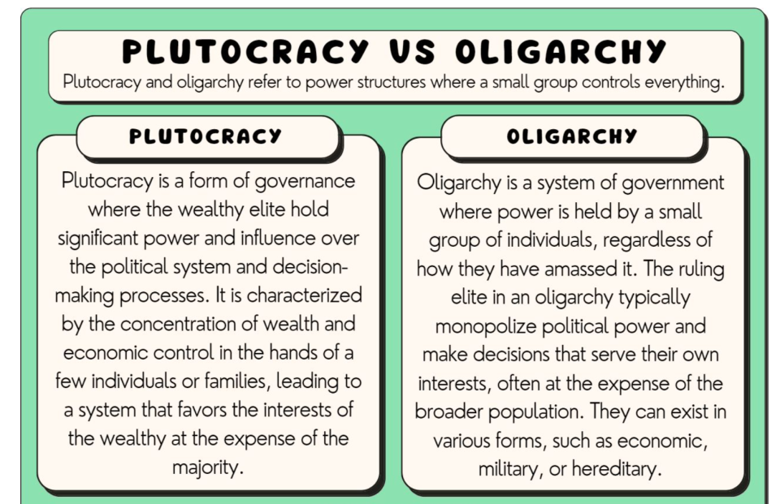

## Table of Contents

## What is the basic definition of plutocracy?

Plutocracy is a type of government where the rich people have the most power. In a plutocracy, the wealthy control the country's decisions and laws. This can happen because they have a lot of money and can influence politicians or even become leaders themselves.

Sometimes, a plutocracy can make the gap between rich and poor even bigger. The rich might make rules that help them get richer, while the poor might not have a say in what happens. This can lead to unfairness and problems in society.

## How does plutocracy differ from other forms of government?

Plutocracy is different from other forms of government because it focuses on wealth. In a plutocracy, the richest people have the most power. They can make decisions and laws that help them stay rich or get richer. This is different from a democracy, where everyone gets to vote and have a say, no matter how much money they have. In a democracy, the government tries to represent what most people want, not just the rich.

Another form of government that is different from plutocracy is a monarchy. In a monarchy, a king or queen rules the country. The power is passed down through a family, not based on how much money someone has. In a plutocracy, there is no royal family, just rich people in charge. Also, in a dictatorship, one person has all the power, and they might not be rich at all. They just take control and make all the decisions. So, plutocracy is unique because it's all about money and wealth, not votes, family, or force.

## Can you provide historical examples of plutocracies?

One example of a plutocracy is ancient Rome during the late Republic and early Empire periods. Rich people, called patricians, had a lot of power. They owned big farms and businesses and could influence the government. They often became senators and made laws that helped them stay rich. Poor people, called plebeians, didn't have much say in what happened. This made the gap between rich and poor even bigger, and it caused a lot of problems in Rome.

Another example is the United States during the Gilded Age in the late 1800s. During this time, very rich people, called robber barons, controlled a lot of the country's businesses and industries. They had so much money that they could influence politicians and laws. This meant that the government often did what the rich wanted, not what was best for everyone. The rich got richer, and the poor had a hard time, which led to a lot of tension and unrest in society.

## What are the key characteristics of a plutocratic system?

In a plutocratic system, the most important thing is money. The richest people have the most power and control. They can make decisions and laws that help them stay rich or get even richer. This means that the government often does what the rich want, not what is best for everyone. The rich can influence politicians by giving them money or by becoming leaders themselves. This can make the gap between rich and poor even bigger because the rich make rules that help them, while the poor don't have much say in what happens.

Plutocracies can lead to a lot of problems in society. When only the rich have power, it can cause unfairness. The poor might feel left out and angry because they don't have a voice in the government. This can lead to tension and unrest. Also, when the rich control everything, they might not care about what is good for the whole country. They might only care about making more money for themselves. This can make life harder for everyone else and can cause big problems in the long run.

## How does wealth influence political power in a plutocracy?

In a plutocracy, wealth is the key to political power. The richest people can use their money to influence politicians and laws. They might give money to politicians who will do what they want, or they might even become leaders themselves. This means that the government often does what the rich want, not what is best for everyone. The rich can make rules that help them stay rich or get richer, while the poor don't have much say in what happens.

This can cause a lot of problems. When only the rich have power, it can make the gap between rich and poor even bigger. The poor might feel left out and angry because they don't have a voice in the government. This can lead to tension and unrest in society. Also, when the rich control everything, they might not care about what is good for the whole country. They might only care about making more money for themselves, which can make life harder for everyone else and cause big problems in the long run.

## What are the potential benefits of a plutocracy, if any?

In a plutocracy, the rich people who run the government might be good at making money. They know how to run businesses and make the economy grow. This can be good for the country because a strong economy can create jobs and make life better for everyone. The rich might also use their money to help the country by building schools, hospitals, and roads. This can make the country a better place to live.

But, there are not many benefits to a plutocracy. The rich might only care about making more money for themselves, not about what is good for everyone. They might make rules that help them get richer, while the poor get left behind. This can make the gap between rich and poor even bigger and cause a lot of problems in society. So, even though a plutocracy might help the economy a little bit, it can also cause a lot of unfairness and trouble.

## What are the criticisms and drawbacks of plutocracy?

One big problem with plutocracy is that it can make the gap between rich and poor even bigger. In a plutocracy, the rich people have all the power. They can make laws that help them get richer, while the poor don't have a say in what happens. This can make life harder for the poor because they don't have the money or power to change things. The rich might not care about what is good for everyone, just about making more money for themselves. This can cause a lot of unfairness and make people angry and upset.

Another problem is that plutocracy can lead to a lot of tension and unrest in society. When only the rich have power, the poor might feel left out and ignored. They might think the government doesn't care about them, which can make them angry and want to fight back. This can cause protests, strikes, and even violence. Also, when the rich control everything, they might not make the best decisions for the whole country. They might only care about their own businesses and money, not about what is good for everyone. This can make big problems worse and make life harder for everyone in the long run.

## How can one identify a plutocracy in modern societies?

In modern societies, you can spot a plutocracy when the richest people have a lot of power over the government. They might give money to politicians who will do what they want, or they might even become leaders themselves. This means that the government often makes laws that help the rich get richer, while the poor don't have much say in what happens. You can see this when big businesses and rich people seem to control what the government does, and when the gap between rich and poor keeps getting bigger.

Another way to identify a plutocracy is by looking at how much influence money has in politics. If rich people can use their money to buy influence, like by giving big donations to political campaigns, it's a sign of a plutocracy. Also, if the government makes decisions that mostly help the rich and ignore the needs of the poor, that's another clue. When you see these things happening, it means that wealth is the key to power, and that's what a plutocracy is all about.

## What role does economic inequality play in the development of plutocracy?

Economic inequality is a big reason why plutocracies can happen. When the gap between rich and poor gets bigger, the rich people have more money and power. They can use their money to influence politicians and laws. This means that the government might start doing what the rich want, not what is best for everyone. The rich can make rules that help them stay rich or get even richer, while the poor don't have much say in what happens. This can make the gap between rich and poor even bigger, and it can lead to a plutocracy where the rich control everything.

When economic inequality is very high, it can make people angry and upset. The poor might feel left out and ignored because they don't have the money or power to change things. This can cause tension and unrest in society. The rich might not care about what is good for everyone, just about making more money for themselves. This can make big problems worse and make life harder for everyone in the long run. So, economic inequality can help create a plutocracy, and it can also make the problems of a plutocracy even worse.

## Are there any current countries or regions considered to be plutocracies?

Some people think that the United States has some parts of a plutocracy. Rich people and big businesses can give a lot of money to politicians. This means that the government sometimes makes laws that help the rich get richer. The gap between rich and poor is getting bigger, and many people think that the rich have too much power. This doesn't mean the whole country is a plutocracy, but some parts of it can look like one.

Another place that some people think might be a plutocracy is Russia. Rich people who are close to the government can have a lot of power. They might use their money to influence what the government does. This can make it hard for poor people to have a say in what happens. Like the United States, Russia is not a full plutocracy, but it has some signs of one.

## How do plutocracies affect social mobility and economic opportunities?

In a plutocracy, social mobility can be very hard. Social mobility means being able to move up in society, like getting a better job or more money. But in a plutocracy, the rich people make the rules. They might make it hard for poor people to get good jobs or go to good schools. The rich can use their money to keep themselves at the top, and it can be very hard for poor people to move up. This can make the gap between rich and poor even bigger, and it can make life harder for everyone who is not rich.

Economic opportunities can also be affected by a plutocracy. The rich people might make laws that help their own businesses and make them richer. They might not care about creating jobs or helping the economy grow for everyone. This means that poor people might not have many chances to start their own businesses or get good jobs. The rich can use their money to control the economy, and this can make it hard for poor people to have the same chances. So, a plutocracy can make it harder for people to move up in society and can limit the economic opportunities for those who are not rich.

## What measures can be taken to prevent or mitigate the effects of plutocracy?

One way to prevent or reduce the effects of plutocracy is to have rules that stop rich people from using their money to control the government. This can mean setting limits on how much money people can give to politicians or political campaigns. By doing this, the government can make decisions based on what is good for everyone, not just the rich. Another way is to make sure that everyone has a voice in the government, no matter how much money they have. This can be done by having fair elections where everyone can vote and by making sure that the government listens to what people want, not just what rich people want.

Another important measure is to help close the gap between rich and poor. This can be done by making sure that everyone has access to good education and healthcare. When people have these things, they have a better chance to move up in society and have good jobs. The government can also make laws that help create more jobs and make the economy grow for everyone, not just the rich. By doing these things, the government can help make sure that everyone has a fair chance and that the rich don't control everything.

## References & Further Reading

[1]: Higgs, R. (2015). ["Wealth and Power: Long-term Trends and the Nature of Plutocracy."](https://scholar.harvard.edu/files/akillewald/files/wealth_inequality_and_accumulation.pdf) The Independent Institute.

[2]: O’Hara, M. (2015). ["High Frequency Market Microstructure."](https://www.sciencedirect.com/science/article/pii/S0304405X15000045) Journal of Financial Economics, 116(2), 257-270.

[3]: United States Supreme Court. (2010). ["Citizens United v. Federal Election Commission, 558 U.S. 310."](https://supreme.justia.com/cases/federal/us/558/310/) Legal Information Institute.

[4]: King, L. P. (2005). ["Financialization and Plutocracy: Is there a Democratic Alternative?"](https://onlinelibrary.wiley.com/doi/10.1111/joes.12242) Critical Sociology, 31(1-2), 179-206.

[5]: Rodrik, D. (2018). ["Straight Talk on Trade: Ideas for a Sane World Economy."](https://www.jstor.org/stable/j.ctvc779z4) Princeton University Press.