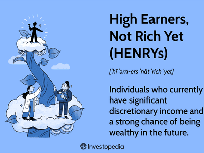

The widening gap between the rich and the poor is an increasingly pressing issue in today's global economy. As wealth becomes more concentrated in the hands of a few, significant socio-economic concerns arise regarding equity, economic stability, and democratic governance. This article examines the interconnected themes of wealth inequality, plutonomy, economic theory, and algorithmic trading, shedding light on their roles in shaping the modern economic landscape.

Plutonomy, a term coined by Citigroup analysts, describes an economic system where the wealthy exert disproportionate influence, leading to economic growth that primarily benefits them. This paradigm challenges the sustainability and fairness of societies by questioning the balance of opportunity and prosperity among different social strata. Understanding plutonomy is essential as it brings to light the dynamics of wealth concentration and its impact on broader economic policies and theories.

Moreover, algorithmic trading, a technology-driven process dominating financial markets, deserves closer scrutiny for its influence on wealth distribution. With its capacity to execute trades at high speeds, algorithmic trading often advantages individuals or entities with substantial resources and technological access, potentially reinforcing existing wealth disparities.

These themes show how deeply interconnected technological advancements, economic theories, and wealth distribution issues are. Exploring their implications allows us to better understand the challenges facing modern economies. By critically examining plutonomy, wealth inequality, and algorithmic trading, we can identify opportunities for promoting greater economic equity and sustainability in the future.

## Table of Contents

## Understanding Plutonomy

Plutonomy is a term that describes an economic structure where a small portion of the population holds a significant share of the wealth. This concept was brought to the forefront by Citigroup analysts who used it to characterize economies where economic growth is predominantly driven by and for the wealthy. In such economies, luxury consumption and high-value investments typically drive the market, creating a cycle that further enriches the affluent minority.

In a plutonomy, economic activity tends to concentrate around goods and services tailored to the wealthy, potentially skewing market dynamics and consumer behavior. This is contrasted with the broader economic theories that often assume consumer behavior is homogeneous across different income levels. By focusing on the spending and investment patterns of the rich, plutonomies challenge these traditional assumptions, requiring a reevaluation of how economic policies are crafted.

Understanding plutonomy is crucial for addressing income inequality, as it exposes the underlying dynamics that contribute to wealth concentration. It raises important questions about the role of economic policies and how they may contribute to sustaining a plutonomic cycle. For instance, fiscal policies that disproportionately benefit high-income earners, such as tax breaks on capital gains or luxury spending, can perpetuate this economic imbalance.

Moreover, plutonomy can potentially exacerbate societal issues related to wealth inequality, as the economic power held by the wealthy minority can influence political decisions, regulatory environments, and broader societal norms. This has implications for democratic processes and economic fairness, making it essential to study and understand plutonomies within the context of comprehensive economic planning and policy-making.

In summary, by examining the principles and implications of plutonomy, we can better understand the complexities of income inequality and its roots in economic structures that heavily favor the affluent. This understanding is vital for developing policies aimed at achieving a more balanced economic environment where opportunities and resources are more evenly distributed across the population.

## Economic Theories Surrounding Plutonomy

Neoclassical and Marxist perspectives offer distinct interpretations of wealth concentration within a plutonomy. Neoclassical economics posits that wealth accumulation results primarily from individual skills, innovation, and entrepreneurship. This perspective assumes that market dynamics function best when individuals, acting in their own self-interest, contribute to overall economic efficiency. The theoretical underpinning suggests that income distribution is a natural outcome of variations in labor productivity and individual merit. High levels of wealth are thus seen as a reward for personal contribution and risk-taking within a competitive market framework. 

On the other hand, Marxist theory provides a critical analysis of capitalism, emphasizing its inherent tendency to create disparities that favor wealth accumulation among the elite. Marxists argue that capitalism inherently leads to an unequal distribution of wealth as it generates a class system where the bourgeoisie—the capitalist class—exploit the proletariat, the working class. This exploitation results in a significant concentration of wealth and economic power among the few, reinforcing societal stratification and reducing economic mobility.

Each theoretical perspective contributes insights into the ways economic policies might influence wealth equality or inequality. Neoclassical theory supports policies that foster entrepreneurship and market freedom as vehicles for wealth creation. Conversely, Marxist theory advocates for structural reforms and policies promoting social equity and wealth redistribution to combat systemic imbalances.

Plutonomy challenges both frameworks, highlighting the limitations of existing theories in addressing extreme wealth concentration. Neoclassical principles may struggle with recognizing the constraints of meritocracy in the face of systemic inequality, where opportunities and outcomes are disproportionately skewed. Similarly, while Marxist theory predicts such concentrations, it requires updated approaches to handle contemporary capitalist structures, including those driven by technological advancements and globalization, which exacerbate wealth disparities.

The pervasive influence of plutonomy necessitates reevaluating established economic theories to better grasp and address modern extreme wealth concentration. Such reevaluation might involve integrating elements from behavioral economics, considering socio-economic factors beyond traditional theory, and exploring the impact of technological advances, such as automation and [artificial intelligence](/wiki/ai-artificial-intelligence), on labor markets and wealth distribution. By fostering theories that encompass the complexities of a global economy marked by significant wealth centralization, policymakers can craft more effective strategies to mitigate inequality.

## Wealth Inequality: A Deepening Issue

Wealth inequality has emerged as a significant challenge, with an increasing concentration of resources in the hands of the elite. This growing disparity has profound implications for several key aspects of society, including social mobility, economic stability, and democratic governance.

Social mobility is often hindered in societies with pronounced wealth inequality. When resources such as quality education, healthcare, and networking opportunities become the privilege of the wealthy, it creates barriers for lower-income individuals striving to improve their socioeconomic status. This lack of upward mobility perpetuates the cycle of poverty, making it challenging to disrupt entrenched economic hierarchies.

Economic stability is also at risk in highly unequal societies. Wealth concentration can lead to distorted economic growth, as consumer spending—typically a driving force in the economy—may be limited to a small segment of the population. This concentration can exacerbate boom and bust cycles as the economic system becomes overly reliant on the financial decisions of a few affluent individuals or entities. In such an environment, economic shocks can have disproportionate effects, further destabilizing the economic framework.

Democratic governance faces its own set of challenges due to wealth inequality. When economic power is concentrated, political influence often follows suit, leading to a democratic deficit where policy decisions favor the interests of the wealthy over those of the broader population. This erosion of democratic principles can increase social tensions, resulting in unrest and a loss of trust in public institutions.

To address wealth inequality, comprehensive policies are essential. Progressive taxation is a critical tool in this regard, as it ensures that higher income earners contribute a fairer share toward funding public goods and services. Additionally, robust social welfare programs can help redistribute wealth by providing support to those in need and fostering more equitable access to essential services.

The role of government is pivotal in these efforts. Policymakers must advocate for and implement measures that promote equitable distribution and minimize the adverse effects of plutonomy. This includes regulatory frameworks that prevent excessive monopolistic practices and ensure fair wages and labor rights. Moreover, international collaboration is necessary to tackle wealth inequality on a global scale, addressing issues such as tax evasion and profit shifting.

In conclusion, reducing wealth inequality is essential for fostering a more inclusive and resilient society. While it presents complex challenges, targeted policies and governance can pave the way for a future where economic opportunities are accessible to all, rather than a select few.

## Algorithmic Trading: Impact and Controversies

Algorithmic trading, a prominent feature of contemporary financial markets, involves the use of computer algorithms to automate trading decisions and execute orders at speeds and frequencies unattainable by human traders. High-frequency trading ([HFT](/wiki/high-frequency-trading-strategies)) forms a large subset of this domain, executing transactions in fractions of a second. 

The rise of [algorithmic trading](/wiki/algorithmic-trading) has undeniably introduced efficiencies and [liquidity](/wiki/liquidity-risk-premium) into markets. By leveraging sophisticated algorithms, traders can quickly respond to market changes, optimize their strategies, and reduce transaction costs. Algorithms analyze extensive data sets to identify patterns and signals that inform buy-and-sell decisions, often outperforming traditional trading methods.

However, this technology is not without controversy. Critics argue that algorithmic trading contributes to increased market [volatility](/wiki/volatility-trading-strategies). The Flash Crash of May 6, 2010, is frequently cited as an instance where high-frequency trading exacerbated a sudden market decline, raising concerns about systemic risks. The rapid pace and interconnectedness of transactions can lead to cascading effects, amplifying fluctuations across financial markets.

Moreover, algorithmic trading tends to benefit large financial entities that can invest heavily in technology and infrastructure. Wealthy investors have access to advanced [machine learning](/wiki/machine-learning) and data processing capabilities, giving them an edge over smaller market participants. This dynamic can reinforce plutonomic trends, whereby wealth concentration is intensified as the rich leverage technology to accrue greater financial advantage.

From a regulatory perspective, balancing innovation with oversight is a formidable challenge. Ensuring market fairness and transparency necessitates that regulators adapt to the evolving landscape of trading technologies. Considerations include imposing limits on trading speeds, enhancing market controls such as circuit breakers, and increasing transparency of trading strategies. 

Algorithmic trading presents both opportunities and risks. Its capacity to revolutionize market operations must be tempered with measures that safeguard against inequities and systemic vulnerabilities. As financial markets evolve, achieving an equilibrium between innovation and regulation will be crucial to promote a more equitable economic environment.

## Future Directions: Addressing Wealth Inequality

Addressing wealth inequality necessitates an overhaul of current economic policies with a focus on equitable resource distribution, enhancing educational opportunities, and ensuring fair labor practices. To effectively tackle wealth inequality, policies should not only distribute resources more evenly but also provide opportunities for upward mobility and economic participation for all individuals, irrespective of their socioeconomic background. 

Key strategies involve the implementation of progressive taxation, which ensures that those with greater wealth contribute a fair share to societal welfare. This approach supports the redistribution of wealth by funding vital public services like education and healthcare, which are crucial for leveling the economic playing field. Additionally, investment in education is paramount for reducing inequality. By improving access to quality education, individuals are better equipped to acquire the skills necessary to succeed in an economy increasingly dominated by technology and specialization.

Fair labor rights also play a critical role in addressing wealth inequality. Ensuring that all individuals have access to fair wages, safe working conditions, and the right to unionize fosters a more balanced income distribution. This can be further supported by governmental policies that protect workers' rights and promote job security, thereby enhancing economic stability.

Technological innovations present both challenges and opportunities in the fight against wealth inequality. Algorithmic trading, for example, has traditionally been dominated by institutional investors with significant resources. By democratizing access to these tools through regulations and supportive frameworks, governments can help level the playing field. Open-source technologies and educational platforms can empower smaller investors and reduce the current disparities in financial market participation.

Actionable steps toward achieving a more equitable and sustainable economic future encompass a multi-faceted approach. Policymakers need to collaborate with educators, technologists, and business leaders to create inclusive growth strategies that harness technological advancements while safeguarding against their potential adverse effects on equality. 

Ultimately, a shift towards an economic framework that prioritizes equitable growth, transparent regulation, and inclusive participation is essential for resolving the pervasive issue of wealth inequality. By implementing these strategies, societies can strive for an economy that not only fosters growth but also ensures that the benefits are shared broadly across all segments of the population.

## Conclusion

 Addressing wealth inequality through comprehensive strategies is crucial for sustainable economic development. The interconnected nature of plutonomy, economic theories, and algorithmic trading plays a significant role in shaping this issue. Plutonomy highlights the concentration of wealth among a small segment of the population, often leading to economic systems that disproportionately favor the rich. This concentration challenges traditional economic theories and necessitates a reevaluation of frameworks to effectively address wealth disparities.

Algorithmic trading further complicates the picture, as it can exacerbate plutonomic trends by providing advantages to wealthy investors with access to cutting-edge technology. Balancing innovation with regulation is critical to ensuring that financial markets remain fair and transparent and do not further entrench existing inequalities.

Successful implementation of policies that promote equity, transparency, and opportunity will be fundamental to countering wealth inequality. These policies may include progressive taxation, robust social welfare programs, fair labor rights, and ensuring equitable access to technological advancements. Collaborative efforts between policymakers, entrepreneurs, and the broader society are necessary to design and implement these strategies effectively.

By understanding and addressing these elements, the goal is to create an economic system that is beneficial to a broader range of participants, rather than predominantly favoring a privileged few. This requires a transformative approach to economic policy, one that prioritizes inclusive growth and ensures that resources and opportunities are distributed more equitably across different segments of society.

## References & Further Reading

[1]: Piketty, T. (2014). *Capital in the Twenty-First Century*. Harvard University Press.

[2]: Frank, R. H. (2007). *Richistan: A Journey Through the American Wealth Boom and the Lives of the New Rich*. Three Rivers Press.

[3]: Krugman, P. (2012). *End This Depression Now!*. W. W. Norton & Company.

[4]: Haldane, A. G., & May, R. M. (2011). ["Systemic Risk in Banking Ecosystems."](https://www.nature.com/articles/nature09659) Nature, 469(7330), 351-355.

[5]: Wilmott, P., & Haug, E. G. (2005). ["The Best of Wilmott 1: Incorporating the Quantitative Finance Review."](https://books.google.com/books/about/The_Best_of_Wilmott_1.html?id=imGSCYliKAYC) Wiley.

[6]: Lazonick, W. (2014). ["Profits Without Prosperity: Stock Buybacks Manipulate the Market and Leave Most Americans Worse Off."](https://hbr.org/2014/09/profits-without-prosperity) Harvard Business Review.

[7]: Stiglitz, J. E. (2012). *The Price of Inequality: How Today's Divided Society Endangers Our Future*. W. W. Norton & Company.

[8]: Vayanos, D., & Woolley, P. (2013). ["An Institutional Theory of Momentum and Reversal."](https://personal.lse.ac.uk/vayanos/Papers/ITMR_RFS13.pdf) The Review of Financial Studies, 26(5), 1087-1145.

[9]: Zuboff, S. (2019). *The Age of Surveillance Capitalism: The Fight for a Human Future at the New Frontier of Power*. PublicAffairs.