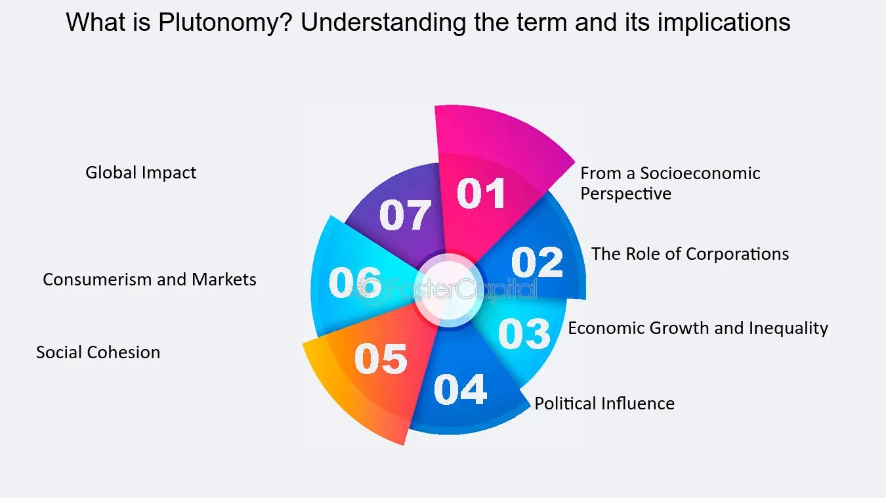

## Table of Contents

## What is the basic definition of plutonomy?

Plutonomy is an economy that is driven by the spending and wealth of a small group of very rich people. These rich people, often called plutocrats, have a lot of money and power. Because they have so much money, their spending can have a big impact on the economy. They buy expensive things like luxury cars, big houses, and fancy vacations, which helps to keep the economy going.

In a plutonomy, the rich get richer while the rest of the population might not see as much benefit. This can lead to a big gap between the rich and the poor. Some people worry that this kind of economy is not fair and can cause problems in society. However, others think that the spending of the rich can create jobs and help the economy grow.

## How does plutonomy differ from other economic systems?

Plutonomy differs from other economic systems mainly because it depends a lot on the spending of a small group of very rich people. In most other economic systems, like capitalism or socialism, the economy is driven by a broader group of people. For example, in capitalism, businesses and consumers of all income levels play a role in driving the economy. In socialism, the government tries to make sure everyone benefits more equally. But in a plutonomy, the rich have a lot more power and their spending has a bigger impact on the economy than in these other systems.

Another big difference is the gap between the rich and the poor. In a plutonomy, this gap can be very wide because the economy grows mainly from the spending of the rich. In contrast, other systems like socialism aim to reduce this gap by spreading wealth more evenly. Even in capitalism, there are efforts to help the middle and lower classes through things like taxes and social programs. But in a plutonomy, the focus is more on the rich, which can lead to bigger differences in wealth and power.

## What are the key characteristics of a plutonomy?

A plutonomy is an economy where a small group of very rich people have a lot of power and their spending drives the economy. These rich people, called plutocrats, buy expensive things like luxury cars, big houses, and fancy vacations. Because they have so much money, their spending can make a big difference in the economy. In a plutonomy, the rich get richer and their wealth grows faster than the rest of the population.

The main thing that makes a plutonomy different from other economies is the big gap between the rich and the poor. In a plutonomy, the economy grows mainly because of what the rich people spend their money on. This can lead to a situation where the rich have a lot more power and money than everyone else. Other economies, like capitalism or socialism, try to spread the wealth more evenly or help more people benefit from the economy. But in a plutonomy, the focus is on the rich, which can make the difference between the rich and the poor even bigger.

## Who coined the term 'plutonomy' and in what context?

The term 'plutonomy' was coined by Ajay Kapur, an economist at Citigroup. He used this word in a series of research reports he wrote in the early 2000s. Kapur and his team at Citigroup used the term to describe economies where the rich have a lot of power and their spending drives the economy.

In these reports, Kapur talked about how countries like the United States, the United Kingdom, and Canada were becoming plutonomies. He said that in these countries, a small group of very rich people were getting richer and their spending was making a big difference in the economy. Kapur's idea was that understanding plutonomies could help investors make better choices about where to put their money.

## What role do the wealthy play in a plutonomic economy?

In a plutonomic economy, the wealthy, or plutocrats, play a big role. They have a lot of money and power, and their spending drives the economy. When they buy expensive things like luxury cars, big houses, and fancy vacations, it helps the economy grow. Because they have so much money, what they spend it on can make a big difference. Their spending can create jobs and help businesses that sell these expensive things.

But in a plutonomic economy, the rich get richer while the rest of the people might not see as much benefit. This can lead to a big gap between the rich and the poor. The wealthy have a lot more power and money than everyone else. Some people worry that this kind of economy is not fair and can cause problems in society. But others think that the spending of the rich can help the economy grow and create jobs for everyone.

## How does income inequality affect a plutonomy?

Income inequality is a big part of a plutonomy. In a plutonomy, the rich have a lot more money than everyone else. This big gap between the rich and the poor can make the economy depend a lot on what the rich people spend their money on. When the rich buy expensive things, it helps the economy grow. But if the rich decide to save their money instead of spending it, the economy can slow down. This means that the economy can be a bit unstable because it relies so much on a small group of people.

This big difference in income can also cause problems in society. When the rich have so much more money and power, it can make people feel like the system is not fair. This can lead to tension and even anger among people who feel left out. Some people might think that the government should do more to help everyone, not just the rich. But in a plutonomy, the focus is on the rich, which can make it hard to change things and make the economy more equal.

## What are the economic indicators used to identify a plutonomy?

Economists look at different things to see if a country is a plutonomy. One big thing they look at is how much money the rich have compared to everyone else. If a small group of people have a lot more money and their spending drives the economy, it might be a plutonomy. They also look at how fast the rich are getting richer compared to the rest of the people. If the rich are getting richer much faster, that's another sign.

Another thing economists check is how much the rich spend on expensive things. If their spending on luxury cars, big houses, and fancy vacations is a big part of the economy, it could mean the country is a plutonomy. They also look at the stock market and how well companies that sell expensive things are doing. If these companies are doing really well, it might be because the rich are spending a lot of money on them.

## Can you explain the function of consumer spending in a plutonomy?

In a plutonomy, consumer spending is really important, but it's mostly about what the rich people spend their money on. The rich, or plutocrats, have a lot of money, so when they buy expensive things like luxury cars, big houses, and fancy vacations, it helps the economy grow. Their spending can create jobs and help businesses that sell these expensive things. Because the rich have so much money, what they spend it on can make a big difference in the economy.

But in a plutonomy, not everyone's spending matters the same way. The rest of the people might not have as much money to spend, so their spending doesn't have as big an impact on the economy. This can make the economy a bit unstable because it relies so much on what the rich decide to do with their money. If the rich decide to save their money instead of spending it, the economy can slow down. So, in a plutonomy, the spending of the rich is the main thing that drives the economy.

## What are the historical examples of plutonomies?

One historical example of a plutonomy is the Roman Republic. In ancient Rome, a small group of rich people, called the patricians, had a lot of power and money. They owned big farms and businesses, and they spent their money on fancy houses, parties, and other expensive things. The rest of the people, called the plebeians, were not as rich and did not have as much power. The economy of Rome depended a lot on what the patricians spent their money on, which made Rome a kind of plutonomy.

Another example is the Gilded Age in the United States, which happened from the 1870s to about 1900. During this time, a few very rich people, called robber barons, owned big businesses and made a lot of money. They spent their money on big mansions, fancy clothes, and expensive trips. The economy grew a lot because of what these rich people spent their money on, but many other people were poor and did not benefit as much. This big difference between the rich and the poor made the U.S. economy during the Gilded Age a lot like a plutonomy.

## How do government policies influence the development of a plutonomy?

Government policies can help a plutonomy grow by making it easier for rich people to get richer. If the government has low taxes for the rich or gives them special breaks, the rich can keep more of their money. They can then spend this money on expensive things, which helps the economy grow. The government might also make rules that help big businesses owned by rich people. These rules can make it easier for the rich to make more money and spend it on things that drive the economy.

But government policies can also try to stop a plutonomy from growing too much. If the government makes rules to spread wealth more evenly, like having higher taxes on the rich or giving more help to poor people, it can make the economy less dependent on the rich. These policies can make the gap between the rich and the poor smaller, which can make the economy more stable and fair. But in a plutonomy, it can be hard to change things because the rich have a lot of power and might not want these changes.

## What are the criticisms and ethical concerns associated with plutonomies?

People who don't like plutonomies say that they are not fair. In a plutonomy, the rich have a lot more money and power than everyone else. This big difference between the rich and the poor can make people feel left out and angry. They might think that the economy should help everyone, not just the rich. Some people worry that when the rich have so much power, they can make rules that help them get even richer, while the rest of the people don't get as much help. This can make the gap between the rich and the poor even bigger, which can cause problems in society.

Another big worry is that plutonomies can be unstable. Because the economy depends so much on what the rich spend their money on, if the rich decide to save their money instead of spending it, the economy can slow down. This can make it hard for the economy to grow in a steady way. Some people think that the government should do more to make the economy more equal and stable. But in a plutonomy, it can be hard to change things because the rich have a lot of power and might not want these changes.

## How can the concept of plutonomy be applied in economic forecasting and analysis?

In economic forecasting and analysis, the concept of plutonomy can help experts understand how the spending of rich people affects the economy. If a country is a plutonomy, economists might look at how much money the rich have and what they spend it on. They can use this information to guess how the economy will grow. For example, if the rich are spending a lot of money on luxury cars and big houses, it might mean the economy will grow because this spending creates jobs and helps businesses.

But economists also need to think about the risks. In a plutonomy, the economy can be unstable because it depends so much on what the rich do with their money. If the rich decide to save their money instead of spending it, the economy might slow down. So, when making forecasts, economists need to think about how the rich might change their spending habits. This can help them predict if the economy will stay strong or if it might have problems.

## References & Further Reading

[1]: Piketty, T. (2014). *Capital in the Twenty-First Century*. Harvard University Press.

[2]: Frank, R. H. (2007). *Richistan: A Journey Through the American Wealth Boom and the Lives of the New Rich*. Three Rivers Press.

[3]: Krugman, P. (2012). *End This Depression Now!*. W. W. Norton & Company.

[4]: Haldane, A. G., & May, R. M. (2011). ["Systemic Risk in Banking Ecosystems."](https://www.nature.com/articles/nature09659) Nature, 469(7330), 351-355.

[5]: Wilmott, P., & Haug, E. G. (2005). ["The Best of Wilmott 1: Incorporating the Quantitative Finance Review."](https://books.google.com/books/about/The_Best_of_Wilmott_1.html?id=imGSCYliKAYC) Wiley.

[6]: Lazonick, W. (2014). ["Profits Without Prosperity: Stock Buybacks Manipulate the Market and Leave Most Americans Worse Off."](https://hbr.org/2014/09/profits-without-prosperity) Harvard Business Review.

[7]: Stiglitz, J. E. (2012). *The Price of Inequality: How Today's Divided Society Endangers Our Future*. W. W. Norton & Company.

[8]: Vayanos, D., & Woolley, P. (2013). ["An Institutional Theory of Momentum and Reversal."](https://personal.lse.ac.uk/vayanos/Papers/ITMR_RFS13.pdf) The Review of Financial Studies, 26(5), 1087-1145.

[9]: Zuboff, S. (2019). *The Age of Surveillance Capitalism: The Fight for a Human Future at the New Frontier of Power*. PublicAffairs.