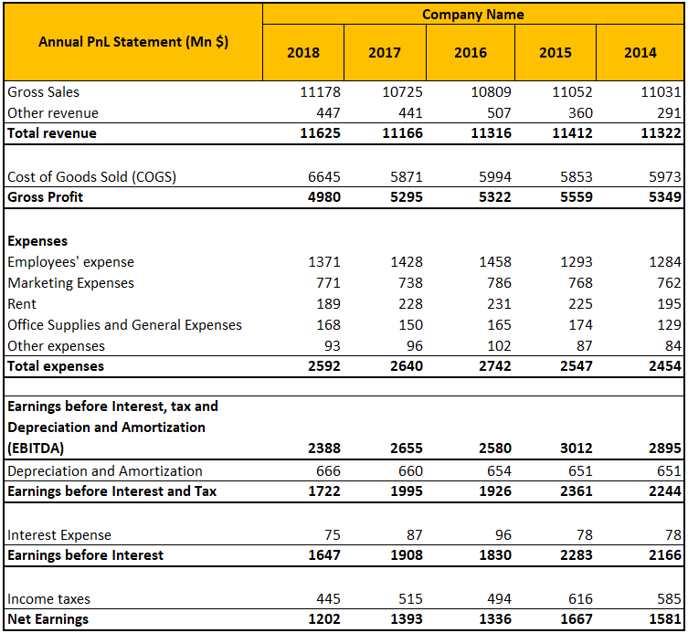

Algorithmic trading, often referred to as algo trading, has significantly transformed financial markets, enabling more rapid and efficient trading strategies. This advancement has been made possible by automating trading strategies using complex algorithms and computer systems, allowing traders to capitalize on market opportunities much faster than traditional trading methods. At the core of assessing these strategies is the Profit and Loss (PnL) metric, a fundamental indicator of financial performance.

Profit and Loss, or PnL, serves as a crucial metric in evaluating the success of a trading strategy. PnL provides traders with a clear representation of the financial gains or losses incurred over a specific period from their trading activities. This metric is integral because it allows traders to ascertain the efficiency and profitability of their algorithms, enabling them to make informed decisions about continuing, modifying, or discontinuing certain trading strategies.



In this article, we will explore the concept of PnL in the context of algorithmic trading. The discussion will include the importance of PnL, the methodologies used to calculate it, and how it can be leveraged to optimize trading strategies. Additionally, we will examine the integration of PnL into various trading platforms and systems, highlighting its role in enhancing traders' decision-making processes. The accurate calculation and interpretation of PnL involve considerations such as transaction costs, commissions, and other financial fees, providing a comprehensive overview of a strategy's revenue outcome.

Understanding PnL is essential for traders aiming to evaluate the effectiveness and inherent risks of their trading strategies. By gaining insights into PnL, traders can critically assess performance, address potential pitfalls, and ultimately improve their trading outcomes. As we discuss PnL's roles and applications in algo trading, traders will gain valuable knowledge on optimizing their strategies for better financial performance and risk management.

## Table of Contents

## Understanding PnL in Algo Trading

Profit and Loss (PnL) represents the net outcome of trading activities, encapsulating the differences between revenue generated and expenses incurred over a specified timeframe. This metric is integral for traders, serving as a key performance indicator to assess the success or failure of their trading strategies. In the context of [algorithmic trading](/wiki/algorithmic-trading), PnL is typically calculated by automated systems designed to meticulously track every transaction executed by trading algorithms.

Automated PnL calculations are crucial for several reasons. One primary advantage is the consideration of transaction costs, commissions, and other assorted fees which directly affect the profitability of a trading strategy. For instance, a simple PnL calculation could be expressed as:

$$
\text{PnL} = \sum (\text{Sell Price} \times \text{Quantity}) - \sum (\text{Buy Price} \times \text{Quantity}) - \text{Fees}
$$

This formula outlines the fundamental approach to calculating PnL, where revenue from asset sales is offset by purchase costs and additional fees incurred during trades. Such calculations help provide a comprehensive view of strategy performance, enabling algorithmic traders to effectively gauge the profitability and efficiency of their deployed strategies.

Moreover, understanding PnL assists traders in pinpointing potential areas for improvement within their trading models. By analyzing PnL data, traders can identify patterns of performance, investigate potential inefficiencies, and make informed decisions regarding strategy adjustments. Enhanced PnL insight allows traders to refine algorithms, improve risk management approaches, and ultimately enhance overall trading outcomes.

This analytic process is vital, as it not only reinforces the success of existing strategies but also fosters the development of more robust and resilient trading systems. As a result, understanding PnL becomes an essential competency for any trader engaged in algorithmic trading to ensure continuous strategy optimization and financial success.

## Importance of PnL in Algo Trading

Profit and Loss (PnL) is essential for evaluating and measuring algorithmic trading strategies. It acts as a direct indicator of a trading strategy’s success, with a high PnL pointing to profitability and a low PnL signaling the need for strategic reassessment. By contrasting the PnL of different strategies, traders can identify which approaches yield the most consistent and superior results. This comparison is vital for strategic optimization and risk management, allowing traders to adjust their methods to maximize returns and maintain balanced risk levels.

PnL's role in risk management cannot be overstated. Traders utilize it to assess the average profits against average losses, facilitating a nuanced understanding of a strategy’s risk-reward profile. By evaluating PnL data, traders can incorporate stop-loss measures and adjust position sizes to achieve desired risk exposures, thus safeguarding against significant market downturns.

Furthermore, PnL serves as a benchmark, enabling traders to benchmark current strategies against historical performance or alternative strategies. This comparison process enhances strategic alignment with market conditions and objectives, ensuring that trading decisions are informed by empirical data rather than intuition.

Efficient analysis of PnL allows for a deeper insight into the strengths and weaknesses inherent in a trading strategy. Traders can pinpoint underperforming elements and optimize accordingly, ensuring that the strategy is fine-tuned for performance enhancement.

For algorithmic traders, a thorough comprehension of PnL is indispensable in crafting robust strategies designed to meet specific trading goals. Armed with PnL analysis, traders are better equipped to refine algorithms continuously, adapting to market changes, boosting profitability, and securing a competitive edge in a fast-evolving trading environment.

## Calculating PnL in Algorithmic Trading

Calculating Profit and Loss (PnL) in algorithmic trading involves more than just the straightforward equation of PnL = Total Sales - Total Cost. While this basic formula sets the foundation, algo trading requires a nuanced approach due to the complexity of financial markets and trading technologies. Here, we explore various aspects critical to PnL calculations in this domain.

### Advanced PnL Models

In algorithmic trading, PnL calculations must consider factors such as slippage, latency, and market impact. **Slippage** refers to the difference between the expected price of a trade and the actual price, often occurring during periods of high [volatility](/wiki/volatility-trading-strategies). Accounting for slippage is crucial, as it can significantly affect the realized PnL.

**Latency** is the delay between the time a trading signal is generated and when it is executed in the market. High-frequency traders, in particular, must minimize latency to ensure trades are executed at desired prices, directly impacting PnL.

**Market impact** refers to the influence that a trade has on the market price. Large trades can move markets unfavorably for the trader, which needs to be factored into sophisticated PnL models. These aspects make it clear that real-world PnL can differ from backtested results due to real-time market dynamics.

### Tools and Simulations

Modern trading platforms offer tools that enable traders to simulate PnL outcomes by inputting various market conditions and transaction scenarios. These tools incorporate algorithms to project potential outcomes, helping traders foresee and plan for diverse trading climates. By simulating potential PnL scenarios, traders can better understand the implications of different trading strategies and market conditions.

For example, traders can utilize Python scripts to simulate trades under varying market conditions. Here’s a basic outline of such a simulation:

```python
def calculate_pnl(trades):
    pnl = 0.0
    for trade in trades:
        pnl += trade['sales'] - trade['cost'] - trade['slippage'] - trade['fees']
    return pnl

# Example trades with varying slippage and fees
trades = [
    {'sales': 105, 'cost': 100, 'slippage': 0.5, 'fees': 0.2},
    {'sales': 110, 'cost': 107, 'slippage': 0.4, 'fees': 0.3}
]

print(f"Total PnL: {calculate_pnl(trades)}")
```

### Hidden Costs and Optimization

Identifying and accounting for hidden costs is paramount. Besides direct transaction costs, traders must consider fees associated with brokerage, data feeds, and technology infrastructure. Uncovering these costs can provide insights into optimizing algorithms for greater efficiency and profitability.

### External Influences

Finally, it's vital to account for external influences like market volatility and macroeconomic events. **Volatility** can lead to erratic price movements, affecting profitability expectations. Macroeconomic events, such as [interest rate](/wiki/interest-rate-trading-strategies) changes or geopolitical shifts, can cause market disruptions, impacting PnL forecasts. By integrating external data into PnL calculations, traders can achieve a more comprehensive understanding of potential risks and opportunities.

Through advanced models, real-time simulations, and a vigilant approach to hidden costs and external factors, traders can accurately calculate and optimize PnL in algorithmic trading, paving the way for enhanced strategy performance.

## Utilizing PnL for Strategy Optimization

Profit and Loss (PnL) is an essential metric not only for evaluating historical performance but also for driving future strategy optimizations in algorithmic trading. Traders use historical PnL data to discern patterns and correlations, which aids in making more informed decisions. These analyses help to identify consistent trends or anomalies that could indicate areas for strategy refinement.

Incorporating [machine learning](/wiki/machine-learning) and [artificial intelligence](/wiki/ai-artificial-intelligence) is increasingly becoming a method to enhance PnL outcomes. These technologies can process large datasets to identify intricate patterns that may elude traditional analysis. By leveraging past results, machine learning algorithms can continuously refine and adapt trading strategies, thereby optimizing PnL.

Setting clear PnL benchmarks is vital for establishing effective performance targets and risk management strategies. Benchmarks provide a quantifiable measure that traders can aim to achieve or exceed. These targets are crucial in assessing whether a trading strategy is performing as expected or needs adjustment.

Optimization using PnL involves several iterative processes such as testing, [backtesting](/wiki/backtesting), and fine-tuning trading algorithms. During backtesting, traders simulate trades on historical data to evaluate how a strategy might have performed, allowing them to understand its potential profitability and risks. This step often reveals how strategies can be altered to improve outcomes.

An iterative approach enables traders to systematically test modifications and assess their impact on PnL. Python code can be a useful tool in this iterative process. For instance, the use of libraries such as NumPy or pandas can facilitate the analysis of time-series data. Here’s a simple example of how Python might be employed to analyze PnL data:

```python
import pandas as pd
import numpy as np

# Load historical PnL data
pnl_data = pd.read_csv('pnl_data.csv')

# Calculate the rolling mean and standard deviation for PnL
rolling_mean = pnl_data['PnL'].rolling(window=20).mean()
rolling_std = pnl_data['PnL'].rolling(window=20).std()

# Identify potential optimization points
potential_optimizations = pnl_data[(pnl_data['PnL'] < rolling_mean - 2 * rolling_std) | 
                                   (pnl_data['PnL'] > rolling_mean + 2 * rolling_std)]

print(potential_optimizations)
```

Such analytical tools enable traders to pinpoint times when PnL deviated significantly from expected ranges, indicating opportunities for strategy improvement.

By continuously monitoring, analyzing, and adjusting their strategies based on PnL, traders can strive to achieve maximum efficacy in their algorithmic trading endeavors.

## Challenges and Considerations

While PnL offers critical insights into trading strategy performance, traders must be aware of its inherent limitations. First and foremost, PnL is susceptible to fluctuations due to market conditions. Changes in market volatility can have significant impacts on PnL, influencing the price movements and [liquidity](/wiki/liquidity-risk-premium) that algorithms depend on. Thus, adaptive strategies that can respond to diverse market environments are essential.

Transaction fees and commissions present another challenge for PnL calculations. These costs can erode profits, especially in high-frequency trading where numerous trades accumulate substantial fees. Even slight changes in fee structures can impact the overall profitability of an algorithmic strategy. Traders must incorporate these variables into their models for a comprehensive assessment of actual performance.

Unforeseen events, such as geopolitical developments or sudden regulatory changes, can also affect PnL. Such events can lead to tumultuous market conditions, adding layers of uncertainty that challenge algorithmic trading systems. Because of this, continuous monitoring and the capacity to adjust strategies swiftly are crucial for maintaining desired PnL outcomes.

A balanced approach that considers the pursuit of higher PnL alongside effective risk management is imperative. Overemphasizing PnL can lead to excessive risk-taking, potentially resulting in substantial losses. To mitigate this, traders should establish risk thresholds and employ risk management techniques like stop-loss orders or diversification to protect their capital.

Finally, accurately interpreting PnL requires a consideration of the broader market context and external influences. Traders should not evaluate PnL in isolation but rather in conjunction with factors such as economic indicators and global economic conditions. Understanding these influences can provide deeper insights into the true performance of trading strategies and guide strategic adjustments.

In summary, while PnL is an invaluable metric for assessing trading strategies, it is affected by several variables, including market conditions, fees, and unexpected events. Therefore, a holistic approach that combines continuous monitoring, adaptation, and risk management is essential for leveraging PnL effectively.

## Conclusion

Profit and Loss (PnL) is a fundamental component of evaluating and optimizing algorithmic trading strategies. It serves not only as a measure of financial performance but also as a tool for making informed decisions that can enhance the efficacy of trading algorithms. By understanding the intricacies of PnL and leveraging it effectively, traders can significantly increase the performance and profitability of their automated trading systems. The ongoing analysis of PnL data enables traders to adapt to the rapidly changing dynamics of financial markets, thus maintaining a competitive edge.

Moreover, PnL, when analyzed alongside other key metrics and market intelligence, provides a comprehensive framework for successful algorithmic trading. This multi-dimensional approach facilitates a deeper understanding of market trends and informs strategic adjustments. As technology and financial markets continue to evolve, the advanced analysis of PnL will remain central to the development of robust strategies and efficient risk management practices. This ensures that traders not only meet their performance targets but also effectively manage potential losses.

## References & Further Reading

[1]: Bergstra, J., Bardenet, R., Bengio, Y., & Kégl, B. (2011). ["Algorithms for Hyper-Parameter Optimization."](https://papers.nips.cc/paper/4443-algorithms-for-hyper-parameter-optimization) Advances in Neural Information Processing Systems 24.

[2]: ["Advances in Financial Machine Learning"](https://www.amazon.com/Advances-Financial-Machine-Learning-Marcos/dp/1119482089) by Marcos Lopez de Prado

[3]: ["Evidence-Based Technical Analysis: Applying the Scientific Method and Statistical Inference to Trading Signals"](https://www.amazon.com/Evidence-Based-Technical-Analysis-Scientific-Statistical/dp/0470008741) by David Aronson

[4]: ["Machine Learning for Algorithmic Trading"](https://github.com/stefan-jansen/machine-learning-for-trading) by Stefan Jansen

[5]: ["Quantitative Trading: How to Build Your Own Algorithmic Trading Business"](https://books.google.com/books/about/Quantitative_Trading.html?id=j70yEAAAQBAJ) by Ernest P. Chan