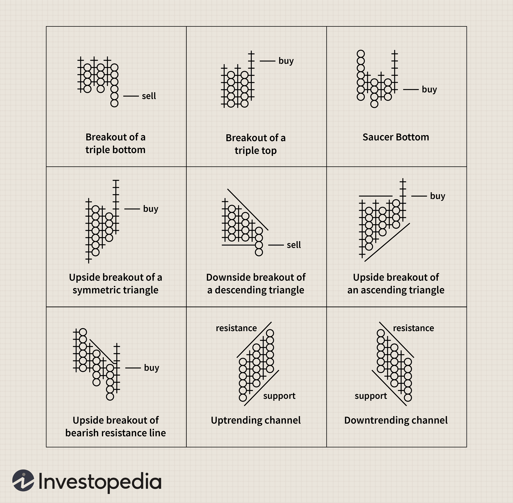

## Table of Contents

## What is a Point-and-Figure chart and how does it differ from other types of charts?

A Point-and-Figure chart is a type of chart used in technical analysis to track price movements of a security, commodity, or currency. Unlike traditional charts that plot price against time, Point-and-Figure charts focus solely on significant price changes. They use columns of X's and O's to represent rising and falling prices, respectively. A new X is added when the price rises by a certain amount, called the box size, and a new O is added when the price falls by the same amount. This method helps traders filter out minor price fluctuations and focus on more meaningful trends.

Point-and-Figure charts differ from other types of charts, like line, bar, and candlestick charts, in several ways. First, they do not consider time, so the horizontal axis does not represent specific time periods. This makes them useful for identifying long-term trends without the noise of short-term movements. Second, they use a specific reversal criterion, typically three boxes, to switch from an X column to an O column or vice versa. This feature helps in spotting trend reversals more clearly than other charts. Overall, Point-and-Figure charts provide a unique perspective on price movements, emphasizing significant changes and trends over time.

## How do you construct a Point-and-Figure chart?

To construct a Point-and-Figure chart, you first need to decide on the box size, which is the minimum price change needed to add a new X or O to the chart. For example, if you choose a box size of $1, the price must rise by $1 to add a new X, or fall by $1 to add a new O. You also need to set a reversal amount, typically three boxes. This means the price must move in the opposite direction by three times the box size to start a new column.

Start with a blank chart and a price series. If the price goes up by the box size, draw an X in the first column. Keep adding X's as the price continues to rise by the box size. If the price falls by three times the box size, start a new column to the right and draw an O for each box size drop. If the price then rises by three times the box size, start another new column to the right and draw X's again. Continue this process, always starting new columns when the price reverses by the chosen reversal amount. This method helps you see big price changes without getting distracted by small ups and downs.

## What are the basic components of a Point-and-Figure chart?

A Point-and-Figure chart has two main parts: columns of X's and columns of O's. The X's show when the price is going up. Each X means the price went up by a certain amount, which we call the box size. The O's show when the price is going down. Each O means the price went down by the same box size. So, if you see a column of X's, it means the price kept going up, and if you see a column of O's, it means the price kept going down.

The other important part of a Point-and-Figure chart is the reversal amount. This is how much the price needs to change to switch from a column of X's to a column of O's, or from O's to X's. Usually, this is set at three times the box size. So, if the price was going up and making X's, it needs to drop by three times the box size before you start a new column of O's. This helps you see big changes in the price and ignore the small ones.

## What is the significance of the box size and reversal amount in Point-and-Figure charting?

The box size in Point-and-Figure charting is really important because it decides how big a price change needs to be before you add a new X or O to the chart. If you choose a small box size, you'll see more X's and O's because even small price changes will count. But if you pick a bigger box size, you'll only see X's and O's when the price changes a lot. This helps you focus on the big price moves and ignore the little ones that might not matter as much.

The reversal amount is also key because it tells you how much the price needs to change to switch from making X's to O's, or from O's to X's. Usually, this is set at three times the box size. So, if the price was going up and you were drawing X's, it needs to go down by three times the box size before you start a new column with O's. This helps you spot when the price trend is really changing, instead of just bouncing around a bit. By using these two things together, you can make a chart that shows the big, important price moves clearly.

## How can Point-and-Figure charts help in identifying support and resistance levels?

Point-and-Figure charts are really useful for finding support and resistance levels. These are prices where the price tends to stop going down or up. On a Point-and-Figure chart, you can see support levels where the price keeps bouncing back up from. This happens when you see a lot of O's in a column, but then the price starts making X's again at the same level. It means that price level is like a floor that the price doesn't want to fall through.

Resistance levels are the opposite. They are prices where the price keeps hitting but can't go higher. On the chart, you'll see a lot of X's in a column, but then the price starts making O's at the same level. This shows that the price level is like a ceiling that the price can't break through. By looking at where these patterns happen a lot, you can spot the important support and resistance levels and use them to make better trading decisions.

## What are the common patterns found in Point-and-Figure charts and what do they indicate?

Point-and-Figure charts show some common patterns that help traders figure out what might happen next with the price. One pattern is called a "Double Top," which happens when the price goes up, comes down a bit, and then goes up again to the same level before falling. This pattern shows that the price can't go higher and might start going down soon. Another pattern is a "Double Bottom," which is the opposite. It happens when the price goes down, goes up a bit, and then goes down again to the same level before going up. This shows that the price can't go lower and might start going up soon.

Another important pattern is the "Triple Top," which is like the Double Top but with one more high. The price goes up, comes down, goes up again, comes down, and then goes up one more time to the same level before falling. This is a stronger sign that the price might start going down. The "Triple Bottom" is like the Double Bottom but with one more low. The price goes down, goes up, goes down again, goes up, and then goes down one more time to the same level before going up. This is a stronger sign that the price might start going up.

These patterns help traders see where the price might be turning around. By watching for these patterns, traders can guess if the price will keep going the same way or start moving in the opposite direction. This can help them decide when to buy or sell.

## How can traders use Point-and-Figure charts to set price targets?

Traders use Point-and-Figure charts to set price targets by counting the number of columns in a pattern. When they see a Double or Triple Top or Bottom, they can measure how many columns are in the pattern and use that to guess where the price might go next. For example, if there's a Double Top breakout, traders count the number of columns from the lowest point of the pattern to the breakout point. Then, they add that number of columns to the breakout price to find a target price. This helps them know where the price might go if the trend continues.

Another way to set price targets is by using trend lines on the Point-and-Figure chart. Traders draw lines along the highs and lows of the X's and O's to see the overall direction of the price. When the price breaks through these trend lines, it can signal a big move. Traders then use the same counting method to find where the price might go after the breakout. By using these methods, traders can make better guesses about future price movements and set their targets accordingly.

## What are the advantages of using Point-and-Figure charts over traditional time-based charts?

Point-and-Figure charts have some big advantages over traditional time-based charts. They focus on big price changes and ignore small ones. This means they help traders see the important trends without getting distracted by little ups and downs. Also, because Point-and-Figure charts don't use time, they can show long-term trends more clearly. This is really helpful for traders who want to know where the price might go in the future without worrying about what happened every day or every hour.

Another advantage is that Point-and-Figure charts make it easier to spot when the price is about to change direction. They use clear patterns like Double Tops and Double Bottoms to show when the price might start going the other way. This helps traders make better decisions about when to buy or sell. Plus, Point-and-Figure charts help traders set price targets by counting the columns in these patterns. This gives them a good idea of where the price might go next, which can help them plan their trades more carefully.

## How can Point-and-Figure charts be used to manage risk in trading?

Point-and-Figure charts can help traders manage risk by showing clear support and resistance levels. These levels are where the price often stops and turns around. Traders can use these levels to set stop-loss orders, which are like safety nets that automatically sell a stock if the price drops too much. By setting a stop-loss just below a support level, traders can limit how much money they might lose if the price goes down. This helps them stay in control and not lose too much if things don't go as planned.

Another way Point-and-Figure charts help with risk management is by making it easier to spot when the price might change direction. Patterns like Double Tops and Double Bottoms show when the price might start going the other way. If traders see these patterns, they can adjust their trades to protect their money. For example, if they see a Double Top, they might decide to sell before the price starts dropping. By using these patterns, traders can make smarter choices and keep their risk low.

## What are some advanced techniques for analyzing Point-and-Figure charts?

One advanced technique for analyzing Point-and-Figure charts is using trend lines. Traders draw lines along the highs and lows of the X's and O's to see the overall direction of the price. When the price breaks through these trend lines, it can signal a big move. Traders can then use the same counting method to find where the price might go after the breakout. This helps them make better guesses about future price movements and set their targets accordingly.

Another technique is using moving averages on Point-and-Figure charts. Even though these charts don't use time, traders can still calculate moving averages by counting the number of X's and O's over a certain number of columns. This helps them smooth out the price data and see the trend more clearly. If the price crosses above or below the moving average, it can be a sign to buy or sell. This method helps traders make more informed decisions and manage their risk better.

## How can Point-and-Figure charts be integrated with other technical analysis tools?

Point-and-Figure charts can be used with other technical analysis tools to make better trading decisions. One way to do this is by using them with moving averages. Even though Point-and-Figure charts don't use time, traders can still calculate moving averages by counting the number of X's and O's over a certain number of columns. This helps them smooth out the price data and see the trend more clearly. If the price crosses above or below the moving average, it can be a sign to buy or sell. By combining Point-and-Figure charts with moving averages, traders can get a clearer picture of the trend and make more informed decisions.

Another way to use Point-and-Figure charts with other tools is by looking at volume. While Point-and-Figure charts focus on price changes, adding volume data can show how strong a price move is. If a breakout on a Point-and-Figure chart happens with high volume, it's a stronger sign that the price will keep moving in that direction. Traders can use volume indicators like the On-Balance Volume (OBV) to see if the volume supports the price movement they see on the Point-and-Figure chart. This combination helps traders confirm their trading signals and manage their risk better.

## What are the limitations and criticisms of using Point-and-Figure charts in trading?

One big limitation of Point-and-Figure charts is that they don't show time. This means traders can't see how long it took for a price to move from one point to another. This can be a problem because knowing how long a trend lasts can be important for making trading decisions. Also, because Point-and-Figure charts focus only on big price changes, they might miss out on some important information that smaller price movements can give. This could make traders miss out on some trading opportunities or not see all the risks involved.

Another criticism is that Point-and-Figure charts can be hard to understand for people new to trading. The patterns and rules for drawing X's and O's might seem confusing at first. Also, setting the right box size and reversal amount can be tricky. If these are not set correctly, the chart might not show the trends clearly. Traders also need to be careful because Point-and-Figure charts can sometimes give false signals, especially if the market is moving sideways without a clear trend. This means traders need to use other tools and methods along with Point-and-Figure charts to make the best decisions.

## How can you develop price targets using Point-and-Figure charts?

Point-and-Figure (P&F) charting offers unique methodologies for developing price targets through the use of vertical and horizontal count techniques. These approaches are grounded in the interpretation of historical price patterns, allowing traders to forecast potential price movements and establish strategic trade entry and [exit](/wiki/exit-strategy) points.

### Vertical Count Method

The vertical count method is predicated on the projection of price movement based on the height of a completed column of Xs or Os on the P&F chart. This technique provides insight into the expected extent of a price move following a breakout. The calculation involves the following steps:

1. **Identify the Column**: Locate a completed column of Xs or Os that represents a significant price move or breakout.
2. **Count the Boxes**: Count the number of boxes in the identified column.
3. **Calculate the Price Move**: Multiply the number of boxes by the box size and the reversal value to project the price target.

Let:

- $c$ be the count of boxes in the column,
- $b$ the box size,
- $r$ the reversal value,

Then the projected price target $T_v$ is:

$$
T_v = c \times b \times r
$$

This calculated value provides traders with an anticipated price level, helping them decide on potential exits or additional buy/sell actions.

### Horizontal Count Method

The horizontal count method estimates price targets based on the width of a consolidation pattern, typically a row of boxes forming a base or resistance line. The steps to employ this method are as follows:

1. **Identify the Base**: Spot the base pattern or resistance level on the P&F chart.
2. **Count Rows**: Count the total rows constituting the base pattern.
3. **Calculate the Target**: Use the width of the base in conjunction with the box size and potential breakout multiplier to determine the horizontal target.

Let:

- $w$ be the width of the base (in terms of rows),
- $b$ the box size, 

Then the horizontal price target $T_h$ is:

$$
T_h = w \times b
$$

This technique helps to pinpoint broader price movement expectations over time, offering a strategic outlook for long-term trading decisions.

By utilizing these vertical and horizontal count methods, traders sharpen their strategies, attaining proficiency in predicting market behavior and effectively managing trades. The clarity in delineating price objectives through the P&F chart’s systemized approach is invaluable for optimizing the efficacy of trading strategies.

## References & Further Reading

[1]: Pring, M. J. (2002). [Technical Analysis Explained: The Successful Investor's Guide to Spotting Investment Trends and Turning Points](https://www.amazon.com/Technical-Analysis-Explained-Fifth-Successful/dp/0071825177). McGraw-Hill.

[2]: Aronson, D. R. (2006). [Evidence-Based Technical Analysis: Applying the Scientific Method and Statistical Inference to Trading Signals](https://www.amazon.com/Evidence-Based-Technical-Analysis-Scientific-Statistical/dp/0470008741). Wiley.

[3]: Dorsey, T. J. (2013). [Point and Figure Charting: The Essential Application for Forecasting and Tracking Market Prices](https://www.amazon.com/Point-Figure-Charting-Application-Forecasting/dp/1118445708). Wiley.

[4]: Lopez de Prado, M. (2018). [Advances in Financial Machine Learning](https://www.amazon.com/Advances-Financial-Machine-Learning-Marcos/dp/1119482089). Wiley.

[5]: Chan, E. P. (2009). [Quantitative Trading: How to Build Your Own Algorithmic Trading Business](https://github.com/ftvision/quant_trading_echan_book). Wiley.

[6]: Jansen, S. (2020). [Machine Learning for Algorithmic Trading](https://github.com/stefan-jansen/machine-learning-for-trading). Packt Publishing.