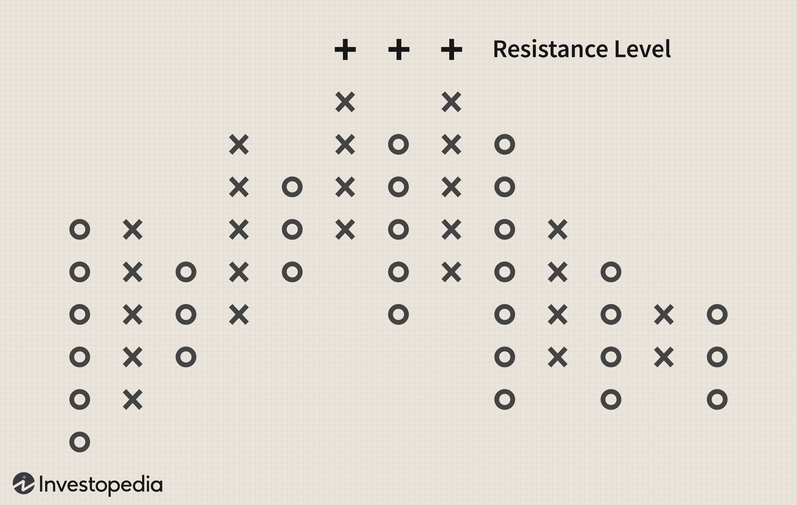

## Table of Contents

## What is a point and figure chart?

A point and figure chart is a type of chart used in technical analysis to track price movements of a security, like a stock or commodity. Unlike traditional charts that plot price against time, point and figure charts focus only on significant price changes. They use columns of X's and O's to show rising and falling prices. An X is added to the chart when the price rises by a certain amount, called the box size, and an O is added when the price falls by the same amount. This helps traders see clear trends and patterns without the distraction of minor price fluctuations.

These charts are useful because they help traders filter out small price movements and focus on bigger trends. For example, if a stock's price goes up by the box size, a new X is added in the column. If the price then goes down by the box size, a new column of O's starts. This makes it easier to spot support and resistance levels, which are prices where the stock tends to stop falling or rising. By ignoring time and focusing on price changes, point and figure charts can make it simpler to predict future price movements and make trading decisions.

## How does a point and figure chart differ from other types of charts?

A point and figure chart is different from other charts because it only shows big price changes and doesn't care about time. Most charts, like line charts or candlestick charts, show how prices change over time. They have dates on the bottom and prices on the side. But point and figure charts just use X's and O's to show when prices go up or down by a certain amount. This makes them easier to read because they focus on the important price moves and ignore small ups and downs.

Another way point and figure charts are different is that they help you see trends and patterns more clearly. For example, if you look at a bar chart or a candlestick chart, you might see a lot of little changes that can be confusing. But with a point and figure chart, you only see the big moves, so it's easier to spot when a stock is going up or down in a big way. This can help traders decide when to buy or sell, because they can see the important support and resistance levels where the price often stops and turns around.

## What are the basic components of a point and figure chart?

A point and figure chart has two main parts: X's and O's. The X's show when the price goes up by a certain amount, called the box size. For example, if the box size is $1 and the price goes up by $1, you add an X. The O's show when the price goes down by the same amount. So, if the price drops by $1, you add an O. These X's and O's are put in columns. A column of X's means the price is going up, and a column of O's means the price is going down.

The chart also has something called the reversal amount, which is how much the price needs to change to start a new column. If the reversal amount is $3, the price has to go down by $3 before you start a new column of O's after a column of X's, and vice versa. This helps the chart focus on big price changes and ignore small ones. By using just these simple parts, a point and figure chart can help you see clear trends and patterns in the price of a stock or other security.

## How do you construct a point and figure chart?

To construct a point and figure chart, you start by choosing a box size, which is the amount the price needs to move to add a new X or O. For example, if you pick a box size of $1, you add an X when the price goes up by $1, and you add an O when the price goes down by $1. You also need to decide on a reversal amount, which is how much the price has to change to start a new column. If the reversal amount is $3, the price needs to go down by $3 after a column of X's to start a new column of O's, or go up by $3 after a column of O's to start a new column of X's.

Once you have your box size and reversal amount, you can start building the chart. You look at the price of the stock or security and add X's in a column when the price goes up by the box size. If the price then goes down by the reversal amount, you start a new column and add O's when the price goes down by the box size. You keep doing this, adding X's and O's in different columns as the price goes up and down. This way, the chart shows clear trends without the small price changes that might be confusing in other types of charts.

## What is the significance of the box size in a point and figure chart?

The box size in a point and figure chart is really important because it decides how big a price change needs to be before it shows up on the chart. If you pick a small box size, like $0.50, the chart will show even small price changes. But if you pick a bigger box size, like $2, the chart will only show bigger price changes. This means the box size helps you decide what kind of price moves you want to see on the chart.

Choosing the right box size can help you see the trends and patterns that are most important to you. If you're looking at a stock that changes a lot in price, a smaller box size might be better because it will show more of those changes. But if you're looking at a stock that doesn't change much, a bigger box size could be better because it will help you focus on the bigger, more important price moves. So, the box size is a key part of making a point and figure chart that shows the information you need to make good trading decisions.

## How does the reversal amount affect a point and figure chart?

The reversal amount in a point and figure chart decides when the chart starts a new column. It's the amount the price needs to change to switch from showing rising prices to falling prices, or the other way around. If you pick a small reversal amount, like $2, the chart will start a new column more often because it doesn't take a big price change to do it. But if you pick a bigger reversal amount, like $5, the chart will only start a new column when the price changes a lot, so you'll see fewer switches between columns of X's and O's.

This matters because the reversal amount can change how clear the trends and patterns are on the chart. A smaller reversal amount means the chart will show more changes in direction, which can make it harder to see the big trends. But a bigger reversal amount means the chart will only show the big changes, so it's easier to see the main trends and patterns. By choosing the right reversal amount, you can make a point and figure chart that helps you focus on the price moves that are most important for your trading decisions.

## What are the common patterns found in point and figure charts?

Point and figure charts show different patterns that help traders see where prices might go next. One common pattern is the "double top," which happens when the price goes up, then falls back, and then goes up again to the same level. This pattern can mean that the price might start to go down. Another pattern is the "double bottom," which is the opposite. It happens when the price goes down, then goes up, and then goes down again to the same level. This can mean that the price might start to go up.

Another pattern you might see is the "triple top," which is like the double top but the price goes up to the same level three times. This can be a stronger sign that the price will start to go down. The "triple bottom" is the opposite, where the price goes down to the same level three times, which can be a stronger sign that the price will start to go up. These patterns help traders see where the price might find support or resistance, which are levels where the price often stops and turns around.

## How can point and figure charts be used for trend analysis?

Point and figure charts are great for seeing trends because they only show big price changes and ignore small ones. This makes it easier to spot when a stock is going up or down in a big way. For example, if you see a lot of X's in a row, it means the price is going up and up. This is called an uptrend. If you see a lot of O's in a row, it means the price is going down and down. This is called a downtrend. By looking at these patterns, traders can see if a stock is in a strong trend and decide when to buy or sell.

Another way point and figure charts help with trend analysis is by showing where the price might stop and turn around. These are called support and resistance levels. If the price keeps going up to the same level but then falls back, that's a resistance level. If the price keeps going down to the same level but then goes back up, that's a support level. By watching these levels, traders can guess where the price might go next. If the price breaks through a resistance level, it might keep going up. If it breaks through a support level, it might keep going down. This helps traders make better decisions about when to trade.

## What are the advantages of using point and figure charts for trading?

Point and figure charts are helpful for trading because they make it easy to see big price changes and ignore small ones. This means traders can focus on the most important trends without getting confused by little ups and downs. For example, if a stock's price is going up a lot, you'll see a column of X's, which shows a clear uptrend. If the price is going down a lot, you'll see a column of O's, showing a clear downtrend. This makes it easier to decide when to buy or sell because you can see the big picture.

Another advantage of point and figure charts is that they help traders find important levels where the price might stop and turn around. These are called support and resistance levels. If the price keeps going up to the same level but then falls back, that's a resistance level. If the price keeps going down to the same level but then goes back up, that's a support level. By watching these levels, traders can predict where the price might go next. If the price breaks through a resistance level, it might keep going up, and if it breaks through a support level, it might keep going down. This helps traders make better decisions about when to trade.

## What are the limitations or criticisms of point and figure charts?

Point and figure charts have some problems that traders should know about. One big issue is that they don't show time. Most other charts, like line charts or candlestick charts, have dates on the bottom, so you can see when things happened. But point and figure charts only care about price changes, so you can't tell how long it took for the price to go up or down. This can make it hard to know if a trend is happening quickly or slowly, which can be important for deciding when to trade.

Another criticism is that point and figure charts can be hard to set up right. You have to pick the right box size and reversal amount, and if you pick wrong, the chart might not show the trends you need to see. If the box size is too big, you might miss important price changes. If it's too small, the chart might be too busy and hard to read. Also, because they only show big price changes, point and figure charts might not be good for stocks that don't move much in price. They work best for stocks that change a lot, so traders have to be careful about which stocks they use them for.

## How can point and figure charts be integrated with other technical analysis tools?

Point and figure charts can be used together with other technical analysis tools to help traders make better decisions. One way to do this is by using moving averages, which are lines that show the average price of a stock over a certain time. By putting a moving average on a point and figure chart, traders can see if the price is above or below the average, which can help them decide if the stock is in an uptrend or a downtrend. Another tool that works well with point and figure charts is the Relative Strength Index (RSI), which shows if a stock is overbought or oversold. If the RSI shows that a stock is overbought and the point and figure chart shows a resistance level, it might be a good time to sell.

Another way to use point and figure charts with other tools is by looking at volume. Volume is how many shares of a stock are bought and sold, and it can show how strong a trend is. If a point and figure chart shows a breakout, which is when the price moves past a resistance or support level, and the volume is high, it can mean that the breakout is strong and likely to keep going. Traders can also use trend lines on point and figure charts to see the direction of the price better. By drawing lines that connect the highs and lows of the X's and O's, traders can see the trend more clearly and use it with other tools like the RSI or moving averages to make better trading decisions.

## What advanced techniques can be applied to enhance the effectiveness of point and figure charts?

One advanced technique to make point and figure charts more effective is to use different box sizes and reversal amounts for the same stock. By looking at charts with different settings, traders can see different trends and patterns. For example, a chart with a small box size might show short-term trends, while a chart with a bigger box size might show long-term trends. By comparing these charts, traders can get a better idea of where the price might go next. Another technique is to use a method called "scaling," where the box size changes based on how much the stock's price changes. This can help the chart stay useful even if the stock's price goes up or down a lot.

Another way to improve point and figure charts is by using them with other advanced tools like Fibonacci retracement levels. These levels help traders find important support and resistance points by using math. By drawing Fibonacci levels on a point and figure chart, traders can see where the price might stop and turn around. Also, traders can use a technique called "projection" to guess where the price might go after a breakout. By looking at how far the price moved before the breakout and then adding that distance to the breakout point, traders can predict future price targets. These advanced techniques can help traders make better decisions by giving them more information about where the price might go.

## How can one develop price targets using Point and Figure charts?

Point and Figure (P&F) charts provide unique methods for forecasting price targets through the vertical and horizontal count techniques. These methods are embedded in P&F charts' structure and can offer valuable insights for today's trading algorithms.

### Vertical Count Method

The vertical count method is based on the initial move in a column of Xs that represents an upward movement. The process involves determining the number of Xs in the first completed column following a major bottom and multiplying this by a predetermined box size and reversal amount. The formula for calculating a vertical target is:

$$
\text{Vertical Target} = \text{Price at Lowest X} + (\text{Number of Xs} \times \text{Box Size} \times \text{Reversal Amount})
$$

For example, consider a P&F chart where the box size is $1, the reversal amount is 3, and a column of Xs comprises 10 boxes. If the initial price at the lowest X is $50, the calculation for the target would be:

$$
\text{Vertical Target} = 50 + (10 \times 1 \times 3) = 80
$$

In trading algorithms, this method is particularly useful for identifying breakout opportunities and setting price targets for upward trends based on established patterns.

### Horizontal Count Method

The horizontal count technique calculates the price target by examining the width of a congestion area or base formation in the P&F chart. This method sums the boxes across the base—usually marked by O columns—and multiplies this total by the box size and reversal amount, adding it to the lowest price in the formation to derive the price target. The formula is:

$$
\text{Horizontal Target} = \text{Price at Base} + (\text{Width of Base} \times \text{Box Size} \times \text{Reversal Amount})
$$

For instance, if the base width is observed to be 8 boxes, the box size is $2, the reversal amount remains 3, and the price at the base is $30, the calculation would be:

$$
\text{Horizontal Target} = 30 + (8 \times 2 \times 3) = 78
$$

In algorithmic trading, the horizontal count method can be employed to set targets during consolidation breakouts, providing algorithms with calculated price objectives based on historical price patterns.

### Application in Trading Algorithms

Modern algorithms can incorporate these P&F counting methods to set dynamic price targets in automated trading systems. By integrating P&F charting principles, algorithms analyze price movements without the noise of minute fluctuations, focusing primarily on significant price changes. This enables the development of rules-based systems that execute trades when specific price targets derived from P&F methods are reached, improving decision-making efficiency and profitability.

Furthermore, the simplicity and objectivity of these calculations make them ideal for algorithmic strategies that rely on clear quantitative rules. Algorithms can be programmed to continuously read P&F chart patterns, updating price targets as the market evolves, thus ensuring adaptive and reactive trading strategies.

## References & Further Reading

[1]: Pring, M. J. (2002). ["Technical Analysis Explained: The Successful Investor's Guide to Spotting Investment Trends and Turning Points."](https://www.amazon.com/Technical-Analysis-Explained-Fifth-Successful/dp/0071825177) McGraw-Hill.

[2]: ["Point and Figure Charting: The Essential Application for Forecasting and Tracking Market Prices"](https://www.amazon.com/Point-Figure-Charting-Application-Forecasting/dp/1118445708) by Thomas Dorsey

[3]: "The Definitive Guide to Point and Figure" by Jeremy du Plessis, available on [Amazon](https://www.amazon.com/Definitive-Guide-Point-Figure-Comprehensive/dp/0857192450).

[4]: Murphy, J. J. (1999). ["Technical Analysis of the Financial Markets: A Comprehensive Guide to Trading Methods and Applications."](https://archive.org/details/technicalanalysi0000murp) New York Institute of Finance.

[5]: Schwager, J. D. (1989). ["Market Wizards: Interviews with Top Traders."](https://www.amazon.com/Market-Wizards-Jack-D-Schwager/dp/0887306101) Wiley. 