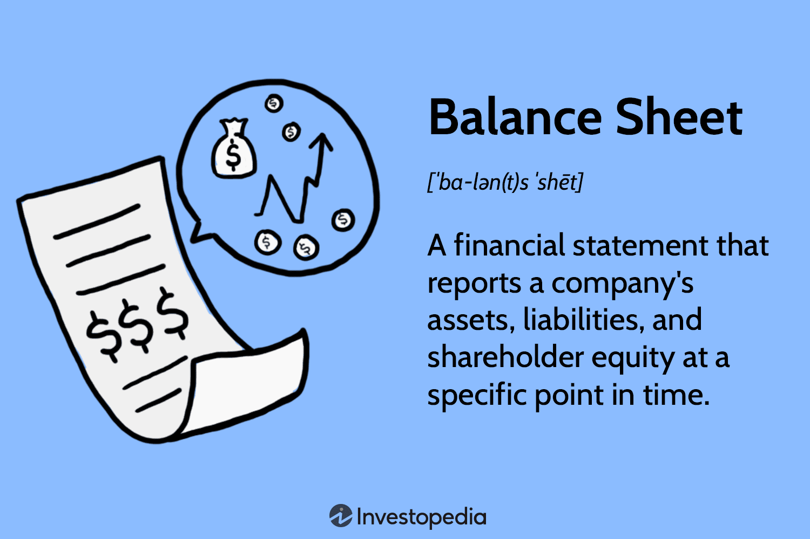

The convergence of point balance reward systems, loyalty programs, and algorithmic trading (algo trading) marks a distinct juncture where consumer engagement intertwines with cutting-edge financial technology. Loyalty programs, pivotal in nurturing customer retention, have been ingrained in business strategies across multiple sectors for decades. They offer repeat customers rewards or incentives, thereby encouraging continual patronage and fostering enduring brand relationships.

Point balance systems play an equally crucial role, but within the financial sphere, particularly in managing and understanding the financial positions tied to futures markets. These systems provide investors and brokers with a comprehensive view of profits and losses in open futures contracts, ensuring transparency and regulatory compliance. By accurately tracking long and short positions, point balance systems facilitate informed financial decision-making and risk management.



Algorithmic trading, meanwhile, has revolutionized financial markets, significantly increasing the efficiency and accuracy of trading activities. This technology employs complex algorithms to autonomously execute trades based on pre-established criteria, handling immense data volumes at speeds far surpassing human capabilities. The integration of machine learning further refines these systems, enhancing their adaptability and intelligence, which is vital for high-frequency trading operations.

Together, the integration of loyalty programs, point balance reward systems, and algo trading offers rich potential for synergistic benefits that serve both businesses and consumers. By leveraging these systems in tandem, organizations can enhance consumer engagement, optimize financial strategies, and ultimately drive profitability and innovation in an increasingly digital and dynamic marketplace.

## Table of Contents

## Understanding Point Balance Reward Systems

Point balance reward systems play a vital role in the financial management and reporting of open futures contracts. These systems provide a comprehensive view of profits and losses, which is essential for both brokers and investors. By maintaining accurate records, point balance systems help in tracking the performance of futures contracts, whether long or short, thereby ensuring effective financial management.

Futures brokers depend on point balance systems to manage and report their financial positions on a monthly basis. Such reporting is not only crucial for internal management but also aligns with regulatory requirements. Federal regulations necessitate the issuance of point balance statements, which promote transparency and protect investor interests by providing clear insights into the financial status of futures contracts. These statements serve as official documentation that details the cumulative profits and losses associated with open contracts, therefore holding brokers accountable and enabling investors to make informed decisions.

The system's capacity to track long and short contracts aids brokers and investors by offering a detailed understanding of their financial positions. This capability ensures precise computation of net gains or losses from futures contracts, enhancing strategic decision-making processes. For instance, if a trader holds a set of futures contracts with different outcomes, the point balance system can summarize the overall financial impact, providing a clear financial snapshot.

Furthermore, point balance systems offer benefits that go beyond mere reporting. They enhance confidence in the market by assuring compliance with stringent financial standards. The system's transparency and accuracy instill trust among investors, encouraging more participation in futures markets. As a result, these systems are indispensable tools for fostering a secure and efficient trading environment, ultimately leading to greater stability and efficiency in financial markets.

## Loyalty Programs: Enhancing Customer Engagement

Loyalty programs are strategically designed to incentivize customers to make repeat purchases by offering rewards, discounts, or other exclusive benefits. These programs play a crucial role in fostering customer loyalty and engagement by providing tangible incentives for continued patronage. Moreover, loyalty programs serve an ancillary function by gathering valuable data on consumer behavior. By analyzing patterns in customer purchases, businesses can gain insights into preferences and trends, enabling them to tailor their offerings and marketing strategies more effectively.

Successful loyalty programs often incorporate tiered reward systems, which enhance customer engagement by presenting achievable milestones. These systems create a sense of progression and accomplishment for participants, encouraging sustained interaction with the brand. As customers ascend through various tiers, they unlock more valuable rewards and exclusive opportunities, creating a compelling incentive to remain loyal to a particular brand or service.

The digital transformation era is significantly reshaping traditional loyalty programs, making them more personalized and technology-driven. Today's advanced digital platforms leverage data analytics and [machine learning](/wiki/machine-learning) to tailor rewards and offers to individual customer preferences. This level of personalization enhances the customer experience, making the rewards system more relevant and appealing to the individual user.

Prominent examples such as Starbucks and Sephora illustrate the impact of effective loyalty programs on sales and customer retention. Starbucks Rewards, for instance, offers customers the ability to earn "Stars" for every purchase, which can be redeemed for free items. The program also includes tiers, with different levels offering progressively greater rewards, thereby incentivizing regular visits and higher spending. Similarly, Sephora’s Beauty Insider program provides various tiers, where members can unlock higher levels of rewards such as birthday gifts, exclusive sales, and early access to new products.

These examples underscore the pivotal role of well-structured loyalty programs in enhancing customer engagement. By combining rewards with data analytics and technology, businesses can craft loyalty solutions that not only drive repeat purchases but also deepen customer relationships, ultimately leading to increased brand loyalty and sustained revenue growth.

## Algorithmic Trading: Revolutionizing Financial Markets

Algorithmic trading, often referred to as algo trading, employs sophisticated algorithms to automatically execute trades based on predetermined criteria. This practice has dramatically transformed the landscape of financial markets by enhancing the speed and efficiency of transactions. At its core, [algorithmic trading](/wiki/algorithmic-trading) relies on the capability to analyze large volumes of market data and execute orders at speeds unattainable by human traders. This automation provides traders with a substantial competitive advantage, enabling rapid decision-making and execution that maximizes potential profit margins.

A fundamental feature of algorithmic trading is its ability to process complex datasets swiftly, making it a crucial tool in today's fast-paced trading environment. Algorithms can be programmed to follow diverse strategies, from simple conditions such as moving averages to intricate frameworks involving statistical [arbitrage](/wiki/arbitrage) or market sentiment analysis. By leveraging these algorithms, traders can efficiently evaluate numerous variables and execute trades based on insights that might be too intricate for manual analysis.

The integration of machine learning into algorithmic trading systems has further bolstered their adaptability and intelligence. Machine learning models can continuously learn from historical market data, refine their predictive capabilities, and adjust their trading strategies accordingly. This learning ability allows trading systems to better anticipate market trends, manage risks, and seize opportunities. For instance, employing neural networks and decision trees helps in developing predictive models that are more nuanced and accurate.

One of the most prominent applications of algorithmic trading is high-frequency trading ([HFT](/wiki/high-frequency-trading-strategies)). HFT strategies focus on executing a large number of orders at extremely high speeds, taking advantage of even the smallest price differentials. The underlying algorithms monitor market conditions and make split-second decisions to enter or [exit](/wiki/exit-strategy) trades, often holding positions for mere fractions of a second. This rapid trading capability requires not only advanced algorithms but also state-of-the-art technology infrastructure to ensure minimal latency.

Python has emerged as a popular choice for implementing algorithmic trading strategies due to its robust libraries and ease of use. Libraries such as NumPy, pandas, and scikit-learn provide powerful tools for data manipulation, analysis, and machine learning. Consider the following simple Python example that uses moving averages for trade execution decisions:

```python
import numpy as np
import pandas as pd

def moving_average_strategy(data, short_window=40, long_window=100):
    signals = pd.DataFrame(index=data.index)
    signals['signal'] = 0.0

    # Short moving average
    signals['short_mavg'] = data['Close'].rolling(window=short_window, min_periods=1).mean()

    # Long moving average
    signals['long_mavg'] = data['Close'].rolling(window=long_window, min_periods=1).mean()

    # Generate signals
    signals['signal'][short_window:] = np.where(signals['short_mavg'][short_window:] > signals['long_mavg'][short_window:], 1.0, 0.0)

    # Generate trading orders
    signals['positions'] = signals['signal'].diff()

    return signals

# Example usage with market data
# market_data = pd.read_csv('market_data.csv', index_col='Date', parse_dates=True)
# signals = moving_average_strategy(market_data)
```

This code snippet demonstrates a straightforward strategy using short and long-term moving averages to generate buy or sell signals. Such strategies can be the foundation for more sophisticated systems that incorporate additional market indicators and machine learning predictions.

Overall, algorithmic trading has revolutionized financial markets by enabling traders to make data-driven decisions with unprecedented speed and precision. As technology continues to advance, the future of trading will likely see even greater integration of [artificial intelligence](/wiki/ai-artificial-intelligence) and automation, driving innovation and efficiency in the industry.

## Synergies Between Loyalty Programs and Algorithmic Insights

The integration between loyalty programs and algorithmic insights provides businesses with a robust framework for enhancing customer engagement and increasing profitability. At the core of this synergy is the ability of data collected from loyalty programs to inform trading algorithms about consumer behavior trends. This data, which includes purchasing patterns, preferences, and frequency of transactions, can be analyzed to generate predictive insights. For instance, machine learning models, such as clustering algorithms, can group customers based on similar purchasing behaviors, allowing for more tailored marketing campaigns.

Algorithmic insights serve to optimize loyalty programs by accurately predicting customer needs and preferences. By utilizing techniques such as predictive analytics, businesses can anticipate future purchasing decisions, enabling them to offer personalized rewards and incentives. For example, a retailer might use regression analysis to forecast a customer's likelihood of purchasing a specific product, subsequently offering discounts that increase the probability of conversion.

These capabilities create personalized experiences that foster greater customer engagement. Targeted marketing strategies become feasible, allowing businesses to reach consumers at the right time with the right message. This personalization not only enhances the customer experience but also strengthens brand loyalty, as customers feel recognized and valued when they receive tailored incentives that resonate with their personal preferences.

Moreover, the combination of loyalty program data and algorithmic insights can lead to increased brand loyalty and consumer engagement. By understanding customer behavior more deeply, businesses can adjust their strategies in real-time, responding promptly to shifts in consumer demands or market trends. This dynamic approach ensures that companies remain competitive in a rapidly changing economic landscape.

From a profitability perspective, leveraging insights derived from algorithmic analysis helps businesses allocate resources more efficiently. By focusing on high-value customers and optimizing reward structures to align closely with consumer expectations, companies can improve their return on investment. Furthermore, the improved targeting reduces marketing waste and increases the effectiveness of promotional efforts.

In summary, the integration of loyalty program data with algorithmic insights empowers businesses to create more engaging and profitable customer interaction strategies. As technology advances, these synergies will likely become more sophisticated, offering even greater opportunities for innovation in customer relationship management.

## Challenges and Considerations

Balancing earn rates with reward values is critical to the effectiveness and sustainability of loyalty programs. To maintain consumer interest and financial feasibility, businesses must ensure that the points or rewards offered translate into genuine value for the consumer without eroding profit margins. This requires a keen understanding of both customer preferences and the cost associated with rewards, demanding regular analysis and adjustment based on market conditions and consumer feedback.

The integration of technology in loyalty programs involves careful planning and execution to maximize effectiveness and minimize potential issues. As digital platforms evolve, loyalty programs must adapt to incorporate new technologies like mobile apps, artificial intelligence, and blockchain. These technologies can enhance user experience through personalization and efficiency. However, integrating these systems requires infrastructure investment, technical expertise, and a strategic approach to ensure that they align with business goals and customer expectations. 

Privacy concerns are increasingly prominent with the use of customer data to generate algorithmic insights. While leveraging data can significantly enhance personalization and targeting, businesses must navigate various regulations designed to protect consumer privacy. This includes adhering to standards set by laws such as the General Data Protection Regulation (GDPR) in Europe or the California Consumer Privacy Act (CCPA) in the United States. Companies must implement robust data protection measures and provide transparent communication regarding data usage to build trust and comply with legal requirements.

Regulatory compliance is essential in both trading and consumer engagement solutions. For algorithmic trading, traders and financial institutions must ensure adherence to financial regulations designed to maintain market integrity and protect investors. This involves not only meeting existing regulations but also staying informed of changes as regulatory bodies respond to technological advancements. Similarly, loyalty programs must comply with consumer protection regulations to avoid misleading marketing practices and ensure fair reward structures.

Ensuring a smooth integration of systems and processes across various platforms is another significant challenge. As companies expand their digital footprint, they often rely on multiple platforms for different aspects of their operations. This requires effective integration strategies to allow for seamless data exchange and operational coherence. Both IT infrastructure and cross-functional collaboration are crucial for achieving this, as the complexity of integrating disparate systems can lead to inefficiencies and data silos if not managed properly.

Overall, these challenges highlight the need for a strategic approach that balances innovation with caution, ensuring that technological advancements enhance rather than hinder business and consumer objectives.

## Conclusion

The intersection of point balance systems, loyalty programs, and algorithmic trading represents a transformative opportunity for businesses seeking to optimize their consumer engagement and financial operations. As separate entities, each component offers distinct advantages, but their integration can lead to substantial benefits in both customer interaction and decision-making processes.

Effectively merging these diverse systems enhances consumer engagement by utilizing data-driven insights to tailor personalized experiences and rewards. Algorithmic trading insights can be employed to refine loyalty programs, ensuring they align more closely with consumer behavior patterns and expectations. This fusion allows businesses to anticipate customer needs, thereby improving satisfaction and fostering loyalty, ultimately driving up profitability.

Technological advancements continue to shape the landscape of digital transformation, presenting new opportunities for innovation. The ability to process and analyze large volumes of data quickly empowers companies to adopt more agile and responsive strategies. This agility is critical in an ever-evolving market environment where speed and precision can determine competitive advantage.

Furthermore, as digital technologies progress, they pave the way for new trends and improved practices within these sectors. Emerging technologies such as artificial intelligence and machine learning offer promising avenues for further enhancement of these integrated systems. These advancements facilitate not only the optimization of current processes but also the development of innovative solutions that can propel businesses towards greater efficiency and effectiveness.

In conclusion, the strategic integration of point balance systems, loyalty programs, and algorithmic trading is not only feasible but also advantageous. By capitalizing on technological advancements and harnessing data-driven insights, organizations can craft robust strategies that cater to both consumer engagement and financial efficacy. As technology continues to evolve, it is crucial for businesses to remain at the forefront of innovation, ensuring they harness these opportunities to their fullest potential for sustainable growth and success.

## References & Further Reading

[1]: Bergstra, J., Bardenet, R., Bengio, Y., & Kégl, B. (2011). ["Algorithms for Hyper-Parameter Optimization."](https://dl.acm.org/doi/10.5555/2986459.2986743) Advances in Neural Information Processing Systems 24.

[2]: ["Advances in Financial Machine Learning"](https://www.amazon.com/Advances-Financial-Machine-Learning-Marcos/dp/1119482089) by Marcos Lopez de Prado

[3]: ["Evidence-Based Technical Analysis: Applying the Scientific Method and Statistical Inference to Trading Signals"](https://www.amazon.com/Evidence-Based-Technical-Analysis-Scientific-Statistical/dp/0470008741) by David Aronson

[4]: ["Machine Learning for Algorithmic Trading"](https://github.com/stefan-jansen/machine-learning-for-trading) by Stefan Jansen

[5]: ["Quantitative Trading: How to Build Your Own Algorithmic Trading Business"](https://www.amazon.com/Quantitative-Trading-Build-Algorithmic-Business/dp/1119800064) by Ernest P. Chan