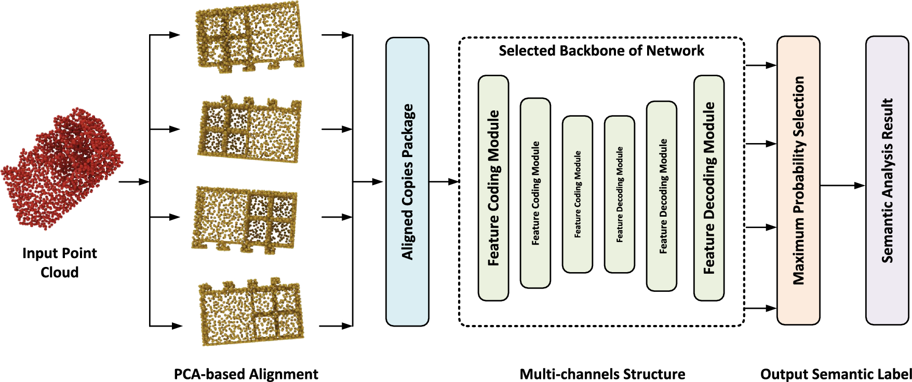

## Table of Contents

## What is a point cloud in the context of machine learning?

A point cloud is a collection of data points in space, often used in machine learning to represent three-dimensional objects or scenes. Each point in the cloud has coordinates, like x, y, and z, which tell us where the point is in 3D space. Sometimes, these points also have other information, like color or intensity, which can help in understanding the object better. For example, if you scan a room with a 3D scanner, the scanner will collect many points that together form a point cloud of the room.

In machine learning, point clouds are used in tasks like object recognition, where the goal is to identify what an object is, or in scene understanding, where the goal is to understand the layout of a scene. Machine learning models, like neural networks, can be trained to process these point clouds and make predictions based on them. For instance, a model might learn to recognize a chair from the pattern of points that make up the chair's shape. This is useful in applications like autonomous driving, where cars need to understand their surroundings in 3D to navigate safely.

## Why is data augmentation important for point cloud data?

Data augmentation is important for point cloud data because it helps make machine learning models better at understanding and working with 3D objects. When you have a lot of different versions of the same point cloud, like rotating it or adding noise, the model can learn from all these versions. This means the model can recognize the object no matter how it's seen in the real world. For example, if you're training a model to recognize a car, you want it to know it's a car whether it's seen from the front, back, or side.

Using [data augmentation](/wiki/data-augmentation) also helps when you don't have a lot of point cloud data to begin with. By creating new versions of the data you have, you can make your dataset bigger and more varied. This can help the model learn better and work well even with new, unseen data. So, data augmentation makes your model more flexible and reliable, which is really important for things like self-driving cars or robots that need to understand their 3D world accurately.

## What are the common challenges faced when working with point cloud data?

One common challenge when working with point cloud data is dealing with noise and inaccuracies. Point clouds are often collected using sensors like LiDAR, which can introduce errors due to reflections or environmental conditions. These errors can make it hard for [machine learning](/wiki/machine-learning) models to correctly understand the shape and structure of objects. For example, a point cloud of a tree might have extra points that don't really belong to the tree, making it difficult for a model to recognize it properly.

Another challenge is the sheer amount of data that point clouds can generate. A single scan can produce millions of points, and processing all these points can be very time-consuming and require a lot of computational power. This makes it hard to quickly train models or use them in real-time applications, like autonomous driving, where decisions need to be made instantly. To handle this, researchers often use techniques like downsampling, where they reduce the number of points, but this can sometimes lead to losing important details.

Finally, point clouds lack a natural structure like images, which have a grid of pixels. This makes it difficult to directly apply many traditional machine learning techniques that work well with structured data. For instance, convolutional neural networks (CNNs) are great for images but don't work as well with point clouds because the points are scattered in space. Researchers have to develop new methods, like PointNet, to handle this unstructured data effectively.

## What is PointAugment and how does it work?

PointAugment is a way to make point cloud data better for machine learning. It does this by changing the point clouds in different ways, like moving them around or adding small changes, so that the machine learning model can learn from many different versions of the same object. This helps the model understand the object no matter how it looks in the real world. For example, if you're teaching a computer to recognize a chair, PointAugment can show the computer the chair from many angles and with small changes, so it knows it's a chair no matter how it's seen.

PointAugment works by using a special method called elastic distortion. This method stretches and bends the point cloud a little bit, kind of like how a rubber band can be stretched and twisted. This makes the point cloud look different but keeps the main shape of the object the same. By doing this, PointAugment creates new versions of the point cloud that the machine learning model can use to learn better. This is really helpful because it makes the model more flexible and able to handle new, unseen data well.

## How does PatchAugment differ from PointAugment?

PatchAugment and PointAugment are both ways to make point cloud data better for machine learning, but they do it differently. PointAugment uses elastic distortion to stretch and bend the whole point cloud a little bit. This makes the point cloud look different but keeps the main shape of the object the same. It's like taking a rubber band and twisting it slightly. This helps the machine learning model see the object from many angles and with small changes, so it can learn to recognize it no matter how it's seen in the real world.

PatchAugment, on the other hand, focuses on smaller parts of the point cloud, called patches. Instead of changing the whole point cloud at once, PatchAugment picks out small areas and changes them. It might move these patches around or add noise to them. This way, the model can learn to understand the object even if some parts of it are different or missing. By working on smaller parts, PatchAugment can create a lot of variety in the data, which helps the model learn better and be more flexible with new data it hasn't seen before.

## What are the typical transformations used in point cloud augmentation?

Point cloud augmentation often involves several typical transformations to make the data more useful for machine learning. One common transformation is rotation, where the entire point cloud is turned around different axes. This helps the model learn to recognize objects from any angle. Another transformation is scaling, where the size of the point cloud is changed slightly. This teaches the model to identify objects even if they are bigger or smaller than usual. Translation is also used, moving the point cloud to different positions in space, which helps the model understand that an object's location doesn't change what it is.

Another set of transformations includes adding noise and jittering. Adding noise means putting in extra points that don't really belong to the object, which helps the model learn to ignore irrelevant data. Jittering involves slightly moving the existing points around, which can simulate small errors that might happen in real-world data collection. Elastic distortion is another technique, where the point cloud is stretched and bent a little bit, like a rubber band. This creates new versions of the point cloud that look different but keep the main shape of the object, helping the model learn from varied data.

Finally, there are more specific transformations like random point dropout and patch-based methods. Random point dropout removes some points from the cloud, teaching the model to recognize objects even if some data is missing. Patch-based methods, like those used in PatchAugment, focus on smaller parts of the point cloud, changing these patches to create variety. All these transformations together make the point cloud data more diverse and robust, helping machine learning models perform better in real-world scenarios.

## How can point cloud augmentation improve the performance of machine learning models?

Point cloud augmentation helps machine learning models by making them better at understanding 3D objects from different angles and conditions. When you change the point cloud data in different ways, like rotating it or adding noise, you create many versions of the same object. This teaches the model to recognize the object no matter how it looks in the real world. For example, if you're training a model to recognize a car, you want it to know it's a car whether it's seen from the front, back, or side. By seeing the car in many different ways, the model learns to focus on the important features that make it a car, not just how it's positioned.

Using point cloud augmentation also helps when you don't have a lot of data to start with. By creating new versions of the data you have, you can make your dataset bigger and more varied. This can help the model learn better and work well even with new, unseen data. For instance, if you only have a few scans of a room, you can use augmentation to create more scans from different angles or with slight changes. This makes the model more flexible and reliable, which is really important for things like self-driving cars or robots that need to understand their 3D world accurately.

## What are the limitations of current point cloud augmentation techniques?

One limitation of current point cloud augmentation techniques is that they might change the point cloud too much, making it hard for the model to learn what's real and what's not. For example, if you add a lot of noise or stretch the point cloud too much, the model might get confused about what the object really looks like. This can lead to the model not working well when it sees real-world data that doesn't have all these changes.

Another limitation is that these techniques can be very slow and need a lot of computer power. When you have millions of points in a point cloud, changing all of them takes a long time. This can make it hard to use these techniques in real-time applications, like self-driving cars, where the model needs to make quick decisions. Researchers are trying to find ways to make these techniques faster and easier to use, but it's still a big challenge.

## How can one implement PointAugment in a machine learning pipeline?

To implement PointAugment in a machine learning pipeline, you first need to understand how it works. PointAugment uses a technique called elastic distortion to change the point cloud. This means it stretches and bends the point cloud a little bit, like a rubber band, to create new versions of the data. You can do this by using a library like PyTorch or TensorFlow, which have tools to help you change the point cloud. You'll need to write code that takes your original point cloud and applies the elastic distortion to it. This code will create many different versions of your point cloud, which you can then use to train your machine learning model.

Once you have your code set up, you can add PointAugment to your training pipeline. This means that every time you train your model, you'll use these new, changed versions of the point cloud. You can do this by writing a function that applies the elastic distortion and then calling this function before you feed the data into your model. This way, your model will see the object from many different angles and with small changes, helping it learn better. By using PointAugment, you can make your model more flexible and able to handle new, unseen data well.

## What metrics should be used to evaluate the effectiveness of point cloud augmentation?

To evaluate how well point cloud augmentation works, you can use different metrics that show how much the model's performance improves. One common metric is accuracy, which tells you how often the model correctly identifies objects in the point cloud. If the model's accuracy goes up after using augmentation, it means the model is better at recognizing objects from different angles and with small changes. Another useful metric is the F1 score, which is a balance between precision and recall. Precision shows how many of the model's positive predictions are correct, while recall shows how many of the actual positive cases the model catches. The F1 score is calculated as $$F1 = 2 \times \frac{\text{precision} \times \text{recall}}{\text{precision} + \text{recall}}$$. If the F1 score improves, it means the model is both more accurate and more complete in its predictions.

Another important metric is the model's robustness, which you can measure by testing it on new, unseen data. If the model still performs well on this new data, it means the augmentation helped it learn to handle different situations. You can also look at the model's generalization ability, which is how well it can apply what it learned to new types of objects or scenes. If the model can recognize new objects it hasn't seen before, it shows that the augmentation made it more flexible. By using these metrics, you can see if point cloud augmentation is helping your model learn better and work well in the real world.

## How do advanced techniques like adversarial training integrate with point cloud augmentation?

Adversarial training is a way to make machine learning models stronger by showing them tricky examples that are meant to fool them. When you use this with point cloud augmentation, you create these tricky examples by changing the point cloud data in ways that might confuse the model. For example, you could rotate the point cloud or add noise to it, just like in regular augmentation, but you do it in a way that tries to make the model guess wrong. By doing this, you help the model learn to handle these tricky situations better, making it more reliable in the real world.

To integrate adversarial training with point cloud augmentation, you first need to set up your augmentation techniques, like PointAugment or PatchAugment, to change the point cloud data. Then, you use these changed point clouds to create adversarial examples. You do this by trying to find the smallest change that can make the model guess wrong. Once you have these adversarial examples, you include them in your training data. This means that during training, the model sees both the regular augmented data and the tricky adversarial data. Over time, this helps the model learn to recognize objects even when they are changed in tricky ways, making it more robust and better at handling real-world data.

## What are the future directions and research opportunities in point cloud augmentation?

Future research in point cloud augmentation could focus on making the techniques faster and easier to use. Right now, changing a point cloud with millions of points can take a lot of time and computer power. Researchers are working on new ways to speed this up, like using special computer chips or finding smarter ways to change the data. They are also looking into new kinds of changes that can be made to the point cloud, like adding different kinds of noise or changing the way the points are spread out. By making these techniques faster and more varied, they can be used in more real-time applications, like self-driving cars, where quick decisions are important.

Another big area for future research is making point cloud augmentation work better with other machine learning techniques, like adversarial training. This means using tricky examples to make the model stronger, as well as changing the point cloud in normal ways. Researchers are trying to find the best ways to combine these methods to make the model even more reliable and able to handle different situations. They are also looking at how to use point cloud augmentation to help with tasks like scene understanding, where the model needs to understand the whole 3D world around it, not just single objects. By exploring these new directions, researchers can make machine learning models that work better and more safely in the real world.