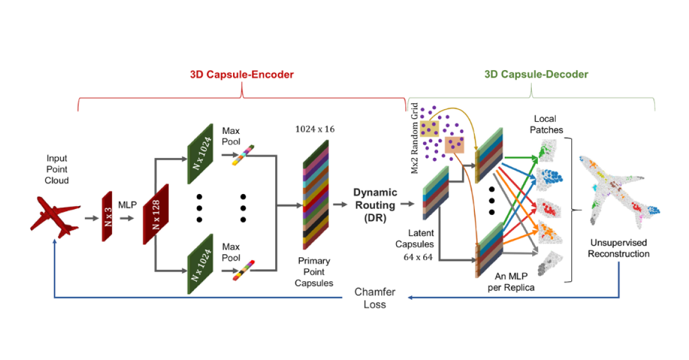

## Table of Contents

## What is a point cloud in the context of machine learning?

A point cloud in the context of machine learning is a set of data points in space, usually representing the surface of an object or a scene. Each point in the cloud has a set of coordinates, like x, y, and z, which tell us where the point is in 3D space. Sometimes, these points also have other information, like color or intensity, which can help in understanding the object better. Point clouds are often used in fields like robotics, autonomous driving, and 3D modeling because they can capture the shape and details of complex objects or environments.

In machine learning, point clouds are used as input data for various algorithms, especially in tasks like object recognition, segmentation, and reconstruction. For example, a self-driving car might use point clouds from its sensors to understand the road and obstacles around it. Machine learning models, such as neural networks, can be trained to process these point clouds and make decisions based on the data. This involves learning to recognize patterns and features from the points, which can be challenging because point clouds can be noisy and irregular. Despite these challenges, point clouds are valuable because they provide a rich, detailed representation of the physical world.

## How are point clouds used in 3D object recognition and scene understanding?

Point clouds are used in 3D object recognition by helping computers figure out what objects are in a scene. When a machine learning model looks at a point cloud, it tries to find patterns and shapes that match known objects. For example, if the point cloud shows a bunch of points in the shape of a car, the model can recognize it as a car. This is important for things like self-driving cars, where the vehicle needs to know if there's a car, a pedestrian, or a tree in its path. The model learns from lots of examples to get better at recognizing different objects, even if they are seen from different angles or are partially hidden.

In scene understanding, point clouds help computers understand the whole environment, not just individual objects. By looking at the arrangement of points, a machine learning model can figure out where walls, floors, and furniture are in a room, or where roads and buildings are in a city. This is useful for creating maps, planning robot paths, or even helping virtual reality systems create realistic environments. The model uses the relationships between points to understand the structure and layout of the scene, making it possible to navigate or interact with the environment more effectively.

## What are the main challenges in processing point cloud data?

One big challenge in processing point cloud data is that the points can be messy and not organized. Unlike images where pixels are neatly arranged in a grid, point clouds can have points scattered all over the place. This makes it hard for computers to understand the data because there's no clear order to the points. Also, point clouds can have missing parts or extra noise, which means some important details might be missing or there might be extra points that don't belong. This can make it tough for machine learning models to figure out what they're looking at.

Another challenge is that processing point clouds can take a lot of computer power. There can be millions of points in a single cloud, and going through all of them to find patterns or shapes is a big job. This means that the computer needs to be fast and have a lot of memory to handle all this data. Plus, the algorithms used to process point clouds need to be smart enough to work well even when the data is messy or incomplete. This is why researchers are always working on new ways to make point cloud processing faster and more accurate.

## Can you explain the basic architecture of a point cloud model like PointNet?

PointNet is a special kind of neural network designed to work with point clouds. It's made up of several layers that help the computer understand the data better. The first part of PointNet takes all the points in the cloud and processes them together. It does this by using something called a shared multi-layer perceptron (MLP), which is just a fancy way of saying it uses the same set of rules to look at each point. This helps PointNet figure out important features from the points, like their position and any other information they might have, such as color.

After finding these features, PointNet does something clever. It takes a max pooling step, which means it looks at all the features from all the points and picks the most important ones. This helps the model understand the whole point cloud, not just individual points. Once it has these important features, PointNet uses them to do things like recognize objects or understand scenes. This way, even if the point cloud is messy or has missing parts, PointNet can still make sense of it and do its job well.

## How does YOHO improve upon traditional point cloud processing methods?

YOHO, or YOLO for point clouds, is a method that makes processing point clouds faster and more efficient. Traditional methods often need a lot of time and computer power because they look at each point in the cloud one by one. YOHO, on the other hand, looks at the whole point cloud at once, just like how YOLO looks at an entire image to find objects quickly. By doing this, YOHO can figure out what objects are in the point cloud much faster, which is really helpful for things like self-driving cars that need to make quick decisions.

Another way YOHO improves on traditional methods is by being better at handling messy data. Point clouds can have missing parts or extra noise, which can confuse other methods. YOHO uses smart tricks to focus on the important parts of the point cloud and ignore the mess, so it can still recognize objects even when the data isn't perfect. This makes YOHO a powerful tool for working with point clouds in real-world situations where the data can be tricky.

## What is the role of Voxel R-CNN in point cloud segmentation and detection?

Voxel R-CNN is a special kind of machine learning model that helps computers understand and work with point clouds better. It does this by turning the points into small 3D boxes called voxels. This makes it easier for the computer to see the shape and details of the objects in the point cloud. Voxel R-CNN is really good at figuring out where objects are in the point cloud and what they are. This is called detection. It looks at the voxels and decides if they belong to a car, a person, or something else.

For segmentation, Voxel R-CNN helps the computer break down the point cloud into different parts, like separating the wheels from the body of a car. It does this by carefully looking at the voxels and figuring out which ones go together to make up different parts of the objects. By using voxels, Voxel R-CNN can handle messy point clouds better and still do a good job at detecting and segmenting the objects. This makes it a powerful tool for things like self-driving cars and robots that need to understand their surroundings quickly and accurately.

## How does RPM-Net handle the registration of point clouds?

RPM-Net helps computers line up different point clouds by matching them together. Imagine you have two pictures of the same room taken from different angles. RPM-Net can figure out how to move and rotate one picture so it matches the other perfectly. It does this by first guessing how the point clouds might fit together, then it keeps tweaking its guess to make the fit better. This process is called registration, and it's really useful for things like 3D scanning where you need to combine many scans to make one complete model.

RPM-Net uses a special way to make its guesses better. It looks at how close the points in one cloud are to the points in the other cloud and tries to move them closer together. It keeps doing this until the points line up as well as they can. This method helps RPM-Net handle point clouds that are messy or have missing parts, making it good for real-world situations where the data isn't perfect. By using smart math and learning from examples, RPM-Net can register point clouds quickly and accurately.

## What makes PREDATOR effective for 3D object detection from point clouds?

PREDATOR is really good at finding objects in 3D point clouds because it uses a smart way to look at the points. It breaks the point cloud into smaller parts called voxels, which are like tiny 3D boxes. By doing this, PREDATOR can see the shape and details of the objects better. It then uses a special kind of neural network to figure out where the objects are and what they are. This neural network is trained to look at the voxels and pick out important features that help it recognize different objects, even if they are seen from different angles or are partially hidden.

Another thing that makes PREDATOR effective is how it handles messy data. Point clouds can have missing parts or extra noise, which can make it hard for other methods to work well. PREDATOR is designed to focus on the important parts of the point cloud and ignore the mess. This way, it can still find and recognize objects even when the data isn't perfect. This makes PREDATOR a powerful tool for things like self-driving cars and robots that need to understand their surroundings quickly and accurately.

## How does PointASNL enhance the learning of local geometric structures in point clouds?

PointASNL, which stands for Pointwise Attention-based Spatial Neighborhood Learning, helps computers understand the shape of objects in point clouds better. It does this by looking closely at the points around each point in the cloud. Imagine you are trying to understand what a car looks like by looking at a bunch of dots. PointASNL helps by paying special attention to the dots that are close to each other, which helps it figure out the car's shape more accurately. It uses something called attention mechanisms to decide which nearby points are the most important for understanding the local structure.

This attention mechanism works by giving more weight to the points that are more important for understanding the shape. For example, if you are looking at a point on the car's wheel, PointASNL will focus more on the points that are also part of the wheel and less on points that are far away, like those on the car's roof. By doing this, PointASNL can learn the local geometric structures of the point cloud more effectively. This makes it better at tasks like recognizing objects or understanding scenes, even when the point cloud is messy or has missing parts.

## What are the advantages of using Point-GNN for point cloud analysis?

Point-GNN, or Point Graph Neural Network, is really good at understanding point clouds because it looks at the points as if they were connected in a graph. Imagine a bunch of dots, and Point-GNN draws lines between the dots that are close to each other. This helps the computer see how the points are related and understand the shape of the object better. By treating the points like a graph, Point-GNN can figure out the important features of the object, like its edges and corners, which makes it easier to recognize what the object is.

Another advantage of Point-GNN is that it can handle messy point clouds well. Sometimes, point clouds have missing parts or extra noise, which can make it hard for other methods to work properly. Point-GNN uses the graph to focus on the important parts of the point cloud and ignore the mess. This way, it can still understand the object's shape and recognize it, even if the data isn't perfect. This makes Point-GNN a powerful tool for tasks like object recognition and scene understanding in real-world situations.

## How does Panoptic-PolarNet approach the task of panoptic segmentation in point clouds?

Panoptic-PolarNet helps computers understand everything in a point cloud by breaking it down into two parts: things and stuff. Things are objects like cars and people, while stuff is the background like roads and buildings. Panoptic-PolarNet uses a special way to look at the point cloud by turning it into a polar coordinate system. This is like looking at a map from above and using angles and distances to figure out where everything is. By doing this, Panoptic-PolarNet can see the shape and details of the objects and the background better, making it easier to tell them apart.

Once Panoptic-PolarNet has turned the point cloud into a polar coordinate system, it uses a neural network to find and label all the things and stuff. The neural network looks at the points and decides which ones belong to which object or part of the background. This way, Panoptic-PolarNet can create a complete picture of the scene, showing where each object is and what the background looks like. This is really helpful for things like self-driving cars and robots that need to understand their surroundings quickly and accurately.

## What innovations does PQ-Transformer bring to point cloud processing and analysis?

PQ-Transformer brings new ideas to point cloud processing by using a special way to look at the points called a transformer. Transformers are good at understanding the relationships between things, and PQ-Transformer uses this to figure out how the points in a cloud are connected. It does this by grouping the points into small parts called patches and then looking at how these patches relate to each other. This helps PQ-Transformer understand the shape and details of the objects in the point cloud better, even if the points are messy or have missing parts.

Another cool thing about PQ-Transformer is how it handles the order of the points. In a point cloud, the points don't have a set order, which can make it hard for computers to understand them. PQ-Transformer solves this by using something called positional encoding, which gives each point a special code that tells the computer where it is in the cloud. This way, PQ-Transformer can keep track of the points and understand the whole point cloud, no matter how the points are arranged. This makes PQ-Transformer a powerful tool for tasks like object recognition and scene understanding in real-world situations.