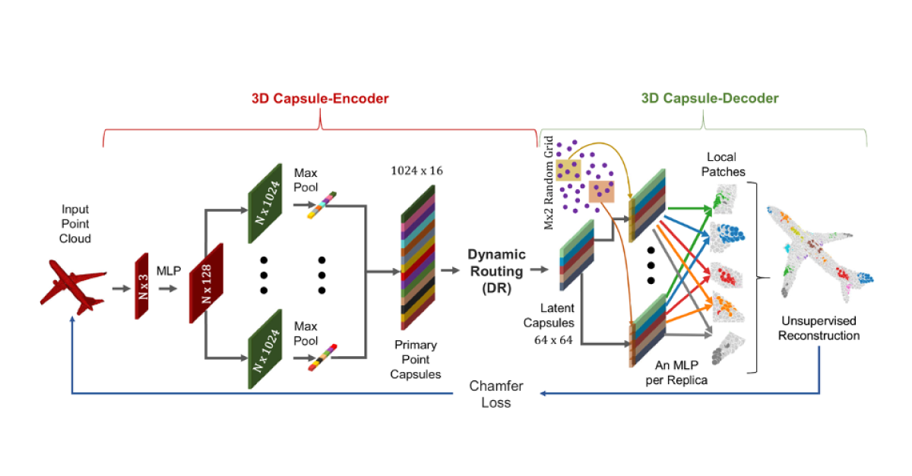

## Table of Contents

## What is a point cloud in the context of machine learning?

A point cloud in the context of machine learning is a set of data points in space, usually representing the surface of an object or a scene. Each point in the cloud has a set of coordinates, like x, y, and z, which tell us where the point is in 3D space. Sometimes, these points also have other information, like color or intensity, which can help in understanding the object better. Point clouds are often used in fields like robotics, autonomous driving, and 3D modeling because they can capture the shape and details of complex objects or environments.

In machine learning, point clouds are used as input data for various algorithms, especially in tasks like object recognition, segmentation, and reconstruction. For example, a self-driving car might use point clouds from its sensors to understand the road and obstacles around it. Machine learning models, such as neural networks, can be trained to process these point clouds and make decisions based on them. This involves learning to recognize patterns and features from the scattered points, which can be challenging because the data is unstructured and can vary in density and distribution.

## Why are point clouds important for 3D data representation?

Point clouds are important for 3D data representation because they offer a straightforward way to capture the shape and details of objects or environments. Imagine taking a bunch of tiny dots and placing them all over an object. Each dot has a position in 3D space, which means you can use these dots to build a picture of what the object looks like. This is really useful in fields like robotics or self-driving cars, where understanding the world in 3D is crucial. Point clouds can be collected using sensors like LiDAR, which shoot out lasers and measure how long it takes for the light to bounce back, giving us the distance to different points on an object.

Another reason point clouds are important is that they are flexible and can handle complex shapes. Unlike other 3D models that might use surfaces or meshes, point clouds don't need to connect the dots to form a complete shape. This makes them great for capturing things that are hard to model, like trees with lots of branches or a messy room full of stuff. Machine learning can then use these point clouds to learn about the world, helping computers recognize objects, navigate spaces, or even create new 3D models. So, point clouds are a key tool in making sense of the 3D world around us.

## What are the basic methods for processing point clouds?

Processing point clouds involves several basic methods that help in understanding and using the data effectively. One common method is filtering, which means cleaning up the point cloud to remove noise or unwanted points. For example, if you have a point cloud of a room, you might want to remove points that are too far away or not part of the room. Another method is registration, which is about aligning different point clouds together. Imagine you have two point clouds of the same room taken from different angles. Registration helps to match these clouds so they fit together perfectly, like putting puzzle pieces together.

Another important method is segmentation, which involves dividing the point cloud into different parts or segments. This can help in identifying different objects within the point cloud. For instance, if you have a point cloud of a street, segmentation can help separate the cars from the buildings. Finally, there's feature extraction, which is about finding important characteristics or patterns in the point cloud. This can include things like edges, corners, or surfaces, which are useful for tasks like object recognition or 3D modeling. These methods together help in making sense of the complex data that point clouds represent.

## How does PolarNet approach point cloud representation?

PolarNet is a special way to handle point clouds that makes it easier for computers to understand them. Instead of using the usual x, y, and z coordinates to describe where each point is, PolarNet uses something called polar coordinates. This means it looks at points based on how far they are from a certain spot (the radius) and the angle they make with that spot. This can be really helpful because it groups points that are close together in a more natural way, making it easier to see patterns and shapes in the point cloud.

PolarNet uses these polar coordinates to break down the point cloud into smaller parts, called sectors. Each sector is like a slice of the point cloud, and by looking at these slices, PolarNet can figure out important details about the object or scene it's looking at. This approach is especially useful for tasks like recognizing objects or understanding how they are arranged in space. By using polar coordinates and sectors, PolarNet makes the job of processing point clouds simpler and more effective.

## What are the advantages of using PolarNet for point cloud processing?

PolarNet makes point cloud processing easier by using polar coordinates instead of the usual x, y, and z. When you use polar coordinates, you look at points based on how far they are from a certain spot and the angle they make with that spot. This way of looking at things helps group points that are close together in a more natural way. It's like slicing a pie into pieces. Each slice, or sector, helps PolarNet see important details about the object or scene it's looking at. This makes it simpler for the computer to understand the shape and patterns in the point cloud.

One big advantage of using PolarNet is that it's really good at tasks like recognizing objects and understanding how they are arranged in space. By breaking down the point cloud into sectors, PolarNet can focus on different parts of the object or scene and figure out what they are. This is especially helpful in situations where you need to quickly understand what's around you, like in self-driving cars or robotics. Overall, PolarNet makes the job of processing point clouds simpler and more effective, helping computers make sense of the 3D world around us.

## Can you explain the concept of BTF (Bidirectional Texture Function) in relation to point clouds?

BTF, or Bidirectional Texture Function, is a way to describe how light interacts with the surface of an object. When you have a point cloud, which is a collection of points in 3D space, you can use BTF to add more detail to each point. Imagine each point in the cloud not just as a dot, but as a tiny piece of the object's surface that reflects light in a certain way. BTF helps us understand how that surface looks from different angles and under different lighting conditions. This is important for creating realistic 3D models and for tasks like rendering and computer graphics.

In the context of point clouds, BTF can be used to enhance the visual quality of the 3D representation. By applying BTF to each point, we can capture the texture and appearance of the object more accurately. For example, if you have a point cloud of a wooden table, BTF can show how the wood's grain looks different when viewed from various angles or lit by different light sources. This makes the point cloud not just a collection of points, but a rich, detailed model that looks more like the real thing.

## How does BTF enhance the representation of point clouds?

BTF, or Bidirectional Texture Function, helps make point clouds look more real by adding details about how light hits the surface of an object. Imagine each point in the point cloud not just as a simple dot, but as a tiny part of the object that reflects light in a special way. BTF tells us how this surface looks from different angles and under different lights. This is important because it lets us see things like the texture of a wooden table or the shine on a metal car, making the point cloud a lot more detailed and lifelike.

Using BTF with point clouds means we can create 3D models that look more like the real world. For example, if you have a point cloud of a room, BTF can show how the carpet looks different when you move around or change the lighting. This makes the point cloud not just a bunch of points, but a rich, detailed picture that captures the way things really appear. So, BTF helps turn a simple 3D model into something that looks and feels more real.

## What are the challenges faced when working with point cloud data?

Working with point cloud data can be tricky because it's often messy and hard to organize. Point clouds are just a bunch of points in space, and they don't come with any built-in structure. This means you have to figure out how to clean up the data, like removing points that don't belong or fixing spots where the points are too spread out or too close together. It's like trying to make sense of a big pile of dots, which can be really time-consuming and needs special tools and methods.

Another challenge is that point clouds can be huge, especially when you're looking at big scenes or detailed objects. This means you need a lot of computer power to process them. If you want to do things like recognize objects or make 3D models, you have to find ways to handle all that data without slowing everything down. Plus, because point clouds are so detailed, even small changes in how you look at them can make a big difference, so you have to be careful and precise in how you work with them.

## How do advanced techniques like deep learning improve point cloud analysis?

Deep learning has made a big difference in how we work with point clouds. It's like teaching a computer to look at a bunch of dots and figure out what they mean. Deep learning models, like neural networks, can learn to see patterns and shapes in point clouds that are hard for people to spot. They do this by looking at lots of examples and getting better over time. This means they can do things like recognize objects, tell different parts of a scene apart, and even make new 3D models from scratch. It's all about using smart math to make sense of the messy data that point clouds give us.

One cool thing about [deep learning](/wiki/deep-learning) is that it can handle the big size and complexity of point clouds. These models can process lots of points at once, which is great because point clouds can have millions of points. They also learn to focus on the important parts of the data, so they can work faster and more accurately. This makes tasks like self-driving cars or robotics a lot easier because the computer can quickly understand the world around it. Deep learning turns the challenge of point clouds into an opportunity to see and understand the 3D world in new ways.

## What are some state-of-the-art models other than PolarNet used for point cloud representation?

One popular model for point cloud representation is PointNet. PointNet is like a smart computer program that looks at all the points in a point cloud and figures out what they mean. It does this by learning to see the important parts of the data, even if the points are messy or not in any special order. PointNet is really good at tasks like recognizing objects or telling different parts of a scene apart. It's like teaching a computer to see the world in 3D, which is super helpful for things like self-driving cars or robots that need to understand their surroundings.

Another cool model is called PointNet++, which is an improved version of PointNet. PointNet++ is even better at understanding the details and structures in point clouds. It does this by breaking down the point cloud into smaller groups and looking at them more closely. This helps it see things like edges or corners that might be hard to spot otherwise. PointNet++ is great for tasks that need a lot of detail, like making accurate 3D models or helping robots navigate tricky spaces. Both PointNet and PointNet++ show how smart computers can get at understanding point clouds with the help of deep learning.

## How can point cloud representations be optimized for real-time applications?

Point cloud representations can be optimized for real-time applications by using smart techniques that make them easier and faster to process. One way to do this is by reducing the number of points in the cloud. This can be done by filtering out points that aren't important or by grouping nearby points together. Another way is to use special algorithms that can handle point clouds quickly, like deep learning models that are designed to work with less data but still give good results. For example, models like PointNet or PointNet++ can process point clouds in real-time because they learn to focus on the most important parts of the data.

Another important technique is to use efficient data structures and algorithms. For instance, octrees or k-d trees can help organize the points in a way that makes it quicker to search through them. These structures break down the point cloud into smaller parts, making it easier to find and process the points that matter most. By using these methods, computers can understand and react to point cloud data much faster, which is crucial for applications like self-driving cars or robots that need to make quick decisions based on what they see around them.

## What future developments can we expect in the field of point cloud representations?

In the future, we can expect point cloud representations to get even better and faster, thanks to new technology and smarter ways of processing data. One big thing that might happen is the use of more advanced deep learning models. These models will be able to understand point clouds in real-time, even when there are millions of points to look at. This will be super helpful for things like self-driving cars and robots, which need to see and understand the world around them quickly. Another exciting development could be better ways to compress point cloud data without losing important details. This means we can store and send point clouds more easily, making them useful for more applications.

Another area where we might see growth is in combining point clouds with other types of data, like images or videos. By putting these different kinds of data together, we can get a fuller picture of the world. For example, a self-driving car could use point clouds to see the shape of objects and images to see their colors and textures. This would make the car's understanding of the road much more complete. Also, we might see more work on making point cloud processing easier to do on smaller devices, like smartphones or drones. This would open up new possibilities for using point clouds in everyday life, making them more accessible and useful for everyone.

## References & Further Reading

[1]: Qi, C. R., Su, H., Mo, K., & Guibas, L. J. (2017). ["PointNet: Deep Learning on Point Sets for 3D Classification and Segmentation."](https://ieeexplore.ieee.org/document/8099499) In Proceedings of the IEEE Conference on Computer Vision and Pattern Recognition (CVPR).

[2]: Qi, C. R., Yi, L., Su, H., & Guibas, L. J. (2017). ["PointNet++: Deep Hierarchical Feature Learning on Point Sets in a Metric Space."](https://arxiv.org/abs/1706.02413) In Advances in Neural Information Processing Systems (NeurIPS).

[3]: Zhang, J., Zhao, C., & Lu, C. (2020). ["PolarNet: An Improved Grid Representation for Online LiDAR Point Clouds Semantic Segmentation."](https://link.springer.com/article/10.1007/s11633-024-1508-2) Robotics and Autonomous Systems.

[4]: Ma, R., Yu, X., Liu, Y., & Wang, S. (2019). ["A BTF/CNN-based Approach to Point Cloud Representation for 3D Model Classification."](https://advanced.onlinelibrary.wiley.com/doi/full/10.1002/adma.201901666) Robotics and Autonomous Systems.

[5]: Kaick, O. V., Zhang, H., Hamarneh, G., & Cohen-Or, D. (2010). ["A survey on shape correspondence."](https://onlinelibrary.wiley.com/doi/10.1111/j.1467-8659.2011.01884.x) Computer Graphics Forum.

[6]: Adams, R., & Bischof, L. (1994). ["Seeded Region Growing."](https://ieeexplore.ieee.org/document/295913) IEEE Transactions on Pattern Analysis and Machine Intelligence.