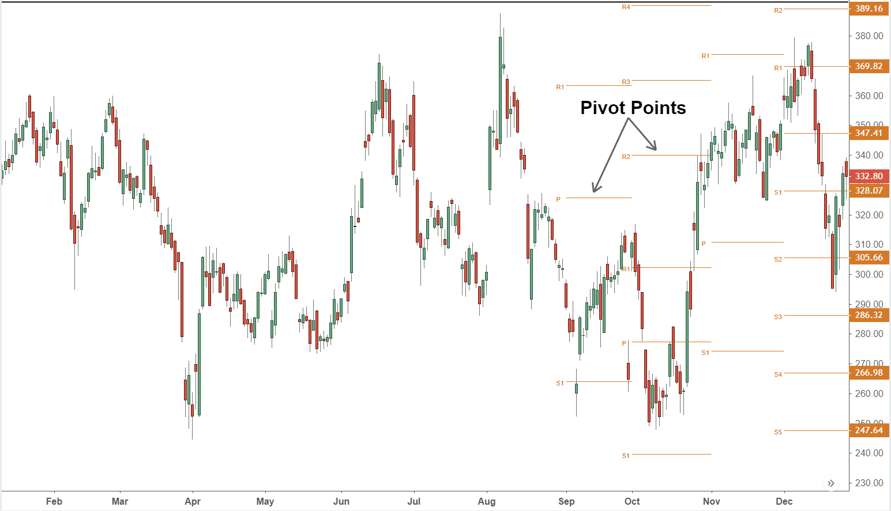

Understanding stock market points is crucial for navigating the financial markets effectively. These metrics form the backbone of market analysis, allowing traders, investors, and financial analysts to interpret market movements accurately. Stock market points represent numerical values that indicate changes in stock prices or market indexes such as the Dow Jones Industrial Average or the S&P 500. By understanding these changes, market participants can make informed decisions, identify trends, and gauge market sentiments.

Traders rely heavily on these metrics to execute buy or sell orders. Stock market points reflect the market's immediate response to news, earnings reports, or economic indicators, providing traders with real-time data to optimize their strategies. For investors, stock market points offer insights into longer-term trends and investment health. Financial analysts use these points to evaluate market performance and risk, helping construct financial models and forecasts.



Stock market points are not limited to individual stock movements but extend to broader financial points that encompass entire indexes. These indexes aggregate the performance of a collection of stocks, offering a comprehensive view of market movement. Understanding how points operate in these contexts is essential for robust financial analysis.

Algorithmic trading, a cornerstone of modern financial markets, leverages stock market points extensively. By using sophisticated algorithms, traders can process and react to point changes at speeds unattainable by human counterparts. This allows for efficient trading strategies that capitalize on minute market fluctuations. Algorithms can execute numerous transactions based on pre-defined criteria, reducing human error and optimizing outcomes in ever-volatile markets. This capability underscores the importance of precise understanding of point changes and the ability to interpret their implications quickly.

In summary, comprehending stock market points is fundamental for anyone involved in financial trading or analysis. These metrics provide clarity and direction, aiding in decision-making and strategic planning.

## Table of Contents

## Understanding Stock Market Points

Stock market points are a measure used to express changes in the value of stocks or stock market indexes. They are crucial for assessing market performance, facilitating quick analysis of financial conditions, and making informed trading decisions.

Stock market points differ in their usage between individual stocks and stock market indexes. For individual stocks, a point typically represents a one-unit change in the stock's price, equivalent to one currency unit in the investor’s market (e.g., $1 change in the U.S. stock market). For example, if a stock's price increases from $50 to $51, it is said to have gained one point. On the other hand, points in stock market indexes reflect the aggregate movement of the entire index. For example, if the Dow Jones Industrial Average moves from 34,000 to 34,050, it has increased by 50 points. 

Points represent monetary changes, but their significance can differ significantly between individual stocks and market indexes. Take the example of the S&P 500, a widely tracked stock market index. If the S&P 500 moves up by 10 points, it doesn’t necessarily mean each stock within the index has risen by 10 dollars; instead, it indicates the cumulative effect of price changes in all the index's constituent stocks, weighted by market capitalization.

There are common misconceptions surrounding stock market points, particularly in comparison to percentage changes. A move of 200 points in a high-priced index like the Dow Jones may be less significant, percentage-wise, than a 20-point move in a smaller index or stock. Percentages offer a relative measure of change, allowing for a clearer comparison of performance across stocks or indexes of different initial values. For instance, a stock that increases from $10 to $11 has moved up by 1 point, which equates to a 10% increase—this percentage is more informative than the simple point change.

Understanding the distinction and proper use of points helps prevent misleading interpretations, such as assuming a 100-point move has the same impact regardless of context. In financial analysis, discerning when to focus on raw point changes versus percentage changes provides a more nuanced view of market dynamics and investment value.

## Financial Points in Stock Market Indexes

Stock market indexes, such as the Dow Jones Industrial Average (DJIA) and the S&P 500, are vital tools for assessing the overall health and performance of equity markets. Each index operates by assigning a point value to its component stocks, creating a cohesive measurement that reflects the market's direction and strength.

### Points in Major Indexes

In stock market indexes, a "point" represents a specific unit of measure for assessing the change in the index's overall value. Each index calculates its value differently, primarily based on the price movements of its constituent stocks. The Dow Jones Industrial Average, for example, is a price-weighted index, meaning it gives greater weight to stocks with higher prices. Conversely, the S&P 500 is market-capitalization-weighted, emphasizing larger companies.

**Example**:

In the DJIA, a $1 change in the price of a high-priced stock like Goldman Sachs has a more significant impact on the index than the same $1 change in a lower-priced stock, such as Cisco. By contrast, the S&P 500 calculation involves dividing the aggregate market capitalization of its constituents by a divisor, which is adjusted for stock splits and other corporate actions.

### Computation and Investor Impact

The computation of index points is crucial for investors as they provide a snapshot of market trends. The formula for calculating the DJIA value is straightforward:

$$
\text{DJIA Index Value} = \frac{\sum \text{Stock Prices}}{\text{Dow Divisor}}
$$

On the other hand, the S&P 500 value is computed as:

$$
\text{S&P 500 Index Value} = \frac{\sum (\text{Stock Price} \times \text{Shares Outstanding})}{\text{Index Divisor}}
$$

Significant changes in index points can deeply affect investor sentiment and decisions. For instance, a large drop in the Dow Jones might signal economic troubles, prompting investors to sell holdings to avoid potential losses. Conversely, a substantial rise often indicates a bullish trend, encouraging investment.

### Historical Impact of Significant Point Changes

Major historical events illustrate the profound impact of point changes on stock market indexes and investor behavior. The "Black Monday" crash on October 19, 1987, saw the DJIA plummet by 508 points, or about 22.6%. This unprecedented drop was largely driven by panic selling and program trading, triggering significant global economic consequences.

Similarly, the financial crisis of 2008-2009 delivered sharp point declines, with the DJIA dropping 777 points on September 29, 2008, a record at that time. These point changes underscored fears about the unfolding financial turmoil and led investors to reassess their portfolios urgently.

Overall, understanding how stock market index points are calculated and interpreted can provide crucial insights for investors. It highlights the need to consider both quantitative data and broader economic factors in making informed investment decisions.

## The Role of Algorithmic Trading with Stock Market Points

Algorithmic trading marks a significant advancement in modern financial markets, drawing from computational power and sophisticated algorithms to analyze vast datasets and execute trades at speeds unattainable by human traders. This transformation in trading practices leverages stock market points as critical inputs for creating and optimizing trading strategies.

Algo traders utilize stock market points by integrating them into mathematical models to detect market trends and potential trading signals. These models often incorporate historical data, including past point changes of stocks or indexes, and forecast future price movements. For instance, a Python algorithm might look something like this:

```python
import numpy as np

# Simulating a trading signal based on stock points change
def generate_trading_signal(historical_points, threshold=10):
    # Calculate daily changes in points
    daily_changes = np.diff(historical_points)

    # Generate a buy signal (+1) if the point change exceeds the threshold, sell signal (-1) if it drops below negative threshold
    signals = np.where(daily_changes > threshold, 1, np.where(daily_changes < -threshold, -1, 0))

    return signals

# Example historical points data
historical_points = [3000, 3010, 2995, 3100, 3090, 3085]

# Generate trading signals
trading_signals = generate_trading_signal(historical_points)
print(trading_signals)
```

In this basic example, the algorithm generates buy or sell signals based on the threshold of point changes. Such strategies enable traders to capitalize on rapid point fluctuations in the stock market, executing trades within milliseconds of detecting favorable conditions.

The benefits of [algorithmic trading](/wiki/algorithmic-trading) are manifold. The primary advantage is its ability to process large volumes of data at high speed, enabling traders to exploit fleeting market opportunities and minimize transaction costs. Additionally, algorithms can operate without the psychological biases that often impact human decision-making, ensuring a disciplined and consistent trading approach.

However, the use of stock market points in algorithmic trading carries potential risks. The reliance on algorithmic models can lead to market instability, especially if numerous traders implement similar strategies simultaneously, resulting in excessive market movements known as "flash crashes." Moreover, these algorithms are only as good as the data and assumptions upon which they are based. Inaccurate data or flawed models can lead to significant financial losses.

The increasing complexity of these algorithms requires stringent monitoring and adjustment by financial analysts to ensure their continued efficacy amidst changing market conditions. Additionally, regulatory frameworks are evolving to manage the risks associated with algorithmic trading, ensuring that market integrity is maintained while leveraging the benefits of technological advancements.

## Comparing Points with Percentages

In financial markets, understanding the distinction between point changes and percentage changes is fundamental for accurate analysis. Points refer to the absolute change in a stock's price or an index's value, whereas percentage changes reflect the relative magnitude of these changes, offering a clearer perspective on the impact.

Percentage changes offer a normalized measure, making them a better gauge of performance across varying scales or values. For example, a one-point increase in a stock trading at $10 signifies a 10% rise, whereas the same point increase from $100 represents just a 1% change. This discrepancy demonstrates how percentage changes provide context that raw point changes do not, highlighting their usefulness in comparative analysis across companies or times.

Consider an example with two stocks: Stock A priced at $50 and Stock B at $500. If both experience a 5-point increase, the relative impact differs substantially. For Stock A, this is a 10% increase, indicating significant movement. In contrast, Stock B's increase is only 1%, suggesting minimal price fluctuation. Relying solely on points in this scenario would mislead an analyst into perceiving similar levels of impact across disparate stocks.

A focus on points can be misleading, especially with stock market indexes like the Dow Jones Industrial Average (DJIA). The DJIA is a price-weighted index, meaning stocks with higher prices have a larger impact on the index's point movements. Thus, a point change in the DJIA could reflect substantial movement in a few high-priced stocks rather than a broad market trend. In such situations, percentage changes across individual components offer a balanced view of market conditions, revealing underlying strengths or weaknesses that point changes obscure.

Given these considerations, understanding when to apply percentage changes over points not only aids in clearer interpretation but also fortifies financial analysis by removing scale biases and providing consistent metrics across varying investment landscapes. For holistic insight, investors and analysts should incorporate percentage-based evaluations alongside qualitative assessments to ensure robust financial decision-making.

## Practical Applications of Understanding Stock Market Points

Investors and traders use stock market points as crucial indicators in making informed decisions. Points offer a quantifiable metric that reflects the monetary changes in stock prices and market indexes, serving as a real-time guide to market fluctuations. Understanding these changes allows market participants to anticipate trends, evaluate their portfolio's performance, and adjust their investment strategies accordingly.

### Case Studies and Examples

One illustrative example is the 2008 financial crisis, where significant point drops in major indexes like the Dow Jones Industrial Average urged investors to reassess their asset allocations. Those who understood the severity indicated by these point drops could better mitigate their losses by reallocating investments to more stable assets such as bonds or gold.

Another case is the tech boom of the 1990s, where consecutive upward point movements in the NASDAQ index signaled substantial growth in the technology sector. Investors who recognized these trends could capitalize on the growth by investing in tech stocks early.

### Tips for Financial Novices

1. **Focus on Trends, Not Just Numbers**: Novices should pay attention to the trend direction indicated by point changes rather than focusing solely on the numbers. A small point change in a high-value stock could represent a significant percentage change.

2. **Use Percentage Changes for Context**: While points provide a raw indicator of change, percentages often offer better context. For example, a 100-point drop in an index valued at 10,000 is only a 1% change, which is less alarming than the same point drop on a 1,000-point index (10%).

3. **Combine Points with Qualitative Analysis**: It is essential to integrate quantitative data like points with qualitative factors such as economic news, company earnings reports, and geopolitical events. This approach provides a more comprehensive view that aids in making informed decisions.

4. **Utilize Technological Tools and Resources**: Various platforms offer analytics and visualization tools that can help to interpret point changes effectively. Customizable alerts for specific point thresholds can also assist in timely decision-making.

Understanding the nuances of point changes, coupled with these practical applications, can significantly enhance an investor's ability to navigate the ever-evolving financial markets. By mastering both point and percentage interpretations, traders can position themselves strategically in response to market movements.

## Conclusion

A comprehensive understanding of stock market points is critical for successful trading and investing. These metrics offer a fundamental measure of market performance and provide key insights into the fluctuations of individual stocks and market indexes. However, it is crucial for investors and traders not to limit their analysis to point changes alone. Points, while indicative of movements, often lack context without considering the relative scale of these changes, which is where a nuanced perspective becomes necessary.

Financial success in trading and investing hinges on blending quantitative data, such as stock market points, with qualitative analysis. By integrating these elements, individuals can develop a more complete view of market dynamics. Quantitative data provides the metrics needed to track and predict market trends, while qualitative analysis offers the broader context, including economic indicators, market sentiment, and geopolitical factors, which can influence stock prices. 

In practice, this integration allows investors to better navigate complex financial landscapes, making informed decisions that account for both numerical trends and broader market signals. For example, understanding a 100-point drop in an index is more meaningful when evaluated against market conditions or the index's total value. 

Successful financial decision-making thus requires attention to detail and a willingness to engage with the data beyond surface-level impressions. It invites investors to consider how factors interact and impact market performance holistically, encouraging a blend of numerical precision with strategic insight.

## References & Further Reading

[1]: Bergstra, J., Bardenet, R., Bengio, Y., & Kégl, B. (2011). ["Algorithms for Hyper-Parameter Optimization."](https://dl.acm.org/doi/10.5555/2986459.2986743) Advances in Neural Information Processing Systems 24.

[2]: ["Advances in Financial Machine Learning"](https://www.amazon.com/Advances-Financial-Machine-Learning-Marcos/dp/1119482089) by Marcos Lopez de Prado

[3]: ["Evidence-Based Technical Analysis: Applying the Scientific Method and Statistical Inference to Trading Signals"](https://www.amazon.com/Evidence-Based-Technical-Analysis-Scientific-Statistical/dp/0470008741) by David Aronson

[4]: ["Machine Learning for Algorithmic Trading"](https://github.com/stefan-jansen/machine-learning-for-trading) by Stefan Jansen

[5]: ["Quantitative Trading: How to Build Your Own Algorithmic Trading Business"](https://www.amazon.com/Quantitative-Trading-Build-Algorithmic-Business/dp/1119800064) by Ernest P. Chan