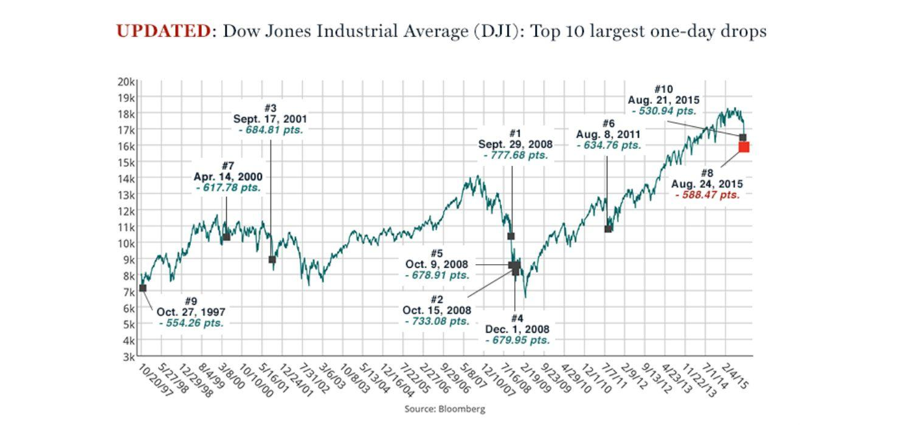

## Table of Contents

## What is a point in the stock market?

A point in the stock market refers to a single unit of change in the value of an index or a stock. For example, if the Dow Jones Industrial Average goes up from 30,000 to 30,001, it has increased by one point. Points are used to measure how much a stock or an index has moved in value over a certain period of time. It's a simple way to track changes, but the actual value of a point can vary depending on the specific index or stock.

Points are important because they help investors and traders quickly understand how much a stock or an index has changed. If someone says the S&P 500 went up 10 points today, you know it increased in value. However, the dollar value of a point can be different for different stocks and indexes. For instance, a point in the S&P 500 might be worth more in dollars than a point in a smaller index. This is why it's useful to know both the point change and the percentage change to get a full picture of what's happening in the market.

## How are points calculated in stock market indices?

Points in stock market indices are calculated by adding up the values of the stocks in the index and then using a specific formula. Each index has its own way of doing this. For example, the Dow Jones Industrial Average adds up the prices of its 30 stocks and then divides by a special number called the "divisor." This divisor changes over time to account for things like stock splits or changes in the companies included in the index. The result is the index's value in points.

Other indices like the S&P 500 use a different method. They add up the market value of all the stocks in the index, which is the price of each stock multiplied by the number of shares. Then, they divide this total market value by a number called the "index divisor." This divisor is adjusted to keep the index's value smooth when companies are added or removed. So, when someone says the S&P 500 went up 10 points, it means the total market value of those 500 companies increased by a certain amount, which is then shown as points.

## Why are points important for investors?

Points are important for investors because they show how much a stock or an index has changed in value. If you're looking at the stock market, you might hear that the Dow Jones went up 50 points today. That tells you the overall value of the 30 big companies in the Dow Jones went up a bit. It's a quick way to see if the market is doing well or not. For investors, knowing the point change helps them decide if it's a good time to buy or sell their stocks.

Also, points help investors understand trends over time. If the S&P 500 keeps going up by a lot of points every month, it might mean the economy is doing well. Investors can use this information to plan their investments better. But, it's not just about the points. Investors also look at the percentage change and other details to get the full picture. Points are just one piece of the puzzle, but they're a really helpful piece.

## Can you explain the difference between points and percentage changes in stock prices?

Points and percentage changes are two ways to talk about how much a stock or an index has changed in value. Points are the actual number that a stock or index goes up or down by. For example, if a stock was $100 and it goes up to $101, it has gone up by 1 point. Points are good for quick checks and seeing the raw change in value.

Percentage changes, on the other hand, show how much a stock or index has changed as a part of its starting value. Using the same example, if a stock goes from $100 to $101, the percentage change is 1%. This means the stock went up by 1% of its starting value. Percentage changes are useful because they help you compare changes in stocks or indexes that have different prices. A 1% change means the same thing whether the stock was $10 or $1000, but the points would be different.

Both points and percentage changes are important for investors. Points give you a quick snapshot of how much a stock or index has moved in raw numbers. Percentage changes help you understand the change in a way that you can compare across different stocks or indexes. Together, they give a fuller picture of what's happening in the market.

## How do points affect the overall market sentiment?

Points can really change how people feel about the stock market. When the points go up a lot, it can make people feel happy and confident. They might think the market is doing well and want to buy more stocks. On the other hand, if the points drop a lot, people can get worried or scared. They might start selling their stocks because they think the market is going down. So, the number of points can make a big difference in how people feel about investing.

Points also help set the mood for the market because they show quick changes. If the points keep going up day after day, it can create a feeling of excitement and make people think the market will keep getting better. But if the points start to go down, it can make people feel nervous and unsure about what will happen next. In this way, points are like a thermometer for the market's health, showing how people are feeling and what they might do next.

## What historical events have significantly impacted points in the stock market?

Big events in history have made the stock market's points go up and down a lot. One famous time was the Great Depression in the 1930s. It started with a big drop in the stock market called the Wall Street Crash of 1929. The points fell a lot, and it made people lose a lot of money. This event made everyone feel very worried and scared about the future. The market took a long time to get better after that.

Another important event was the 2008 Financial Crisis. It started because of problems with housing loans, and it made the stock market's points drop very fast. Many people lost their jobs and their savings. The points going down made everyone feel unsure and scared about what would happen next. It took years for the market to recover and for people to feel better about investing again. These events show how big changes in the world can affect the points in the stock market and how people feel about it.

## How can understanding points help in making investment decisions?

Understanding points in the stock market can help you make better choices about your investments. Points tell you how much a stock or an index has changed in value. If you see the points going up, it might mean the market is doing well, and it could be a good time to buy more stocks. But if the points are going down a lot, it might make you think about selling some of your stocks to avoid losing money. By keeping an eye on the points, you can decide when to buy or sell based on what's happening in the market.

Also, looking at points over time can help you see trends. If the points keep going up month after month, it might mean the economy is getting stronger, and it could be a good time to invest more. But if the points start dropping, it might be a sign that things are not going so well, and you might want to be more careful with your money. Points are like a guide that can help you make smart choices about when to put your money into the market and when to take it out.

## What are some common misconceptions about points in the stock market?

One common misconception about points in the stock market is that a big change in points always means a big change in money. But this isn't always true. The value of a point can be different depending on the stock or index. For example, a 100-point change in the Dow Jones might not be as much money as a 100-point change in a smaller index. So, it's important to look at the percentage change too, not just the points, to understand how much money you might gain or lose.

Another misconception is that points tell you everything you need to know about the market. Points are helpful, but they don't show the whole picture. Other things like the economy, news, and company earnings can also affect the market. So, while points can give you a quick idea of what's happening, you should also look at other information to make good investment choices.

## How do points in different stock market indices (e.g., Dow Jones, S&P 500) compare?

Points in different stock market indices like the Dow Jones and the S&P 500 can be hard to compare because they are calculated differently. The Dow Jones adds up the prices of its 30 big companies and then divides by a special number called the "divisor." This makes the points in the Dow Jones show how the prices of these 30 companies are changing. On the other hand, the S&P 500 looks at the total value of 500 companies, which means it takes into account both the price of the stocks and how many shares there are. So, a point in the S&P 500 shows a change in the overall value of these 500 companies.

Because of these different ways of calculating points, a change in points can mean different things in different indices. For example, a 100-point change in the Dow Jones might not be as big of a deal as a 100-point change in the S&P 500. It's like comparing apples to oranges. To really understand what's going on, it's better to look at the percentage change along with the points. This helps you see how much the market has changed in a way that you can compare across different indices.

## What advanced strategies can traders use to capitalize on point movements?

Traders can use a strategy called "scalping" to make money from small point movements in the stock market. Scalping means buying and selling stocks really fast, often within minutes or even seconds, to take advantage of tiny changes in points. Traders who do this need to watch the market closely and use special tools to see when points are moving in their favor. They might make a lot of small trades throughout the day, hoping that the total of all those little gains adds up to a big profit.

Another strategy is called "swing trading," which focuses on bigger point movements that happen over days or weeks. Swing traders try to find stocks that are about to go up or down a lot in points. They do this by looking at patterns in the stock's price and using charts to predict where the points might go next. When they think the points are going to move in a big way, they buy or sell the stock and hold onto it for a short time until the point movement happens. This way, they can make money from the bigger changes in the stock's value.

## How do global economic factors influence points in the stock market?

Global economic factors can really change the points in the stock market. Things like interest rates, inflation, and how strong other countries' economies are can make the points go up or down. For example, if the U.S. raises interest rates, it might make borrowing money more expensive, and that can slow down the economy. When the economy slows down, people might worry and sell their stocks, which makes the points drop. On the other hand, if a big country like China is doing well, it can make people feel more confident about the world economy, and that can push the points up.

Another important global factor is trade. If countries are trading a lot with each other, it can be good for the stock market. More trade means more business, which can make companies' profits go up, and that can make the points in the stock market go up too. But if countries start fighting over trade, like putting up tariffs, it can hurt businesses and make the points go down. So, traders and investors need to keep an eye on what's happening around the world because it can have a big impact on the points in the stock market.

## What role do algorithmic trading and high-frequency trading play in point fluctuations?

Algorithmic trading and high-frequency trading can make the points in the stock market move a lot. These kinds of trading use computers to buy and sell stocks very quickly, often in just a few seconds. The computers follow special rules, or algorithms, that tell them when to trade. Because they can trade so fast, they can take advantage of tiny changes in the market. This can make the points go up and down a lot in a short time, even if the overall market isn't changing much.

These fast trades can also make the market more unpredictable. When a lot of computers are trading at the same time, it can create big swings in the points. Sometimes, these swings can be so big that they cause what's called a "flash crash," where the points drop very quickly and then come back up just as fast. Traders and investors need to be careful because these quick changes can affect their decisions and how much money they make or lose.

## What are the financial points in stock market indexes?

Stock market indexes, such as the Dow Jones Industrial Average (DJIA) and the S&P 500, are vital tools for assessing the overall health and performance of equity markets. Each index operates by assigning a point value to its component stocks, creating a cohesive measurement that reflects the market's direction and strength.

### Points in Major Indexes

In stock market indexes, a "point" represents a specific unit of measure for assessing the change in the index's overall value. Each index calculates its value differently, primarily based on the price movements of its constituent stocks. The Dow Jones Industrial Average, for example, is a price-weighted index, meaning it gives greater weight to stocks with higher prices. Conversely, the S&P 500 is market-capitalization-weighted, emphasizing larger companies.

**Example**:

In the DJIA, a $1 change in the price of a high-priced stock like Goldman Sachs has a more significant impact on the index than the same $1 change in a lower-priced stock, such as Cisco. By contrast, the S&P 500 calculation involves dividing the aggregate market capitalization of its constituents by a divisor, which is adjusted for stock splits and other corporate actions.

### Computation and Investor Impact

The computation of index points is crucial for investors as they provide a snapshot of market trends. The formula for calculating the DJIA value is straightforward:

$$
\text{DJIA Index Value} = \frac{\sum \text{Stock Prices}}{\text{Dow Divisor}}
$$

On the other hand, the S&P 500 value is computed as:

$$
\text{S&P 500 Index Value} = \frac{\sum (\text{Stock Price} \times \text{Shares Outstanding})}{\text{Index Divisor}}
$$

Significant changes in index points can deeply affect investor sentiment and decisions. For instance, a large drop in the Dow Jones might signal economic troubles, prompting investors to sell holdings to avoid potential losses. Conversely, a substantial rise often indicates a bullish trend, encouraging investment.

### Historical Impact of Significant Point Changes

Major historical events illustrate the profound impact of point changes on stock market indexes and investor behavior. The "Black Monday" crash on October 19, 1987, saw the DJIA plummet by 508 points, or about 22.6%. This unprecedented drop was largely driven by panic selling and program trading, triggering significant global economic consequences.

Similarly, the financial crisis of 2008-2009 delivered sharp point declines, with the DJIA dropping 777 points on September 29, 2008, a record at that time. These point changes underscored fears about the unfolding financial turmoil and led investors to reassess their portfolios urgently.

Overall, understanding how stock market index points are calculated and interpreted can provide crucial insights for investors. It highlights the need to consider both quantitative data and broader economic factors in making informed investment decisions.

## References & Further Reading

[1]: Bergstra, J., Bardenet, R., Bengio, Y., & Kégl, B. (2011). ["Algorithms for Hyper-Parameter Optimization."](https://dl.acm.org/doi/10.5555/2986459.2986743) Advances in Neural Information Processing Systems 24.

[2]: ["Advances in Financial Machine Learning"](https://www.amazon.com/Advances-Financial-Machine-Learning-Marcos/dp/1119482089) by Marcos Lopez de Prado

[3]: ["Evidence-Based Technical Analysis: Applying the Scientific Method and Statistical Inference to Trading Signals"](https://www.amazon.com/Evidence-Based-Technical-Analysis-Scientific-Statistical/dp/0470008741) by David Aronson

[4]: ["Machine Learning for Algorithmic Trading"](https://github.com/stefan-jansen/machine-learning-for-trading) by Stefan Jansen

[5]: ["Quantitative Trading: How to Build Your Own Algorithmic Trading Business"](https://www.amazon.com/Quantitative-Trading-Build-Algorithmic-Business/dp/1119800064) by Ernest P. Chan