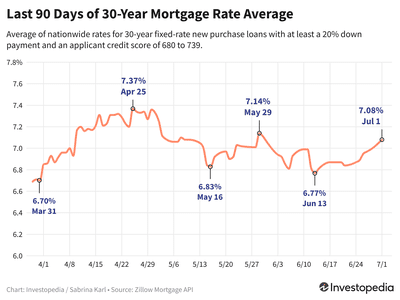

In today's interconnected financial landscape, mortgage rates, stocks, bonds, and algorithmic trading have become integral components influencing the financial decisions of individuals and institutions. Understanding the interactions among these elements is crucial for both investors and homeowners, as they play pivotal roles in shaping economic outcomes and investment strategies.

Mortgage rates significantly affect the housing market and, by extension, the broader economy. They determine the affordability of homeownership, influence real estate investment decisions, and can drive or dampen economic growth. As mortgage rates fluctuate, they can cause shifts in housing demand, impacting not only individual homeowners but also sectors tied to real estate development and infrastructure.



Stocks and bonds represent fundamental instruments in financial markets and are key to building diversified investment portfolios. Stocks offer potential for growth and dividends, reflecting the performance and profitability of companies. In contrast, bonds provide investors with steady income through interest payments, acting as a hedge against market volatility. The dynamic interaction between stocks and bonds often hinges on interest rate changes, which can be influenced by mortgage rate trends.

Algorithmic trading has revolutionized financial markets by utilizing complex algorithms to execute trades at optimal speeds and prices. This technological advancement has brought about increased trading efficiency, reduced transaction costs, and minimized human error, ultimately reshaping the way stocks, bonds, and other financial instruments are traded. The prominence of algorithmic trading necessitates an understanding of its impacts, offering invaluable insights for developing advanced trading strategies.

By examining how mortgage rates, stocks, bonds, and algorithmic trading are interconnected, investors can optimize their investment strategies. This article aims to provide clarity on these relationships, fostering informed decision-making and enhancing the strategic advantage in a complex financial environment.

## Table of Contents

## Mortgage Rates and Their Impact on the Economy

Mortgage rates are a pivotal element within the housing market and the broader economy, affecting both individual homebuyers and the wider financial landscape. They directly influence homebuyer affordability, as the cost of borrowing to purchase a home is determined by prevailing mortgage rates. When mortgage rates rise, monthly payments for home loans increase, which can diminish the affordability of homes for potential buyers. This can lead to decreased demand in the housing market, impacting a wide range of economic factors, from real estate investments to home sales and construction activities.

High mortgage rates not only affect individual affordability but also have macroeconomic implications. As the cost of borrowing increases, fewer consumers are able to afford home loans, which can result in reduced spending in the housing sector. This slowdown can contribute to broader economic deceleration, as the housing market is a key driver of economic growth. Real estate investments may decline, and related industries such as construction, manufacturing, and retail may also feel the effects of decreased demand.

To better understand how mortgage rates impact the economy, it is crucial to recognize the economic indicators that affect these rates. One of the primary influences on mortgage rates is the monetary policy set by central banks, such as the Federal Reserve in the United States. When the central bank raises interest rates to control inflation, mortgage rates typically follow suit. Another significant [factor](/wiki/factor-investing) is the yield on long-term government bonds. Mortgage rates tend to move in the same direction as bond yields, as both serve as benchmarks for a variety of interest rates.

Economic indicators, such as employment [statistics](/wiki/bayesian-statistics), inflation rates, and gross domestic product (GDP) growth, also play a role in shaping mortgage rates. Strong employment and growing GDP can lead to increased inflationary pressures, prompting central banks to raise interest rates to temper inflation, thus elevating mortgage rates.

Understanding these interconnected factors is essential for stakeholders, including homebuyers, real estate investors, and policymakers. By keeping track of these indicators and their influence on mortgage rates, stakeholders can make informed decisions that align with the current and anticipated economic environment. This knowledge can guide investment strategies and policy decisions that aim to balance growth with affordability in the housing market.

## The Role of Stocks and Bonds in Financial Markets

Stocks and bonds are foundational elements in financial markets, each serving distinct roles and offering specific benefits to investors. Stocks, also known as equities, represent ownership shares in a company. These shares provide investors with the potential for capital appreciation and the opportunity to earn dividends, which are portions of a company's profits distributed to shareholders. Stocks are generally considered to [carry](/wiki/carry-trading) higher risk compared to bonds, but they also offer higher potential returns.

Bonds, on the other hand, are debt securities issued by corporations, municipalities, or governments to raise capital. When an investor purchases a bond, they are essentially lending money to the issuer in exchange for periodic interest payments, known as coupon payments, and the return of the bond's face value at maturity. Bonds are generally viewed as more stable investments compared to stocks, offering steady income and lower risk, although at the expense of lower potential returns.

The interplay between stocks and bonds is critical for effective portfolio diversification. Diversification involves spreading investments across various asset classes to reduce risk. The correlation between stocks and bonds is often negative, meaning that when stock prices decline, bond prices may rise, or vice versa. This inverse relationship can help smooth out overall portfolio [volatility](/wiki/volatility-trading-strategies), offering a more balanced investment strategy.

Interest rates significantly influence the attractiveness of both stocks and bonds. Rising interest rates can lead to higher bond yields, making bonds more attractive to investors seeking steady income. However, higher interest rates can also increase the cost of borrowing for companies, potentially reducing corporate profits and impacting stock valuations negatively. Conversely, lower interest rates tend to increase stock market valuations by reducing borrowing costs for companies and decreasing bond yields, which can drive investors toward equities in search of higher returns.

Mortgage rates, while primarily affecting the housing market, also play a role in broader [interest rate](/wiki/interest-rate-trading-strategies) trends. When mortgage rates rise, they often contribute to an overall increase in interest rates, influencing the bond and stock markets accordingly. Investors must be cognizant of these dynamics, as shifts in interest rates can lead to realignments in investment portfolios, with significant movements between equities and fixed-income securities, depending on prevailing economic conditions.

## Algorithmic Trading: Revolutionizing Financial Markets

Algorithmic trading has transformed financial markets by leveraging sophisticated computer algorithms to execute trades at speeds and prices that exceed human capabilities. This method of trading has revolutionized the efficiency and effectiveness of financial transactions, providing several advantages over traditional trading methods.

One key benefit of [algorithmic trading](/wiki/algorithmic-trading) is its ability to operate at high speeds. Algorithms can analyze vast amounts of market data in milliseconds, enabling the execution of trades based on precise market movements. This rapid decision-making is crucial in fast-paced markets where timing can significantly affect profitability. Furthermore, the ability to automate trading strategies allows for 24/7 market engagement, which is particularly beneficial in global markets that operate across multiple time zones.

Algorithmic trading also contributes to cost reduction and minimizes human error. By automating the trading process, the need for constant human oversight is reduced, leading to decreased transaction costs. Moreover, the elimination of human emotion from trading decisions helps to avoid errors that can arise from psychological biases, such as fear or greed, which often lead to suboptimal trading decisions.

The impact of algorithmic trading on stocks, bonds, and other financial instruments is profound. It has brought about increased [liquidity](/wiki/liquidity-risk-premium) in financial markets by facilitating large volumes of trades, which helps narrow bid-ask spreads and reduce volatility. This increased liquidity can lead to more efficient price discovery, benefitting both investors and issuers.

Understanding the role of algorithmic trading is crucial for developing advanced trading strategies. The integration of algorithms allows for the implementation of complex strategies that can adapt to changing market conditions. For example, algorithmic trading can employ strategies such as statistical [arbitrage](/wiki/arbitrage), market-making, and [trend following](/wiki/trend-following), each tailored to capitalize on specific market inefficiencies.

In Python, simple algorithmic trading strategies can be implemented using libraries such as pandas, NumPy, and TA-Lib. For instance, a moving average crossover strategy could be coded as follows:

```python
import pandas as pd
import numpy as np

# Assume 'data' is a DataFrame containing historical price data with a 'Close' column
data['SMA_50'] = data['Close'].rolling(window=50).mean()
data['SMA_200'] = data['Close'].rolling(window=200).mean()

# Simple moving average crossover strategy
data['Signal'] = 0
data['Signal'][50:] = np.where(data['SMA_50'][50:] > data['SMA_200'][50:], 1, 0)
data['Position'] = data['Signal'].diff()

# Buy and sell signals
buy_signals = data[data['Position'] == 1]
sell_signals = data[data['Position'] == -1]
```

This code demonstrates a basic strategy where trades are executed based on the crossover of a 50-day simple moving average (SMA) and a 200-day SMA. Such strategies can be further refined and incorporated into more sophisticated algorithmic trading systems.

In conclusion, algorithmic trading has reshaped financial markets by enhancing trading efficiency, reducing costs, and facilitating the development of complex trading strategies. Understanding its benefits and implementation methodologies is essential for investors and institutions aiming to optimize their trading practices in today’s dynamic financial landscape.

## Interconnections Between Mortgage Rates, Stocks, and Bonds

Mortgage rates, stocks, and bonds are interconnected components of financial markets, influencing each other through the mechanism of interest rates. Changes in mortgage rates can significantly impact the relative attractiveness of stocks and bonds, affecting portfolio allocations and investor behavior.

Mortgage rates, directly tied to prevailing interest rates, can influence both housing market dynamics and broader economic conditions. As mortgage rates increase, borrowing costs rise, potentially dampening demand for housing and related sectors. This, in turn, can lead to shifts in investor sentiment as market participants reassess the economic outlook and adjust their portfolio allocations accordingly.

Interest rate changes are a key determinant in the balance between stocks and bonds within investment portfolios. Generally, higher interest rates make bonds more appealing because they offer higher yields, while stocks might become less attractive due to increased borrowing costs and a potentially slower economic environment. Conversely, lower interest rates tend to make stocks more attractive by reducing borrowing costs and encouraging economic activity, whereas bond yields decrease, rendering them less appealing.

Mathematically, the relationship between interest rates and bond prices can be expressed through the following formula:

$$
P = \frac{C}{1 + r} + \frac{C}{(1 + r)^2} + \ldots + \frac{C + F}{(1 + r)^n}
$$

where $P$ is the bond price, $C$ is the coupon payment, $r$ is the interest rate, and $F$ is the face value of the bond. This formula illustrates that as interest rates $r$ rise, the present value of the bond's future payments decreases, leading to lower bond prices.

Fluctuations in mortgage rates can also indirectly influence market sentiment and trading volumes. For instance, a rise in mortgage rates might signal tighter monetary policy or inflation concerns, prompting investors to reevaluate risk exposure across asset classes, including stocks and bonds. In such scenarios, traders may observe increased volatility and changes in trading volumes as market participants react to these shifts.

Investors aiming for optimized portfolio management need to monitor these interconnections closely. By understanding how mortgage rates can affect the relative attractiveness of stocks and bonds, investors can make more informed choices about asset allocation. For example, a strategic rotation between stocks and bonds may be warranted in anticipation of interest rate movements. By maintaining awareness of these relationships, investors can better navigate the complexities of financial markets and adapt to evolving economic conditions.

In summary, the interplay between mortgage rates, stocks, and bonds is a dynamic process that requires careful observation and analysis. Recognizing how changes in mortgage rates can influence investor preferences and market behavior is crucial for effective portfolio management and decision-making in the financial markets.

## The Future of Financial Markets

Technological advancements and algorithmic trading are significantly reshaping the financial markets, driving a transformation towards more sophisticated and automated investment ecosystems. Algorithmic trading, which employs complex algorithms to execute trades at high speed and accuracy, continues to gain traction. As of recent years, it is estimated that algorithmic trading accounts for a substantial portion of trading volumes in major financial markets. This trend towards automation offers both opportunities and challenges for market participants.

As the financial markets evolve, investors must remain adaptive and abreast of economic indicators. The interplay between economic indicators such as inflation rates, GDP growth, and employment figures with financial instruments like mortgage rates, stocks, and bonds is crucial for anticipating market movements. For example, changes in interest rates, guided by economic indicators, can influence bond prices inversely and affect stock market valuations.

Understanding the connections among mortgage rates, stocks, bonds, and algorithmic trading is vital for investors aiming to optimize their strategies. Mortgage rates, for example, can be influenced by central bank policies, which in turn affect bond yields and stock market performance. Algorithmic trading uses these relationships to capitalize on arbitrage opportunities and implement complex strategies like pairs trading or [statistical arbitrage](/wiki/statistical-arbitrage).

Future financial markets are projected to be increasingly integrated, with traditional trading floors giving way to digital platforms capable of executing trades in nanoseconds. Blockchain technology and cryptocurrencies already hint at a move towards decentralized finance (DeFi), providing a glimpse into more secure, transparent, and decentralized market operations. The integration of [artificial intelligence](/wiki/ai-artificial-intelligence) and [machine learning](/wiki/machine-learning) into trading systems could further enhance predictive analytics, allowing for more precise decision-making processes.

Investors and institutions must harness these technological advancements while remaining vigilant about the associated risks, such as cybersecurity threats and market volatility. Successfully navigating this future landscape will require continuous learning and adaptation, informed by a comprehensive understanding of how these dynamic elements interact. The trajectory towards a fully digitalized and automated financial industry seems inevitable, shaping a future where efficient and data-driven strategies dominate investment practices.

## Conclusion

Recognizing the roles and relationships of mortgage rates, stocks, bonds, and algorithmic trading is essential for informed decision-making. Understanding these interconnected elements provides a strategic advantage in investments. Mortgage rates, as a determinant of borrowing costs, have significant spillover effects on housing affordability and investment decisions, subsequently influencing economic growth. In parallel, stocks and bonds are foundational elements of financial markets, serving as indicators of corporate health and economic stability. Their interplay helps in constructing diversified portfolios that can weather market volatility.

Algorithmic trading, with its ability to process vast amounts of data and execute trades at speeds unattainable to human traders, has revolutionized how these financial instruments are traded, further complicating their interdependencies. Continuous learning and adaptation to these rapid technological advancements are crucial for staying competitive and making judicious investment decisions.

By maintaining awareness of economic indicators and technological advancements, individuals and institutions can better navigate the growing complexities of financial markets. This understanding helps anticipate shifts in market dynamics, optimize asset allocation, and exploit emerging opportunities, thus remaining resilient in a rapidly evolving financial landscape.

## References & Further Reading

[1]: ["The Intelligent Investor"](https://en.wikipedia.org/wiki/The_Intelligent_Investor) by Benjamin Graham

[2]: ["Advances in Financial Machine Learning"](https://www.amazon.com/Advances-Financial-Machine-Learning-Marcos/dp/1119482089) by Marcos Lopez de Prado

[3]: ["Trading and Exchanges: Market Microstructure for Practitioners"](https://www.amazon.com/Trading-Exchanges-Market-Microstructure-Practitioners/dp/0195144708) by Larry Harris

[4]: ["Quantitative Trading: How to Build Your Own Algorithmic Trading Business"](https://www.amazon.com/Quantitative-Trading-Build-Algorithmic-Business/dp/1119800064) by Ernest P. Chan

[5]: ["Evidence-Based Technical Analysis: Applying the Scientific Method and Statistical Inference to Trading Signals"](https://www.amazon.com/Evidence-Based-Technical-Analysis-Scientific-Statistical/dp/0470008741) by David Aronson

[6]: ["Mortgage-Backed Securities: Products, Structuring, and Analytical Techniques"](https://www.amazon.com/Mortgage-Backed-Securities-Structuring-Analytical-Techniques/dp/1118004698) by Frank J. Fabozzi

[7]: Burton G. Malkiel. ["A Random Walk Down Wall Street: The Time-tested Strategy for Successful Investing."](https://www.amazon.com/Random-Walk-Down-Wall-Street/dp/0393358380)

[8]: ["Algorithmic Trading & DMA: An introduction to direct access trading strategies"](https://www.amazon.com/Algorithmic-Trading-DMA-introduction-strategies/dp/0956399207) by Barry Johnson