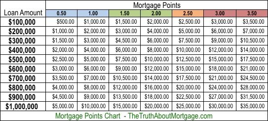

## Table of Contents

## What are points in the context of mortgage rates?

In the context of mortgage rates, points refer to a fee that a borrower pays to a lender at the time of closing a mortgage loan. One point is equal to 1% of the loan amount. For example, if you are borrowing $200,000, one point would cost you $2,000. Points are also known as discount points because they allow borrowers to lower their interest rate and monthly mortgage payments in exchange for paying this upfront fee.

Paying points can be a good strategy if you plan to stay in your home for a long time. By paying points, you can secure a lower interest rate, which means you will pay less interest over the life of the loan. However, if you plan to move or refinance your mortgage soon, paying points might not be worth it because it could take several years to break even on the upfront cost of the points. It's important to do the math and consider how long you plan to stay in the home before deciding whether to pay points.

## How do points affect the interest rate on a mortgage?

Points are a way to lower the interest rate on your mortgage. When you pay points, you give the lender money upfront, and in return, they give you a lower interest rate. Each point you buy usually lowers your interest rate by about 0.25%. So, if you are getting a mortgage with a 5% interest rate and you buy one point, your new rate might be 4.75%.

Whether or not to buy points depends on how long you plan to stay in your home. If you stay long enough, the money you save on interest each month will eventually cover the cost of the points. But if you move or refinance before that happens, you might end up paying more than you save. It's a good idea to talk to your lender and do some calculations to see if buying points makes sense for you.

## What is the difference between discount points and origination points?

Discount points and origination points are two types of fees you might see when getting a mortgage. Discount points are fees you pay to lower your [interest rate](/wiki/interest-rate-trading-strategies). Each point costs 1% of your loan amount and usually lowers your interest rate by about 0.25%. So, if you're borrowing $200,000 and you buy one point, you pay $2,000 upfront, but you get a lower interest rate. This can save you money over time if you stay in your home long enough.

Origination points, on the other hand, are fees charged by the lender for processing your loan. They are also called origination fees and are usually about 1% of the loan amount. Unlike discount points, origination points don't lower your interest rate. They are just a cost of getting the loan. So, if you're borrowing $200,000 and the lender charges one origination point, you'll pay $2,000 just for the lender to process your loan.

## How can buying points on a mortgage save money over time?

Buying points on a mortgage can save you money over time by lowering your interest rate. When you buy points, you pay a fee upfront, but in return, you get a lower interest rate on your loan. For example, if you buy one point, it usually lowers your interest rate by about 0.25%. This means your monthly payments will be smaller because you're paying less interest each month.

Over the life of your loan, these smaller monthly payments can add up to big savings. If you stay in your home for a long time, the money you save on interest can be more than the cost of the points you bought. So, if you plan to stay in your home for many years, buying points can be a smart way to save money in the long run.

## What are points in the stock market?

In the stock market, points are a way to measure the change in the value of a stock index, like the Dow Jones Industrial Average or the S&P 500. When you hear that the Dow Jones went up or down by a certain number of points, it means the total value of the stocks in that index changed by that amount. For example, if the Dow Jones goes up by 100 points, it means the total value of the stocks in the index increased by 100 points.

Points are important because they help people understand how the stock market is doing at a glance. Instead of looking at the price of every single stock, you can just look at the points to see if the market is going up or down. This makes it easier for people to keep track of the market's performance and make decisions about buying or selling stocks.

## How do points in stock indices like the Dow Jones work?

Points in stock indices like the Dow Jones are a way to measure how much the total value of the stocks in the index has changed. If the Dow Jones goes up by 100 points, it means the total value of the stocks in the index has increased by that amount. The Dow Jones is made up of 30 big companies, and the points show how their stock prices have changed overall.

Points are important because they give people a quick and easy way to see how the stock market is doing. Instead of looking at the price of every single stock, you can just look at the points to see if the market is going up or down. This helps people decide whether it's a good time to buy or sell stocks.

## What does it mean when a stock index gains or loses points?

When a stock index like the Dow Jones gains points, it means the total value of the stocks in that index has gone up. For example, if the Dow Jones gains 100 points, it means the value of the 30 big companies that make up the index has increased by that amount. This is a good sign for the stock market because it shows that the companies in the index are doing well, and people might feel more confident about buying stocks.

On the other hand, when a stock index loses points, it means the total value of the stocks in the index has gone down. If the Dow Jones loses 100 points, it means the value of those 30 companies has decreased. This can be a sign that the stock market is not doing as well, and people might be more cautious about buying stocks. Points help people see how the stock market is doing at a glance and make decisions about their investments.

## How do points relate to the performance of bonds?

Points are a way to talk about how much a bond's price has changed. When someone says a bond went up or down by a certain number of points, it means the bond's price changed by that amount. For example, if a bond's price goes up by 2 points, it means the price of the bond increased by $20 for every $1,000 of the bond's face value. This is important because it helps people see how well their bonds are doing.

When a bond gains points, it means its price has gone up, which is good for the person who owns the bond. They can sell it for more money than they paid for it. On the other hand, if a bond loses points, its price has gone down, which is not good for the owner. They would have to sell it for less than they paid. Points help people understand how the bond market is doing and make decisions about buying or selling bonds.

## What is a basis point and how is it used in bond pricing?

A basis point is a way to talk about small changes in interest rates or bond yields. One basis point is equal to 0.01%, or one hundredth of a percent. This might seem tiny, but in the world of finance, even small changes can make a big difference. For example, if the interest rate on a bond goes up by 25 basis points, it means the rate went up by 0.25%.

In bond pricing, basis points are used to show how much the yield on a bond has changed. When the yield goes up by a few basis points, it means the price of the bond goes down a bit. On the other hand, if the yield goes down by a few basis points, the price of the bond goes up. This is important for people who buy and sell bonds because even small changes in yield can affect how much money they make or lose.

## How do changes in bond yields affect bond prices in terms of points?

When bond yields go up, bond prices go down. This is because when the yield goes up, it means the bond is paying more interest. If you want to sell your bond, you have to lower the price to make it attractive to buyers who can get a better interest rate elsewhere. For example, if the yield goes up by 1%, or 100 basis points, the price of the bond might go down by a few points. If the bond has a face value of $1,000, a drop of 2 points means the price goes down by $20.

On the other hand, when bond yields go down, bond prices go up. This happens because the bond is now paying more interest than new bonds being issued. So, if you want to sell your bond, you can ask for a higher price because buyers will want to get the higher interest rate. If the yield goes down by 1%, or 100 basis points, the price of the bond might go up by a few points. For a $1,000 bond, an increase of 2 points means the price goes up by $20.

## Can you explain the relationship between mortgage points and bond market movements?

Mortgage points and the bond market are connected because mortgage rates are influenced by what happens in the bond market. When bond prices go up, it usually means bond yields, or the interest rates on bonds, go down. This can lead to lower mortgage rates. If you buy mortgage points, you're paying to lower your interest rate, which is similar to what happens when bond yields drop. So, if the bond market is doing well and bond prices are going up, it might be a good time to buy mortgage points because you could get a lower interest rate.

On the other hand, when bond prices go down, bond yields go up, and this can lead to higher mortgage rates. If you're thinking about buying mortgage points during a time when the bond market is not doing well, you might not get as much of a benefit because the overall interest rates could be higher. So, keeping an eye on the bond market can help you decide if buying mortgage points is a good idea, as it can affect how much you'll save on your mortgage over time.

## How do expert investors use points in mortgage rates, stocks, and bonds to make strategic financial decisions?

Expert investors use points in mortgage rates, stocks, and bonds to make smart choices about their money. When it comes to mortgage rates, they look at points to decide if it's worth paying extra upfront to get a lower interest rate. If they think they'll stay in their home for a long time, buying points can save them money because their monthly payments will be lower. They keep an eye on the bond market too, because when bond prices go up and yields go down, it can be a good time to buy mortgage points since interest rates might be lower.

In the stock market, points help expert investors see how well the market is doing at a glance. They watch stock indices like the Dow Jones to see if the market is going up or down. If the market gains points, it might be a good time to buy stocks because things are looking up. But if the market loses points, they might hold off on buying or even sell some stocks to avoid losing money. Points give them a quick way to understand the market's performance and make decisions based on that.

When it comes to bonds, expert investors use points and basis points to track changes in bond prices and yields. They know that if bond yields go up, bond prices go down, and vice versa. So, if they see bond prices going up by a few points, they might buy bonds because they can sell them later for more money. On the other hand, if bond prices are going down, they might wait or sell their bonds before they lose more value. By watching points in all these areas, expert investors can make strategic moves to grow their money and protect their investments.

## What are the interconnections between mortgage rates, stocks, and bonds?

Mortgage rates, stocks, and bonds are interconnected components of financial markets, influencing each other through the mechanism of interest rates. Changes in mortgage rates can significantly impact the relative attractiveness of stocks and bonds, affecting portfolio allocations and investor behavior.

Mortgage rates, directly tied to prevailing interest rates, can influence both housing market dynamics and broader economic conditions. As mortgage rates increase, borrowing costs rise, potentially dampening demand for housing and related sectors. This, in turn, can lead to shifts in investor sentiment as market participants reassess the economic outlook and adjust their portfolio allocations accordingly.

Interest rate changes are a key determinant in the balance between stocks and bonds within investment portfolios. Generally, higher interest rates make bonds more appealing because they offer higher yields, while stocks might become less attractive due to increased borrowing costs and a potentially slower economic environment. Conversely, lower interest rates tend to make stocks more attractive by reducing borrowing costs and encouraging economic activity, whereas bond yields decrease, rendering them less appealing.

Mathematically, the relationship between interest rates and bond prices can be expressed through the following formula:

$$
P = \frac{C}{1 + r} + \frac{C}{(1 + r)^2} + \ldots + \frac{C + F}{(1 + r)^n}
$$

where $P$ is the bond price, $C$ is the coupon payment, $r$ is the interest rate, and $F$ is the face value of the bond. This formula illustrates that as interest rates $r$ rise, the present value of the bond's future payments decreases, leading to lower bond prices.

Fluctuations in mortgage rates can also indirectly influence market sentiment and trading volumes. For instance, a rise in mortgage rates might signal tighter monetary policy or inflation concerns, prompting investors to reevaluate risk exposure across asset classes, including stocks and bonds. In such scenarios, traders may observe increased [volatility](/wiki/volatility-trading-strategies) and changes in trading volumes as market participants react to these shifts.

Investors aiming for optimized portfolio management need to monitor these interconnections closely. By understanding how mortgage rates can affect the relative attractiveness of stocks and bonds, investors can make more informed choices about asset allocation. For example, a strategic rotation between stocks and bonds may be warranted in anticipation of interest rate movements. By maintaining awareness of these relationships, investors can better navigate the complexities of financial markets and adapt to evolving economic conditions.

In summary, the interplay between mortgage rates, stocks, and bonds is a dynamic process that requires careful observation and analysis. Recognizing how changes in mortgage rates can influence investor preferences and market behavior is crucial for effective portfolio management and decision-making in the financial markets.

## References & Further Reading

[1]: ["The Intelligent Investor"](https://en.wikipedia.org/wiki/The_Intelligent_Investor) by Benjamin Graham

[2]: ["Advances in Financial Machine Learning"](https://www.amazon.com/Advances-Financial-Machine-Learning-Marcos/dp/1119482089) by Marcos Lopez de Prado

[3]: ["Trading and Exchanges: Market Microstructure for Practitioners"](https://www.amazon.com/Trading-Exchanges-Market-Microstructure-Practitioners/dp/0195144708) by Larry Harris

[4]: ["Quantitative Trading: How to Build Your Own Algorithmic Trading Business"](https://www.amazon.com/Quantitative-Trading-Build-Algorithmic-Business/dp/1119800064) by Ernest P. Chan

[5]: ["Evidence-Based Technical Analysis: Applying the Scientific Method and Statistical Inference to Trading Signals"](https://www.amazon.com/Evidence-Based-Technical-Analysis-Scientific-Statistical/dp/0470008741) by David Aronson

[6]: ["Mortgage-Backed Securities: Products, Structuring, and Analytical Techniques"](https://www.amazon.com/Mortgage-Backed-Securities-Structuring-Analytical-Techniques/dp/1118004698) by Frank J. Fabozzi

[7]: Burton G. Malkiel. ["A Random Walk Down Wall Street: The Time-tested Strategy for Successful Investing."](https://www.amazon.com/Random-Walk-Down-Wall-Street/dp/0393358380)

[8]: ["Algorithmic Trading & DMA: An introduction to direct access trading strategies"](https://www.amazon.com/Algorithmic-Trading-DMA-introduction-strategies/dp/0956399207) by Barry Johnson