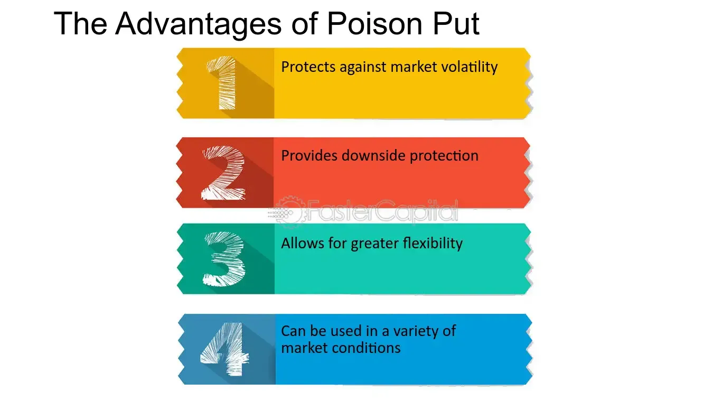

## Table of Contents

## What is a poison put?

A poison put is a type of clause in a bond contract. It lets bondholders make the issuer buy back the bonds before they are due. This happens if certain bad events happen, like if the company is taken over or if its credit rating drops a lot. The clause is called a "poison put" because it can make a takeover less appealing to the buyer. They might have to pay a lot of money to buy back the bonds if the clause is triggered.

The main reason for a poison put is to protect bondholders. If something bad happens to the company, bondholders can get their money back early. This can help them avoid losing money if the company's situation gets worse. Companies might include a poison put in their bonds to make them more attractive to investors. Investors feel safer knowing they have this option if things go wrong.

## How does a poison put work in a bond contract?

A poison put is a special rule in a bond contract. It lets people who own the bonds ask the company to buy them back before they are supposed to be paid back. This can happen if something bad happens to the company, like if it gets taken over or if its credit rating goes down a lot. The rule is called a "poison put" because it can make a takeover less appealing. The company buying the other company might have to pay a lot of money to buy back the bonds if the rule is used.

The main reason for a poison put is to keep bondholders safe. If something bad happens to the company, bondholders can get their money back early. This helps them avoid losing money if the company's situation gets worse. Companies might add a poison put to their bonds to make them more attractive to investors. Investors feel safer knowing they have this option if things go wrong.

## What are the typical triggers for a poison put?

A poison put in a bond contract can be triggered by different events that show the company might be in trouble. One common trigger is if the company gets taken over by another company. This is because a takeover can change how the company works and might make it riskier for bondholders. Another trigger is if the company's credit rating drops a lot. A lower credit rating means the company is seen as less able to pay back its debts, which worries bondholders.

Sometimes, a poison put can also be triggered if the company makes big changes to its business, like selling off important parts of the company or changing what it mainly does. These changes can make the company's future less certain, and bondholders want protection if that happens. Overall, the triggers for a poison put are events that could make the company less stable or more risky, giving bondholders the chance to get their money back early if they need to.

## What are the advantages of including a poison put in a bond?

Including a poison put in a bond can make it safer for people who buy the bond. If something bad happens to the company, like if it gets taken over or its credit rating drops a lot, bondholders can ask the company to buy back their bonds early. This helps them get their money back before the company's situation gets worse. It's like having a safety net that protects their investment.

For the company, adding a poison put can make their bonds more attractive to investors. When investors see that they have the option to get their money back early if things go wrong, they might feel more comfortable buying the bonds. This can help the company sell their bonds more easily and possibly at a better price. So, a poison put can be a good way for a company to make their bonds look safer and more appealing to people who might want to invest in them.

## How does a poison put protect bondholders?

A poison put in a bond contract helps keep bondholders safe. If something bad happens to the company, like a takeover or a big drop in its credit rating, bondholders can ask the company to buy back their bonds before they are due. This means they can get their money back early, which is important if they think the company might not be able to pay them back later.

Having this option makes bondholders feel more secure about their investment. They know they can get out of the bond if things go wrong, which can stop them from losing money if the company's situation gets worse. So, a poison put acts like a safety net, giving bondholders peace of mind and protection against big changes or problems at the company.

## What are the potential drawbacks of a poison put for issuers?

A poison put can make things harder for the company that issued the bonds. If the poison put gets triggered, the company has to buy back the bonds early. This means they need to have enough money ready to pay back the bondholders. If they don't have the money, they might have to borrow more or sell assets, which can be tough and expensive.

Also, having a poison put in the bonds can scare away some people who might want to buy the company. If a takeover happens and the poison put is triggered, the buyer has to deal with buying back the bonds. This can make the takeover more costly and less appealing. So, even though a poison put can make bonds more attractive to investors, it can also make the company less attractive to potential buyers.

## Can you provide an example of a company that used a poison put?

One example of a company that used a poison put is RJR Nabisco. Back in the 1980s, RJR Nabisco had bonds with a poison put clause. This meant that if the company got taken over, the people who owned the bonds could ask RJR Nabisco to buy back the bonds early.

In 1989, RJR Nabisco was taken over in a big buyout. Because of the poison put, the bondholders could make RJR Nabisco pay them back before the bonds were due. This made the buyout more expensive and complicated for the people who wanted to take over RJR Nabisco.

## How does a poison put affect the bond's yield and pricing?

A poison put can make a bond's yield and price different from bonds without this feature. Because the poison put gives bondholders a way to get their money back early if something bad happens, it makes the bond safer for them. Investors might be willing to accept a lower yield for this safety. So, the bond might have a lower yield compared to similar bonds without a poison put. This lower yield can also mean the bond's price might be higher because people are willing to pay more for the added security.

But, if investors think the chances of the poison put being triggered are high, it could make the bond less attractive. If there's a big risk of a takeover or a credit rating drop, investors might want a higher yield to take on that risk. So, the bond's yield might go up, and its price might go down. This shows how the poison put can change how investors see the bond, affecting both its yield and price depending on how likely it is to be used.

## What are the alternatives to a poison put in bond agreements?

One alternative to a poison put is a change of control covenant. This is a rule in the bond agreement that says if the company gets taken over, certain things have to happen to protect bondholders. For example, the new owner might have to keep the same credit rating or pay off the bond early. This helps bondholders feel safe without giving them the right to ask for their money back early like a poison put does.

Another option is a make-whole call provision. This lets the company buy back the bonds before they are due, but they have to pay bondholders more than just the bond's face value. They have to pay enough to make up for the interest the bondholders would have gotten if they held the bond until it matured. This gives bondholders a way to get their money back early but with extra payment to make up for the lost interest.

A third alternative is a rating trigger covenant. This rule says that if the company's credit rating drops below a certain level, it has to do something to fix it. For example, it might need to lower its debt or get more money. This helps keep the bond safe for investors without letting them ask for their money back early like a poison put does.

## How do poison puts influence corporate governance?

Poison puts can change how companies are run. When a company has bonds with a poison put, it makes the people in charge think carefully about big decisions like takeovers. They know that if something like a takeover happens, the bondholders might ask for their money back early. This can make the company less attractive to buyers and might stop some takeovers from happening. So, the people running the company have to think about what's best for the bondholders too, not just what's good for the company or its shareholders.

This can make the company's leaders more careful and maybe even more responsible. They might try to keep the company stable and avoid things that could trigger the poison put, like big drops in credit ratings or selling off important parts of the business. By doing this, they are looking out for the bondholders' interests as well as the company's. So, poison puts can make the people in charge think more about how their decisions affect everyone who has money in the company, not just the shareholders.

## What legal considerations should be taken into account when implementing a poison put?

When a company wants to put a poison put in its bond agreement, it needs to think about the laws and rules that apply. Different places have different laws about what can be in bond contracts. The company has to make sure that the poison put follows all these laws. They might need to talk to lawyers to make sure everything is okay. Also, the company has to be clear with bondholders about what the poison put means. They need to explain the triggers and what happens if the poison put is used, so bondholders know what they are getting into.

Another thing to think about is how the poison put might affect other parts of the company's business. For example, if the company is thinking about being bought by another company, the poison put could make things more complicated. The company needs to make sure that the poison put does not break any rules about takeovers or other business deals. They also need to think about how the poison put might change how investors see the company. If investors think the poison put is too risky, it could make the company's bonds harder to sell. So, the company needs to balance the benefits of the poison put with any possible legal problems it might cause.

## How have poison puts evolved in response to changes in the financial markets?

Over time, poison puts have changed because the financial markets have changed. In the past, poison puts were mostly about protecting bondholders from takeovers. But as the markets got more complicated, companies started using poison puts for other reasons too. For example, they started using them to protect against big drops in credit ratings or big changes in the company's business. This made poison puts more useful for bondholders and helped companies sell their bonds more easily.

Today, poison puts are still important, but they are used in different ways. Companies and investors have learned more about how to use them to manage risk. Because of this, poison puts are now part of bigger plans to keep bondholders safe. They are often used with other rules in bond contracts, like change of control covenants or make-whole call provisions. This shows how poison puts have grown to fit the needs of the modern financial world, helping both companies and investors deal with the ups and downs of the market.

## What is the role of corporate finance in structuring poison puts?

Corporate finance strategies often require the detailed and meticulous crafting of financial instruments to address unique business challenges. One such instrument is the poison put, which serves as a tactical component in bond agreements. Poison puts are embedded options allowing bondholders to demand early repayment at a specified price if certain predefined events occur, such as changes in control that suggest a hostile takeover.

The inclusion of a poison put clause in bond issuances offers a strategic advantage by acting as a deterrent against unsolicited acquisition attempts. By triggering premature redemption, these clauses not only protect the company's operational autonomy but also ensure bondholders receive their investment back, often with a premium. This mechanism introduces a level of uncertainty and potential cost that can deter hostile entities from pursuing aggressive acquisition tactics.

However, incorporating poison puts involves a delicate balancing act. Financial executives must assess the potential implications on the company's debt structure and overall financial health. The immediate impact of a triggered poison put clause could be an increased debt load, as the company may need to pay off bondholders unexpectedly or issue new debt under potentially unfavorable terms. Additionally, the mere presence of such clauses might affect the company's credit rating, as rating agencies often scrutinize the conditions and likelihood of early redemptions.

The strategic deployment of poison puts must align with the company’s broader financial strategies and risk management policies. Decision-makers need to evaluate the potential costs against the protective benefit of maintaining control over the company's strategic direction. Notably, this involves analyzing various financial scenarios and outcomes with regards to takeover probabilities, [interest rate](/wiki/interest-rate-trading-strategies) environments, and the company’s [liquidity](/wiki/liquidity-risk-premium) position.

For instance, the financial formula capturing the present value (PV) of expected future cash flows from such bond agreements must incorporate the probability of the early redemption event. The expected value (EV) of a bond with a poison put can be calculated as follows:

$$
\text{EV} = (1 - p) \cdot \text{PV}_{\text{normal}} + p \cdot \text{PV}_{\text{put}}
$$

Where:
- $\text{PV}_{\text{normal}}$ is the present value of cash flows under normal circumstances.
- $\text{PV}_{\text{put}}$ is the present value of cash flows if the poison put is triggered.
- $p$ is the probability of the trigger event occurring.

This mathematical consideration helps financial strategists decide whether the immediate defensive advantages outweigh the longer-term financial commitments and possible costs associated with early bond redemption.

In summary, the structuring of poison puts within corporate finance requires a nuanced approach, focusing on safeguarding the company's interests while managing potential financial risks. By incorporating these clauses strategically, companies can reinforce their defenses against hostile takeovers and ensure alignment with overarching financial objectives.

## References & Further Reading

[1]: Bratton, W. W. (2002). ["Bond and Loan Covenants."](https://scholarship.law.georgetown.edu/facpub/581/) Indiana Law Journal, 77(4), 869-930.

[2]: Kahan, M., & Klausner, M. (1993). ["Antitakeover Provisions in Bonds: Bridge or Bridgeport?"](https://www.semanticscholar.org/paper/ANTITAKEOVER-PROVISIONS-IN-BONDS-%3A-BONDHOLDER-OR-Kahan-Klausner/4a64154c20a8b939f1cbc19d794729dbee9c1932) Business Lawyer, 48(2), 707-747.

[3]: Mann, R. J., & Powers, S. K. (2003). ["Poison Puts: Corporate Governance Structure or Management Entrenchment?"](https://www.cambridge.org/core/journals/european-journal-of-sociology-archives-europeennes-de-sociologie/article/abs/autonomous-power-of-the-state-its-origins-mechanisms-and-results/338F971178F06BCD3ABC9C573E67B2D8) Journal of Corporation Law, 28(3), 739.

[4]: Hu, X., & Blackwell, C. (2003). ["Algorithmic Trading: Impacts on the Market."](https://www.sciencedirect.com/science/article/pii/S0378426621000480) Journal of Portfolio Management, 31(4), 16-26.

[5]: Bajari, P., & Yeo, J. (2009). ["Algorithmic trading systems and market volatility."](https://scholar.google.com/citations?user=N26qXNIAAAAJ&hl=en) Technical Report, Universities of Chicago and Minnesota. 

[6]: ["Fixed Income Securities: Tools for Today's Markets"](https://www.amazon.com/Fixed-Income-Securities-Markets-Finance/dp/1119835550) by Bruce Tuckman and Angel Serrat

[7]: ["Corporate Finance"](https://www.investopedia.com/terms/c/corporatefinance.asp) by David Hillier, Stephen A. Ross, Randolph W. Westerfield, Jeffrey F. Jaffe, and Bradford D. Jordan