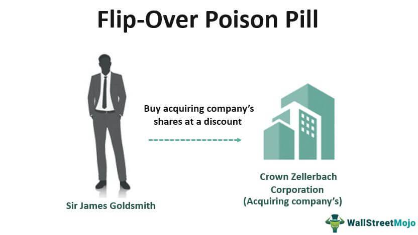

Corporate finance operates as a network of strategies and instruments crafted to enhance value, mitigate risk, and ensure organizational stability in an ever-evolving financial environment. Within this spectrum, the 'poison put' mechanism used in debt securities has emerged as a significant tool. This provision, often embedded in bond covenants, plays a crucial role in financial planning and acquisition defenses, offering tactical advantages in volatile markets.

The relevance of poison puts has amplified with the growing interplay between corporate finance strategies and advanced trading technologies, such as algorithmic trading. This article aims to examine how these components interact within today's sophisticated financial ecosystems. By understanding how poison puts function within debt instruments, one can appreciate their protective capacity for companies against hostile takeovers while also offering bondholders favorable exit strategies during adverse corporate events.

The intersection of these elements is critical in making informed investment decisions and in strategic corporate governance. For investors and companies aiming for long-term success and stability, comprehending the influence of poison puts can provide a competitive edge in financial markets characterized by rapid technological advancements and complex economic interactions.

## Table of Contents

## Understanding Debt Securities and Poison Puts

Debt securities are financial instruments integral to the corporate finance landscape, representing a loan made by an investor to a borrower. These instruments, typically in the form of bonds, enable companies to raise capital by borrowing funds from investors, who, in turn, receive interest payments over a specified period. At maturity, the borrower repays the face value of the bond to the investor. This predictable stream of income makes debt securities a popular choice among investors seeking stability and regular returns.

Within this context, poison puts serve as a strategic mechanism incorporated into some bond agreements. A poison put is a clause that grants bondholders the right to sell their bonds back to the issuer at a predetermined price if specific triggering events occur. One common trigger is a hostile takeover, where an aggressor attempts to gain control of a company against the wishes of its management. The presence of a poison put can act as a deterrent to such hostile attempts by increasing the financial burden on the potential acquirer.

For companies, poison puts function as a defensive strategy against unwanted acquisition attempts, aligning with broader corporate governance objectives to maintain control and autonomy. By embedding these clauses, a company can create an environment that discourages aggressive takeover strategies that might not align with its long-term vision and operational goals.

From the perspective of bondholders, poison puts provide a layer of financial security. When a trigger event occurs, bondholders have the option to [exit](/wiki/exit-strategy) their investment at favorable terms, often at or near the bond's face value, thereby minimizing potential losses associated with unfavorable market conditions. This ability to 'put' the bond back to the issuer mitigates risks for investors, offering a safeguard against the [volatility](/wiki/volatility-trading-strategies) that can accompany unexpected corporate events.

In summary, poison puts enhance the appeal of debt securities by offering protective features that benefit both issuers and investors. They ensure issuers can defend against intrusive acquisitions, while investors retain the ability to capitalize on their investments under clearly defined conditions, thus stabilizing their portfolios in unpredictable market scenarios.

## The Role of Corporate Finance in Structuring Poison Puts

Corporate finance strategies often require the detailed and meticulous crafting of financial instruments to address unique business challenges. One such instrument is the poison put, which serves as a tactical component in bond agreements. Poison puts are embedded options allowing bondholders to demand early repayment at a specified price if certain predefined events occur, such as changes in control that suggest a hostile takeover.

The inclusion of a poison put clause in bond issuances offers a strategic advantage by acting as a deterrent against unsolicited acquisition attempts. By triggering premature redemption, these clauses not only protect the company's operational autonomy but also ensure bondholders receive their investment back, often with a premium. This mechanism introduces a level of uncertainty and potential cost that can deter hostile entities from pursuing aggressive acquisition tactics.

However, incorporating poison puts involves a delicate balancing act. Financial executives must assess the potential implications on the company's debt structure and overall financial health. The immediate impact of a triggered poison put clause could be an increased debt load, as the company may need to pay off bondholders unexpectedly or issue new debt under potentially unfavorable terms. Additionally, the mere presence of such clauses might affect the company's credit rating, as rating agencies often scrutinize the conditions and likelihood of early redemptions.

The strategic deployment of poison puts must align with the company’s broader financial strategies and risk management policies. Decision-makers need to evaluate the potential costs against the protective benefit of maintaining control over the company's strategic direction. Notably, this involves analyzing various financial scenarios and outcomes with regards to takeover probabilities, [interest rate](/wiki/interest-rate-trading-strategies) environments, and the company’s [liquidity](/wiki/liquidity-risk-premium) position.

For instance, the financial formula capturing the present value (PV) of expected future cash flows from such bond agreements must incorporate the probability of the early redemption event. The expected value (EV) of a bond with a poison put can be calculated as follows:

$$
\text{EV} = (1 - p) \cdot \text{PV}_{\text{normal}} + p \cdot \text{PV}_{\text{put}}
$$

Where:
- $\text{PV}_{\text{normal}}$ is the present value of cash flows under normal circumstances.
- $\text{PV}_{\text{put}}$ is the present value of cash flows if the poison put is triggered.
- $p$ is the probability of the trigger event occurring.

This mathematical consideration helps financial strategists decide whether the immediate defensive advantages outweigh the longer-term financial commitments and possible costs associated with early bond redemption.

In summary, the structuring of poison puts within corporate finance requires a nuanced approach, focusing on safeguarding the company's interests while managing potential financial risks. By incorporating these clauses strategically, companies can reinforce their defenses against hostile takeovers and ensure alignment with overarching financial objectives.

## Algorithmic Trading and Debt Securities: A Synergistic Approach

Algorithmic trading, commonly referred to as algo trading, employs sophisticated computer algorithms to execute trades by reacting instantaneously to market conditions. This technology-driven approach allows traders to capitalize on real-time information and market fluctuations with precision and speed, significantly enriching the trading landscape.

Within the scope of debt securities, [algorithmic trading](/wiki/algorithmic-trading) presents unique opportunities to uncover and exploit various market nuances, particularly those associated with bond covenants such as poison puts. Poison puts are embedded options that allow bondholders to sell the bond back to the issuer upon the occurrence of specific triggering events, like a hostile takeover. Algo trading systems can efficiently monitor bond markets for such contingencies and, once detected, execute strategies that leverage these occurrences to generate profits.

The primary advantage of algo trading lies in its ability to process vast amounts of data across countless variables swiftly. This capability enables the identification of [arbitrage](/wiki/arbitrage) opportunities or discrepancies in pricing that arise due to potential takeover scenarios. For instance, an algorithm can be programmed to continuously analyze and compare bond yields and prices across different issuers or market segments. When the algorithm identifies a deviation caused by a hostile bid for a company with poison put clauses in its debt securities, it can execute trades to profit from anticipated price changes in the bond market.

Moreover, the integration of algorithmic strategies in trading debt securities not only introduces efficiency but also brings a strategic edge to investors. By using automated processes to monitor bond market activities, traders can make informed decisions almost immediately, outpacing manual trading efforts which are inherently slower and prone to human error. The automation of trading processes minimizes transaction costs and improves the likelihood of executing trades at optimal prices.

While these technological advancements significantly enhance trading performance, they also contribute to broader market efficiency. The swift execution of trades and reallocation of resources ensures that securities are priced more accurately according to available information and market conditions. This continuous realignment helps maintain liquidity in markets, thus aiding in the smooth functioning and stability of the financial ecosystem.

In conclusion, the synergy between algorithmic trading and debt securities is fostering transformative shifts in market dynamics. By capitalizing on automation and superior data processing capabilities, market participants can not only achieve superior trading outcomes but also contribute to the efficiency and stability of financial markets. As investors and companies alike adapt to these advancements, the strategic advantages offered by algorithmic trading in debt securities are poised to grow increasingly prominent.

## The Strategic Importance of Poison Puts in the Financial Market

Poison puts serve a fundamental role in the financial markets by offering both a defensive mechanism and a strategic advantage for issuing companies and their investors. For companies, poison puts act as a safeguard against aggressive acquisition tactics, allowing them to maintain control and uphold strategies aligned with their long-term objectives. When a company faces the threat of a hostile takeover, a poison put enables it to potentially deter the takeover attempt by making it financially unattractive. This is because the triggering of a poison put often obligates the company to repurchase its debt at a premium, imposing a significant financial burden on the acquiring entity.

For investors, and specifically bondholders, poison puts offer a layer of security in uncertain times. These provisions ensure that bondholders have the right to demand early repayment if specific events, such as changes in corporate control, occur. This mechanism mitigates the risk that a change in the company’s control could adversely affect the credit quality of the bonds or lead to an environment that is less favorable to the company's existing debt structure.

The effective utilization of poison puts is crucial for enhancing market participation while reducing potential risks. By incorporating poison put clauses, companies can protect themselves from hostile acquisition attempts without negatively affecting their existing credit terms or investor relationships. Simultaneously, investors benefit from a degree of certainty and protection against credit risk deterioration due to adverse corporate actions. This strategic positioning contributes to a more stable financial market environment, where companies maintain autonomy and bondholders enjoy reduced risk exposure.

In sum, poison puts are strategically significant because they foster a balance of power and protection, enabling both companies and investors to navigate financial markets with enhanced resilience and confidence.

## Conclusion: Navigating the Future of Corporate Finance and Trading

The evolution of financial strategies, such as poison puts, highlights the necessity for adaptable approaches within corporate finance. As the complexity of financial markets intensifies, driven by advancements like algorithmic trading, the capacity for rapid and informed decision-making becomes invaluable. Algorithmic trading employs sophisticated computer algorithms to analyze market patterns and execute trades with precision, thereby refining efficiencies and enhancing market responsiveness. This technological sophistication necessitates a continuous effort from market participants, both corporate entities and investors, to remain vigilant and adaptive.

The interplay between debt securities, corporate finance, and algorithmic strategies presents significant potential for unlocking new pathways to growth and stability. The integration of poison puts within debt securities adds a protective and strategic dimension to financial planning, fortifying against adverse events such as hostile takeovers. This defense mechanism, coupled with the analytical power of algorithmic trading, equips companies with the tools to maintain control and strategic autonomy. 

For investors, particularly bondholders, the profound understanding and application of poison puts and algorithmic trading afford a safeguard to their investments. As these instruments and tactics coalesce, they present a spectrum of opportunities and risk mitigation strategies that enhance market participation. 

Ultimately, corporate finance and trading are poised to evolve alongside the advancement of these financial strategies and technologies. Companies and investors equipped with a robust comprehension of poison puts, along with the dexterity offered by algorithmic trading, will likely experience improved stability and potential yield. This calls for a persistent educational pursuit and strategic alignment to embrace the dynamic financial landscape, ensuring both resilience and opportunistic growth.

## References & Further Reading

[1]: Bratton, W. W. (2002). ["Bond and Loan Covenants."](https://scholarship.law.georgetown.edu/facpub/581/) Indiana Law Journal, 77(4), 869-930.

[2]: Kahan, M., & Klausner, M. (1993). ["Antitakeover Provisions in Bonds: Bridge or Bridgeport?"](https://www.semanticscholar.org/paper/ANTITAKEOVER-PROVISIONS-IN-BONDS-%3A-BONDHOLDER-OR-Kahan-Klausner/4a64154c20a8b939f1cbc19d794729dbee9c1932) Business Lawyer, 48(2), 707-747.

[3]: Mann, R. J., & Powers, S. K. (2003). ["Poison Puts: Corporate Governance Structure or Management Entrenchment?"](https://www.cambridge.org/core/journals/european-journal-of-sociology-archives-europeennes-de-sociologie/article/abs/autonomous-power-of-the-state-its-origins-mechanisms-and-results/338F971178F06BCD3ABC9C573E67B2D8) Journal of Corporation Law, 28(3), 739.

[4]: Hu, X., & Blackwell, C. (2003). ["Algorithmic Trading: Impacts on the Market."](https://www.sciencedirect.com/science/article/pii/S0378426621000480) Journal of Portfolio Management, 31(4), 16-26.

[5]: Bajari, P., & Yeo, J. (2009). ["Algorithmic trading systems and market volatility."](https://scholar.google.com/citations?user=N26qXNIAAAAJ&hl=en) Technical Report, Universities of Chicago and Minnesota. 

[6]: ["Fixed Income Securities: Tools for Today's Markets"](https://www.amazon.com/Fixed-Income-Securities-Markets-Finance/dp/1119835550) by Bruce Tuckman and Angel Serrat

[7]: ["Corporate Finance"](https://www.investopedia.com/terms/c/corporatefinance.asp) by David Hillier, Stephen A. Ross, Randolph W. Westerfield, Jeffrey F. Jaffe, and Bradford D. Jordan