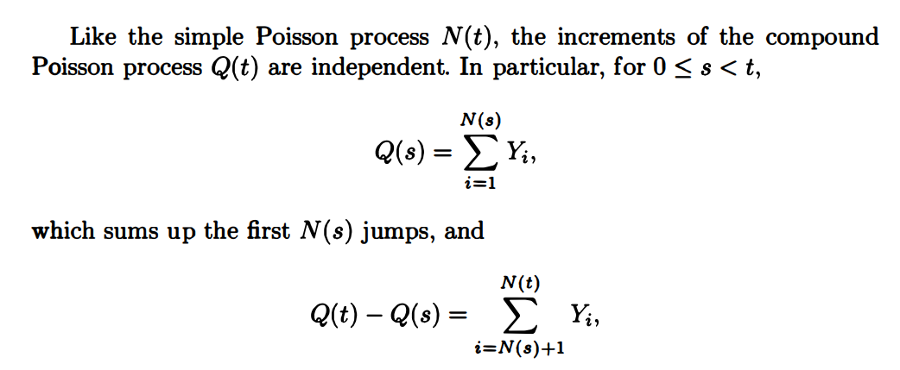

## Table of Contents

## What is a Poisson jump?

A Poisson jump is a concept used in probability and statistics to describe sudden changes or "jumps" in a process. Imagine you're counting the number of times something happens, like the number of phone calls you get in an hour. These events don't happen smoothly but in sudden jumps. The Poisson jump helps model these sudden changes by using the Poisson distribution, which predicts how many times an event might happen in a fixed period.

In simpler terms, if you're watching a process and it suddenly changes by a certain amount, that's a jump. The Poisson jump uses the Poisson distribution to figure out how likely these jumps are and how big they might be. This is useful in many fields, like finance for modeling stock prices, or in physics for understanding particle movements. By understanding these jumps, we can better predict and manage the randomness in different systems.

## How does the Poisson process relate to Poisson jumps?

The Poisson process and Poisson jumps are closely related because they both deal with random events happening over time. A Poisson process is a model that counts how many times something happens in a given time period. For example, it could be used to count the number of emails you receive in an hour. The key thing about a Poisson process is that these events happen independently and at a steady average rate. 

Poisson jumps come into play when you look at how these events cause sudden changes in the process. Imagine you're tracking the number of emails, and every time you get an email, the count jumps up by one. These jumps are what we call Poisson jumps. The size of the jump is usually fixed, like one email, but the timing of these jumps follows the Poisson process. So, the Poisson process tells us when the jumps happen, and the Poisson jumps show us the effect of these events on the process.

## What is the mathematical definition of a Poisson jump?

A Poisson jump is a sudden change in a mathematical process that follows a Poisson distribution. Imagine you are tracking something over time, like the number of cars passing by. Every time a car passes, the count jumps up by one. These jumps are called Poisson jumps because they happen randomly, following the rules of the Poisson process.

The Poisson process says that these jumps happen at a steady average rate, but the exact timing is random. For example, if cars pass by on average every 5 minutes, the Poisson process predicts how many cars might pass in an hour, but it doesn't say exactly when each car will come. The Poisson jump focuses on the effect of each event, like the count going up by one when a car passes. Together, the Poisson process and Poisson jumps help us understand and predict these random events in a simple way.

## Can you explain the concept of jump intensity in the context of Poisson jumps?

Jump intensity in the context of Poisson jumps is like how often you expect these jumps to happen. Imagine you're counting the number of times something happens, like the number of buses passing a bus stop. The jump intensity is the average rate at which these buses pass by. If buses come by on average every 10 minutes, then the jump intensity is one bus every 10 minutes. This rate helps you predict how many jumps, or buses, you might see in a certain amount of time.

The jump intensity is important because it tells you how busy or quiet the process is. If the jump intensity is high, it means jumps happen a lot, like if buses come every minute. If it's low, jumps are rare, like if buses only come every hour. By knowing the jump intensity, you can better understand and plan for how often these sudden changes, or jumps, will happen in your process.

## How are Poisson jumps used in financial modeling?

In financial modeling, Poisson jumps are used to understand and predict sudden changes in things like stock prices or interest rates. Imagine you're watching a stock's price, and suddenly it jumps up or down. These jumps can happen because of unexpected news or events. By using Poisson jumps, financial experts can model these sudden changes and better predict how likely they are to happen and how big they might be. This helps them make smarter investment decisions and manage risk better.

For example, if a company announces better-than-expected earnings, the stock price might jump up suddenly. Financial models that include Poisson jumps can account for these surprises. By understanding the average rate at which these jumps happen, called the jump intensity, experts can estimate how often these big changes might occur. This information is crucial for creating strategies that can handle the ups and downs of the financial markets.

## What is the difference between a Poisson jump and other types of stochastic jumps?

A Poisson jump is a specific type of stochastic jump that follows the rules of the Poisson process. This means the jumps happen randomly but at a steady average rate. Imagine you're counting the number of times something happens, like the number of phone calls you get in an hour. With a Poisson jump, the calls come in suddenly, and you can predict how many calls you might get based on the average rate, but you can't know exactly when each call will come. This makes Poisson jumps useful for modeling events that are independent and happen at a constant average rate.

Other types of stochastic jumps can have different rules. For example, a jump-diffusion model might include both continuous changes and sudden jumps, where the size and frequency of the jumps can vary based on other factors in the system. Another type, like a compound Poisson process, allows the size of each jump to be random, not just the timing. These different types of jumps are used to model more complex systems where the rate or size of jumps might change over time or depend on other variables. Understanding these differences helps in choosing the right model for different situations, like financial markets or natural phenomena.

## How can Poisson jumps be simulated in a computational model?

To simulate Poisson jumps in a computational model, you need to understand the average rate at which these jumps happen, called the jump intensity. Imagine you're counting the number of times something happens, like the number of cars passing a street. If cars come by on average every 5 minutes, you can use this rate in your computer program. The program will use a random number generator to decide when these jumps happen, making sure they follow the rules of the Poisson process. This means the jumps are random but happen at that average rate of one car every 5 minutes.

Once you have the timing figured out, you need to decide how big each jump is. In many cases, the size of the jump is fixed, like adding one car to your count each time. But sometimes, the size can also be random, like if the number of passengers in each car varies. Your program will then update the count or value whenever a jump happens. By running the simulation many times, you can see how these jumps affect the overall process and get a good idea of what might happen in real life.

## What are the applications of Poisson jumps in fields other than finance?

Poisson jumps are used in many fields outside of finance, like in physics and biology. In physics, they help model how particles move randomly. Imagine tiny particles bouncing around in a gas. They don't move smoothly but jump around suddenly. Poisson jumps help scientists predict how often these jumps happen and how they affect the overall movement of the gas. This is useful for understanding things like how heat spreads or how particles in a cloud behave.

In biology, Poisson jumps are used to study how often certain events happen, like the number of times a cell divides. If cells divide randomly but at a steady average rate, Poisson jumps can model this process. This helps scientists understand and predict how populations of cells grow or how diseases spread. By knowing the average rate of these jumps, researchers can make better guesses about what will happen next in a biological system.

## How do Poisson jumps affect the statistical properties of a stochastic process?

Poisson jumps change the way a stochastic process behaves by adding sudden changes. Imagine you're watching the number of cars passing by. Without jumps, the count might go up smoothly. But with Poisson jumps, the count jumps up suddenly every time a car passes. This makes the process more unpredictable because you never know exactly when the next jump will happen. The jumps follow a Poisson distribution, which means they happen at a steady average rate but randomly. This randomness makes the process more variable, and it can lead to bigger changes in the count over time.

These jumps also affect how we measure and predict the process. Because the jumps happen randomly, they add a lot of variability to the data. This means that the average value of the process might stay the same, but the spread or range of possible values becomes wider. When we try to predict what will happen next, we have to take into account both the smooth parts of the process and the sudden jumps. By understanding the rate at which these jumps happen, called the jump intensity, we can better model and predict the overall behavior of the process. This is important in many fields, like physics and biology, where sudden changes can have big effects.

## What advanced techniques are used to estimate the parameters of a Poisson jump process?

To estimate the parameters of a Poisson jump process, like the jump intensity, people often use a method called maximum likelihood estimation. Imagine you're trying to guess how often cars pass by a street. You watch the cars for a while and count how many pass by. Then, you use a special math formula to figure out the best guess for how often cars come by on average. This method looks at all the data you collected and finds the jump intensity that makes your observations most likely. It's like solving a puzzle to find the number that fits best with what you saw.

Another technique is called the method of moments. This one is simpler but still effective. You start by calculating some basic numbers from your data, like the average number of jumps and how spread out they are. Then, you use these numbers to find the jump intensity that matches your data the best. It's like comparing the average and spread of your data to what you would expect from a Poisson jump process. By matching these numbers, you can estimate the parameters without needing complex math. Both methods help you understand and predict how often these sudden changes, or jumps, happen in your process.

## Can you discuss the limitations and assumptions of using Poisson jumps in modeling?

Using Poisson jumps in modeling has some limitations. One big assumption is that the jumps happen at a steady average rate, but in real life, this rate might change over time. For example, if you're counting the number of phone calls, the rate might be different during the day compared to the night. Another assumption is that the jumps are independent, meaning one jump doesn't affect when the next one happens. But in many situations, like stock prices, one big jump might make the next one more likely. These assumptions can make the model less accurate if the real world doesn't follow these rules.

Another limitation is that Poisson jumps usually assume the size of each jump is fixed or follows a simple pattern. In reality, the size of jumps can be very random and hard to predict. For example, if you're modeling the number of people entering a store, the number of people in each group can vary a lot. This can make the model less useful for understanding complex systems where the size of jumps matters a lot. By understanding these limitations, you can decide if a Poisson jump model is good enough for your needs or if you need a more complicated model to capture the real-world behavior more accurately.

## How do Poisson jumps integrate with other stochastic processes in more complex models?

Poisson jumps often work together with other types of random processes to make more complex models. Imagine you're watching the price of a stock. The price might go up and down smoothly most of the time, but sometimes it jumps suddenly because of big news. To model this, you can use a jump-diffusion model. This model combines a smooth, continuous process, like a random walk, with sudden Poisson jumps. The smooth part shows the normal ups and downs, while the jumps show the big, unexpected changes. By putting these two together, you get a better picture of how the stock price might behave in real life.

In some cases, you might use a compound Poisson process. This is like the basic Poisson jump model, but the size of each jump can be random too. For example, if you're counting the number of cars passing by, a simple Poisson jump model would say each car adds one to the count. But in a compound Poisson process, each car might add a different number of passengers to the total. This makes the model more realistic because it can handle both the timing and the size of the jumps being random. By combining Poisson jumps with other stochastic processes, you can create models that capture more of the complexity and randomness found in the real world.

## What is the Mathematical Foundation of Poisson Jumps?

Poisson processes serve as a fundamental mathematical model for describing events that occur independently and at a constant average rate, making them suitable for capturing erratic market phenomena. A key characteristic of Poisson processes is their 'memoryless' property, suggesting that the timing of any forthcoming event is uninfluenced by prior occurrences. This attribute is especially advantageous in trading, where anticipating future market moves is paramount.

The mathematical representation of a Poisson process involves modeling the number of events occurring within a fixed time interval. If $N(t)$ denotes the number of events by time $t$, then for a Poisson process with rate $\lambda$, the probability of observing $k$ events in a time interval $t$ is expressed by the formula:

$$

P(N(t) = k) = \frac{(\lambda t)^k e^{-\lambda t}}{k!} 
$$

where $\lambda$ is the average rate of event occurrence per unit time, $e$ is the base of the natural logarithm, and $k!$ denotes the factorial of $k$.

In trading, Poisson jumps are integral in modeling and quantifying rare, yet impactful events, such as market crashes or sudden price surges. The occurrence of such jumps can significantly influence market dynamics and affect trading strategies. Additionally, Poisson processes are adept at modeling large order arrivals, which can cause abrupt shifts in market prices.

The utility of the Poisson process in trading lies in its ability to quantify these rare events, enabling traders to incorporate the potential for such events into their risk assessments and trading models. By doing so, traders can better manage their portfolios and adjust their strategies to account for possible volatility.

Moreover, financial markets often experience periods of calm interspersed with sudden, significant price changes. Poisson processes help in capturing these abrupt shifts, thereby providing a more nuanced understanding of market behavior. This understanding allows traders to develop strategies that are robust to the inherent uncertainties and volatilities in financial markets. Traditionally, these insights are incorporated into trading algorithms to optimize execution timing and improve trading performance.

## What is the relationship between Risk Management and Poisson Jumps?

Risk management strategies significantly benefit from incorporating Poisson jumps, as they enable traders to anticipate and mitigate the adverse effects of sudden and unexpected market events. The ability to identify and analyze the frequencies of these jumps provides a foundation for the development of refined hedging techniques. These techniques are crucial in enhancing Value at Risk (VaR) models and conducting robust stress testing.

Poisson jump processes allow traders to quantify the likelihood and impact of infrequent, yet substantial market events. By analyzing historical jump data, traders can estimate the jump intensity, $\lambda$, which represents the average rate of jump occurrences. The integration of jump dynamics into risk management frameworks allows for a more nuanced understanding of market volatility, directly impacting the development of VaR models. A typical VaR calculation involving Poisson jumps might adjust the probability of extreme losses using:

$$
\text{VaR} = \mu \cdot \Delta t + \sigma \cdot \sqrt{\Delta t} \cdot Z + J \cdot \text{Poisson}(\lambda \cdot \Delta t)
$$

Where:
- $\mu$ is the expected return
- $\sigma$ is the standard deviation of returns
- $Z$ is a standard normal random variable
- $J$ captures the jump size distribution
- $\lambda$ is the jump intensity
- $\Delta t$ is the time horizon

Understanding the dynamics of Poisson jumps also facilitates prompt adjustments to trading portfolios. By monitoring indicators of jump risk, traders can swiftly recalibrate their exposure, thereby safeguarding against potential losses caused by abrupt price swings. This proactive risk management approach reduces the likelihood of sustaining severe financial losses during market turbulence.

Incorporating jump analysis into risk management strategies enhances stress testing procedures, ensuring comprehensive evaluation of potential market scenarios, including those characterized by rare, extreme events. This consideration of Poisson jump models contributes to a robust trading strategy, capable of handling the complexities and uncertainties inherent in financial markets.

## References & Further Reading

[1]: Cont, R., & Tankov, P. (2004). ["Financial Modelling with Jump Processes."](https://academic.oup.com/jrsssa/article/168/1/250/7084125) Chapman and Hall/CRC.

[2]: Merton, R. C. (1976). ["Option Pricing when Underlying Stock Returns are Discontinuous."](https://www.sciencedirect.com/science/article/pii/0304405X76900222) Journal of Financial Economics, 3(1-2), 125-144.

[3]: Glasserman, P. (2004). ["Monte Carlo Methods in Financial Engineering."](https://link.springer.com/book/10.1007/978-0-387-21617-1) Springer.

[4]: Gatheral, J. (2006). ["The Volatility Surface: A Practitioner's Guide."](https://github.com/PlamenStilyianov/Quant/blob/master/Gatheral%20J.%20The%20volatility%20surface..%20A%20practitioner%27s%20guide%20(Wiley%2C%202006)(ISBN%200471792519)(210s)_FD_.pdf) Wiley Finance.

[5]: Avellaneda, M., & Stoikov, S. (2008). ["High-frequency Trading in a Limit Order Book."](https://people.orie.cornell.edu/sfs33/LimitOrderBook.pdf) Quantitative Finance, 8(3), 217-224.

[6]: Rachev, S. T., Mittnik, S., Fabozzi, F. J., Focardi, S. M., & Jasic, T. (2007). ["Financial Econometrics: From Basics to Advanced Modeling Techniques."](https://www.scirp.org/reference/referencespapers?referenceid=2289638) Wiley.

[7]: Jorion, P. (2006). ["Value at Risk: The New Benchmark for Managing Financial Risk."](https://link.springer.com/article/10.1007/s11408-007-0057-3) McGraw-Hill.

[8]: Karatzas, I., & Shreve, S. E. (1991). ["Brownian Motion and Stochastic Calculus."](https://link.springer.com/book/10.1007/978-1-4612-0949-2) Springer.

[9]: Robert, C. P., & Casella, G. (2004). ["Monte Carlo Statistical Methods."](https://link.springer.com/book/10.1007/978-1-4757-4145-2) Springer.

[10]: Taylor, S. J. (2007). ["Modelling Financial Time Series."](https://worldscientific.com/worldscibooks/10.1142/6578) World Scientific.