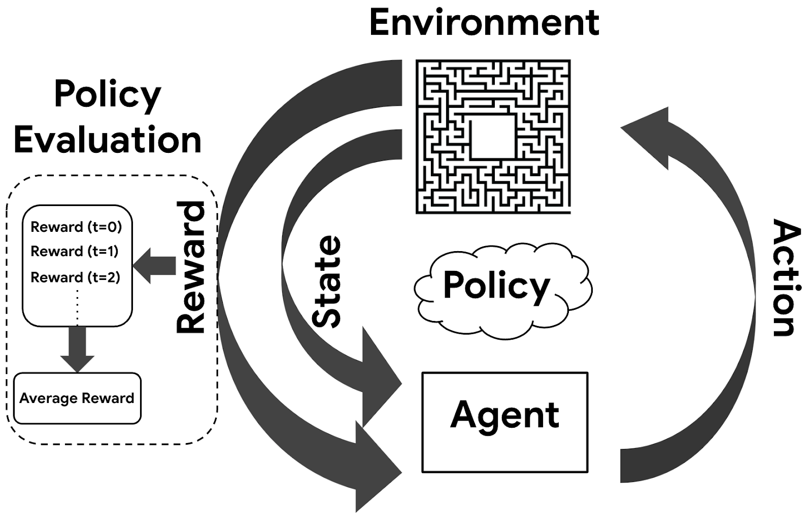

## Table of Contents

## What is policy evaluation in the context of machine learning?

Policy evaluation in machine learning is a process used in reinforcement learning where we try to figure out how good a certain policy is. A policy is like a set of rules that an agent, like a computer program, follows to decide what to do in different situations. When we evaluate a policy, we want to know how well these rules help the agent achieve its goals, usually by calculating the expected return or reward the agent will get by following the policy over time.

To do policy evaluation, we often use a method called Monte Carlo simulation. This means we let the agent follow the policy many times in different scenarios and then average the results to see how well it does overall. Another common method is using dynamic programming, where we use a mathematical formula, like the Bellman equation, to calculate the value of the policy step-by-step. Both methods help us understand if the policy is good or if we need to make changes to improve the agent's performance.

## Why is policy evaluation important in reinforcement learning?

Policy evaluation is important in reinforcement learning because it helps us understand how well our agent is doing. By evaluating the policy, we can see if the rules the agent follows are leading to good outcomes or if they need to be changed. This is crucial because the whole goal of reinforcement learning is to make the agent better at achieving its goals over time. If we don't know how well the current policy is working, we can't make smart decisions about how to improve it.

Without policy evaluation, we would be guessing whether our changes to the policy are actually making things better. By using methods like Monte Carlo simulations or dynamic programming, we can get a clear picture of the expected rewards the agent will get. This information guides us in tweaking the policy to maximize the agent's performance. In essence, policy evaluation acts like a report card for the agent, showing us where it's doing well and where it needs to improve.

## What are the basic methods used for policy evaluation?

One basic method for policy evaluation is the Monte Carlo method. This method involves running many episodes where the agent follows the policy from start to finish. Each time, we keep track of the rewards the agent gets. After many episodes, we average these rewards to estimate how good the policy is. This method is simple to understand and works well when we can run lots of episodes. The more episodes we run, the more accurate our estimate of the policy's performance becomes.

Another method is dynamic programming, which uses math to evaluate the policy. A common approach in dynamic programming is to use the Bellman equation. This equation helps us calculate the value of each state by considering the immediate reward and the future rewards the agent expects to get. We update these values step-by-step until they stop changing much. This method can be very accurate, but it works best when we know everything about the environment, which isn't always the case in real-world situations.

Both Monte Carlo and dynamic programming are useful for policy evaluation. Monte Carlo is great when we can run lots of trials and don't need to know everything about the environment. Dynamic programming is good when we have a full understanding of the environment and want to use math to find the exact values. Choosing the right method depends on what we know about the situation and what resources we have available.

## How does Monte Carlo method work for policy evaluation?

The Monte Carlo method for policy evaluation works by running many episodes where the agent follows the policy from start to finish. Each time an episode is run, we keep track of the total rewards the agent gets. After running many episodes, we take the average of these total rewards to get an estimate of how good the policy is. The more episodes we run, the more accurate our estimate becomes. This method is useful because it doesn't need to know everything about the environment; it just needs to be able to run lots of trials.

For example, if we want to evaluate a policy for playing a game, we would play the game many times, following the policy each time. If the game gives a score at the end, we would record the score for each game and then average all the scores. This average score tells us how well the policy is doing. The Monte Carlo method is simple to understand and apply, making it a popular choice for policy evaluation in reinforcement learning.

## What is the difference between on-policy and off-policy evaluation?

On-policy evaluation means we only look at how well the agent does when it follows the current policy all the time. We use the experiences the agent gets while following this policy to figure out how good it is. For example, if we're using the Monte Carlo method for on-policy evaluation, we run many episodes where the agent sticks to the current policy and then average the rewards to see how well it's doing. On-policy methods like Monte Carlo or Temporal-Difference learning with SARSA help us understand the current policy's performance directly.

Off-policy evaluation, on the other hand, lets us use data from different policies to evaluate the one we're interested in. This means we can learn about a new policy without having to follow it all the time. For instance, with the off-policy method called Q-learning, we can use experiences from an old policy to estimate how well a new policy might do. This is useful because it allows us to evaluate and improve policies without needing to run lots of new episodes just for the new policy, making it more efficient.

Both on-policy and off-policy evaluation have their own strengths. On-policy methods give us a clear picture of the current policy's performance, while off-policy methods help us explore new policies more efficiently. Choosing between them depends on what we need to know and what resources we have available.

## Can you explain Temporal Difference (TD) learning in policy evaluation?

Temporal Difference (TD) learning is a way to evaluate a policy in reinforcement learning. It's like a mix between Monte Carlo and dynamic programming methods. In TD learning, we don't wait until the end of an episode to see how well the policy did. Instead, we update our guesses about how good each state is as we go along. This is done by comparing what we thought would happen next with what actually happened. If our guess was close, we don't change it much. If it was off, we adjust it more. This way, we can learn from each step of the journey, not just the end result.

In TD learning, we use something called the TD error to update our estimates. The TD error is the difference between the reward we just got plus what we think we'll get in the future, and what we thought the current state was worth before. The formula for updating the value of a state $$V(s)$$ in TD learning is $$V(s) \leftarrow V(s) + \alpha \left[ R + \gamma V(s') - V(s) \right]$$, where $$R$$ is the immediate reward, $$\gamma$$ is a discount factor for future rewards, $$V(s')$$ is the value of the next state, and $$\alpha$$ is the learning rate. This method helps us improve our policy estimates even when we don't have full episodes to work with, making it very useful in real-world situations where we might not always see the end of an episode.

## How does the choice of discount factor affect policy evaluation?

The discount factor, often written as $$\gamma$$, is a number between 0 and 1 that tells us how much we care about future rewards compared to immediate rewards. When we evaluate a policy, the discount factor affects how we calculate the total value of following that policy. If $$\gamma$$ is close to 0, we care more about the rewards we get right now and less about what might happen later. This means the policy's value will be based more on short-term gains. On the other hand, if $$\gamma$$ is close to 1, we value future rewards almost as much as immediate ones, so the policy's value will depend more on long-term outcomes.

Choosing the right discount factor is important because it changes how we see the policy's performance. A low $$\gamma$$ might make a policy look good if it gets quick rewards, but it might miss out on better long-term strategies. A high $$\gamma$$ helps us see the big picture and can lead to policies that plan for the future, but it might make the policy seem worse if good outcomes take a long time to happen. So, the discount factor helps us balance between wanting rewards now and wanting them later, and it shapes how we evaluate and improve our policies.

## What are some common challenges faced during policy evaluation?

One common challenge in policy evaluation is dealing with the trade-off between exploration and exploitation. When we evaluate a policy, we need to decide whether the agent should stick to what it knows works well (exploitation) or try new things to see if they might be even better (exploration). If the agent only exploits, it might miss out on better strategies. But if it explores too much, it might not make the most of what it already knows. Finding the right balance is tricky and can affect how accurately we can evaluate the policy.

Another challenge is the issue of sample efficiency. Evaluating a policy often requires running many episodes or trials, which can be time-consuming and resource-intensive. For example, in Monte Carlo methods, we need lots of episodes to get a good estimate of the policy's value. If we don't have enough data, our evaluation might not be accurate. This is especially tough in real-world situations where running episodes can be costly or dangerous. Techniques like Temporal Difference (TD) learning try to help by learning from each step, but even these methods need a good balance of data to work well.

Lastly, the choice of the discount factor $$ \gamma $$ can also pose a challenge. The discount factor affects how we weigh immediate versus future rewards. If $$ \gamma $$ is too low, we might focus too much on short-term gains and miss out on better long-term strategies. If it's too high, we might overvalue future rewards that might never happen. Getting the right $$ \gamma $$ is important for a fair evaluation of the policy, but it's not always clear what the best value should be, especially in complex environments.

## How can bias and variance be managed in policy evaluation?

Managing bias and variance in policy evaluation is important to get a good estimate of how well a policy works. Bias happens when our method of evaluating the policy always gives us the same wrong answer. For example, if we use a small number of episodes in Monte Carlo evaluation, our estimate might be biased because it doesn't cover all the possible situations the agent might face. To reduce bias, we can run more episodes or use methods like Temporal Difference (TD) learning, which updates estimates as the agent goes along. The formula for updating the value of a state in TD learning is $$V(s) \leftarrow V(s) + \alpha \left[ R + \gamma V(s') - V(s) \right]$$, where $$R$$ is the immediate reward, $$\gamma$$ is the discount factor, $$V(s')$$ is the value of the next state, and $$\alpha$$ is the learning rate. This helps us get a more accurate picture of the policy's performance over time.

Variance, on the other hand, is about how much our estimates jump around from one run to another. High variance means our estimates can be very different each time we evaluate the policy, making it hard to trust them. To manage variance, we can use techniques like averaging over many runs or using methods that smooth out the estimates, like using a smaller learning rate in TD learning. Another way to reduce variance is by using off-policy methods like Q-learning, which can use data from different policies to evaluate the one we're interested in. This can help us get more stable estimates because we're not relying on just one set of experiences. Balancing bias and variance is key to making sure our policy evaluation gives us reliable and useful information about how well the policy is doing.

## What advanced techniques exist for improving the accuracy of policy evaluation?

One advanced technique for improving policy evaluation accuracy is using importance sampling. This method helps us use data from one policy to evaluate another policy. Imagine you have an old policy and a new policy you want to test. With importance sampling, you can use the experiences from the old policy to see how the new policy would do. This can save a lot of time because you don't need to run new episodes for the new policy. The basic idea is to adjust the rewards you got from the old policy to match what the new policy would have done. This technique can help reduce the bias in our estimates, especially when we don't have enough data to run lots of new episodes.

Another technique is using function approximation, which helps when the number of states in the environment is too big to handle one by one. Instead of keeping a separate value for each state, we use a function to guess the value of any state. This function could be something simple like a linear model, or more complex like a neural network. For example, in Temporal Difference (TD) learning, we can update our function approximation using the formula $$V(s) \leftarrow V(s) + \alpha \left[ R + \gamma V(s') - V(s) \right]$$, where $$R$$ is the immediate reward, $$\gamma$$ is the discount factor, $$V(s')$$ is the value of the next state, and $$\alpha$$ is the learning rate. Function approximation helps us generalize what we've learned to new situations, making our policy evaluation more accurate and efficient, especially in big or changing environments.

## How do you evaluate policies in continuous action spaces?

Evaluating policies in continuous action spaces can be trickier than in discrete spaces because there are so many possible actions to choose from. Instead of picking from a small set of actions, the agent has to decide on a specific value within a range. To handle this, we often use methods like Monte Carlo or Temporal Difference (TD) learning, but we need to adapt them to work with continuous actions. For example, in Monte Carlo, we run many episodes where the agent follows the policy and then average the rewards to see how well it's doing. In TD learning, we update our estimates of the policy's value as we go along using the formula $$V(s) \leftarrow V(s) + \alpha \left[ R + \gamma V(s') - V(s) \right]$$, where $$R$$ is the immediate reward, $$\gamma$$ is the discount factor, $$V(s')$$ is the value of the next state, and $$\alpha$$ is the learning rate.

One common approach to evaluate policies in continuous action spaces is to use function approximation. This means we use a function, like a neural network, to guess the value of any state and action. The function helps us handle the huge number of possible actions by generalizing what we've learned. For example, we might use a neural network to predict the value of taking a specific action in a specific state. This way, we can evaluate the policy more efficiently and accurately, even when there are too many states and actions to keep track of one by one.

## What are the latest research trends in policy evaluation for machine learning?

One of the latest trends in policy evaluation for machine learning is the use of deep learning techniques, especially deep neural networks. Researchers are using these networks to estimate the value of policies in complex environments. Deep neural networks can handle high-dimensional data and learn complex patterns, which is useful in environments with lots of states and actions. For example, in Temporal Difference (TD) learning, the update rule $$V(s) \leftarrow V(s) + \alpha \left[ R + \gamma V(s') - V(s) \right]$$ can be implemented using a neural network to predict $$V(s)$$. This approach helps in evaluating policies in continuous action spaces where traditional methods might struggle.

Another trend is the use of off-policy methods like Q-learning with experience replay. This technique allows the agent to learn from past experiences more efficiently. By storing experiences in a buffer and randomly sampling them during training, the agent can learn from a diverse set of situations. This helps reduce bias and improve the accuracy of policy evaluation. Researchers are also exploring ways to combine off-policy methods with on-policy methods to get the best of both worlds, leading to more robust policy evaluations in a variety of scenarios.