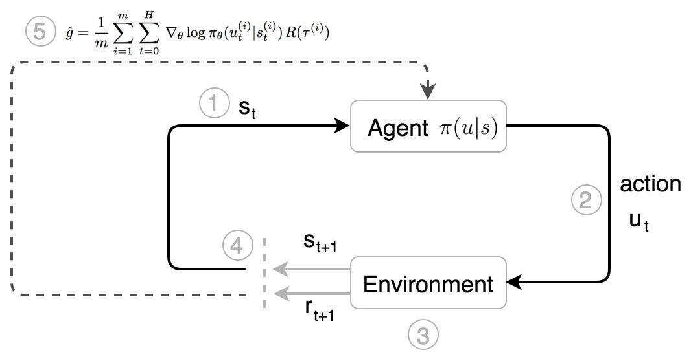

## Table of Contents

## What are Policy Gradient Methods in the context of machine learning?

Policy Gradient Methods are a type of reinforcement learning algorithm used in machine learning to help an agent learn how to make decisions. These methods directly optimize the policy, which is a strategy that the agent uses to decide its actions based on the current state of the environment. Instead of learning the value of states or state-action pairs, policy gradient methods focus on learning the best policy by adjusting the parameters of the policy to maximize a reward function over time. This approach can be particularly useful in complex environments where the optimal policy is difficult to find using other methods.

The core idea behind policy gradient methods is to use gradient ascent to update the policy parameters. The gradient of the expected cumulative reward with respect to the policy parameters is calculated, and the policy is updated in the direction that increases the expected reward. Mathematically, if we denote the policy by $$\pi_\theta$$ where $$\theta$$ are the parameters, the update rule can be expressed as $$\theta \leftarrow \theta + \alpha \nabla_\theta J(\theta)$$, where $$\alpha$$ is the learning rate and $$J(\theta)$$ is the objective function representing the expected cumulative reward. This process is repeated over many episodes, allowing the policy to improve gradually.

One popular example of a policy gradient method is the REINFORCE algorithm. In REINFORCE, the agent interacts with the environment, collects experiences, and then uses these experiences to update the policy. The update is based on the difference between the actual rewards received and the expected rewards, which helps guide the policy towards better decision-making. Policy gradient methods like REINFORCE can be powerful tools for solving complex decision-making problems in areas such as robotics, game playing, and autonomous driving, where traditional methods might struggle to find effective solutions.

## How do Policy Gradient Methods differ from other reinforcement learning approaches like Q-learning?

Policy Gradient Methods and Q-learning are both types of [reinforcement learning](/wiki/reinforcement-learning), but they approach the problem of learning from the environment in different ways. Policy Gradient Methods directly learn a policy, which is a strategy for choosing actions based on the current state. The goal is to find the best policy by adjusting its parameters to maximize the total reward over time. This is done using gradient ascent, where the policy parameters are updated in the direction that increases the expected reward. For example, if we denote the policy by $$\pi_\theta$$ where $$\theta$$ are the parameters, the update rule can be written as $$\theta \leftarrow \theta + \alpha \nabla_\theta J(\theta)$$, where $$\alpha$$ is the learning rate and $$J(\theta)$$ is the objective function representing the expected cumulative reward.

On the other hand, Q-learning focuses on learning the value of taking a particular action in a particular state, known as the Q-value. Instead of directly learning a policy, Q-learning learns a Q-function, which estimates the expected future rewards for each state-action pair. The agent then uses this Q-function to decide which action to take by choosing the action with the highest Q-value for the current state. Over time, the Q-function is updated based on the rewards received and the estimated future rewards, allowing the agent to improve its decision-making. While Policy Gradient Methods can handle continuous action spaces more naturally and are often used in complex environments, Q-learning is simpler to implement and can be effective in environments with discrete action spaces.

## Can you explain the basic principle behind the REINFORCE algorithm?

The REINFORCE algorithm is a type of Policy Gradient Method used in reinforcement learning. It works by directly improving the policy that the agent uses to choose actions. The main idea is to collect experiences from the environment and then use these experiences to update the policy. The policy tells the agent what action to take in each state, and the goal is to adjust this policy so that it leads to higher rewards over time. In REINFORCE, the policy is updated based on the rewards the agent receives, which helps guide the policy towards better decision-making.

To explain it simply, imagine the agent going through a series of steps in the environment. At each step, it chooses an action based on the current policy, and then it receives a reward. The agent keeps track of all these actions and rewards. At the end of the episode, REINFORCE uses the total reward to figure out how to update the policy. If an action led to high rewards, the policy is adjusted to make that action more likely in the future. If an action led to low rewards, the policy is adjusted to make that action less likely. This process is repeated over many episodes, allowing the policy to gradually improve. Mathematically, the update rule can be written as $$\theta \leftarrow \theta + \alpha \nabla_\theta J(\theta)$$, where $$\theta$$ are the policy parameters, $$\alpha$$ is the learning rate, and $$J(\theta)$$ is the objective function representing the expected cumulative reward.

## What are the advantages of using Actor-Critic methods like A2C and A3C over traditional policy gradient methods?

Actor-Critic methods like A2C and A3C combine the strengths of both policy-based and value-based reinforcement learning, offering several advantages over traditional policy gradient methods. One key advantage is that they can learn more efficiently. In traditional policy gradient methods like REINFORCE, the policy is updated based on the total reward at the end of each episode. This can be slow because the agent has to wait until the end to get feedback. In contrast, Actor-Critic methods use a value function, called the critic, to estimate the expected future rewards at each step. This allows the policy, called the actor, to be updated more frequently and with more accurate feedback, leading to faster learning.

Another advantage of Actor-Critic methods is that they can reduce the variance in policy updates. Traditional policy gradient methods can suffer from high variance because they rely on the total reward, which can be noisy. Actor-Critic methods mitigate this by using the critic's value estimates to normalize the rewards. This results in more stable and reliable updates to the policy. For example, in A2C and A3C, the update rule for the actor can be expressed as $$\theta \leftarrow \theta + \alpha \nabla_\theta \log \pi_\theta(a|s) (R - V(s))$$, where $$\theta$$ are the policy parameters, $$\alpha$$ is the learning rate, $$\pi_\theta(a|s)$$ is the probability of taking action $$a$$ in state $$s$$, $$R$$ is the actual return, and $$V(s)$$ is the estimated value of state $$s$$. This approach helps the actor learn a better policy more consistently.

## How does Trust Region Policy Optimization (TRPO) improve upon the stability of policy gradient updates?

Trust Region Policy Optimization (TRPO) improves the stability of policy gradient updates by limiting how much the policy can change in each update. This is important because big changes can make the policy perform worse, especially in complex environments. TRPO uses a trust region, which is like a safety zone, to make sure the policy doesn't change too much. It does this by solving a special kind of optimization problem that keeps the policy's changes within a safe limit. This helps the policy improve steadily without sudden drops in performance.

The key idea behind TRPO is to use a constraint to control the size of the policy update. Instead of using a simple gradient ascent like in traditional policy gradient methods, TRPO solves an optimization problem that maximizes the expected improvement in the policy while ensuring that the new policy stays close to the old one. Mathematically, this can be expressed as maximizing $$J(\pi_{\theta})$$ subject to the constraint that the KL-divergence between the old policy $$\pi_{\theta_{old}}$$ and the new policy $$\pi_{\theta}$$ is less than a small value $$\delta$$. This constraint helps prevent the policy from making large, risky updates, leading to more stable and reliable learning.

## What is Proximal Policy Optimization (PPO) and how does it address the challenges faced by TRPO?

Proximal Policy Optimization (PPO) is a type of reinforcement learning algorithm that improves upon Trust Region Policy Optimization (TRPO) by making it simpler and more efficient. TRPO can be hard to use because it involves solving a complex optimization problem to keep the policy updates within a safe limit. PPO addresses this challenge by using a simpler method to control how much the policy can change. Instead of solving a complex problem, PPO uses a trick called "clipping" to make sure the policy doesn't change too much. This makes PPO easier to implement and faster to run, which is great for training policies in complex environments.

In PPO, the policy is updated using a formula that includes a "clipping" term. This term stops the policy from changing too much by limiting how big the update can be. If the new policy tries to change too much, the clipping term kicks in and keeps the update small. This helps keep the policy stable and prevents big drops in performance. The update rule in PPO can be written as $$\theta \leftarrow \theta + \alpha \nabla_\theta \min(r_t(\theta) \hat{A}_t, \text{[clip](/wiki/clip)}(r_t(\theta), 1 - \epsilon, 1 + \epsilon) \hat{A}_t)$$, where $$r_t(\theta)$$ is the ratio of the new policy to the old policy, $$\hat{A}_t$$ is the estimated advantage, $$\epsilon$$ is a small number that controls the clipping, and $$\alpha$$ is the learning rate. By using this method, PPO makes it easier to train policies that work well without the need for complicated math.

## How does Deep Deterministic Policy Gradient (DDPG) extend policy gradient methods to continuous action spaces?

Deep Deterministic Policy Gradient (DDPG) is a way to use policy gradient methods in situations where actions can be any number, not just a few choices. In regular policy gradient methods, like REINFORCE, the agent picks actions from a set list. But in DDPG, the agent can choose any action from a continuous range, like moving a robot's arm to any position. DDPG does this by using two neural networks: one to decide what action to take (the actor) and one to guess how good that action will be (the critic). The actor network looks at the current situation and picks the best action, while the critic network helps the actor by telling it how good its choices are.

To make DDPG work, the actor and critic networks learn together. The actor network updates its way of choosing actions based on the feedback it gets from the critic network. The critic network, on the other hand, learns to predict the value of actions by looking at the rewards the agent gets and the values of future states. The update rule for the actor can be written as $$\theta \leftarrow \theta + \alpha \nabla_\theta Q(s, \mu(s|\theta))$$, where $$\theta$$ are the actor's parameters, $$\alpha$$ is the learning rate, $$Q(s, a)$$ is the critic's estimate of the action value, and $$\mu(s|\theta)$$ is the action chosen by the actor for state $$s$$. By working together, DDPG can handle continuous action spaces well, making it useful for tasks like controlling robots or driving cars.

## What are the key differences between DDPG and Twin Delayed DDPG (TD3), and why might TD3 be preferred?

DDPG and Twin Delayed DDPG (TD3) are both used for learning in situations where actions can be any number, not just a few choices. The main difference is that TD3 uses two critic networks instead of one, like DDPG does. This helps TD3 be more careful when choosing actions because it takes the smaller of the two critic's guesses about how good an action will be. This method, called "clipped double-Q learning," helps avoid over-estimating how good actions are, which can lead to better results. Also, TD3 updates the actor and critic networks less often than DDPG, which can make learning more stable and prevent big changes that might make things worse.

TD3 might be preferred over DDPG because it can handle the problem of over-estimating action values better. In DDPG, the single critic network might guess that some actions are better than they really are, leading the actor to make bad choices. By using two critics and taking the smaller guess, TD3 reduces this problem. Also, the delayed updates in TD3 give the critic networks more time to learn before the actor network changes, making the whole process more stable. This can lead to better performance, especially in complex environments where small mistakes can have big effects.

## Can you describe the Soft Actor-Critic (SAC) algorithm and its use of entropy regularization?

Soft Actor-Critic (SAC) is a type of reinforcement learning algorithm that helps an agent learn how to make decisions in environments with continuous action spaces. SAC uses two key ideas: it learns both a policy (the actor) and a value function (the critic) like other Actor-Critic methods, but it also adds something called entropy regularization. Entropy regularization encourages the policy to explore different actions, not just the ones that seem best at the moment. This helps the agent learn a more flexible and robust policy, which can be useful in complex situations where sticking to one action might not be the best in the long run.

In SAC, the policy is updated to maximize a combination of the expected reward and the entropy of the policy. The entropy measures how random the policy's actions are, and by including it in the objective, SAC encourages the policy to keep some randomness. The update rule for the policy can be written as $$\theta \leftarrow \theta + \alpha \nabla_\theta (Q(s, a) + \alpha \log \pi_\theta(a|s))$$, where $$\theta$$ are the policy parameters, $$\alpha$$ is the learning rate, $$Q(s, a)$$ is the critic's estimate of the action value, and $$\pi_\theta(a|s)$$ is the policy. By balancing the reward and entropy, SAC helps the agent find a policy that not only performs well but also explores the environment effectively. This makes SAC a powerful tool for tasks like robot control or autonomous driving, where exploring different actions can lead to better overall performance.

## What is the role of off-policy learning in methods like Soft Actor-Critic and how does it benefit the learning process?

Off-policy learning in methods like Soft Actor-Critic (SAC) means the agent can learn from experiences it didn't actually follow. Instead of only learning from the actions it took, the agent can use data from other actions too. This helps the agent learn faster and more efficiently because it can use a wider range of experiences. In SAC, the agent uses a replay buffer to store past experiences and then samples from this buffer to update its policy and value function. This approach allows the agent to keep learning even from old experiences, which can be very useful in complex environments where gathering new data might be slow or expensive.

The main benefit of off-policy learning in SAC is that it helps the agent explore the environment more thoroughly. By learning from a variety of actions, not just the ones it chose, the agent can discover better strategies more quickly. This is especially helpful when combined with entropy regularization, which encourages the agent to keep trying different actions. The combination of off-policy learning and entropy regularization makes SAC a powerful tool for tasks where exploration is important, like robot control or autonomous driving. By using off-policy learning, SAC can improve its policy more effectively and find solutions that might not be obvious from just following one set of actions.

## How do multi-agent extensions like MADDPG adapt policy gradient methods for environments with multiple agents?

Multi-Agent Deep Deterministic Policy Gradient (MADDPG) is a way to use policy gradient methods when there are many [agents](/wiki/agents) in an environment, all learning at the same time. In regular policy gradient methods like DDPG, one agent learns by itself. But in MADDPG, each agent learns its own policy while also considering what the other agents are doing. This is important because in multi-agent settings, the actions of one agent can affect the others. MADDPG helps each agent learn how to work together or compete better by letting them use information about each other's actions and states.

MADDPG works by giving each agent its own actor and critic networks, just like in DDPG. The actor network decides what action an agent should take based on its own state, while the critic network helps by estimating how good that action will be, considering the actions of all agents. To update the policies, MADDPG uses experiences from all agents, stored in a shared replay buffer. This allows each agent to learn from the collective experiences of the group, which can lead to better coordination and performance. The update rule for the actor of agent $$i$$ can be written as $$\theta_i \leftarrow \theta_i + \alpha \nabla_{\theta_i} Q_i(s, a_1, ..., a_n)$$, where $$\theta_i$$ are the parameters of agent $$i$$'s actor, $$\alpha$$ is the learning rate, $$Q_i$$ is the critic's estimate for agent $$i$$, and $$a_1, ..., a_n$$ are the actions of all agents. By using this method, MADDPG helps multiple agents learn to work together effectively in complex environments.

## What are some of the latest advancements in Policy Gradient Methods, such as Autotuned Temperature in Soft Actor-Critic or Robust Predictable Control, and their potential impacts on the field?

One of the latest advancements in Policy Gradient Methods is the Autotuned Temperature in Soft Actor-Critic (SAC). In regular SAC, the temperature parameter, which controls how much the policy explores different actions, is set by hand. But with Autotuned Temperature, the algorithm learns the best temperature by itself. This makes SAC even better at finding a good balance between exploring new actions and sticking to what works. The temperature is updated using a special rule that looks at how much the policy is exploring and how well it's doing. This can be written as $$\alpha \leftarrow \alpha - \lambda \nabla_\alpha (\alpha \log \pi_\theta(a|s) - \alpha \bar{H})$$, where $$\alpha$$ is the temperature, $$\lambda$$ is the learning rate for the temperature, $$\pi_\theta(a|s)$$ is the policy, and $$\bar{H}$$ is the target entropy. By letting the algorithm figure out the best temperature, Autotuned Temperature can make SAC work better in many different situations.

Another exciting advancement is Robust Predictable Control (RPC), which helps policy gradient methods deal with unpredictable environments. In regular policy gradient methods, the agent learns a policy that works well in the environment it's trained in. But if the environment changes a bit, the policy might not work as well. RPC tries to fix this by making the policy more robust. It does this by adding a special term to the policy update that encourages the policy to be predictable and work well even when things change a little. This can help the policy be more reliable in real-world situations where things don't always go as planned. By making policies more robust, RPC can make policy gradient methods more useful for tasks like robot control or autonomous driving, where the environment can be unpredictable.

## References & Further Reading

[1]: Sutton, R. S., & Barto, A. G. (2018). ["Reinforcement Learning: An Introduction"](https://web.stanford.edu/class/psych209/Readings/SuttonBartoIPRLBook2ndEd.pdf). MIT Press.

[2]: Silver, D., Lever, G., Heess, N., Degris, T., Wierstra, D., & Riedmiller, M. (2014). ["Deterministic Policy Gradient Algorithms."](https://dl.acm.org/doi/10.5555/3044805.3044850) In Proceedings of the 31st International Conference on Machine Learning (ICML 2014).

[3]: Lillicrap, T. P., Hunt, J. J., Pritzel, A., Heess, N., Erez, T., Tassa, Y., Silver, D., & Wierstra, D. (2015). ["Continuous control with deep reinforcement learning."](https://arxiv.org/abs/1509.02971) arXiv:1509.02971.

[4]: Schulman, J., Levine, S., Moritz, P., Jordan, M., & Abbeel, P. (2015). ["Trust Region Policy Optimization,"](https://arxiv.org/abs/1502.05477) arXiv:1502.05477.

[5]: Schulman, J., Wolski, F., Dhariwal, P., Radford, A., & Klimov, O. (2017). ["Proximal Policy Optimization Algorithms."](https://arxiv.org/abs/1707.06347) arXiv:1707.06347.

[6]: Haarnoja, T., Zhou, A., Abbeel, P., & Levine, S. (2018). ["Soft Actor-Critic: Off-Policy Maximum Entropy Deep Reinforcement Learning with a Stochastic Actor,"](https://arxiv.org/abs/1801.01290) arXiv:1801.01290.

[7]: Fujimoto, S., van Hoof, H., & Meger, D. (2018). ["Addressing Function Approximation Error in Actor-Critic Methods."](https://arxiv.org/abs/1802.09477) arXiv:1802.09477.

[8]: Lowe, R., Wu, Y., Tamar, A., Harb, J., Abbeel, O. P., & Mordatch, I. (2017). ["Multi-Agent Actor-Critic for Mixed Cooperative-Competitive Environments."](https://arxiv.org/abs/1706.02275) arXiv:1706.02275.