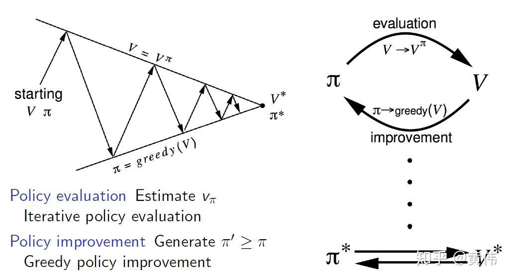

Algorithmic trading has undergone significant transformation with the incorporation of sophisticated algorithms designed to enhance decision-making capabilities. One such innovation is the application of reinforcement learning algorithms, particularly the Policy-Value Iteration methods. These methods represent a crucial advancement in creating algorithms that are capable of learning and optimizing trading strategies through interaction with dynamic market environments.

This article aims to examine the foundational concepts of Policy Iteration and Value Iteration within the framework of algorithmic trading. These methods hold importance not only for algorithm developers but also for traders looking to improve the effectiveness of automated trading systems. The principal idea is to leverage reinforcement learning to predict market movements and execute trades more efficiently, thereby increasing the profitability and reducing risks associated with trading activities.



Reinforcement learning, a subset of machine learning, involves an agent learning to make decisions by receiving feedback from interactions within an environment. In the context of trading, these algorithms assess a wide array of market variables to make informed decisions. Policy Iteration and Value Iteration are two pivotal reinforcement learning approaches that facilitate the development of optimal trading strategies by iteratively improving policies or value functions. Policy Iteration focuses on evaluating and refining policies to achieve optimal actions, while Value Iteration emphasizes computing value functions to determine the best strategies.

This exploration highlights the significance of including Policy-Value Iteration in financial markets. These methods provide a robust framework for understanding and enhancing trading strategies, offering a competitive edge in an increasingly automated and fast-paced trading landscape. Throughout the article, the methodologies, comparisons, and practical applications of Policy-Value Iteration in the financial sector will be discussed to provide a comprehensive understanding of these influential techniques.

## Table of Contents

## Understanding Value Iteration

Value Iteration is a fundamental algorithm in the field of reinforcement learning, designed to compute the optimal value function by iteratively updating state values. This process begins with initializing the value function, which represents the expected long-term reward for each state. At each iteration, the Bellman equation is used to update the value function, moving it closer to the optimal value. The Bellman equation is given by:

$$
V(s) = \max_a \left( \sum_{s'} P(s'|s, a) [R(s, a, s') + \gamma V(s')] \right)
$$

where $V(s)$ is the value of state $s$, $a$ represents the actions possible from state $s$, $P(s'|s, a)$ is the transition probability from state $s$ to $s'$ given action $a$, $R(s, a, s')$ denotes the immediate reward received after transitioning from $s$ to $s'$ given action $a$, and $\gamma$ is the discount factor, which weighs future rewards against immediate ones.

The iterative process of Value Iteration continues until the changes in the value function between iterations are below a predetermined threshold, indicating convergence to the optimal value function. This convergence guarantees that the optimal policy can be derived by selecting the action that maximizes the expected return in each state.

In the context of [algorithmic trading](/wiki/algorithmic-trading), Value Iteration is particularly useful for predicting price movements and evaluating potential future returns. By modeling trading scenarios as a Markov Decision Process, traders can use it to assess each state's long-term rewards under various market conditions. This method allows for the development of strategies that optimize expected returns based on projected market behavior.

However, the practical implementation of Value Iteration in trading strategies must consider both convergence rates and computational complexity. The algorithm's efficiency depends on the size of the state and action spaces, as larger spaces require more computational resources and time to reach convergence. Therefore, practitioners often balance precision and resource availability to tailor Value Iteration for effective use in real-time trading environments.

## Deciphering Policy Iteration

Policy Iteration is a methodology in [reinforcement learning](/wiki/reinforcement-learning) focused on refining a decision-making policy until it becomes optimal. The primary aim is to iteratively enhance a current policy by evaluating it and then applying improvements based on the evaluation outcomes. In essence, this technique seeks to stabilize the strategy used in making decisions, enabling an agent to achieve the best possible outcomes.

The framework of Policy Iteration can be broken down into two core steps: policy evaluation and policy improvement. During the policy evaluation step, the algorithm calculates the expected return for each state under the current policy. This typically involves solving the Bellman expectation equations, which provide the value function $V^\pi(s)$, representing the expected reward when starting in state $s$ and following policy $\pi$. In practice, this process is often computed iteratively until the value function converges to a stable solution.

The policy improvement step ensues once the estimated value function is sufficiently accurate. Here, the algorithm updates the policy by selecting actions that maximize the expected return from each state, effectively utilizing the newly computed value function to guide the decision-making process. The policy is updated by choosing actions that increase the expected reward, refining the strategy iteratively.

In the context of financial markets, Policy Iteration can significantly enhance trading strategies by refining trading rules based on real-time feedback data. This feedback-driven improvement is particularly effective given the dynamic and complex nature of financial environments, where market conditions are ever-changing. By continually adapting the trading policy with each iteration, traders can optimize their strategy to respond efficiently to new information and market trends.

One of the critical considerations when implementing Policy Iteration is its computational intensity. While the process often converges faster to the optimal policy compared to Value Iteration, which updates value functions directly, it demands substantial computational resources. Evaluating the entire state space can be demanding, especially in high-dimensional scenarios common in financial applications. Thus, practitioners must carefully weigh the trade-offs between the faster convergence speed of Policy Iteration and the required computational resources.

Despite these challenges, the ability of Policy Iteration to iteratively refine decision-making processes makes it a powerful tool in algorithmic trading. By enhancing trading rules based on evaluation and policy improvement, it empowers traders with a robust strategy that adapts dynamically to market conditions, potentially leading to more effective and profitable trading outcomes.

## Comparison of Value Iteration and Policy Iteration

Both Value Iteration and Policy Iteration are foundational algorithms in reinforcement learning, designed to solve Markov Decision Processes (MDPs) by discovering optimal strategies. Despite their common goal, these methodologies differ significantly in their approach.

Value Iteration focuses on iteratively updating the value function, $V(s)$, for each state $s$ in the state space. It relies on the Bellman Optimality Equation to perform these updates:

$$
V(s) \leftarrow \max_{a} \sum_{s'} P(s'|s,a) [ R(s,a,s') + \gamma V(s') ]
$$

Here, $P(s'|s,a)$ represents the transition probability, $R(s,a,s')$ is the reward function, and $\gamma$ is the discount [factor](/wiki/factor-investing). The process continues until the value function converges, providing an optimal policy indirectly derived from the converged value function. Value Iteration is straightforward and often easier to implement due to its direct approach of updating expected state values.

In contrast, Policy Iteration involves two distinct steps: policy evaluation and policy improvement. Initially, a policy is evaluated by calculating the value function for that policy. Once the evaluation is complete, the policy is improved by choosing actions that yield the highest expected value according to the evaluated value function. This process iteratively enhances the policy until it converges to the optimal one.

Python pseudo-code for Policy Iteration is as follows:

```python
def policy_iteration(states, actions, transition_prob, reward, discount_factor, theta):
    # Initialize a random policy
    policy = {state: actions[0] for state in states}
    # Initialize the value function
    value_function = {state: 0 for state in states}

    # Repeat until convergence
    while True:
        # Policy Evaluation
        while True:
            delta = 0
            for state in states:
                v = value_function[state]
                action = policy[state]
                value_function[state] = sum([transition_prob[state][action][next_state] * 
                                            (reward[state][action][next_state] + discount_factor * value_function[next_state])
                                            for next_state in states])
                delta = max(delta, abs(v - value_function[state]))
            if delta < theta:
                break

        # Policy Improvement
        policy_stable = True
        for state in states:
            old_action = policy[state]
            policy[state] = max(actions, key=lambda a: sum([transition_prob[state][a][next_state] *
                                                            (reward[state][a][next_state] + discount_factor * value_function[next_state])
                                                            for next_state in states]))
            if old_action != policy[state]:
                policy_stable = False

        if policy_stable:
            break

    return policy, value_function
```

Comparatively, Policy Iteration often converges to an optimal policy faster than Value Iteration due to its explicit policy improvement steps. However, it requires more computational resources for the policy evaluation phase, which can be demanding depending on the problem's complexity.

In the context of algorithmic trading, the choice between Value Iteration and Policy Iteration depends heavily on specific use-case requirements. Value Iteration may be preferred when computational simplicity and speed are priorities. In contrast, Policy Iteration might be advantageous when seeking more refined decision-making strategies, albeit with additional computational overhead.

Ultimately, appreciating the strengths and weaknesses of each method equips trading algorithm developers with a robust set of tools for crafting advanced strategies tailored to the dynamically evolving financial markets.

## Applications in Algorithmic Trading

Reinforcement learning algorithms, particularly Policy-Value Iteration methods, are revolutionizing the automation of trading strategies by providing sophisticated tools for predicting market behavior and enhancing decision-making processes. These methods enable traders to fine-tune trade execution, thus securing a competitive advantage. 

Policy-Value Iteration enhances decision-making by continually assessing complex market scenarios. The iterative nature of these models allows traders to test various hypotheses and refine decision logic dynamically, crucial for adapting to the ever-changing market conditions. For instance, traders can model the expected future returns of holding or selling a stock based on the current market state, then choose the policy that yields the highest potential return.

In high-frequency trading ([HFT](/wiki/high-frequency-trading-strategies)) environments, where the rapid execution of trades is vital, Policy-Value Iteration methods are particularly invaluable. These models require robust algorithms capable of making split-second decisions to capitalize on fleeting market opportunities. Python code implementing these algorithms can process vast amounts of market data, improving trade timing and accuracy. A simple implementation might look like the following:

```python
import numpy as np

def value_iteration(V, iterations, gamma=0.99):
    for i in range(iterations):
        # Calculate the value of each state under the best policy found so far
        V = np.max(np.sum(transition_probabilities * (rewards + gamma * V), axis=2), axis=1)
    return V

# Initialize the value function and model parameters
transition_probabilities = ...  # Define transition probabilities matrix
rewards = ...  # Define rewards matrix
V = np.zeros(number_of_states)
iterations = 1000

# Run value iteration
optimal_values = value_iteration(V, iterations)
```

The adaptability of Policy-Value Iteration also plays a significant role in reducing risk and enhancing profitability. These algorithms monitor and react to market dynamics, ensuring that trading models remain robust against adverse market movements. They can help identify optimal timing for entering or exiting trades, thus minimizing potential losses and maximizing gains.

Moreover, these methods provide a framework for continuous learning and adaptation. As trading environments evolve, Policy-Value Iteration can be adjusted to incorporate newer data and patterns, ensuring that automated trading strategies remain effective. This capability helps in maintaining a balance between risk and reward, a fundamental aspect of successful trading strategies.

In summary, Policy-Value Iteration in algorithmic trading allows traders to harness advanced computational techniques for improving predictions, decision logic, and overall trading performance, making them an indispensable tool in modern financial marketplaces.

## Conclusion

The integration of Policy-Value Iteration algorithms into algorithmic trading represents a significant leap forward in financial technology. These methods have fundamentally transformed the efficiency and precision of automated trading systems. By adopting reinforcement learning techniques such as Value Iteration and Policy Iteration, traders and developers can optimize trade executions and enhance decision-making processes within their algorithms.

Value Iteration provides a straightforward approach, updating value functions to determine optimal strategies by evaluating expected returns in future states. Its simplicity is an asset, allowing for straightforward implementation and quick results, making it an ideal choice for scenarios requiring less computational power.

Conversely, Policy Iteration facilitates more refined policy outcomes by iteratively evaluating and improving trading strategies, albeit at a higher computational cost. This method is highly effective in complex trading environments where precision and customization of policy are essential.

Looking ahead, advancements in this area promise to drive further innovations in algorithmic trading. Ongoing research is anticipated to refine these algorithms, enhance their adaptability, and improve their predictive accuracy. Efforts to reduce computational demands without sacrificing performance are particularly crucial for maintaining competitiveness in high-frequency trading markets.

Incorporating these sophisticated techniques equips traders with the tools needed to effectively navigate the complexities of modern financial markets. As a result, traders can capitalize on market opportunities more efficiently and mitigate risks, ensuring improved profitability and sustained competitive advantage in a rapidly evolving trading landscape. Embracing Policy-Value Iteration methods thus represents a strategic imperative for those looking to excel in today's algorithmic trading environment.

## References & Further Reading

[1]: Sutton, R. S., & Barto, A. G. (2018). ["Reinforcement Learning: An Introduction"](https://web.stanford.edu/class/psych209/Readings/SuttonBartoIPRLBook2ndEd.pdf). MIT Press.

[2]: Silver, D., Lever, G., Heess, N., Degris, T., Wierstra, D., & Riedmiller, M. (2014). ["Deterministic Policy Gradient Algorithms"](http://proceedings.mlr.press/v32/silver14.pdf). Proceedings of the 31st International Conference on Machine Learning.

[3]: Bertsekas, D. P. (2011). ["Dynamic Programming and Optimal Control"](https://www.mit.edu/~dimitrib/dpbook.html). Athena Scientific.

[4]: ["Advances in Financial Machine Learning"](https://www.amazon.com/Advances-Financial-Machine-Learning-Marcos/dp/1119482089) by Marcos Lopez de Prado

[5]: Mnih, V., Kavukcuoglu, K., Silver, D., et al. (2015). ["Human-level control through deep reinforcement learning"](https://www.nature.com/articles/nature14236). Nature, 518(7540), 529–533.

[6]: Yousefi, M., & Hashemi, S. (2021). ["A Review of Reinforcement Learning in Algorithmic Trading"](https://arxiv.org/abs/2106.00123). IEEE Access, 9, 40189-40202.