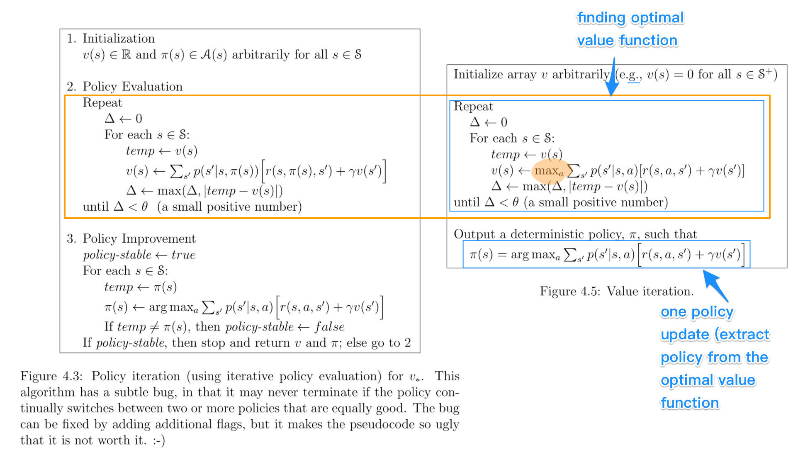

## Table of Contents

## What is Policy-Value Iteration?

Policy-Value Iteration is a method used in reinforcement learning and decision-making processes. It combines two important techniques: policy iteration and value iteration. In policy iteration, you start with a random policy and keep improving it until you find the best way to act in every situation. In value iteration, you estimate how good it is to be in each state by calculating the expected rewards you can get from there. By combining these two, policy-value iteration helps find the best policy faster and more efficiently.

In simple terms, imagine you're trying to find the best route to a treasure. Policy iteration would be like trying different paths and seeing which one gets you closer to the treasure, then sticking to the best path and refining it. Value iteration would be like figuring out how valuable each spot on the map is based on how close it is to the treasure. Policy-value iteration does both at the same time, so you not only improve your path but also understand the value of each spot, making your journey to the treasure quicker and more effective.

## How does Policy-Value Iteration differ from traditional Policy Iteration and Value Iteration?

Policy-Value Iteration is a bit different from traditional Policy Iteration and Value Iteration because it mixes the best parts of both. In traditional Policy Iteration, you start with a random way of doing things and keep tweaking it until you find the best way. You do this by figuring out how good your current way is, then trying a new way based on that. On the other hand, Value Iteration is about figuring out how good each situation is by looking at the rewards you can get from there, and you keep updating these values until they don't change much anymore.

Policy-Value Iteration combines these two ideas. Instead of doing them one after the other, it does them at the same time. This means you're not only improving your way of doing things (like in Policy Iteration), but you're also figuring out the value of each situation (like in Value Iteration). By doing both together, you can find the best way to act much faster and more efficiently. It's like using two tools at once instead of switching between them, which helps you reach your goal quicker.

## What are the key components of the Policy-Value Iteration algorithm?

The Policy-Value Iteration algorithm has two main parts that work together to find the best way to act in different situations. The first part is about figuring out how good each situation is, which is called the value function. You start by guessing how valuable each situation might be and then keep updating these guesses based on the rewards you can get from each situation. This is similar to Value Iteration, but in Policy-Value Iteration, you don't wait until the values stop changing before moving on to the next step.

The second part involves improving your way of acting, which is called the policy. You use the values you've calculated to decide the best action to take in each situation. Then, you try out this new way of acting and see if it makes the values better. If it does, you keep this new way; if not, you try another one. By doing these two steps together, you can quickly find the best way to act without having to do them one after the other like in traditional Policy Iteration and Value Iteration.

## Can you explain the basic steps involved in a single iteration of Policy-Value Iteration?

In a single iteration of Policy-Value Iteration, you start by looking at the current values of each situation. These values tell you how good it is to be in each situation based on the rewards you can get from there. You then use these values to figure out the best action to take in each situation. This part is like using a map to decide which path to take based on how close each path gets you to your goal.

After deciding on the best actions, you try them out and see how they change the values of the situations. If the new actions make the values better, you keep them. If not, you might need to try different actions. By doing this, you're constantly updating both your way of acting and your understanding of how good each situation is. This back-and-forth helps you find the best way to act faster than if you did these steps one after the other.

## What types of problems is Policy-Value Iteration typically used to solve?

Policy-Value Iteration is often used to solve problems in areas like robotics, game playing, and decision-making in business. Imagine a robot that needs to find the quickest way to move around a room without bumping into things. Policy-Value Iteration helps the robot learn the best paths to take by figuring out how good each spot in the room is and then deciding the best moves to make. It's like the robot is playing a game where it gets points for moving quickly and safely, and Policy-Value Iteration helps it learn the rules of the game and how to win.

In game playing, like chess or Go, Policy-Value Iteration can help a computer player learn the best moves to make. The computer starts by guessing how good each possible move is and then keeps playing the game, updating its guesses based on whether the moves lead to winning or losing. Over time, it gets better at choosing the right moves, just like a human player would improve by practicing. This method is very useful because it can handle complex games where there are many possible moves and outcomes to consider.

## How does the convergence of Policy-Value Iteration compare to other reinforcement learning algorithms?

Policy-Value Iteration often converges faster than traditional Policy Iteration and Value Iteration because it works on both the policy and the value function at the same time. In traditional Policy Iteration, you first update the value function completely before changing the policy, which can take a lot of steps. In Value Iteration, you keep updating the value function without changing the policy until the values stop changing, which can also be slow. But with Policy-Value Iteration, you're tweaking both the policy and the value function in each step, so you can reach the best solution quicker. It's like using two tools together instead of one at a time.

Compared to other [reinforcement learning](/wiki/reinforcement-learning) algorithms like Q-learning or SARSA, Policy-Value Iteration has its own strengths and weaknesses. Q-learning and SARSA update their value estimates based on actual experiences, which can be slower but works well in environments where you can't predict everything. Policy-Value Iteration, on the other hand, uses a model of the environment to plan ahead, which can lead to faster convergence if the model is accurate. But if the model is wrong, Policy-Value Iteration might not work as well as methods that learn directly from experience. So, the choice between these algorithms depends a lot on how well you know the environment and how fast you need to find a good solution.

## What are the advantages of using Policy-Value Iteration over other methods?

Policy-Value Iteration has a big advantage because it can find the best way to act faster than many other methods. It does this by working on two things at the same time: figuring out how good each situation is and deciding the best actions to take. Other methods, like Policy Iteration or Value Iteration, do these steps one after the other, which can take longer. By doing both steps together, Policy-Value Iteration can reach the best solution quicker, like using two tools at once instead of one at a time. This makes it really useful in situations where you need to find the best way to act quickly.

Another advantage is that Policy-Value Iteration can handle complex problems well. It's great for things like playing games or controlling robots where there are lots of different situations and choices to make. Because it keeps updating both the values of situations and the actions to take, it can learn and improve even in tricky environments. This makes it a strong choice for tasks where you need to think ahead and plan carefully, like in chess or navigating a robot through a busy room.

## What are the potential drawbacks or limitations of Policy-Value Iteration?

One big problem with Policy-Value Iteration is that it needs a good model of the environment to work well. If the model is wrong or not complete, the method might not find the best way to act. This can be a big issue in real life where things can be unpredictable and hard to model perfectly. For example, if you're using it to control a robot, but the robot's sensors give wrong information, Policy-Value Iteration might make bad decisions.

Another limitation is that Policy-Value Iteration can be slow and use a lot of computer power, especially in big and complex problems. Because it's always updating both the values of situations and the actions to take, it can take a lot of calculations to find the best solution. This might not be a problem for small tasks, but for big ones like playing complex games or managing a whole factory, it can be a challenge.

## How can the performance of Policy-Value Iteration be optimized?

To make Policy-Value Iteration work better, you can start by making sure the model of the environment is as good as possible. If the model is accurate, Policy-Value Iteration can find the best way to act more quickly. You can also use better ways to guess the values of situations at the start. If you start with good guesses, it can take fewer steps to find the right values. Another way to help is by using a computer that can do lots of calculations quickly. This can make the whole process faster, especially for big and complex problems.

Another way to improve Policy-Value Iteration is by using smart tricks to cut down on the number of calculations needed. For example, you can stop updating values that don't change much, which saves time and computer power. You can also focus on the most important situations and actions first, instead of trying to update everything at once. By doing these things, you can make Policy-Value Iteration work better and find the best way to act more quickly.

## Can you provide a practical example of implementing Policy-Value Iteration in a programming language?

Let's look at a simple example of using Policy-Value Iteration in Python to solve a grid world problem. Imagine a 3x3 grid where an agent starts at the top-left corner and wants to reach the bottom-right corner. Each move can be up, down, left, or right, and the agent gets a reward of -1 for each step it takes. The goal is to find the shortest path to the goal, which means minimizing the total reward (or negative reward).

Here's how you might set up the code to use Policy-Value Iteration. First, you define the grid and the rewards, then you initialize the value function with zeros and a random policy. In each iteration, you go through every state in the grid and update the value of that state based on the current policy. After updating the values, you improve the policy by choosing the action that leads to the highest value in the next state. You keep doing this until the values and the policy stop changing much. By the end, the agent knows the best path to take to reach the goal with the least number of steps.

## How does the choice of value function approximation affect the outcome of Policy-Value Iteration?

The way you guess how good each situation is, or the value function, can really change how well Policy-Value Iteration works. If you use a simple guess, like saying all situations are worth zero at the start, it might take a long time for the algorithm to figure out the best way to act. But if you start with a smarter guess, like knowing some situations are better than others from the beginning, it can find the best way much faster. So, choosing a good way to guess the values at the start can make a big difference in how quickly and well Policy-Value Iteration solves the problem.

Also, the way you update these guesses, or the value function approximation method, matters a lot. If you use a method that can handle complex situations well, like a [neural network](/wiki/neural-network), it can learn the values more accurately. But this might take more time and computer power. On the other hand, using a simpler method, like a table to keep track of values, might be faster but not as good at handling complex problems. So, you need to think about how complex your problem is and how much time and power you have when choosing the best way to approximate the value function.

## What recent advancements or variations have been made to the original Policy-Value Iteration algorithm?

One big change to Policy-Value Iteration is called Deep Policy-Value Iteration. This uses something called a neural network to guess how good each situation is. A neural network is like a smart computer brain that can learn from examples. By using a neural network, Deep Policy-Value Iteration can handle really complex problems, like playing games or controlling robots, much better than the old way. But it needs a lot of computer power and time to work well.

Another new idea is called Asynchronous Policy-Value Iteration. In this version, different parts of the problem are worked on at the same time, instead of one after the other. This can make the whole process much faster, especially for big problems. It's like having a team of people working on different parts of a puzzle at the same time, instead of one person doing it all by themselves. This way, you can find the best way to act quicker, but it can be harder to make sure everything works together smoothly.

## What is Understanding Value Iteration?

Value Iteration is a fundamental algorithm in the field of reinforcement learning, designed to compute the optimal value function by iteratively updating state values. This process begins with initializing the value function, which represents the expected long-term reward for each state. At each iteration, the Bellman equation is used to update the value function, moving it closer to the optimal value. The Bellman equation is given by:

$$
V(s) = \max_a \left( \sum_{s'} P(s'|s, a) [R(s, a, s') + \gamma V(s')] \right)
$$

where $V(s)$ is the value of state $s$, $a$ represents the actions possible from state $s$, $P(s'|s, a)$ is the transition probability from state $s$ to $s'$ given action $a$, $R(s, a, s')$ denotes the immediate reward received after transitioning from $s$ to $s'$ given action $a$, and $\gamma$ is the discount factor, which weighs future rewards against immediate ones.

The iterative process of Value Iteration continues until the changes in the value function between iterations are below a predetermined threshold, indicating convergence to the optimal value function. This convergence guarantees that the optimal policy can be derived by selecting the action that maximizes the expected return in each state.

In the context of [algorithmic trading](/wiki/algorithmic-trading), Value Iteration is particularly useful for predicting price movements and evaluating potential future returns. By modeling trading scenarios as a Markov Decision Process, traders can use it to assess each state's long-term rewards under various market conditions. This method allows for the development of strategies that optimize expected returns based on projected market behavior.

However, the practical implementation of Value Iteration in trading strategies must consider both convergence rates and computational complexity. The algorithm's efficiency depends on the size of the state and action spaces, as larger spaces require more computational resources and time to reach convergence. Therefore, practitioners often balance precision and resource availability to tailor Value Iteration for effective use in real-time trading environments.

## What is the comparison between Value Iteration and Policy Iteration?

Both Value Iteration and Policy Iteration are foundational algorithms in reinforcement learning, designed to solve Markov Decision Processes (MDPs) by discovering optimal strategies. Despite their common goal, these methodologies differ significantly in their approach.

Value Iteration focuses on iteratively updating the value function, $V(s)$, for each state $s$ in the state space. It relies on the Bellman Optimality Equation to perform these updates:

$$
V(s) \leftarrow \max_{a} \sum_{s'} P(s'|s,a) [ R(s,a,s') + \gamma V(s') ]
$$

Here, $P(s'|s,a)$ represents the transition probability, $R(s,a,s')$ is the reward function, and $\gamma$ is the discount [factor](/wiki/factor-investing). The process continues until the value function converges, providing an optimal policy indirectly derived from the converged value function. Value Iteration is straightforward and often easier to implement due to its direct approach of updating expected state values.

In contrast, Policy Iteration involves two distinct steps: policy evaluation and policy improvement. Initially, a policy is evaluated by calculating the value function for that policy. Once the evaluation is complete, the policy is improved by choosing actions that yield the highest expected value according to the evaluated value function. This process iteratively enhances the policy until it converges to the optimal one.

Python pseudo-code for Policy Iteration is as follows:

```python
def policy_iteration(states, actions, transition_prob, reward, discount_factor, theta):
    # Initialize a random policy
    policy = {state: actions[0] for state in states}
    # Initialize the value function
    value_function = {state: 0 for state in states}

    # Repeat until convergence
    while True:
        # Policy Evaluation
        while True:
            delta = 0
            for state in states:
                v = value_function[state]
                action = policy[state]
                value_function[state] = sum([transition_prob[state][action][next_state] * 
                                            (reward[state][action][next_state] + discount_factor * value_function[next_state])
                                            for next_state in states])
                delta = max(delta, abs(v - value_function[state]))
            if delta < theta:
                break

        # Policy Improvement
        policy_stable = True
        for state in states:
            old_action = policy[state]
            policy[state] = max(actions, key=lambda a: sum([transition_prob[state][a][next_state] *
                                                            (reward[state][a][next_state] + discount_factor * value_function[next_state])
                                                            for next_state in states]))
            if old_action != policy[state]:
                policy_stable = False

        if policy_stable:
            break

    return policy, value_function
```

Comparatively, Policy Iteration often converges to an optimal policy faster than Value Iteration due to its explicit policy improvement steps. However, it requires more computational resources for the policy evaluation phase, which can be demanding depending on the problem's complexity.

In the context of algorithmic trading, the choice between Value Iteration and Policy Iteration depends heavily on specific use-case requirements. Value Iteration may be preferred when computational simplicity and speed are priorities. In contrast, Policy Iteration might be advantageous when seeking more refined decision-making strategies, albeit with additional computational overhead.

Ultimately, appreciating the strengths and weaknesses of each method equips trading algorithm developers with a robust set of tools for crafting advanced strategies tailored to the dynamically evolving financial markets.

## References & Further Reading

[1]: Sutton, R. S., & Barto, A. G. (2018). ["Reinforcement Learning: An Introduction"](https://web.stanford.edu/class/psych209/Readings/SuttonBartoIPRLBook2ndEd.pdf). MIT Press.

[2]: Silver, D., Lever, G., Heess, N., Degris, T., Wierstra, D., & Riedmiller, M. (2014). ["Deterministic Policy Gradient Algorithms"](http://proceedings.mlr.press/v32/silver14.pdf). Proceedings of the 31st International Conference on Machine Learning.

[3]: Bertsekas, D. P. (2011). ["Dynamic Programming and Optimal Control"](https://www.mit.edu/~dimitrib/dpbook.html). Athena Scientific.

[4]: ["Advances in Financial Machine Learning"](https://www.amazon.com/Advances-Financial-Machine-Learning-Marcos/dp/1119482089) by Marcos Lopez de Prado

[5]: Mnih, V., Kavukcuoglu, K., Silver, D., et al. (2015). ["Human-level control through deep reinforcement learning"](https://www.nature.com/articles/nature14236). Nature, 518(7540), 529–533.

[6]: Yousefi, M., & Hashemi, S. (2021). ["A Review of Reinforcement Learning in Algorithmic Trading"](https://arxiv.org/abs/2106.00123). IEEE Access, 9, 40189-40202.