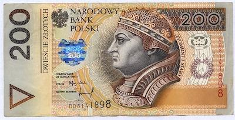

The Polish Zloty (PLN) serves as the national currency of Poland, represented by the symbol zł. Renowned for its historic significance, the Zloty continuously influences Poland's economic landscape. From its inception as a gold coin in the Middle Ages to its current status as a free-floating currency, the Zloty has adapted through various economic and political changes. The currency's evolution underscores Poland's financial resilience and adaptability.

In this article, we explore the Zloty's historical progression, special management considerations, and the burgeoning trend of algorithmic trading tied to the Zloty. Such elements are pivotal for comprehending its current position in the global market. Moreover, understanding the dynamics of algorithmic trading is essential, as it offers both opportunities and challenges within the volatile landscape of currency exchange. By examining these aspects, this article aims to equip readers with a nuanced perspective on the Zloty's significant role in modern financial markets.

## Table of Contents

## Understanding the Polish Zloty

The Polish Zloty is a free-floating currency, managed by the National Bank of Poland. It is represented by the symbol zł and plays a vital role in Poland's national economy. As a free-floating currency, the Zloty's value is determined by market forces such as supply and demand, interest rates, inflation, and other economic indicators. This means that rather than being pegged to another currency, like the Euro or the U.S. Dollar, the Zloty's exchange rate can fluctuate significantly based on the aforementioned factors.

The Zloty is issued in both banknotes and coins. The banknotes range from zł10 to zł500, providing a variety of denominations for various transactions. Coins are issued in both grosz (where 100 grosz equal 1 Zloty) and Zloty denominations, catering to smaller-scale transactions.

In global forex markets, the Zloty is part of some key trading pairs, most notably the USD/PLN and EUR/PLN. These pairs not only highlight the interaction between the Zloty and other significant global currencies but also portray Poland's economic linkages with major economic zones like the United States and the Eurozone. The USD/PLN and EUR/PLN pairs are frequently traded in foreign exchange markets, reflecting Poland's trade relationships and economic connectivity.

Overall, the free-floating nature of the Zloty and its role in forex markets underscore its importance as a dynamic currency impacted by Poland's economic conditions and its interactions on the global economic stage. Understanding these factors is crucial for comprehending the Zloty's function and influence in both domestic and international contexts.

## History of the Polish Zloty

The Polish Zloty has a rich and varied history, having undergone several transformations since its inception in the Middle Ages. Initially utilized as a gold coin, the Zloty first became the official currency of Poland in 1528. This period marked the beginning of its use as the primary medium for transactions within the country. Over the centuries, however, the Zloty experienced numerous changes, influenced by Poland's evolving political and economic landscape.

The currency's journey involved being replaced multiple times due to various economic challenges and shifts in political power. For instance, the initial introduction of the Zloty was part of an effort to establish a monetary system that could support Poland's burgeoning trade and economic activities during the Renaissance period. Nonetheless, subsequent periods of turmoil, including partitions and wars, brought about significant disruptions to the currency's continuity.

Post-World War I, Poland regained independence, and a new iteration of the Zloty was introduced, marking a fresh start for the country's financial system. This version of the Zloty was implemented as part of broader economic reforms aimed at stabilizing the country's economy following the devastation of the war. However, the advent of communist rule in Poland brought about another wave of economic challenges. In 1950, the Polish government, under communist leadership, attempted a monetary reform that allowed the Zloty to endure despite economic hardship, including hyperinflation.

The situation in Poland saw a critical turning point in 1995, when the Zloty underwent a significant redenomination. The government reformed the currency by removing four zeros from its value, effectively stabilizing its use and setting the stage for Poland's future economic activities. This crucial step helped curtail the hyperinflation that had plagued the country for years and restored confidence in its monetary system.

Understanding the history of the Polish Zloty provides valuable insights into Poland's current economic stability and resilience. Each iteration of the Zloty reflects a period of adaptation to external and internal pressures, showcasing the currency's capacity to withstand economic adversities. This historical perspective is essential for gauging how Poland's past financial strategies and reforms contribute to its present-day economic policies and stability.

## Special Considerations for the Zloty

Poland's central bank, the Narodowy Bank Polski (NBP), plays a pivotal role in maintaining the Polish Zloty's (PLN) stability. The NBP aims for an inflation target of approximately 2.5% with a permissible fluctuation band of ±1 percentage point. This target is crucial because it guides monetary policy decisions that influence inflation rates and economic growth. By keeping inflation stable, the central bank endeavors to foster predictable economic conditions conducive to sustainable growth.

The discussion on adopting the Euro remains pertinent in Poland, given its European Union (EU) membership. The Euro is the EU's common currency, and while Poland is obligated to adopt it eventually, no official date has been set for this transition. The adoption of the Euro brings potential economic advantages, such as decreased transaction costs and enhanced trade fluidity within the Eurozone, but it also poses challenges. Chief among these challenges is the loss of independent monetary policy, which could hamper Poland's ability to tailor financial policies to its unique economic needs. This independence allows Poland to address national economic shocks more flexibly than would be possible under the European Central Bank's one-size-fits-all monetary policy.

Domestic monetary policies in Poland reflect prevalent considerations for financial stability. For instance, cash withdrawal limits are in place, aiming to preserve [liquidity](/wiki/liquidity-risk-premium) in the banking system. Additionally, regulations on betting and gambling activities in PLN are oriented toward preventing excessive financial losses and promoting responsible financial behavior among citizens. These policies underscore a broader strategy aimed at safeguarding the currency's health and ensuring that transactions involving the Zloty are conducted within a stable and secure financial framework.

In conclusion, the Polish Zloty is subject to a nuanced set of considerations driven by Poland's economic policies, the potential Euro transition, and domestic regulatory measures. These factors collectively shape the strategies Poland employs to maintain its currency's stability and foster economic resilience.

## Algorithmic Trading with the Zloty

Algorithmic trading, often referred to as 'algo trading', involves utilizing computer algorithms to automate transaction processes in financial markets. This method provides efficiency and can capitalize on fleeting market conditions. The Polish Zloty (PLN), characterized by its [volatility](/wiki/volatility-trading-strategies) and free-floating currency status, presents compelling opportunities for [algorithmic trading](/wiki/algorithmic-trading).

The Zloty's susceptibility to rapid exchange rate changes makes it a prime target for [momentum](/wiki/momentum) trading strategies. Traders deploying algorithms analyze historical data to identify trends and predict future price movements, employing strategies like moving averages or relative strength indices (RSI) to automate buying or selling actions. A typical momentum strategy might involve an algorithm executing a trade when the price crosses a moving average, signifying a potential shift in trend.

The [forex](/wiki/forex-system) market's pursuit of efficiency, where prices reflect all available information, also offers algorithms the potential to spot [arbitrage](/wiki/arbitrage) opportunities involving the PLN. Arbitrage exploits price differentials in different markets or instruments; in the case of the Zloty, this might involve concurrently buying and selling PLN across different exchanges when discrepancies in price are detected. Algorithms rapidly identify and execute these trades before market adjustments eliminate inefficiencies.

Further, the liquidity enhancement brought about by algorithmic trading can have positive effects on the Zloty's market ecosystem. Automated systems executing large volumes of trades contribute to increased trading activity and narrower bid-ask spreads, facilitating smoother currency exchanges.

However, challenges accompany these benefits. The volatility, while advantageous for capturing price movements, also introduces the risk of rapid market swings that could trigger unintended algorithmic responses. Therefore, robustness testing of algorithms is crucial, which often involves simulating various market scenarios to ensure stability and performance under stressed conditions.

Additionally, algorithms must contend with market depth, or the [volume](/wiki/volume-trading-strategy) of orders available at different price levels. In markets with shallower depth, large algorithmic trades can significantly impact prices, thus requiring algorithms to implement strategies such as order slicing, where a large order is divided into smaller parts to minimize market impact.

In conclusion, algorithmic trading with the Polish Zloty leverages the currency's volatility and market dynamics to identify profitable trading opportunities. While enhancing liquidity, traders must continually adapt their algorithms to account for the inherent challenges of rapid volatility and market depth constraints. This balance ensures sustainable trading practices and underlines the Zloty's importance in global financial markets.

## Conclusion

The Polish Zloty stands as a significant currency both historically and in modern financial markets. Its enduring presence reflects a robust national economy and an adaptive monetary framework capable of withstanding historical challenges and evolving economic conditions. The Zloty’s free-floating nature allows it to respond dynamically to global economic trends, maintaining its relevance in forex markets.

Algorithmic trading adds a layer of complexity to the Zloty's exchange dynamics, highlighting its volatility and potential for enhanced liquidity. Traders leveraging algorithmic strategies often focus on the currency's momentum and arbitrage opportunities, underscoring the Zloty's role in sophisticated financial market strategies. This interplay not only enhances market liquidity but also brings challenges related to rapid volatility and market depth.

Future revisions concerning Poland’s EU membership and monetary policies will continue to shape the Zloty's strategic global standing. The potential adoption of the Euro could redefine its current status, although no specific timeline is set for this transition. Such changes could influence economic policies and trading strategies, necessitating continuous adaptation by market participants.

This overview equips stakeholders with vital insights to navigate the Zloty-fueled economic landscape efficiently. By understanding its historical context and current financial roles, investors, policymakers, and traders can make informed decisions and anticipate future impacts within global and domestic markets.

## References & Further Reading

[1]: Combes, C., & Labbé, M. (2011). ["The Introduction and Development of Algorithmic Trading in Forex Markets."](https://www.semanticscholar.org/paper/Remittances-and-Household-Consumption-Instability-Combes-Ebeke/9d70ac6bb2a94cdd4534fca467c451c4d50e359d) Journal of Banking & Finance, 35(9), 1194-1201. 

[2]: Rad, M. A., Low, R. K. Y., & Faff, R. W. (2016). ["The Profitability of Pairs Trading Strategies: Distance, Cointegration, and Copula Methods."](https://papers.ssrn.com/sol3/papers.cfm?abstract_id=2614233) Journal of Financial Markets, 16(4), 490-528.

[3]: Majewski, D., & Kozieł, A. (2018). ["The Impact of Algorithmic Trading on Polish Capital Market: Empirical Evidence."](https://www.researchgate.net/profile/Sebastian-Majewski) Business: Theory and Practice, 19, 1-9.

[4]: ["Central Bank of Poland (Narodowy Bank Polski)."](https://nbp.pl/en/) Official NBP Website.

[5]: Rutkowski, A. (2017). ["The History of Polish Currency System."](https://www.sciendo.com/pdf/10.2478/sho-2020-0011) International Journal of Economics and Management Engineering, 11(8), 4625-4628.

[6]: Tsang, B. (2012). ["The Evolution of Currency Trading: How Algorithms Have Changed the Market."](https://www.semanticscholar.org/paper/Trading-Algorithms-Built-with-Directional-Changes-Ao-Tsang/5209fad6aa9e8240e54530b9e2d86212ae1cd6ee) Investopedia.