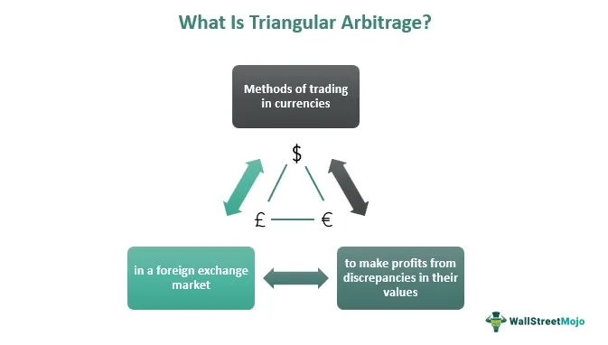

The financial markets are a dynamic and continuously evolving environment, offering both opportunities and challenges to investors. They are characterized by their complexity and the array of factors that influence them, including economic indicators, geopolitical events, and investor sentiment. Over recent years, the landscape of investment strategies has broadened significantly to incorporate innovative methods such as political arbitrage and algorithmic trading. These advanced strategies are transforming traditional investment paradigms by leveraging technology and strategic foresight to optimize market performance.

Political arbitrage represents a distinctive approach where investment decisions are based on anticipated political events and outcomes. This strategy takes advantage of market inefficiencies that often occur due to geopolitical shifts or changes in government policies. For instance, traders may speculate on the potential impacts of elections or policy announcements, thus positioning themselves to benefit from price movements resulting from these political developments.



Similarly, algorithmic trading, often referred to as 'algo trading', revolutionizes how trades are executed by using computer algorithms. These algorithms can process and analyze vast amounts of data at exceptional speeds, making trades based on pre-set criteria and quantitative models. This minimizes human intervention and emotion, which can often lead to inefficiencies in decision-making. Key elements in algorithmic trading include data input, algorithm analysis, and automated trade execution, all of which contribute to a more efficient trading process.

Both political arbitrage and algorithmic trading are reshaping the financial markets by introducing speed, precision, and the ability to manage large volumes of data. As these strategies continue to develop, they highlight the need for investors to stay informed and adapt to technological advancements and political changes. Mastering these innovative approaches can significantly impact market success by providing a competitive edge within the rapidly changing financial environment.

## Table of Contents

## Overview of Financial Market Investment Strategies

Investment strategies in financial markets encompass a broad spectrum, ranging from conventional methods like investing in stocks and bonds to more innovative approaches that leverage technology and data analysis. These strategies are crucial for directing capital towards opportunities that align with investor objectives and market conditions.

Traditional investment strategies, such as stocks and bonds, have long been the cornerstone of financial markets. Investing in stocks involves purchasing shares of companies, thereby acquiring a stake in their potential profitability and growth. Bonds, on the other hand, are fixed-income securities that entail lending money to an entity (such as a corporation or government) for a defined period at a fixed interest rate. Historically, these assets have provided a reliable pathway for investors seeking steady returns or preserving capital.

Recent advancements in technology have significantly broadened the toolkit available to investors and traders. Today, market participants use sophisticated platforms and tools that offer detailed analytics, real-time data processing, and automated trading capabilities. This technological proliferation allows investors to implement strategies that can adapt to rapidly changing market conditions and exploit short-term opportunities, thereby optimizing returns.

Among modern techniques, quantitative investment strategies have gained traction. These strategies utilize mathematical models and algorithms to make investment decisions based on statistical data. One common mathematical approach employed is mean-variance optimization, rooted in modern portfolio theory, which aims to select a portfolio with the best possible return for a given risk level. The formula used in mean-variance optimization is:

$$

\text{Minimize: } \sigma_p^2 = \sum_{i=1}^{n} \sum_{j=1}^{n} w_i w_j \sigma_{ij} 
$$

where $\sigma_p^2$ is the portfolio variance, $w_i$ and $w_j$ are the asset weights in the portfolio, and $\sigma_{ij}$ is the covariance between asset returns.

Furthermore, [algorithmic trading](/wiki/algorithmic-trading) represents a significant innovation. This involves using computer programs to execute trades automatically based on pre-set criteria. Algorithmic trading can capitalize on minute price discrepancies that are imperceptible to the human eye but present opportunities for financial gain.

In addition, diversification strategies remain crucial, reducing risk by allocating investments across various asset classes. A well-diversified portfolio can mitigate the impact of market [volatility](/wiki/volatility-trading-strategies) on investment performance. As financial instruments evolve, so do the strategies and tools available to traders and investors, highlighting the necessity for continuous learning and adaptation to thrive in the financial markets.

## Political Arbitrage: A Unique Approach

Political [arbitrage](/wiki/arbitrage) is an investment strategy that hinges on the anticipation of political events and their potential market outcomes. This approach is unique as it leverages geopolitical shifts and government policy changes to exploit market inefficiencies. Unlike traditional investment strategies that primarily focus on economic indicators, political arbitrage requires investors to possess a keen understanding of political dynamics and their far-reaching impact on market conditions.

One of the core principles of political arbitrage is the identification of market discrepancies before they are corrected by prevailing economic forces. As political events unfold, such as elections, referendums, or policy reforms, they can cause swift shifts in market sentiment. These shifts often create opportunities for astute investors who can predict the probable market reactions and adjust their portfolios accordingly.

To illustrate, consider the trading strategies revolving around elections. Political campaigns and election outcomes often lead to volatility in financial markets. For example, a candidate with a pro-business platform winning an election might lead to a surge in stock prices, particularly in specific sectors like finance or energy. Conversely, the election of a candidate advocating for strict regulations could adversely impact the same sectors. Traders engaged in political arbitrage closely monitor opinion polls, debates, and other indicators to gauge the likely outcome of an election and prepare their investment strategies.

Another example of political arbitrage in action is the response to policy announcements. Government declarations regarding fiscal policies, interest rates, and trade agreements can significantly influence market prices. Investors practicing political arbitrage aim to predict these announcements and position themselves advantageously in the market. For instance, anticipation of an [interest rate](/wiki/interest-rate-trading-strategies) cut by central banks might drive investors to invest in bonds or equities, expecting lower borrowing costs to spur economic growth.

Political arbitrage thus positions itself as a dynamic and intricate strategy that requires investors to stay informed and agile. By anticipating political developments and their economic ramifications, investors can seize the moment to capitalize on market opportunities that might otherwise go unnoticed. This approach signifies the intersection of political insight and financial acumen, offering a pathway to potential market success for those adept at navigating the complex web of political markets.

## Algorithmic Trading: Harnessing Technology

Algorithmic trading, often referred to as "algo trading," revolutionizes financial markets by employing computer algorithms to execute trades at high speeds and volumes. This trading methodology is designed to leverage technological advancements and data analysis, thereby facilitating informed trading decisions devoid of human emotions such as fear and greed. The following elements are essential to understanding the framework and function of algorithmic trading: data input, algorithm analysis, and trade execution.

### Data Input

The foundation of algorithmic trading is robust data collection, which includes historical data and real-time market information. This data encompasses asset prices, trade volumes, economic indicators, and news feeds. By analyzing historical data, algorithms can identify patterns and trends, which are vital for developing and [backtesting](/wiki/backtesting) trading strategies. Real-time data ensures that algorithms have the most current information to make trading decisions.

### Algorithm Analysis

Once the data is gathered, the next step is algorithm analysis. Algorithms are mathematical models that automate the trading process. These models can range from simple sets of rules based on technical indicators to complex predictive models incorporating statistical and [machine learning](/wiki/machine-learning) techniques. For example, moving averages, Bollinger Bands, and other technical indicators might be used in simpler algorithms, while more sophisticated models might apply linear regression, decision trees, or neural networks for pattern recognition and forecasting.

A typical example of an algorithm might involve a moving average crossover strategy, where a short-term moving average crossing above a long-term moving average triggers a buy signal, and the reverse condition prompts a sale. A simple Python implementation might look like this:

```python
def sma_crossover(prices, short_window, long_window):
    short_mavg = prices.rolling(window=short_window).mean()
    long_mavg = prices.rolling(window=long_window).mean()
    signal = (short_mavg > long_mavg).astype(int)  # 1 for buy, 0 for sell
    return signal
```

### Trade Execution

The final component of algorithmic trading is trade execution, whereby the trade orders generated by the algorithm are executed on the market. This process is often facilitated by direct market access (DMA) through trading platforms that allow the algorithm to communicate directly with the exchange. Trade execution must be rapid and precise to capitalize on the opportunities identified by the algorithm, making low latency infrastructure crucial in high-frequency trading environments.

Algorithmic traders often employ execution strategies like iceberg orders, which break up a large trade into smaller chunks to minimize market impact. Additionally, they might use sophisticated order types such as limit orders, stop-loss orders, and trailing stops to manage trades effectively.

In summary, algorithmic trading represents a synthesis of automated systems and quantitative analysis, enabling traders to operate with unparalleled speed and accuracy. As technology advances, efficient data processing and innovative models will continue to shape algorithmic trading strategies, making them indispensable tools for modern investors.

## Types of Algo Trading Strategies

Algorithmic trading strategies are diverse, designed to suit different market environments and investor goals. These strategies employ computer algorithms to automate trading, enabling swift and efficient decision-making while reducing human error. The core strategies include trend-following, mean reversion, [statistical arbitrage](/wiki/statistical-arbitrage), and high-frequency trading, each distinct in its approach and execution.

Trend-following strategies focus on capturing gains through the analysis of an asset's [momentum](/wiki/momentum) in a particular direction. This strategy is predicated on the belief that prices tend to continue in their current direction over time. Traders using this approach often rely on technical indicators such as moving averages. For example, a simple moving average (SMA) can be calculated using the formula:

$$
\text{SMA} = \frac{\sum_{i=1}^{n} P_i}{n}
$$

where $P_i$ is the price of the asset at time $i$, and $n$ is the number of time periods.

Mean reversion strategies assume that asset prices will return to their historical mean or average over time. This approach identifies securities that have deviated significantly from their average value and predicts a reversion to this mean. Mean reversion can be implemented by identifying z-scores of price data, where a high absolute z-score indicates a high likelihood of the asset returning to its mean. The z-score is calculated as:

$$
Z = \frac{X - \mu}{\sigma}
$$

where $X$ is the observation, $\mu$ is the mean of the distribution, and $\sigma$ is the standard deviation.

Statistical arbitrage strategies leverage statistical and econometric techniques to exploit pricing inefficiencies between related securities. This is achieved by maintaining positions in pairs or baskets of securities where price movements are expected to converge over time. A common technique involves using cointegration analysis to determine the relationship between securities.

High-frequency trading ([HFT](/wiki/high-frequency-trading-strategies)) is characterized by executing a large number of orders at extremely high speeds, often exploiting small price discrepancies. HFT requires sophisticated technology and infrastructure to achieve low-latency execution. Strategies in HFT often capitalize on bid-ask spreads or [volume](/wiki/volume-trading-strategy) analysis.

Each of these strategies involves algorithmic rules and criteria that guide trading processes, allowing traders to make decisions based on quantitative analysis rather than intuition. The development and optimization of these algorithms are crucial for achieving consistent profitability and adapting to changing market conditions.

## The Intersection of Political Arbitrage and Algo Trading

Political arbitrage and algorithmic trading, while distinct investment strategies, can work synergistically in a diversified investment portfolio. This intersection leverages the distinct strengths of each strategy to optimize trading decisions, particularly in response to political developments.

Algorithms significantly enhance political arbitrage by swiftly processing vast amounts of market data influenced by political news. Traditionally, political arbitrage involves predicting market movements based on geopolitical shifts or policy changes. However, the manual interpretation of these events can be labor-intensive and prone to delay. Algorithmic systems address these limitations by providing rapid data analysis and decision-making capabilities. For example, an algorithm can be designed to scan news feeds, social media, or government announcements for keywords related to impending policy changes or election outcomes. Upon detecting such triggers, the algorithm can evaluate related market impacts and execute trades within milliseconds, ensuring timely responses that might be missed by using conventional methods.

Investors gain significant benefits from the agility and precision that algo trading offers. Unlike human traders, algorithms operate without emotional bias, allowing for consistent decision-making under volatile conditions. For instance, political events often introduce market uncertainties. Algo trading systems can adapt to these fluctuations by continuously monitoring and assessing market conditions against a predetermined set of rules and criteria, thereby aligning trading strategies with current realities.

Python, with its robust libraries such as Pandas and Scikit-learn, provides an excellent platform for modeling and implementing these complex systems:

```python
import pandas as pd
from sklearn.ensemble import RandomForestClassifier

# Example pseudo-code for a political news sentiment model
def train_model(data):
    features = data[['policy_change_index', 'market_volatility', 'historical_reaction']]
    labels = data['market_movement']
    model = RandomForestClassifier()
    model.fit(features, labels)
    return model

def execute_trade(model, new_data):
    prediction = model.predict(new_data)
    if prediction == 1:  # Assuming 1 indicates a buy signal
        # Trigger buy orders
        pass
    elif prediction == -1:  # Assuming -1 indicates a sell signal
        # Trigger sell orders
        pass
```

This Python example illustrates a basic framework for using machine learning to predict market movements based on political events, which could be a component of a broader, more sophisticated trading strategy. The algorithm can be trained on historical data, incorporating indices such as policy change impacts, market volatility, and historical reactions, to optimize trading actions in response to new data.

By merging political arbitrage with algorithmic trading, investors can exploit the full potential of real-time data analysis and automated execution. This combination enables them to gain actionable insights swiftly, capitalize on fleeting opportunities, and thereby enhance overall portfolio performance even amidst the uncertainties introduced by political events.

## Advantages and Challenges of Advanced Trading Strategies

Advanced trading strategies such as political arbitrage and algorithmic trading offer notable benefits, including speed, efficiency, and the capability to process large data volumes swiftly. These advantages enable investors to make informed decisions rapidly, directly affecting investment performance and enhancing potential returns.

Political arbitrage leverages geopolitical events and policy shifts, exploiting market inefficiencies resulting from such occurrences. This requires an acute understanding of political landscapes and rapid adaptation to new information. On the other hand, algorithmic trading employs sophisticated computer algorithms capable of executing trades at high speed and volume, minimizing the human emotional [factor](/wiki/factor-investing), and optimizing decision-making processes. By automating trades, investors can capitalize on fleeting opportunities that human traders might miss.

Despite these advantages, significant challenges accompany advanced trading strategies. One primary concern is market volatility. Advanced strategies must navigate the ups and downs of the financial markets, which can be both rapid and unpredictable. This volatility necessitates systems that can quickly adapt to changing conditions, reducing the risks associated with sudden market shifts.

Additionally, regulatory concerns pose a challenge. As financial markets continue to evolve, so too does the regulatory framework that governs them. Investors must stay updated on changes in regulations that could impact their strategies. Failure to comply can result in legal repercussions and potential financial losses, making comprehensive regulatory understanding crucial.

The demand for sophisticated technology is another hurdle. Implementing advanced trading strategies often requires investments in technology infrastructure, including high-performance computing systems and advanced software for data analysis. Businesses must also consider cybersecurity measures to protect against breaches, which can lead to data loss or financial damage.

Finally, traders employing these strategies must be vigilant and adaptable. They must constantly monitor both market dynamics and technological advancements, ensuring strategies remain effective and compliant with current regulations. This involves continuous learning and adaptation, challenging traders to maintain their edge in an ever-evolving landscape.

In summary, while advanced trading strategies like political arbitrage and algorithmic trading offer substantial benefits in terms of speed and data processing, they also present challenges related to market volatility, regulatory frameworks, and technological demands. Successful traders must skillfully balance these elements to optimize their approach and achieve sustained success.

## Conclusion

The integration of advanced investment strategies, namely political arbitrage and algorithmic trading, is fundamentally transforming the financial markets. These innovative approaches enable investors to capitalize on market inefficiencies arising from geopolitical events and leverage technology for high-speed, data-driven trading. By understanding and effectively utilizing these strategies, investors have the potential to significantly enhance their market performance.

Political arbitrage exploits market movements resulting from political events, allowing investors to anticipate and react to policy changes, elections, and other geopolitical developments. Meanwhile, algorithmic trading harnesses computational power and sophisticated algorithms to execute trades with precision and speed, minimizing human error and emotional bias. The synergy of these strategies facilitates informed decision-making and timely execution, crucial for navigating the fast-paced and often volatile financial landscape.

As the financial environment continues to evolve, staying informed about these advanced technologies and strategies is critical for success. Continuous learning and adaptation are necessary to keep pace with regulatory changes, technological advancements, and emerging market trends. By integrating political insights with algorithmic efficiency, investors can position themselves advantageously in an increasingly competitive market. Embracing this integration not only enhances current investment outcomes but also prepares investors for future challenges and opportunities in the financial world.

## References & Further Reading

[1]: Bergstra, J., Bardenet, R., Bengio, Y., & Kégl, B. (2011). ["Algorithms for Hyper-Parameter Optimization."](https://dl.acm.org/doi/10.5555/2986459.2986743) Advances in Neural Information Processing Systems 24.

[2]: ["Advances in Financial Machine Learning"](https://www.amazon.com/Advances-Financial-Machine-Learning-Marcos/dp/1119482089) by Marcos Lopez de Prado

[3]: ["Evidence-Based Technical Analysis: Applying the Scientific Method and Statistical Inference to Trading Signals"](https://www.amazon.com/Evidence-Based-Technical-Analysis-Scientific-Statistical/dp/0470008741) by David Aronson

[4]: ["Machine Learning for Algorithmic Trading"](https://github.com/stefan-jansen/machine-learning-for-trading) by Stefan Jansen

[5]: ["Quantitative Trading: How to Build Your Own Algorithmic Trading Business"](https://www.amazon.com/Quantitative-Trading-Build-Algorithmic-Business/dp/1119800064) by Ernest P. Chan