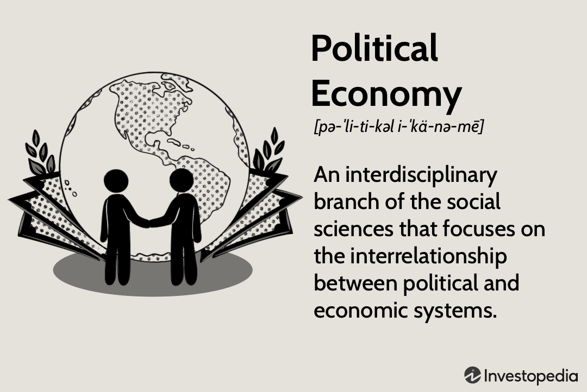

The intersection of economic applications, economic history, and political economy creates a rich tapestry for understanding the modern economic landscape. Each of these domains offers unique insights into how economies function, evolve, and interact with the political and social frameworks that govern them. Economic applications translate theoretical insights into practical tools and policies that directly impact individuals, businesses, and governments. Economic history provides the chronological framework to understand how past events and decisions have shaped current economic conditions and trends. Political economy studies the influence of political structures and processes on economic systems, revealing the interplay between economic policies and political forces.

With the rise of algorithmic trading, a new dimension adds complexity to economic interactions, making it essential to explore these areas comprehensively. Algorithmic trading represents a significant evolution in financial markets, leveraging advanced technologies and mathematical models to execute trades at unprecedented speed and volume. This approach has challenged traditional trading practices and prompted discussions on market efficiency, stability, and the role of human oversight. Understanding algorithmic trading requires not only a grasp of contemporary economic practices but also an appreciation of the historical shifts in trading mechanisms.



By exploring the historical context and current applications of political economy, the significance of economic history, and the evolution of algorithmic trading, we can build a comprehensive picture of the modern economic environment. These interconnected domains illuminate the multifaceted nature of economic interactions, offering valuable insights for investors seeking to maximize returns, policymakers aiming to design effective regulations, and academics studying the dynamics of economic systems.

Understanding these interconnected domains provides valuable insights for investors, policymakers, and academics alike. Investors can better navigate market complexities by considering how historical trends and political influences affect economic conditions. Policymakers benefit from historical awareness and political economic analysis to devise regulations that account for emerging technologies such as algorithmic trading. Academics, through interdisciplinary research, can uncover new theoretical insights and practical solutions to address ongoing and future economic challenges. Collectively, these perspectives ensure a robust and nuanced understanding of the global economic landscape.

## Table of Contents

## Historical Context of Economic Applications

Economic applications have undergone significant transformations over the centuries, deeply influenced by seminal economic theories and pivotal historical events. At the core of these developments are foundational economic ideas proposed by Adam Smith in his seminal work, "The Wealth of Nations," where he introduced the concept of the 'invisible hand' guiding free markets and the principle of specialization to enhance productivity and efficiency. Smith's ideas laid the groundwork for classical economics, shaping the development of capitalist economic systems. [1]

Following Smith, John Stuart Mill expanded upon classical economic theories, incorporating utilitarian principles to evaluate economic policies based on their ability to maximize happiness. His contributions catalyzed debates about individual liberty, property rights, and state intervention, elements that are crucial to modern economic practices and policy formulation. Mill's work serves as a bridge between classical and contemporary economic thought, emphasizing the need for economic systems that balance efficiency with social welfare.

Examining the evolution of economic systems, such as capitalism, socialism, and communism, provides invaluable insights into the complexities of modern economic phenomena. Capitalism, characterized by private ownership and market-driven approaches, has continuously adapted, integrating elements like Keynesian economics during downturns to stabilize economies through government intervention. In contrast, socialism and communism propose more centralized control over resources, advocating for equitable distribution to reduce class disparities. The historical shifts between these systems, driven by wars, revolutions, and ideological clashes, underscore the dynamic and context-dependent nature of economic structures. [2]

Moreover, the impact of historical economic policies continues to resonate in today's global economy, highlighting the importance of historical awareness for effective economic planning. For instance, the Great Depression spurred the development of macroeconomic policies and regulatory measures designed to prevent similar economic catastrophes. Likewise, the collapse of centrally planned economies in the late 20th century led to a widespread reassessment and reformulation of economic strategies worldwide, reinforcing the value of adaptive policy frameworks that reflect historical lessons.

Understanding the historical context of economic applications is imperative for comprehending current global economic dynamics. As economies become increasingly interconnected, historical awareness allows policymakers to craft informed, forward-looking policies that consider the lessons and successes of past economic practices.

References:
- [1] Smith, Adam. "An Inquiry into the Nature and Causes of the Wealth of Nations." 1776.
- [2] Heilbroner, Robert L. "The Worldly Philosophers: The Lives, Times, and Ideas of the Great Economic Thinkers." 1999.

## Political Economy: Theory and Practice

Political economy is a multifaceted discipline that integrates principles from economics, politics, and sociology to explore how institutions and political environments shape economic systems. It investigates the reciprocal relationship between economic policies and political structures, unveiling how each influences the other.

The development of political economy can be traced back to influential thinkers such as Antoine de Montchrestien, who coined the term "political economy" in the early 17th century, and Karl Marx, whose critical analysis of capitalism provided a foundation for understanding the socio-economic implications of political decisions. Montchrestien emphasized the role of the state in managing economic resources, while Marx's dialectical approach highlighted how economic forces and class struggles drive societal change.

Political economy primarily evaluates the influence of government policies on economic outcomes. This involves analyzing taxation, trade regulations, and fiscal policies to determine their effectiveness and fairness. Furthermore, political economy scrutinizes how political power and structures shape these policies. For instance, interest group lobbying and electoral considerations often play crucial roles in the formulation of economic policy.

In a globalized economy, the political economy of individual nations holds substantial sway over international economic relations. Trade agreements, tariffs, and regulatory standards in one country can reverberate throughout the global market. By understanding the political economy, one can discern how national policies impact cross-border trade and international economic cooperation.

The contemporary relevance of political economy lies in its ability to provide insights into current economic challenges and guide policymakers in crafting strategies that accommodate both economic efficiency and social welfare. By considering the historical context and current applications, political economy fosters a comprehensive understanding of the complex interplay between politics and economics, crucial for navigating modern economic landscapes.

## Algorithmic Trading: Modern Economic Application

Algorithmic trading revolutionizes financial markets through the automation of trade execution using complex algorithms. These algorithms, executed on computers, allow for trades to be completed at speeds and volumes unattainable by human traders. High-frequency trading ([HFT](/wiki/high-frequency-trading-strategies)), a subset of [algorithmic trading](/wiki/algorithmic-trading), leverages these capabilities to take advantage of minute price inefficiencies across markets, often holding positions for very short periods.

Relying heavily on sophisticated data analysis, algorithmic trading enhances market efficiency and [liquidity](/wiki/liquidity-risk-premium). Traders use large datasets and [machine learning](/wiki/machine-learning) models to predict price movements, identify trading opportunities, and minimize transaction costs. For example, algorithms can identify [arbitrage](/wiki/arbitrage) opportunities by simultaneously buying and selling equivalent assets in different markets to profit from price differences.

Algorithmic trading also contributes to market stability concerns and systemic risks. The rapid trading speeds can potentially exacerbate [volatility](/wiki/volatility-trading-strategies), as seen in incidents like the 2010 Flash Crash, where the Dow Jones Industrial Average dropped 1,000 points in mere minutes before rebounding. This raised alarms about the lack of control and oversight in algorithmic trading systems and their potential impact on market integrity.

Understanding algorithmic trading requires an appreciation of historical shifts in trading mechanisms, from open outcry systems to electronic exchanges. The introduction of decimalization in stock prices, for instance, reduced trading spreads and enhanced the viability of algorithmic strategies by allowing tighter control over trade execution.

Moreover, algorithmic trading platforms are built on advanced infrastructure capable of processing vast amounts of historical and real-time data. Traders often employ statistical techniques and [backtesting](/wiki/backtesting) methodologies to refine and optimize their trading algorithms. Python, a popular programming language in finance, is frequently used for building these algorithms due to its extensive libraries and ease of integration with data analysis tools.

```python
# Example Python code for a simple moving average crossover strategy
import pandas as pd

# Load historical price data into a DataFrame
data = pd.read_csv('price_data.csv')

# Calculate moving averages
data['SMA50'] = data['Close'].rolling(window=50).mean()
data['SMA200'] = data['Close'].rolling(window=200).mean()

# Generate buy/sell signals
data['Signal'] = 0
data['Signal'][50:] = np.where(data['SMA50'][50:] > data['SMA200'][50:], 1, 0)

# Calculate positions
data['Position'] = data['Signal'].diff()

# DataFrame containing signals and positions is ready for further analysis.
```

Algorithmic trading represents a significant evolution in trading mechanisms, offering both opportunities and challenges. Its integration of technology with trading strategies exemplifies modern economic applications, necessitating a comprehensive understanding of current market practices and evolving technological landscapes.

## Interconnections and Implications

The convergence of economic history, political economy, and algorithmic trading provides significant insights into the dynamics of the modern economy. By interpreting these interconnected fields, one can understand the complexities and anticipate the trends that shape global economic environments.

Algorithmic trading, driven by advancements in technology, embodies the contemporary evolution of trading mechanisms. It relies heavily on computational algorithms to execute high-speed trades, demonstrating efficiency and precision. Yet, its rise could introduce systemic risks and market instability concerns. Policymakers must assess these technologies within historical and economic frameworks to effectively regulate and mitigate potential threats while harnessing their benefits. Recognizing the historical progression of trading systems and the political influences shaping economic policy is crucial in framing these regulations.

Moreover, examining political economy provides a lens through which we can analyze how governmental decisions impact economic activities. Historical economic trends inform present-day policy-making, emphasizing how past decisions influence current trading environments. By utilizing statistical models and data analytics, scholars and economists can predict future economic trends. For instance, Python code can be employed for regression analysis, helping to project potential market fluctuations based on historical data:

```python
import pandas as pd
import numpy as np
from sklearn.model_selection import train_test_split
from sklearn.linear_model import LinearRegression

# Sample dataset with historical economic indicators
data = pd.DataFrame({
    'Economic Indicator': np.random.rand(100),
    'Market Performance': np.random.rand(100)
})

# Splitting the dataset
X = data[['Economic Indicator']]
y = data['Market Performance']
X_train, X_test, y_train, y_test = train_test_split(X, y, test_size=0.2, random_state=42)

# Linear regression model
model = LinearRegression()
model.fit(X_train, y_train)

# Predicting future market performance
predictions = model.predict(X_test)
```

Interdisciplinary approaches integrating economic history, political economy, and algorithmic trading offer holistic insights into global economic interactions. These perspectives enable economists to anticipate market challenges, craft informed policies, and navigate the intricacies of a rapidly evolving financial landscape. This comprehensive understanding supports robust decision-making, safeguarding the economy against unforeseen shifts and fostering sustainable development.

## Conclusion

The economic applications of historical context, political economy, and algorithmic trading collectively inform the complex dynamics of modern economic practices. These domains, when examined together, provide valuable insights into how past actions and theories shape present economic conditions and future possibilities. By integrating historical knowledge, the theoretical frameworks of political economy, and the technological advancements represented by algorithmic trading, we can more comprehensively understand economic phenomena.

The historical context acts as a guide, illuminating how previous economic systems, policies, and theories influence current economic structures. Political economy contributes an understanding of how political forces and institutional frameworks govern economic activities, ensuring that economic theories are grounded in real-world applications. Algorithmic trading showcases the forefront of economic interaction, where technology enhances the speed and efficiency of markets.

For investors, policymakers, and academics, increased understanding in these areas supports informed decision-making. Investors can better predict market trends by recognizing the interplay between economic policies and technological advancements. Policymakers are equipped to craft regulations that responsibly govern emerging technologies, maintaining market stability while encouraging innovation. Academics benefit from a comprehensive framework that merges historical analysis, political insight, and technical prowess to explore current and future economic landscapes.

Sustained research and holistic integration of economic history, political economy, and algorithmic trading are essential for navigating the continually evolving economic environment. Such an interdisciplinary approach not only enriches our comprehension of global economic interactions but also aids in anticipating challenges and opportunities in the future. As these fields converge, their collaborative potential will play a pivotal role in shaping the economic realities of tomorrow.

## References & Further Reading

[1]: Smith, Adam. ["An Inquiry into the Nature and Causes of the Wealth of Nations."](https://www.ibiblio.org/ml/libri/s/SmithA_WealthNations_p.pdf) 1776.

[2]: Heilbroner, Robert L. ["The Worldly Philosophers: The Lives, Times, and Ideas of the Great Economic Thinkers."](https://www.amazon.com/Worldly-Philosophers-Economic-Thinkers-Seventh/dp/068486214X) 1999.

[3]: Montchrestien, Antoine de. ["Treatise on Political Economy."](https://www.jstor.org/stable/23723694) Early 17th century contributions.

[4]: Marx, Karl. ["Capital: A Critique of Political Economy."](https://www.marxists.org/archive/marx/works/download/pdf/Capital-Volume-I.pdf) 1867.

[5]: Lopez de Prado, Marcos. ["Advances in Financial Machine Learning."](https://www.amazon.com/Advances-Financial-Machine-Learning-Marcos/dp/1119482089) February 2018.

[6]: Jansen, Stefan. ["Machine Learning for Algorithmic Trading."](https://github.com/stefan-jansen/machine-learning-for-trading) March 2020.

[7]: Chan, Ernest P. ["Quantitative Trading: How to Build Your Own Algorithmic Trading Business."](https://github.com/ftvision/quant_trading_echan_book) August 2008.

[8]: Aronson, David. ["Evidence-Based Technical Analysis: Applying the Scientific Method and Statistical Inference to Trading Signals."](https://www.amazon.com/Evidence-Based-Technical-Analysis-Scientific-Statistical/dp/0470008741) 2006.

[9]: Fabozzi, Frank J., Focardi, Sergio M., & Kolm, Petter N. ["Algorithmic and High-Frequency Trading."](https://books.google.com/books/about/Robust_Portfolio_Optimization_and_Manage.html?id=PUnRxEBIFb4C) December 2010. 

[10]: Hasbrouck, Joel. ["Empirical Market Microstructure: The Institutions, Economics, and Econometrics of Securities Trading."](https://academic.oup.com/book/52241) July 2007.