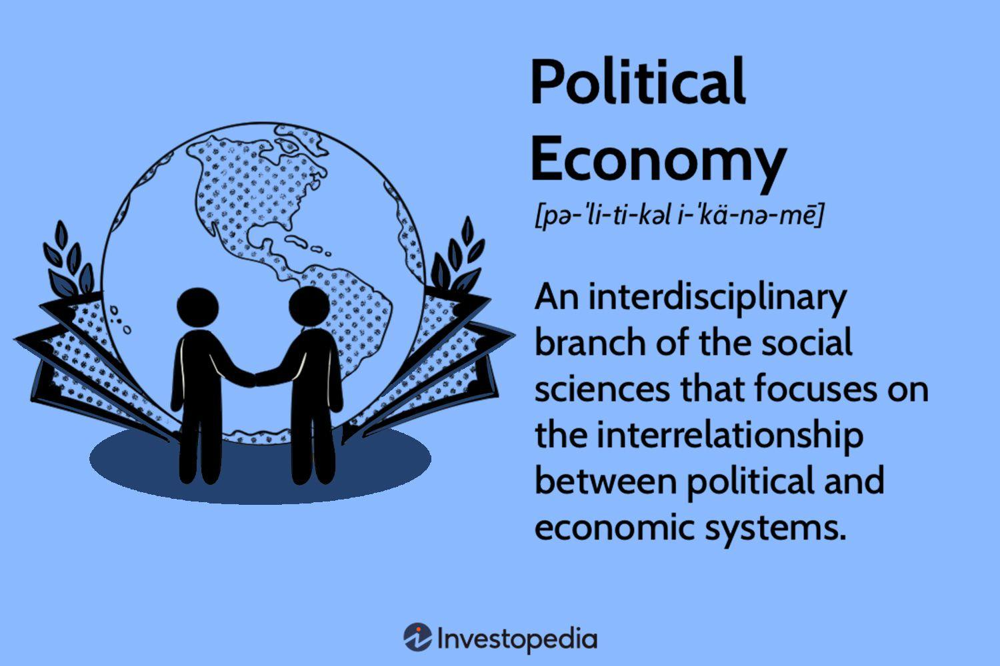

## Table of Contents

## What is political economy?

Political economy is a field that looks at how economics and politics work together. It studies how governments, laws, and political systems affect the way people produce, buy, and sell things. It also looks at how economic conditions can influence political decisions and policies. For example, a government might change its tax laws to help businesses grow, which can affect how people vote in elections.

This field is important because it helps us understand big issues like why some countries are rich and others are poor, or how trade between countries can lead to conflicts or cooperation. Political economy can be used to analyze different economic systems, like capitalism or socialism, and how they impact society. By studying political economy, we can better understand the world around us and make more informed decisions about economic and political policies.

## How does political economy differ from economics?

Political economy and economics both study how people use resources and make money, but they look at things a bit differently. Economics focuses on how people make choices about what to buy, sell, and produce. It uses math and models to understand things like prices, jobs, and how much stuff a country makes. Economists often try to find the best ways to make the economy grow and help people live better lives.

Political economy, on the other hand, looks at how politics and power affect the economy. It asks questions like, "How do government rules change the way businesses work?" or "How do rich people influence laws to make more money?" Political economy also thinks about fairness and how economic systems can help or hurt different groups of people. It's not just about numbers and models; it's about understanding the bigger picture of how society works.

So, while economics might tell you how to make the economy bigger, political economy will also tell you who benefits from that growth and how political decisions shape economic outcomes. Both fields are important, but they give us different pieces of the puzzle when we're trying to understand the world.

## What are the origins of political economy?

The origins of political economy go back to the 18th century. It started when people began to think about how countries could become richer and more powerful. One of the first big ideas was called "mercantilism," which said that a country should try to sell more things to other countries than it buys from them. This would help the country keep more gold and silver, which were seen as signs of wealth back then. But then, thinkers like Adam Smith came along and changed the way people thought about wealth. In his book "The Wealth of Nations," Smith argued that wealth comes from making things and trading them freely, not just from hoarding gold.

As time went on, political economy grew to include more ideas. In the 19th century, Karl Marx looked at how the economy was divided between workers and bosses. He thought that the way the economy worked was unfair to workers and could lead to big changes in society. Other thinkers like John Stuart Mill and David Ricardo also added to the field by talking about things like how much people should be paid and how trade between countries works. Over time, political economy became a way to understand not just how to make money, but also how power and politics shape the economy and affect people's lives.

## Who were the key figures in the early development of political economy?

The early development of political economy was shaped by several key figures. One of the most important was Adam Smith, who is often called the father of modern economics. In his book "The Wealth of Nations," published in 1776, Smith argued that wealth comes from making things and trading them freely. He believed that if people were allowed to follow their own interests, it would lead to a better economy for everyone. This idea, known as the "invisible hand," became very influential.

Another key figure was Karl Marx, who wrote in the 19th century. Marx looked at how the economy was divided between workers and bosses. He thought that the way the economy worked was unfair to workers and could lead to big changes in society. His ideas about class struggle and the problems with capitalism are still discussed today. Other important thinkers from this time include David Ricardo, who talked about how trade between countries works, and John Stuart Mill, who wrote about fairness and how much people should be paid. Together, these thinkers helped shape the field of political economy and how we understand the relationship between economics and politics.

## How has the focus of political economy evolved over time?

The focus of political economy has changed a lot since it started. In the beginning, in the 18th century, people like Adam Smith were mostly interested in how countries could get richer. They talked about things like trade and how to make more stuff. This was a time when ideas like free markets and the "invisible hand" were new and exciting. People wanted to understand how to make their countries wealthier and more powerful.

As time went on, the focus of political economy grew to include more than just making money. In the 19th century, thinkers like Karl Marx started looking at how the economy affected different groups of people. They talked about things like fairness and how workers were treated. This was a time when ideas about class struggle and the problems with capitalism became important. Political economy started to be about understanding how power and politics shape the economy and affect people's lives, not just about making the economy bigger.

Today, political economy still looks at these big questions. It tries to understand how government rules, laws, and political systems affect the economy. It also looks at how economic conditions can influence political decisions and policies. Political economy helps us see the bigger picture of how society works and how different economic systems, like capitalism or socialism, impact people. It's a way to understand the world around us and make better decisions about economic and political policies.

## What are the main schools of thought within political economy?

There are several main schools of thought within political economy. One of the oldest is classical political economy, which started with thinkers like Adam Smith and David Ricardo. They focused on how free markets and trade could make countries richer. They believed that if people were allowed to follow their own interests, it would lead to a better economy for everyone. This school of thought is all about understanding how to make the economy grow and how trade works between countries.

Another important school of thought is Marxism, which was developed by Karl Marx and Friedrich Engels. They looked at how the economy was divided between workers and bosses. They thought that the way the economy worked was unfair to workers and could lead to big changes in society. Marxism is about understanding class struggle and the problems with capitalism. It's a way to see how power and politics shape the economy and affect people's lives.

A more recent school of thought is institutional political economy, which focuses on how rules, laws, and organizations affect the economy. Thinkers in this school believe that understanding these institutions is key to understanding how the economy works. They look at things like government policies, business practices, and how different groups in society interact. Institutional political economy helps us see how the economy is shaped by more than just supply and demand—it's also about the rules and systems that people create.

## How does political economy apply to modern governance and policy-making?

Political economy plays a big role in modern governance and policy-making. It helps leaders understand how their decisions affect the economy and people's lives. For example, when a government makes new laws about taxes or trade, political economy can show how these laws might help or hurt different groups of people. It can also explain why some policies work well in one country but not in another. By using ideas from political economy, leaders can make better choices that help their country grow and make life better for everyone.

Political economy also helps us see how power and politics shape the economy. It looks at how rich people or big companies might influence laws to make more money. This can help governments make rules that are fair and stop powerful groups from taking advantage of others. By understanding these things, leaders can create policies that make the economy work better for everyone, not just a few. Political economy is a tool that helps modern governments make smart and fair decisions.

## What role does political economy play in understanding global trade and international relations?

Political economy helps us understand how countries trade with each other and how this affects their relationships. It looks at how rules and laws about trade can make countries richer or poorer. For example, if one country puts a tax on goods from another country, it might make things more expensive and cause problems between them. Political economy also shows how big companies and powerful countries can influence trade rules to get what they want. By studying these things, we can see why some countries work together and others fight over trade.

Political economy also helps us understand why some countries are friends and others are not. It looks at how economic power affects international relationships. For example, a rich country might use its money to help a poorer country, making them allies. But if two countries want the same resources, it might lead to tension or even war. Political economy helps us see how money and power shape the world and why countries act the way they do in global politics.

## How can political economy be used to analyze economic inequality?

Political economy helps us understand why some people have more money than others. It looks at how laws, government policies, and the way the economy works can make some people rich and others poor. For example, if the government gives big tax breaks to rich people, it can make the gap between rich and poor even bigger. Political economy also shows how powerful people or companies can influence laws to keep more money for themselves, which can lead to more inequality.

By studying political economy, we can see how different economic systems, like capitalism or socialism, affect inequality. In a capitalist system, where people can own businesses and make a lot of money, the rich might get richer while the poor stay poor. In a socialist system, where the government tries to share wealth more evenly, there might be less inequality. Political economy helps us understand these differences and think about how to make things fairer for everyone.

## What are some current debates and controversies within the field of political economy?

One big debate in political economy today is about how much the government should control the economy. Some people think that the government should stay out of the way and let businesses do what they want. They believe that this will make the economy grow faster and create more jobs. Others think that the government needs to step in to make things fair. They want the government to make rules that help poor people and stop rich people from getting too much power. This debate is important because it affects how we make laws and how we try to fix problems like inequality and unemployment.

Another big controversy is about globalization and trade. Some people say that free trade between countries is good because it helps businesses grow and gives people more choices when they buy things. They think that if countries work together, everyone can get richer. But others worry that free trade can hurt workers in rich countries and make poor countries even poorer. They want to put limits on trade to protect jobs and help poor people. This debate is important because it affects how countries work together and how they try to make their economies stronger.

## How do different methodologies in political economy affect research outcomes?

Different ways of studying political economy can change what researchers find out. Some people use numbers and math to look at things like how much money people make or how many jobs there are. This is called quantitative research. It can help us see big patterns and trends, but it might miss important details about why things happen. Other people use stories and interviews to understand how people feel about the economy and how laws affect their lives. This is called qualitative research. It can give us a deeper understanding of people's experiences, but it might be hard to say if these experiences are true for everyone.

Both ways of studying political economy are important, but they can lead to different results. For example, if you use numbers to study inequality, you might find out that rich people are getting richer and poor people are getting poorer. But if you talk to people and hear their stories, you might learn that some poor people feel like the system is unfair and they can't get ahead no matter how hard they try. By using both numbers and stories, researchers can get a fuller picture of what's going on in the economy and how to make things better for everyone.

## What are the future directions and potential new areas of study in political economy?

In the future, political economy might focus more on how technology changes the economy and politics. As more people use the internet and new tools like [artificial intelligence](/wiki/ai-artificial-intelligence), it can change how we work, buy things, and even vote. Political economy can help us understand how these changes affect different groups of people. For example, if robots start doing jobs that people used to do, it might make some people richer and others poorer. By studying these things, we can figure out how to make sure technology helps everyone and not just a few.

Another important area for political economy in the future is the environment. As the world faces problems like climate change and pollution, political economy can help us see how our laws and economic systems affect the planet. It can show us how to make rules that protect the environment while also helping the economy grow. For example, if a country makes laws to stop using dirty energy, it might cost money at first but could help the planet in the long run. By looking at these issues, political economy can help us find ways to have a healthy economy and a healthy planet at the same time.

## References & Further Reading

[1]: Smith, Adam. ["An Inquiry into the Nature and Causes of the Wealth of Nations."](https://www.ibiblio.org/ml/libri/s/SmithA_WealthNations_p.pdf) 1776.

[2]: Heilbroner, Robert L. ["The Worldly Philosophers: The Lives, Times, and Ideas of the Great Economic Thinkers."](https://www.amazon.com/Worldly-Philosophers-Economic-Thinkers-Seventh/dp/068486214X) 1999.

[3]: Montchrestien, Antoine de. ["Treatise on Political Economy."](https://www.jstor.org/stable/23723694) Early 17th century contributions.

[4]: Marx, Karl. ["Capital: A Critique of Political Economy."](https://www.marxists.org/archive/marx/works/download/pdf/Capital-Volume-I.pdf) 1867.

[5]: Lopez de Prado, Marcos. ["Advances in Financial Machine Learning."](https://www.amazon.com/Advances-Financial-Machine-Learning-Marcos/dp/1119482089) February 2018.

[6]: Jansen, Stefan. ["Machine Learning for Algorithmic Trading."](https://github.com/stefan-jansen/machine-learning-for-trading) March 2020.

[7]: Chan, Ernest P. ["Quantitative Trading: How to Build Your Own Algorithmic Trading Business."](https://github.com/ftvision/quant_trading_echan_book) August 2008.

[8]: Aronson, David. ["Evidence-Based Technical Analysis: Applying the Scientific Method and Statistical Inference to Trading Signals."](https://www.amazon.com/Evidence-Based-Technical-Analysis-Scientific-Statistical/dp/0470008741) 2006.

[9]: Fabozzi, Frank J., Focardi, Sergio M., & Kolm, Petter N. ["Algorithmic and High-Frequency Trading."](https://books.google.com/books/about/Robust_Portfolio_Optimization_and_Manage.html?id=PUnRxEBIFb4C) December 2010. 

[10]: Hasbrouck, Joel. ["Empirical Market Microstructure: The Institutions, Economics, and Econometrics of Securities Trading."](https://academic.oup.com/book/52241) July 2007.