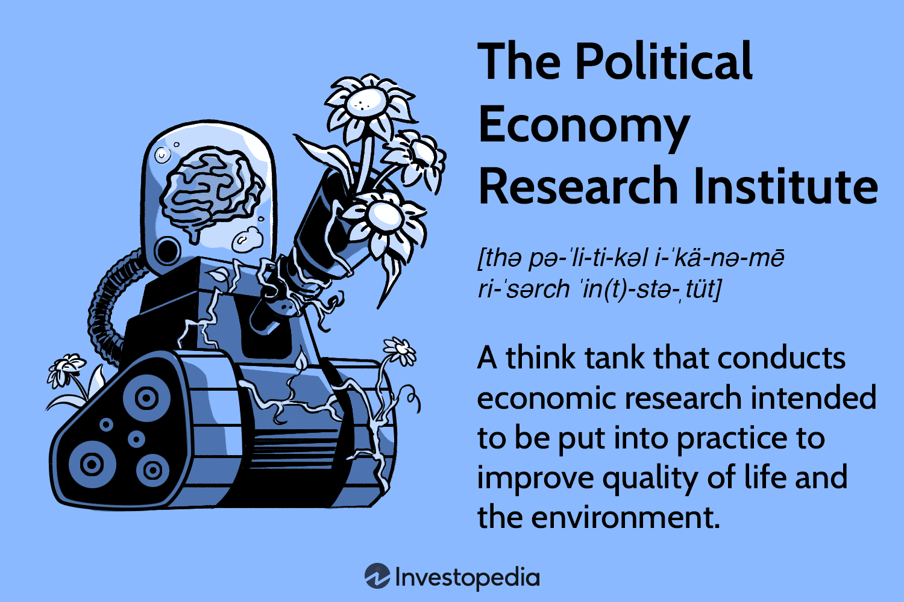

The intersection of political economy, economic policy, and algorithmic trading is a vibrant area of research and practice, sparking interest across academic, governmental, and financial sectors. This multifaceted domain explores how economic policies are crafted and implemented, how they affect the distribution of resources, and how algorithmic trading operates within these frameworks. Political economy examines the relationship between politics and economics, often focusing on how governmental policies impact economic behavior and thus influence market outcomes. By understanding these interrelationships, scholars and practitioners aim to optimize policy design and evaluate its effectiveness in real-world applications.

Research institutes play a pivotal role in broadening our understanding of these areas. They conduct rigorous analyses that inform both academia and policymakers, ultimately contributing to the advancement of knowledge in political economy and economic policy. These institutes also examine the implications of algorithmic trading, a method that utilizes computer algorithms to enact trades with remarkable speed and precision. As algorithmic trading becomes increasingly prevalent, it is crucial to understand its role within the political and economic landscape.

Algorithmic trading has significantly transformed trading practices within financial markets by enhancing efficiency and liquidity. However, its rise brings challenges, such as the need for updated regulatory frameworks to maintain market integrity. This article will discuss the intertwined nature of political economy, economic policy, and algorithmic trading, reflecting on the current research and potential future developments in these fields. Understanding these dynamic interactions is essential for devising economic strategies that uphold transparency, protect investors, and foster sustainable economic growth globally. By synthesizing insights from these distinct but interrelated areas, we aim to provide a comprehensive overview of how they collectively shape the modern economic landscape.

## Table of Contents

## Role of Research Institutes in Political Economy

Research institutes like the Political Economy Research Institute (PERI) play a pivotal role in shaping economic policies by providing comprehensive research and analysis. PERI is renowned for its progressive approach to research, influencing both public discourse and the formulation of policy proposals.

Among the core areas where PERI contributes significantly are economic inequalities, financial instability, and environmental policy. By focusing on these critical issues, research institutes can highlight disparities and propose effective solutions that aim for greater socio-economic welfare. For instance, studies on economic inequalities help uncover gaps in wealth distribution, allowing for targeted policy interventions that promote equality.

Financial instability is another crucial area of focus. Research institutes examine factors contributing to financial volatility and offer insights into stabilizing economic frameworks. They study past financial crises, model risk management strategies, and advise on regulatory changes needed to prevent future occurrences.

Environmental policy is equally essential, and institutions like PERI work on assessing the economic impacts of environmental practices. By evaluating corporate environmental footprints and publicizing data, such as the Toxic 100 list, these institutes push for policy changes that encourage sustainability and reduce environmental damage.

The integration of research with practical policy recommendations is central to these institutes' missions. Collaboration is a key strategy—institutes often partner with academia for theoretical insights, work with government bodies for policy implementation, and liaise with international organizations for global perspectives. This multi-faceted collaboration ensures that research not only stays relevant but also translates into actions that foster improved socio-economic conditions. 

In summary, research institutes serve as valuable torchbearers in political economy, bridging gaps between academic research, public policy, and practical implementation to drive sustainable development and equitable economic policies.

## Understanding Economic Policies

Economic policies have a profound influence on the political economy, primarily by determining how resources and wealth are allocated within a society. These policies are subdivided into two main categories: monetary policies and fiscal policies. 

Monetary policies are crucial for maintaining economic stability. These policies, implemented by central banks, regulate the money supply and interest rates to achieve macroeconomic objectives such as controlling inflation, consumption, growth, and [liquidity](/wiki/liquidity-risk-premium). For example, adjusting interest rates can influence inflation and employment levels, thereby affecting overall economic stability.

Fiscal policies, determined by the government, involve altering spending levels and tax rates to influence the economy. These policies are pivotal in stabilizing economies, especially during periods of recession or inflation. When the government adjusts its levels of spending and taxation, it can directly impact aggregate demand, subsequently influencing economic growth and employment levels. For instance, expansionary fiscal policy, which includes increasing government spending and decreasing taxes, can spur economic growth but might lead to higher inflation if not managed correctly.

Research conducted by institutions focuses on how these economic policies impact growth and address inequalities. Institutions like the World Bank, International Monetary Fund (IMF), and various national think tanks research these aspects to offer insights and recommendations. Their studies often indicate that effective monetary and fiscal policies can promote equitable economic growth, while ineffective policies can exacerbate inequalities. For instance, wealth distribution can be influenced by tax policies; progressive tax rates can help mitigate economic inequalities by taxing higher incomes at higher rates.

Moreover, institutions study the economic conditions of developing countries to provide tailored policy insights. Developing nations often face unique challenges, such as higher levels of debt, inflation, and unemployment. Researchers analyze such conditions to suggest policy frameworks that can foster sustainable growth. These tailored policies aim to balance growth objectives with social welfare considerations, ensuring that economic advancement does not come at the cost of environmental or social degradation.

The ultimate goal of these endeavors is to inform public policies that are aligned with sustainable and equitable economic growth. By understanding and modifying economic policies in accordance with research findings, it is possible to achieve a balance between economic development and social equity. This entails designing policies that not only spur economic activities but also address socio-economic disparities, thereby promoting a more equitable distribution of resources and wealth across different sections of society. 

In conclusion, economic policies play a key role in shaping the political economy, influencing everything from wealth distribution to economic stability. Studies and expertise provided by research institutions are invaluable in crafting policies that aim to achieve sustainable and equitable growth. Through rigorous analysis and informed recommendations, these institutions help steer policy decisions towards fostering a more balanced and resilient global economy.

## Algorithmic Trading and Economic Policy

Algorithmic trading is a form of trading that uses computer algorithms to execute trades at speeds and frequencies beyond human capability. This technology has revolutionized trading practices within financial markets by significantly enhancing efficiency and liquidity. With the advent of [algorithmic trading](/wiki/algorithmic-trading), transactions that once took minutes or even hours can now be completed in milliseconds. This rapid execution reduces transaction costs and allows for more precise market timing, which can lead to enhanced profits.

One of the primary areas of research in algorithmic trading is its interaction with economic policies and market regulations. Researchers and policy analysts investigate how trading algorithms affect broader market dynamics and the implications for regulatory frameworks. These studies often focus on high-frequency trading ([HFT](/wiki/high-frequency-trading-strategies)), a subset of algorithmic trading characterized by high-speed order execution. HFT has been linked to increased market [volatility](/wiki/volatility-trading-strategies) and occasionally destabilizing market events, such as the "Flash Crash" of 2010 when the Dow Jones Industrial Average plummeted and recovered within minutes.

Research institutes and regulatory bodies are striving to understand and mitigate the risks associated with algorithmic and high-frequency trading. They assess these trades' impact on market stability and investor protection to ensure that markets remain fair and transparent. One primary concern is that HFT could provide an unfair advantage to traders with superior technology, undermining market integrity.

To address these issues, there's a concerted effort to develop regulatory measures that strike a balance between fostering innovation and maintaining market safeguards. Regulatory proposals include the implementation of circuit breakers to curb excessive volatility, mandatory disclosures of algorithmic strategies to watchdog agencies, and minimum resting times for orders to prevent rapid-fire trading practices that could lead to market instability.

An example of a regulatory response can be illustrated with the European Union's Markets in Financial Instruments Directive II (MiFID II), which introduces stricter controls and transparency requirements for algorithmic trading. Similarly, in the United States, the Securities and Exchange Commission (SEC) has focused on formulating rules that require trading venues to impose risk controls for automated trading systems.

In conclusion, while algorithmic trading offers significant advancements in market efficiency and liquidity, it presents unique regulatory challenges that require careful consideration and proactive management to uphold the integrity and resilience of financial markets.

## Case Studies and Practical Applications

The examination of economic research and algorithmic trading offers significant insights into policy decision-making processes. A prominent example is the work of the Political Economy Research Institute (PERI), which has significantly contributed to environmental policy through initiatives like the Toxic 100 list. This list ranks corporations by their pollution levels, providing a transparent way of assessing corporate environmental performance. By identifying major polluters, PERI's research has informed policy shifts towards reducing environmental degradation and promoting sustainable corporate behavior. This approach has encouraged regulatory bodies to enforce stricter environmental standards and drive changes in corporate practices to minimize ecological impact.

In Nigeria, the application of algorithmic methodologies demonstrates another practical use of economic research in policymaking. The country faces numerous socio-economic challenges, such as governance inefficiencies and economic disparities. By integrating algorithmic trading techniques with economic policy formulation, Nigerian policymakers are exploring innovative solutions to these issues. For instance, algorithm-driven data analysis can optimize resource allocation, enhance financial transparency, and improve decision-making processes. The use of these methodologies in governance could lead to more efficient management of public resources and better socio-economic outcomes.

These examples underscore the transformative potential of integrating rigorous research with policy-making. By leveraging data-driven insights and algorithmic tools, policymakers can develop policies that are evidence-based, efficient, and effective in addressing complex economic challenges. The real-world impact of such integration highlights the importance of continued collaboration between research institutes, policymakers, and the financial industry to foster sustainable and equitable policy developments.

## Conclusion

Research institutes are pivotal in bridging political economy and economic policy. Their work, firmly rooted in robust theoretical frameworks, significantly influences real-world policy transformations. By conducting critical analyses and offering evidence-based recommendations, these institutes ensure that economic strategies are not only theoretically sound but also practically viable.

Incorporating algorithmic trading into economic strategies is increasingly important. Algorithmic trading, with its ability to process massive datasets and execute trades with precision, offers a transformative lens through which market dynamics and economic policies can be understood and optimized. By understanding its role and impact, policymakers and researchers can develop strategies that balance innovation with market stability and fairness.

Future research should prioritize leveraging technological advancements for sustainable economic growth. This involves exploring innovative approaches that integrate cutting-edge technologies with economic theories and policy formations. By doing so, economies can be steered towards paths that are both prosperous and resilient, aligning with long-term sustainability goals.

Collaboration is key. Effective partnerships among research institutions, policymakers, and industry stakeholders are essential to tackle complex global economic challenges. Such collaboration fosters a comprehensive understanding of diverse economic phenomena and ensures that insights are translated into policies that promote global welfare and stability. By working together, these entities can create robust frameworks that address the multifaceted dynamics of the global economy.

## References & Further Reading

[1]: Montfort, K. (2016). ["The Political Economy of Algorithmic Trading"](https://www.tandfonline.com/doi/full/10.1080/03085147.2018.1528076). Cambridge University Press.

[2]: Lopez de Prado, M. (2018). ["Advances in Financial Machine Learning"](https://www.amazon.com/Advances-Financial-Machine-Learning-Marcos/dp/1119482089). Wiley.

[3]: Aronson, D. R. (2007). ["Evidence-Based Technical Analysis: Applying the Scientific Method and Statistical Inference to Trading Signals"](https://onlinelibrary.wiley.com/doi/book/10.1002/9781118268315). Wiley.

[4]: Vayanos, D., & Woolley, P. (2013). ["An Institutional Theory of Momentum and Reversal."](https://personal.lse.ac.uk/vayanos/Papers/ITMR_RFS13.pdf) The Review of Financial Studies, 26(5), 1087-1145.

[5]: Jansen, S. (2020). ["Machine Learning for Algorithmic Trading, 2nd Edition"](https://github.com/stefan-jansen/machine-learning-for-trading). Packt Publishing.

[6]: Chan, E. P. (2009). ["Quantitative Trading: How to Build Your Own Algorithmic Trading Business"](https://github.com/ftvision/quant_trading_echan_book). Wiley.

[7]: An Introduction to High-Frequency Finance by Ramazan Gençay, Michel Dacorogna, Ulrich A. Müller, Richard B. Olsen, and Olivier Pictet

[8]: MacKenzie, D. (2018). ["Material Signals: A Historical Sociology of High-Frequency Trading"](https://www.sps.ed.ac.uk/sites/default/files/assets/pdf/material-signals.pdf). European Journal of Sociology, 59(3), 359-391.