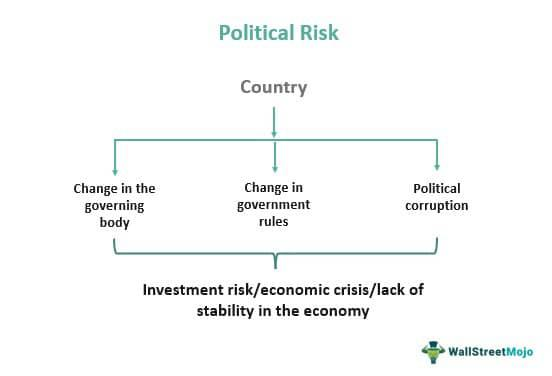

In the rapidly evolving world of finance, understanding risk remains a pivotal concern for investors and traders. As markets become increasingly interconnected, the nature of risk has expanded beyond traditional economic and financial factors to include political and geopolitical dimensions. Political risks stem from changes in government policies, regulatory environments, or outright political instability within a country. These risks have the potential to markedly influence market sentiment and financial stability. Geopolitical risks, on the other hand, encompass a broader array of international considerations, including diplomatic relations, military conflicts, and global trade dynamics, each carrying the potential to disrupt financial markets on a global scale.

This article examines how political risk, geopolitical analysis, and algorithmic trading intersect. Investors and traders today leverage complex models and data analytics to assess these risks, which have become integral to sophisticated financial strategies. Algorithmic trading, which utilizes computer programs to execute trades based on pre-determined criteria, increasingly incorporates geopolitical data and analytical methods to anticipate and respond to shifts in the political landscape.



As the challenges posed by political and geopolitical risks increase, traders employ a variety of strategies to mitigate potential losses. These strategies often involve integrating both qualitative assessments and quantitative data to form comprehensive risk management frameworks. By understanding how political instability and geopolitical tensions influence market dynamics, traders aim to enhance the resilience of their portfolios and optimize their investment decisions amidst uncertainty. Thus, navigating political and geopolitical risks has become essential for maintaining competitive advantage and achieving sustained financial performance in today's complex global markets.

## Table of Contents

## Understanding Political and Geopolitical Risks

Political risk encompasses the potential for financial losses or reduced investment value resulting from political decisions, actions, or events. These could stem from governmental changes, instability, regulatory shifts, or policy modifications that alter the economic or business landscape. For investors and businesses, political risk is significant, as it can lead to sudden and unpredictable changes in a country's investment climate. Countries often presenting political risk include those with volatile governments, ongoing conflicts, or fluctuating political environments.

Geopolitical risk extends beyond the borders of individual nations, involving the complex interplay of international relations, power dynamics, and conflicts that cross national boundaries. This type of risk often arises from geopolitical tensions, military conflicts, trade disputes, or diplomatic disagreements between countries. Such events can have a profound impact on global financial markets, affecting trade flows, commodity prices, and investor confidence across the world. For example, geopolitical tensions in the Middle East often lead to fluctuations in global oil prices due to the region's critical role in energy supply.

Both political and geopolitical risks are crucial considerations for long-term investments, particularly in regions marked by volatility or political uncertainty. Investors must carefully assess the risk-reward balance when investing in such areas. They may require comprehensive evaluation methods, including political risk insurance, diversification strategies, or in-depth geopolitical analysis to mitigate potential adverse impacts.

Incorporating these risks into investment strategies often involves quantitative and qualitative analyses, including studying historical data, monitoring current events, and understanding the political and economic context of investment regions. Additionally, advancements in technology and data analytics enable more sophisticated risk assessment models, allowing investors to better anticipate potential disruptions from political or geopolitical events.

## The Impact of Political Risks on Markets

Political stability is a cornerstone of a healthy economic environment. When political stability is threatened, markets can quickly become volatile. This [volatility](/wiki/volatility-trading-strategies) often affects various asset classes, including currencies, commodities, and equities, as investors respond to shifts in the political landscape.

Political risk, defined as the uncertainty and potential financial loss stemming from changes in government, legislative measures, or social unrest, can have far-reaching effects. For instance, when a country undergoes election cycles, experiences policy shifts, or faces civil unrest, these uncertainties can drive speculative trading, thus causing significant swings in currency values. For example, a controversial election outcome or unexpected policy change can lead to depreciation of a national currency as foreign investors adjust their positions to hedge against potential losses.

Commodities, which are widely traded on global markets, are also susceptible to political instability. Consider the scenario where a major oil-producing nation undergoes political turmoil. This instability can disrupt oil supply chains, causing a surge in prices as buyers scramble to secure their future supply under uncertain conditions. The law of supply and demand plays a critical role here: when supply is constricted, prices generally rise, leading to increased volatility across all markets that depend on oil as an input.

Equities, or stocks, are particularly sensitive to political signals because company valuations often rely on the expected stability of the business environment. Social unrest or unfavorably perceived government regulations can depress stock markets, as investors may fear negative impacts on corporate profits. Regulatory changes, such as stricter environmental standards or labor laws, can increase operational costs for companies, reducing their profitability and, consequently, their stock value.

Notable examples of political risk impacts include the US-China trade war and Brexit. The US-China trade war, characterized by retaliatory tariffs and negotiations fraught with tension, introduced uncertainty and fear in the global markets. Many multinational companies reliant on international trade faced disrupted supply chains and increased costs, leading to fluctuations in their stock prices.

Similarly, Brexit—Britain's [exit](/wiki/exit-strategy) from the European Union—triggered extensive market disruption. The uncertain future of trade agreements, regulatory frameworks, and financial services between the UK and EU led to volatility in the British pound's value and significant adjustments in stock market indices. These changes illustrated the impact political decisions could have on investor confidence and market dynamics.

In conclusion, political risks have profound impacts on market stability and investor behavior. By understanding the mechanisms through which political events influence financial markets, investors and traders can better manage and anticipate market reactions driven by political changes.

## Geopolitical Analysis in Algorithmic Trading

Geopolitical analysis plays a critical role in [algorithmic trading](/wiki/algorithmic-trading) by evaluating how global events may influence financial markets. This form of analysis is essential for developing trading models that can adapt to the complex and often volatile nature of global events. Incorporating geopolitical information into trading strategies allows traders to anticipate and respond to market movements that arise from political developments.

To understand and quantify geopolitical risks, traders utilize both qualitative and quantitative methods. Qualitative analysis involves the systematic collection and interpretation of non-numerical data, such as news reports, expert opinions, and geopolitical forecasts. This method allows traders to grasp the context and potential implications of specific events, such as elections, policy changes, or international conflicts.

On the quantitative side, traders employ statistical and computational techniques to model and predict market reactions. Techniques such as sentiment analysis, which assesses the mood of public discourse on social media or news outlets, provide valuable insights into market sentiments. Predictive modeling leverages [machine learning](/wiki/machine-learning) algorithms to analyze historical data and forecast the impact of geopolitical events on asset prices.

Mathematical models, such as the GARCH (Generalized Autoregressive Conditional Heteroskedasticity) model, are also used to assess the volatility of financial instruments in response to political events. By adapting models to account for geopolitical factors, traders can enhance the accuracy of their predictions.

Moreover, traders often use Python programming to implement complex trading algorithms that integrate geopolitical risk assessments. Python's extensive libraries, such as Pandas for data manipulation and Scikit-learn for machine learning, allow for efficient data processing and model training. A typical Python script for analyzing geopolitical risk data might involve fetching news data, performing sentiment analysis, and adjusting trading positions based on the predicted impact.

For example, a simplified Python script might look like this:

```python
import pandas as pd
from textblob import TextBlob
from sklearn.linear_model import LinearRegression

# Load historical news data
news_data = pd.read_csv('news_headlines.csv')

# Sentiment analysis of headlines
news_data['sentiment'] = news_data['headline'].apply(lambda x: TextBlob(x).sentiment.polarity)

# Use sentiment as a feature to predict stock price movement
X = news_data['sentiment'].values.reshape(-1, 1)
Y = news_data['stock_movement'].values

# Train a linear regression model
model = LinearRegression().fit(X, Y)

# Predict future stock movements based on new sentiment
new_sentiment = [[0.1]]  # Example sentiment input
predicted_movement = model.predict(new_sentiment)

print("Predicted stock movement:", predicted_movement)
```

This integration of geopolitical analysis into algorithmic trading empowers traders to better navigate the uncertainties stemming from political events, thereby enhancing the resilience and effectiveness of their trading strategies.

## Incorporating Political Risk in Algo Trading Strategies

Incorporating political risk into algorithmic trading strategies involves integrating risk factors from geopolitical events to enable dynamic adjustments. This integration allows traders to navigate unpredictable market conditions that arise due to political uncertainties or conflicts. Traders typically employ a combination of hedging strategies and diversification to cushion their portfolios from potential adverse political developments.

### Hedging and Diversification

Hedging strategies involve using financial instruments or market strategies to offset potential losses in investments. Common hedging instruments include options and futures contracts. For instance, an investor anticipating potential currency devaluation due to political instability might use currency futures to mitigate risk. Diversification, on the other hand, involves spreading investments across various financial instruments, industries, or geographical regions to reduce exposure to volatile political environments. By ensuring that a portfolio is not overly reliant on any particular market or asset, traders can better protect themselves against region-specific political disruptions.

### Sentiment Analysis and Predictive Modeling

Tools like sentiment analysis and predictive modeling are instrumental in anticipating market reactions to political events. Sentiment analysis involves parsing social media, news articles, and other textual data sources to gauge public opinion or sentiment on certain political events. This technique relies heavily on natural language processing (NLP) algorithms to quantify sentiment, which can then be used to inform trading decisions.

A basic sentiment analysis in Python could look like this:

```python
from textblob import TextBlob

def get_sentiment(text):
    analysis = TextBlob(text)
    return analysis.sentiment.polarity

# Example usage:
news_headline = "Tensions rise as new tariffs are announced"
sentiment_score = get_sentiment(news_headline)

if sentiment_score < 0:
    print("Market sentiment is negative. Consider hedging positions.")
else:
    print("Market sentiment is neutral or positive.")
```

Predictive modeling involves using statistical and machine learning models to forecast the impact of geopolitical events on market prices. These models can incorporate historical data, market indicators, and geopolitical event data to predict how similar events might influence future market behavior.

A simple linear regression model to predict market reactions could be implemented as follows:

```python
import numpy as np
from sklearn.linear_model import LinearRegression

# Sample data
X = np.array([[1], [2], [3], [4]])  # Geopolitical risk scores
y = np.array([10, 12, 15, 18])     # Market impact scores

# Create and train a linear regression model
model = LinearRegression()
model.fit(X, y)

# Predict the market impact of a new geopolitical event
new_event = np.array([[5]])
predicted_impact = model.predict(new_event)

print(f"Predicted market impact: {predicted_impact[0]}")
```

Incorporating these elements into algorithmic trading strategies allows traders to anticipate shifts in market sentiment and adjust their strategies dynamically. By employing these methods, traders can enhance the robustness of their trading models, ensuring that they are better equipped to handle the complexities of a politically volatile global market.

## Challenges and Limitations

Geopolitical events present a unique set of challenges to traders and investors, primarily due to their inherent unpredictability. Forecasting such events with precision is complicated as they are often driven by complex and rapidly evolving political dynamics that are difficult to quantify. The unpredictable nature of these events stems from the multitude of actors involved—governments, political leaders, multinational organizations—and the diverse interests they represent. These factors create a level of uncertainty that is hard to predict accurately through conventional models.

The complexity of geopolitical risks arises from the interconnectedness of economic, social, and political factors. For instance, a political decision in one country can have ripple effects across global markets, influencing trade relations, currency valuations, and commodity prices. The volatility introduced by such situations requires traders to consider various factors that may not have direct correlations but can collectively influence market conditions. Quantifying these influences involves sophisticated modeling techniques that incorporate both historical data and real-time inputs—an endeavor that is often fraught with challenges given the erratic nature of geopolitical developments.

One of the critical hurdles in effectively analyzing geopolitical risks is the limited availability of reliable real-time data. Up-to-date information is crucial for making informed decisions, especially in fast-paced trading environments where delays can lead to significant financial losses. However, accessing high-quality data in real time is a challenge, particularly from regions with restricted information flow or where data dissemination is tightly controlled by authorities. This lack of reliable data often results in a reliance on secondary sources or delayed reports, which may not provide the necessary depth or accuracy needed for robust risk assessment.

Moreover, even with access to real-time data, the sheer [volume](/wiki/volume-trading-strategy) of information can be overwhelming. Traders must filter through vast amounts of news, social media updates, and official statements, identifying what is pertinent and discarding noise. This requires sophisticated algorithms capable of performing sentiment analysis and predictive modeling to forecast potential market reactions. However, these algorithms are not infallible and can misinterpret information or fail to detect subtle nuances that might affect market outcomes.

In summary, the unpredictable nature, complex interplay of factors, and challenges in accessing reliable real-time data make geopolitical risk assessment a formidable task in algorithmic trading. Despite advances in technology and modeling techniques, traders must navigate these uncertainties skillfully to manage risk effectively.

## Conclusion

Geopolitical risk analysis is an essential component of algorithmic trading, providing the means to navigate the complex and often unpredictable landscape of global financial markets. By carefully integrating qualitative and quantitative methods, traders can enhance their ability to anticipate and respond to the uncertainties posed by political and geopolitical events.

Qualitative analysis involves the careful examination of geopolitical events, trends, and scenarios, such as elections, conflicts, or policy changes, which may impact market dynamics. Traders assess the potential implications of these events, taking into account historical precedents and expert opinions. This nuanced understanding allows traders to make informed assumptions about how market participants might react under different geopolitical conditions.

Quantitative analysis, on the other hand, relies on statistical and mathematical models to quantify the potential impact of geopolitical risks. These models can incorporate various datasets, such as historical price movements, macroeconomic indicators, and sentiment analysis, to forecast potential market reactions. Machine learning algorithms can be employed to identify patterns and correlations that may not be immediately evident through traditional analysis.

For example, sentiment analysis tools can process vast amounts of news articles, social media posts, and other text data to gauge the market's mood regarding specific geopolitical events. This data can be fed into predictive models that estimate the likelihood of market shifts. By using such tools, traders can adjust their strategies dynamically, minimizing potential losses and optimizing returns.

Furthermore, traders adopt hedging strategies and diversify their portfolios to mitigate risks associated with geopolitical uncertainty. Diversification across asset classes, geographies, and sectors can help cushion against localized political or geopolitical disruptions. Additionally, hedging instruments, such as options and futures, provide mechanisms to manage risk exposure effectively.

Understanding and mitigating political risks through meticulous analysis and strategic diversification enhance the robustness of algorithmic trading strategies. In an ever-evolving global landscape, the ability to incorporate these insights into trading decisions is a crucial advantage. This holistic approach enables traders to maintain stability and achieve consistent performance, even when faced with the unpredictability of international political developments.

## References & Further Reading

[1]: Bremmer, I. (2006). ["The J Curve: A New Way to Understand Why Nations Rise and Fall."](https://en.wikipedia.org/wiki/The_J_Curve) Simon & Schuster.

[2]: Bremmer, I., & Keat, P. (2009). ["The Fat Tail: The Power of Political Knowledge for Strategic Investing."](https://academic.oup.com/book/52210) Oxford University Press.

[3]: Geopolitical Risk and Markets Research Papers, ["Goldman Sachs Global Market Institute"](https://www.goldmansachs.com/pdfs/insights/pages/growth-and-geopolitical-risk-f/report.pdf).

[4]: Sethi, A. (2021). ["Geopolitical Risk and International Security: Considering Leadership in the Age of AI"](https://www.youtube.com/watch?v=UY3tj4qyNTU) International Journal.

[5]: Financial Times, ["Geopolitical Analysis in Financial Markets"](https://www.ft.com/geopolitics).