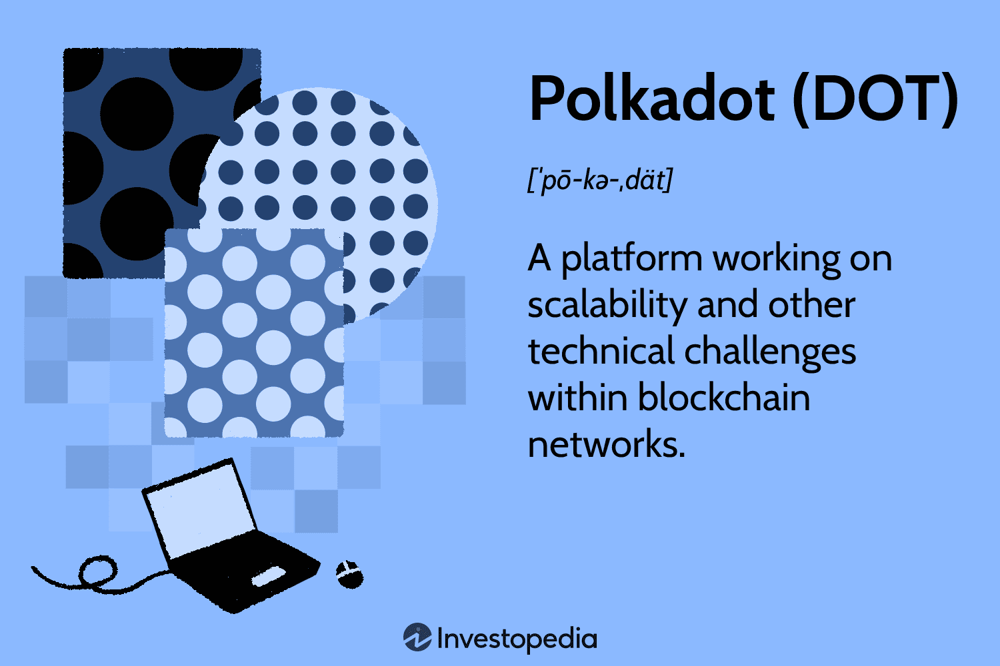

Polkadot, introduced in 2020 by Dr. Gavin Wood, marks a significant advancement in blockchain technology. It offers a scalable and interoperable platform designed for building and deploying decentralized applications (dApps) and blockchain networks. The innovative architecture of Polkadot addresses critical challenges in the blockchain ecosystem, namely scalability, security, and governance. Among its key contributions is the pioneering of multi-chain architectures, which enable seamless communication and interaction between diverse blockchains. This capability allows for a dynamic exchange of data and value across different blockchain networks without the need for intermediaries or centralized control.

Polkadot's unique structure consists of a relay chain that manages the network's consensus and a series of parachains that support specialized use-cases with independent functionalities. This multichain setup not only increases transaction throughput but also facilitates cross-chain interoperability, ensuring that decentralized applications can scale efficiently while maintaining high resilience to security threats. Additionally, Polkadot employs a sophisticated governance model, empowering token holders to participate in decision-making processes, propose network upgrades, and vote on critical changes. As the blockchain landscape evolves, Polkadot stands out with its focus on technological and operational advancements, particularly in algorithmic trading, a domain where its scalable infrastructure holds significant potential.



## Table of Contents

## Understanding Polkadot (DOT)

Polkadot is a groundbreaking blockchain platform that facilitates the connection and communication between various blockchain networks. At its core, Polkadot employs a unique multichain architecture comprising three main components: the relay chain, parachains, and bridges. 

The **relay chain** is the central component of Polkadot's architecture. It is primarily responsible for the network's shared security, consensus, and cross-chain interoperability. By managing these essential functions, the relay chain ensures that all connected blockchains, known as parachains, can operate efficiently and securely.

**Parachains** are individual blockchains that attach to the relay chain. Each parachain can be custom-tailored to serve specific use cases, whether they are transactions, smart contracts, or other decentralized applications. This customizability allows developers to optimize their parachain for particular functionalities or industries. By operating in parallel, these parachains enable Polkadot to conduct multiple transactions simultaneously, substantially increasing the network's throughput and efficiency.

**Bridges** extend Polkadot's interoperability to external blockchain networks, such as Ethereum or Bitcoin. Through these bridges, Polkadot enables cross-chain communication and interaction, allowing assets and information to flow seamlessly across different blockchain ecosystems.

A notable aspect of Polkadot is its focus on parallel processing, which is facilitated by its multichain framework. This capability is essential for achieving high scalability, as it allows multiple blockchain tasks to be processed at the same time, reducing the bottlenecks common in traditional single-chain architectures.

Polkadot employs a **nominated proof-of-stake (NPoS)** consensus mechanism to validate transactions. In the NPoS model, network participants, known as nominators, select validators by staking their own DOT tokens. Validators are then responsible for securing the network, validating proofs from collators (entities that maintain parachains), and participating in consensus. This consensus mechanism not only enhances the network's security but also promotes decentralized governance, as stakeholders have a direct role in selecting the validators and influencing the network's future development.

Through these innovative features, Polkadot aims to create a highly scalable and interoperable ecosystem, facilitating seamless interactions between diverse blockchain projects and enabling the development of a truly decentralized Web3.

## History and Development

Polkadot was conceptualized by Dr. Gavin Wood, who is notable for his contributions as a co-founder of Ethereum and for developing the Ethereum programming language, Solidity. The development of Polkadot commenced in 2016 with the goal of overcoming the limitations inherent in existing blockchain networks, particularly those related to scalability, interoperability, and governance.

Dr. Wood embarked on the Polkadot journey after releasing the Polkadot whitepaper in 2016, laying out a vision for a multi-chain framework that enables multiple blockchains to interconnect while maintaining the autonomy of each chain. This architecture was designed to support a broad spectrum of decentralized applications, surpassing the capabilities of single-chain networks.

The Polkadot mainnet officially launched in May 2020, marking a significant milestone in its development journey. This launch involved the rollout of Polkadot's relay chain, a central component that coordinates communication and data transfer among diverse blockchains, known as parachains. The initial phase of the mainnet, sometimes referred to as the Proof of Authority phase, allowed the Web3 Foundation and Parity Technologies to control the network, primarily for security reasons, until it was decentralized by staking participants.

Throughout its development, Polkadot has undergone several substantial upgrades. One such upgrade is the introduction of parachain auctions, which allow developers to secure a slot on the network for their parachains, fostering a competitive and innovative environment. These updates have incrementally enhanced Polkadot’s functionalities, advancing its interoperability features and stability.

Polkadot's continued evolution reflects its commitment to supporting a diverse array of blockchain applications. By facilitating novel use-cases through its advanced features, Polkadot attracts projects that span various domains, including finance, supply chain, and data privacy. As new upgrades and functionalities are integrated, Polkadot aims to maintain its position at the forefront of blockchain innovation, driving broader adoption and exploration of decentralized technologies.

## How Polkadot Works

Polkadot operates on a novel blockchain architecture centered around its relay chain, which serves as the primary network responsible for overall governance and security. This relay chain coordinates the system while allowing different blockchains, known as parachains, to connect seamlessly. The design ensures that each parachain can have its distinct features, tailored to specific use-cases or applications, making Polkadot highly adaptable.

To enable cross-chain interoperability, Polkadot employs bridges, which are specialized components that link the network with external blockchains. This capability is crucial for achieving data exchange and functionality transfer between disparate networks, thereby expanding the utility and reach of Polkadot-based applications.

Parachains are essentially autonomous blockchains running parallel to the relay chain. They are optimized for specific tasks, such as handling transaction throughput or managing data types unique to particular applications. The parallel processing capability within Polkadot ensures that tasks across parachains are handled simultaneously, improving efficiency and scalability. This allows multiple parachains to process different transaction types concurrently, significantly enhancing throughput.

Furthermore, the architecture supports smart contract execution across various blockchains. This is achieved through Polkadot's Wasm (WebAssembly) sandbox environment, which ensures lightweight, secure execution of smart contracts. The facilitation of efficient data transfer between parachains enhances this capability, allowing smart contracts to interact fluidly across the network.

Polkadot's modular framework and multi-chain architecture provide the foundation for innovative blockchain solutions, allowing developers to build complex applications that require inter-chain communication and interaction. The combination of relay chains, parachains, and bridges makes Polkadot an exemplary model of decentralized network interoperability and scalability, reinforcing its strategic position in the blockchain ecosystem.

## The DOT Token

The DOT token serves a pivotal role within the Polkadot ecosystem, primarily underpinning its governance, staking, and bonding functionalities. As the native [cryptocurrency](/wiki/cryptocurrency) of the Polkadot network, DOT empowers token holders to actively engage in the decision-making process through a sophisticated governance model. This model allows participants to vote on protocol upgrades, structural changes, and other significant proposals, ensuring that the network remains dynamic and responsive to community needs.

Staking is another critical function facilitated by DOT, which enhances network security and operational integrity. Through a nominated proof-of-stake (NPoS) consensus mechanism, DOT holders can nominate validators they trust, contributing to the validation of transactions across the network. In return, they earn staking rewards, incentivizing their participation and support of network operations. This system not only decentralizes control but also mitigates the risk of central authority within the network.

Polkadot employs an inflationary model with the DOT token to incentivize continual participation and growth within the ecosystem. This inflation is strategically implemented to reward stakeholders, promote network security, and fund future development initiatives. The inflation rate is dynamic, adjusting in response to overall staking activity on the platform to maintain equilibrium between token supply and demand.

In summary, the multifaceted utility of the DOT token within Polkadot's architecture underscores its significance in fostering a robust and sustainable blockchain network. By integrating governance, staking, and an innovative economic model, DOT ensures that the Polkadot network remains secure, progressive, and inclusive, inviting participation from a diverse set of stakeholders.

## Algo Trading and Polkadot

Algorithmic trading, a technique that utilizes pre-programmed algorithms to execute trades based on market data, finds a compelling application in blockchain platforms such as Polkadot. Polkadot's architecture, which emphasizes interoperability and scalability, enables sophisticated trading strategies that can span multiple blockchain networks. This is particularly beneficial for algo trading, which relies on the ability to execute trades quickly and across various markets.

Polkadot facilitates these advanced strategies through its multi-chain framework, allowing for parallel processing. This capability means that multiple blockchain networks within the Polkadot ecosystem can process transactions simultaneously. Consequently, algorithmic traders can leverage this feature to execute trades efficiently across separate networks without being hindered by the bottlenecks typically experienced on single-chain systems. This parallel processing is integral for maintaining high-speed and high-frequency trading operations, which are hallmarks of successful [algorithmic trading](/wiki/algorithmic-trading).

Moreover, the DOT token, Polkadot's native cryptocurrency, plays a crucial role in these trading operations. Traders utilize DOT tokens not only as a medium of exchange but also to access the network's governance and staking features. By participating in governance, traders can vote on protocol upgrades and changes, which can directly impact the trading environment on Polkadot. Furthermore, staking DOT tokens helps secure the network while providing traders with staking rewards, thus aligning their financial interests with the network's stability and growth.

The unique infrastructure of Polkadot also allows for the integration of external data through oracle services. These services can feed real-time data across parachains, enabling traders to create more dynamic and responsive trading algorithms. This data integration is crucial for algo traders seeking to develop strategies that react swiftly to market changes, such as [arbitrage](/wiki/arbitrage) opportunities arising from price discrepancies between different decentralized exchanges (DEXs) on the network.

To illustrate how a trader might set up an algorithmic trading strategy on Polkadot, consider the following Python code snippet that uses a basic trading algorithm framework. This example assumes the availability of an API to interact with a Polkadot-based exchange:

```python
import time
import requests

API_KEY = 'your_api_key'
BASE_URL = 'https://api.polkadot-exchange.com'
TRADING_PAIR = 'DOT/USDT'
THRESHOLD = 0.02  # 2% price movement threshold

def get_price():
    response = requests.get(f'{BASE_URL}/market/{TRADING_PAIR}', headers={'X-API-KEY': API_KEY})
    data = response.json()
    return float(data['current_price'])

def execute_trade(action):
    response = requests.post(f'{BASE_URL}/orders', headers={'X-API-KEY': API_KEY},
                             json={'pair': TRADING_PAIR, 'action': action, 'amount': 10})
    if response.status_code == 201:
        print(f'Successfully executed {action} order.')

def main():
    initial_price = get_price()
    print(f'Initial price: {initial_price}')
    while True:
        current_price = get_price()
        print(f'Current price: {current_price}')
        if (current_price - initial_price) / initial_price > THRESHOLD:
            execute_trade('buy')
            initial_price = current_price
        elif (initial_price - current_price) / initial_price > THRESHOLD:
            execute_trade('sell')
            initial_price = current_price
        time.sleep(60)  # Wait for 1 minute before checking prices again

if __name__ == '__main__':
    main()
```

This algorithm monitors the DOT/USDT trading pair and executes buy or sell orders whenever the price moves 2% beyond a reference price. Such automated strategies help capitalize on price fluctuations while leveraging Polkadot's robust, scalable infrastructure to ensure quick execution. As Polkadot continues to evolve, its support for algorithmic trading is expected to expand, offering further efficiencies and opportunities for traders operating within its ecosystem.

## Future Prospects

Polkadot is considered a promising network with the potential to significantly contribute to the foundation of Web3 applications. One of its future prospects lies in enhancing features for decentralized finance (DeFi), governance frameworks, and blockchain interoperability. As the Web3 ecosystem continues to evolve, Polkadot's capacity to facilitate seamless interoperability between various blockchain networks is expected to play a crucial role.

The platform's distinctive architecture allows it to address many of the scalability and governance issues present in existing blockchain ecosystems. Unlike traditional blockchains that may face congestion and high transaction costs, Polkadot's approach to parallel processing and multichain communication can potentially alleviate these concerns. Its unique relay chain and parachain structure enable the simultaneous processing of many transactions, vastly improving throughput compared to single-chain frameworks.

Moreover, Polkadot's robust governance model allows for more decentralized consensus and decision-making processes, which are vital for the dynamic and rapidly changing landscape of digital finance. This governance structure could position Polkadot favorably against competitors like Ethereum, particularly as developers and enterprises seek scalable and interoperable solutions for deploying decentralized applications (dApps).

With an ambitious goal to process up to 1 million transactions per second, Polkadot aims to further consolidate its role in blockchain scalability. Achieving such high throughput would not only enhance its operational efficiency but also make it an attractive platform for high-frequency trading and sophisticated dApp development.

As blockchain technology advances, the ability of Polkadot to offer a scalable, secure, and interoperable environment could foster significant growth and innovation across various sectors. This adaptability may attract considerable development interest, further solidifying Polkadot's position as a key player in the blockchain industry.

## Conclusion

Polkadot represents a new frontier in blockchain technology, where innovation and decentralized collaboration are at the forefront. Its unique multi-chain architecture, which fosters interoperability and scalability, positions Polkadot as a significant player in digital finance. This innovative framework enables seamless communication between diverse blockchain networks, making it a robust platform that supports a wide array of applications.

Polkadot's approach to governance is both inclusive and robust, allowing stakeholders to have an active role in the decision-making process. This governance model, combined with the platform's focus on future advancements, sets the stage for ongoing evolution and adaptation in the blockchain space. As developers create more applications on Polkadot, the potential to redefine traditional blockchain interactions becomes evident, pushing the boundaries of what is currently possible.

For investors and technology enthusiasts, Polkadot offers promising opportunities. Its infrastructure can support complex decentralized applications (dApps) and facilitate efficient operations, making it an attractive platform for developers and traders alike. As Polkadot continues to evolve and mature, it stands poised to play a pivotal role in the ongoing transformation of digital finance, providing a fertile ground for innovation and growth in the blockchain landscape.

## References & Further Reading

[1]: Wood, G. (2016). ["Polkadot: Vision for a Heterogeneous Multi-Chain Framework."](https://assets.polkadot.network/Polkadot-whitepaper.pdf) White Paper.

[2]: Alston, P. (2020). ["Polkadot: A Primer."](https://www.youtube.com/watch?v=VSa41h9R5pM) Gartner.

[3]: Zamfir, V. (2018). ["The Blockchain Scalability Problem & the Race for a Decentralized Future."](https://dl.acm.org/doi/abs/10.1145/3700641) ConsenSys Media.

[4]: Poon, J. & Buterin, V. (2017). ["Plasma: Scalable Autonomous Smart Contracts."](https://plasma.io/plasma.pdf) White Paper.

[5]: Ethereum Foundation. (2021). ["Ethereum 2.0: Scalable and Sustainable 2.0 That Secures the World’s Digital Economy."](https://cointelegraph.com/ethereum-price) Ethereum Project.