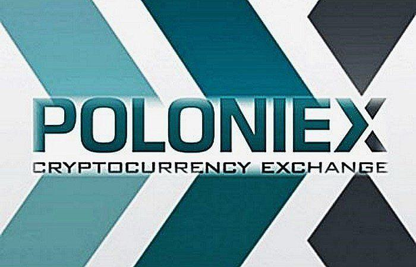

Cryptocurrency exchanges have seen a rapid increase in popularity over the past decade, transforming from niche platforms to crucial components of the global financial ecosystem. As digital currencies continue to reshape the financial landscape, exchanges like Poloniex have emerged as prominent venues for trading a wide array of cryptocurrencies. Established in 2014, Poloniex has positioned itself as a leading cryptocurrency exchange platform, offering users a vast selection of trading pairs, robust security measures, and an efficient trading environment.

Algorithmic trading, or algo trading, represents a significant evolution within the trading arena, particularly in the context of cryptocurrencies. This method employs computer programs to execute trades based on predefined criteria, such as timing, price, or volume, often outperforming human-based strategies in terms of speed and efficiency. By leveraging complex algorithms, traders can capitalize on market conditions with precision and without the limitations of human emotion.



The primary purpose of this article is to assess Poloniex’s capabilities as a trading platform, with a specific focus on its support for algorithmic trading. By examining the features and tools available to users, we aim to provide insights into how Poloniex fosters an environment conducive to algo trading success.

For modern cryptocurrency investors, the importance of algorithmic trading cannot be overstated. As markets become more competitive and data-driven, the ability to utilize algorithmic strategies offers significant advantages, including enhanced trading accuracy, risk management, and the ability to perform trades at unprecedented speeds. For investors seeking to remain ahead in this dynamic market, understanding and implementing algorithmic trading strategies on platforms like Poloniex is essential.

## Table of Contents

## Overview of Poloniex

Poloniex, a prominent name in the cryptocurrency exchange market, was founded in 2014 by Tristan D’Agosta. Initially making headlines for its seamless trading capabilities, Poloniex quickly gained traction as a go-to platform for cryptocurrency enthusiasts and traders. In 2018, it was acquired by Circle, a financial services company backed by Goldman Sachs, further cementing its position in the industry. This acquisition was aimed at enhancing Poloniex's offerings and improving its technological infrastructure. However, by late 2019, Circle spun out the exchange to a new company called Polo Digital Assets, allowing Poloniex to focus independently on its growth strategies outside the regulatory umbrellas concerning U.S. customers. 

**Key Features and Services**

Poloniex offers a diverse range of features and services designed to cater to both beginner and experienced traders. The platform provides spot trading, which allows users to buy and sell a variety of cryptocurrencies instantly. Additionally, Poloniex extends its services to include margin trading, enabling users to trade with leverage. This feature appeals to traders looking to maximize potential returns, albeit with higher risks. Poloniex also provides a lending service, which lets users earn interest by lending their cryptocurrencies to other traders.

Another noteworthy feature is the availability of a user-friendly application programming interface (API). This tool allows developers to integrate trading bots and algorithms, facilitating automated trading strategies. The exchange also supports futures trading, providing advanced traders the avenue to speculate on the price of cryptocurrencies beyond traditional markets.

**Types of Cryptocurrencies Available**

Poloniex supports trading for a wide array of cryptocurrencies. It hosts pairs in major cryptocurrencies such as Bitcoin (BTC), Ethereum (ETH), and Litecoin (LTC), as well as a long list of altcoins including Tron (TRX), Ripple (XRP), and more niche tokens. This extensive offering allows users to diversify their portfolios significantly, accommodating various trading strategies and preferences.

**Reputation and User Base**

Poloniex has built a substantial user base globally, credited with offering a robust platform and a wide range of trading options. The exchange has experienced fluctuations in its reputation, notably due to regulatory challenges and the decision to [exit](/wiki/exit-strategy) the U.S. market. However, it remains popular among international users for its comprehensive features and consistent user interface improvements. The platform's peer-to-peer nature, coupled with minimal downtime during trading sessions, are additional factors that contribute to its global appeal.

**Security Measures**

In the volatile and often precarious world of [cryptocurrency](/wiki/cryptocurrency) trading, security is paramount. Poloniex has implemented several security measures to safeguard its users' assets and data. These measures include two-[factor](/wiki/factor-investing) authentication (2FA) for account access, IP whitelisting for heightened login security, and cold storage techniques to protect the majority of digital assets offline. These strategies aim to prevent unauthorized access and reduce the likelihood of hacking incidents, which are prevalent in the cryptocurrency space. Furthermore, Poloniex maintains a dedicated risk management team that continuously monitors activity to identify and mitigate potential threats.

## Understanding Algorithmic Trading

Algorithmic trading, often referred to as algo trading, involves the use of computer programs and algorithms to trade financial assets, including cryptocurrencies, at speeds and frequencies that a human trader cannot achieve. These algorithms are designed to execute pre-defined instructions relating to variables such as timing, price, and [volume](/wiki/volume-trading-strategy), thereby enabling the automatic buying and selling of securities with minimal human intervention.

### Key Differences from Traditional Trading

Traditional trading relies heavily on manual execution of buy and sell orders and often involves a high degree of human intuition and sentiment. By contrast, [algorithmic trading](/wiki/algorithmic-trading) systematically executes trades based on statistical, technical, or quantitative analysis. It eliminates emotional biases and enables quicker reaction to market events, thus potentially increasing trade efficiency and profitability.

### Benefits of Algorithmic Trading in Cryptocurrencies

1. **Speed and Efficiency**: Algorithms can process vast amounts of data and execute trades in milliseconds, far outpacing the capabilities of human traders.

2. **Reduced Costs**: By reducing the need for manual intervention and optimizing trade execution, algorithmic trading can minimize transaction costs and slippage.

3. **Market Adaptation**: Algorithms can adjust positions swiftly in response to market changes, allowing traders to exploit short-lived trading opportunities.

4. **Backtesting**: Traders can test their trading strategies on historical data to assess potential viability and profitability, enhancing strategy development.

### Popular Strategies in Algorithmic Trading

Several algo trading strategies are prevalent in the cryptocurrency market:

- **Trend Following**: Algorithms identify and follow existing market trends, buying when prices rise and selling when they fall.

- **Arbitrage**: Algorithms exploit price differences of the same asset on different exchanges to earn profits.

- **Mean Reversion**: This strategy assumes that prices will revert to their historical mean, allowing traders to buy low and sell high.

- **Market Making**: Involves placing buy and sell orders simultaneously to capture the spread and provide liquidity to the market.

### Challenges and Considerations

Despite its benefits, algorithmic trading presents certain challenges and considerations:

- **Market Volatility**: Cryptocurrencies are known for their high volatility, which can lead to rapid and unexpected shifts in market conditions, potentially disrupting algorithm performance.

- **Technical Failures**: Algorithms depend on sophisticated technology and infrastructure. Hardware or software malfunctions could lead to significant financial losses.

- **Regulatory Concerns**: With financial markets being highly regulated, any algo trading system must comply with pertinent laws and regulations, which can vary significantly by jurisdiction.

- **Data Quality**: The accuracy of algorithmic trading relies heavily on the quality of the input data; poor data quality can result in suboptimal trading decisions.

Traders considering algorithmic trading in cryptocurrencies must carefully design their strategies, verify systems through thorough testing, and continually adapt to changing market conditions and regulatory environments.

## Algotrading on Poloniex

Poloniex, a well-established cryptocurrency exchange, recognizes the growing demand for algorithmic trading among its users and offers robust support for this advanced trading method. Algorithmic trading, which involves the use of pre-programmed instructions, enables traders to execute orders at high speeds that are impossible for a human trader. This method relies on various inputs such as price, volume, and time as well as sophisticated mathematical models to make trading decisions.

Poloniex provides a comprehensive API that facilitates the development of trading algorithms. This API offers a range of features, including real-time market data retrieval, access to trading history, and order placement capabilities. The API is designed to be developer-friendly, with extensive documentation that guides users through the authentication process, endpoint functionalities, and error management procedures.

The platform's API supports several programming languages, which enhances its compatibility with a variety of trading bots and software options available in the market. Python, being a preferred language for many developers due to its simplicity and extensive library support, can be effectively used to interact with Poloniex's API. For example, using a simple Python script, traders can continuously track market prices and execute trades based on predefined conditions:

```python
import requests

# Poloniex API endpoints
BASE_URL = 'https://api.poloniex.com'
TICKER_ENDPOINT = '/markets/{}/ticker'

def get_current_price(symbol):
    url = BASE_URL + TICKER_ENDPOINT.format(symbol)
    response = requests.get(url)
    return response.json()['last']

# Example: Track price of BTC_USDT
btc_usdt_price = get_current_price('BTC_USDT')
print(f"Current BTC/USDT price: {btc_usdt_price}")
```

Poloniex supports various trading bots, such as HaasOnline, Shrimpy, and CryptoTrader, all of which integrate smoothly with its platform. These bots enable users to automate their trading strategies, back-test historical data, and optimize their performance.

There are notable instances of successful algorithmic trading on Poloniex. While specific case studies from Poloniex are scarce due to privacy and competitive reasons, these successes often involve [arbitrage](/wiki/arbitrage) strategies, [market making](/wiki/market-making), and [trend following](/wiki/trend-following), where algorithms are configured to exploit small price discrepancies across different trading pairs or exchanges.

For beginners eager to start algorithmic trading on Poloniex, a few critical tips can help pave the way for success. Firstly, it's important to start small and gradually scale up as confidence and experience grow. Familiarizing oneself with the Poloniex API through test environments can mitigate potential risks. Staying informed about market conditions and continuously fine-tuning algorithms based on real-world performance data is crucial. Engaging with online communities and forums can provide additional insights and shared experiences from other algo traders. Furthermore, understanding risk management principles and setting strict limits on losses can protect investments from unforeseen market [volatility](/wiki/volatility-trading-strategies).

In summary, Poloniex's support for algorithmic trading, including its flexible API and compatibility with various trading tools, makes it an attractive platform for crypto traders looking to automate their strategies. By leveraging these tools and following best practices, traders can enhance their efficiency and profitability in the competitive world of cryptocurrency trading.

## The Future of Algotrading on Cryptocurrency Platforms

The landscape of algorithmic trading in the cryptocurrency market is rapidly evolving, driven by technological advancements and shifting regulatory frameworks. As it stands, several predictions and trends indicate significant developments on the horizon for algo trading enthusiasts and platforms, such as Poloniex. 

A prominent prediction is the increasing integration of [artificial intelligence](/wiki/ai-artificial-intelligence) (AI) and [machine learning](/wiki/machine-learning) in algo trading systems. These technologies enhance the capability of trading algorithms to analyze vast datasets and recognize complex patterns imperceptible to human traders. For instance, machine learning models, particularly [deep learning](/wiki/deep-learning), can forecast price movements with greater accuracy by adapting to new market conditions and historical data. An example of a simple machine learning model in Python could be:

```python
from sklearn.ensemble import RandomForestClassifier
import numpy as np

# Hypothetical historical data (features) and outcomes (target)
X = np.array([[0.05, 0.04], [0.03, 0.01], [0.08, 0.06]])
y = np.array([1, 0, 1])  # 1: price goes up, 0: price goes down

# Train the model
model = RandomForestClassifier(n_estimators=100)
model.fit(X, y)

# Predict the market movement
new_data = np.array([[0.06, 0.05]])
prediction = model.predict(new_data)
```

Another anticipated trend is the enhancement of Poloniex's algorithmic trading features. This may include more robust APIs, better integration with third-party trading bots, and more sophisticated data analytics tools. These improvements will empower traders to deploy more complex strategies with ease and reliability.

Regulatory changes will significantly impact cryptocurrency algo trading. Governments and financial authorities are increasingly focusing on regulating cryptocurrencies to protect investors and ensure market stability. Regulations might require platforms like Poloniex to provide more transparency in algorithmic trading activities and implement stricter compliance standards. In countries with favorable regulations, algorithmic trading platforms might see a surge in adoption, while stricter environments could necessitate strategic adjustments by traders and platforms alike.

To prepare for such future changes, traders should engage in continuous learning and adaptation. Staying informed about technological advances, regulatory updates, and market trends will be crucial. Additionally, traders should diversify their strategies and consider incorporating AI-driven solutions to remain competitive.

In conclusion, the future of algorithmic trading on cryptocurrency platforms presents both opportunities and challenges. By leveraging AI and machine learning, traders can gain a competitive edge, while staying abreast of regulatory changes will be essential for sustaining success in this dynamic landscape.

## Conclusion

Poloniex has emerged as a pivotal platform for investors seeking to harness the power of algorithmic trading within the cryptocurrency sector. Throughout this article, we have highlighted Poloniex's firm standing as a reputable cryptocurrency exchange, well-suited for facilitating algorithmic trading with its robust API and support for various trading bots. Algorithmic trading offers significant advantages, such as enhanced speed, precision, and the capacity to handle large trading volumes without human error. Poloniex's focus on these features positions it as a highly efficient choice for crypto enthusiasts looking to expand their trading strategies.

Traders are encouraged to actively explore the algorithmic trading options available on Poloniex to capitalize on these benefits, potentially improving their market engagement and investment outcomes. As the cryptocurrency market continues to evolve, staying informed and adaptable is paramount. Understanding algorithmic strategies and integrating them into one's trading routine can offer a competitive edge in the swiftly changing digital asset landscape.

It is crucial for traders not only to stay updated on the latest developments in the crypto exchange space but also to engage in personal research and experimentation. This hands-on approach not only aids in mastering the intricacies of algorithmic trading but also helps in adapting to future modifications in trading technologies and market regulations. By doing so, traders can be well-prepared for new opportunities and challenges in the dynamic world of cryptocurrency trading.

## References & Further Reading

[1]: Bergstra, J., Bardenet, R., Bengio, Y., & Kégl, B. (2011). ["Algorithms for Hyper-Parameter Optimization."](https://proceedings.neurips.cc/paper/2011/file/86e8f7ab32cfd12577bc2619bc635690-Paper.pdf) Advances in Neural Information Processing Systems 24.

[2]: ["Advances in Financial Machine Learning"](https://www.amazon.com/Advances-Financial-Machine-Learning-Marcos/dp/1119482089) by Marcos Lopez de Prado

[3]: ["Evidence-Based Technical Analysis: Applying the Scientific Method and Statistical Inference to Trading Signals"](https://www.amazon.com/Evidence-Based-Technical-Analysis-Scientific-Statistical/dp/0470008741) by David Aronson

[4]: ["Machine Learning for Algorithmic Trading"](https://github.com/stefan-jansen/machine-learning-for-trading) by Stefan Jansen

[5]: ["Quantitative Trading: How to Build Your Own Algorithmic Trading Business"](https://www.amazon.com/Quantitative-Trading-Build-Algorithmic-Business/dp/1119800064) by Ernest P. Chan