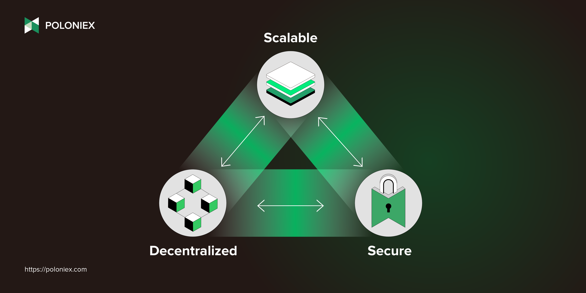

## Table of Contents

## What is Poloniex and what is its primary purpose?

Poloniex is a cryptocurrency exchange platform where people can buy, sell, and trade different types of cryptocurrencies. It was started in 2014 and has become popular among people who want to trade digital currencies like Bitcoin, Ethereum, and many others. The main purpose of Poloniex is to provide a safe and easy way for users to exchange one cryptocurrency for another. This helps people who want to diversify their investments or take advantage of price changes in different digital currencies.

The platform also offers features like margin trading, which allows users to borrow money to make bigger trades, and lending, where users can lend their cryptocurrencies to others to earn interest. These features make Poloniex more than just a simple exchange; it's a place where users can use different strategies to grow their cryptocurrency holdings. Overall, Poloniex aims to be a one-stop shop for all things related to cryptocurrency trading.

## How does Poloniex facilitate cryptocurrency trading?

Poloniex makes it easy for people to trade cryptocurrencies by providing a user-friendly platform. When you go to their website, you can see different cryptocurrencies listed. You can choose to buy, sell, or trade one cryptocurrency for another. The platform shows you the current prices and how much the prices have changed. This helps you decide when to trade. You can also set up different types of orders, like a limit order, where you say the price you want to buy or sell at, and the trade will happen when the price reaches that level.

Another way Poloniex helps with trading is by offering features like margin trading and lending. Margin trading lets you borrow money to make bigger trades. This can help you make more money if the price goes the way you expect, but it can also be risky if the price goes against you. Lending on Poloniex means you can lend your cryptocurrencies to other users and earn interest. This can be a good way to make some extra money while you're not using your cryptocurrencies. Overall, Poloniex tries to give you different tools and options to make trading easier and more profitable.

## What types of cryptocurrencies can be traded on Poloniex?

Poloniex lets you trade many different kinds of cryptocurrencies. You can find popular ones like Bitcoin, Ethereum, and Litecoin. They also have other cryptocurrencies like Ripple, Bitcoin Cash, and EOS. This means you have a lot of choices if you want to buy, sell, or trade different digital currencies.

Besides the well-known cryptocurrencies, Poloniex also has some lesser-known ones. You might see coins like TRON, Stellar, and Cardano. They even have newer or smaller cryptocurrencies that you might not find on other exchanges. This variety helps you explore different options and find the best ones for your trading needs.

## What are the basic steps to start trading on Poloniex?

To start trading on Poloniex, first you need to sign up for an account. Go to the Poloniex website and click on the "Sign Up" button. You will need to enter your email address and choose a strong password. After you sign up, you will get an email to confirm your account. Click on the link in the email to finish the sign-up process. Once your account is confirmed, you should log in and set up two-[factor](/wiki/factor-investing) authentication (2FA) to keep your account safe. This adds an extra layer of security by making you enter a code from your phone each time you log in.

After your account is set up and secure, you can start trading. First, you need to add money to your account. You can do this by sending cryptocurrencies to your Poloniex wallet. Once you have money in your account, go to the trading page. Here, you can choose which cryptocurrencies you want to trade. You can buy, sell, or trade one [cryptocurrency](/wiki/cryptocurrency) for another. To make a trade, you can use different types of orders, like a market order to buy or sell right away at the current price, or a limit order to set the price you want to trade at. Once you place your order, you just need to wait for it to be filled.

## How does Poloniex ensure the security of user funds and data?

Poloniex takes many steps to keep your money and information safe. They use strong encryption to protect your data when you log in and make trades. They also have two-factor authentication (2FA), which means you need a code from your phone to log in. This makes it much harder for someone else to get into your account. Poloniex also keeps most of the money in cold storage, which means it's not connected to the internet and is safer from hackers.

Besides these measures, Poloniex has a team that watches for anything suspicious all the time. If they see something strange, they can stop it before it causes problems. They also have insurance to help cover losses if something bad happens. All these steps together help make sure your money and information are as safe as possible on Poloniex.

## What are the fee structures for trading on Poloniex?

Poloniex has different fees for trading, depending on how much you trade and what kind of order you use. If you make a maker order, which adds [liquidity](/wiki/liquidity-risk-premium) to the market, you pay a fee of 0.09% to 0.10%. If you make a taker order, which takes liquidity away from the market, the fee is higher, at 0.11% to 0.12%. The exact fee depends on how much you've traded in the last 30 days. The more you trade, the lower your fees can be.

There are also fees for other things on Poloniex. If you use margin trading, you pay an extra fee of 0.02% on the borrowed amount. If you want to take your money out of Poloniex, there are withdrawal fees too. These fees change depending on which cryptocurrency you're withdrawing. It's a good idea to check the fee page on the Poloniex website to see the latest fees before you start trading or withdrawing.

## How does Poloniex's user interface cater to both beginners and experienced traders?

Poloniex's user interface is designed to be easy for beginners to use while still offering advanced features for experienced traders. For beginners, the platform has a simple layout that makes it easy to find what you need. You can quickly see the prices of different cryptocurrencies and make trades with just a few clicks. The trading page shows clear charts and graphs that help you understand how prices are changing. There are also guides and tutorials that explain how to use the platform, so you can learn as you go.

For experienced traders, Poloniex offers more advanced tools and options. You can use different types of orders, like limit orders and stop orders, to make more complex trades. The platform also has features like margin trading and lending, which let you borrow money to make bigger trades or earn interest on your cryptocurrencies. The interface lets you customize your trading experience, so you can set up the charts and tools the way you like. This makes it easier for experienced traders to use the strategies they know best.

## What advanced trading features does Poloniex offer?

Poloniex offers several advanced trading features that can help experienced traders make more complex trades. One of these features is margin trading, which lets you borrow money to make bigger trades. This can help you make more money if the price goes the way you expect, but it can also be risky if the price goes against you. Another feature is lending, where you can lend your cryptocurrencies to other users and earn interest. This can be a good way to make some extra money while you're not using your cryptocurrencies.

The platform also allows you to use different types of orders, like limit orders and stop orders. A limit order lets you set the price you want to buy or sell at, and the trade will happen when the price reaches that level. A stop order can help you limit your losses by automatically selling your cryptocurrencies if the price drops too much. These features give you more control over your trades and help you use different strategies to grow your cryptocurrency holdings.

## How does Poloniex comply with regulatory requirements in different jurisdictions?

Poloniex works hard to follow the rules in different places around the world. They have a team that keeps an eye on the laws and makes sure the platform does what it needs to do to stay legal. This includes things like checking who their users are, which is called Know Your Customer (KYC), and watching for any strange activity, which is called Anti-Money Laundering (AML). By doing these things, Poloniex makes sure they are following the rules in the places where they work.

Different countries have different rules, so Poloniex changes how they do things to fit each place. For example, they might need more information from users in one country than in another. They also work with the people who make the rules to make sure they are doing everything right. This helps them keep their platform safe and legal for everyone who uses it.

## What are the liquidity and volume statistics for Poloniex compared to other exchanges?

Poloniex is known for having good liquidity and trading [volume](/wiki/volume-trading-strategy), but it can change depending on which cryptocurrencies you're looking at. For popular cryptocurrencies like Bitcoin and Ethereum, Poloniex usually has a lot of trading happening. This means there are many buyers and sellers, so you can easily make trades without big changes in price. Compared to other big exchanges like Binance and Coinbase, Poloniex might not always have the highest volume, but it's still a strong player in the market.

For less popular or newer cryptocurrencies, Poloniex can sometimes have better liquidity than other exchanges. This is because they offer a wide range of cryptocurrencies that you might not find on other platforms. So, if you're interested in trading smaller or newer coins, Poloniex can be a good choice. Overall, while Poloniex might not lead in volume for every cryptocurrency, it provides a solid trading environment with good liquidity for many digital assets.

## How does Poloniex's API support algorithmic trading and integration with other platforms?

Poloniex's API is a tool that helps people who want to use computers to trade cryptocurrencies automatically. This is called [algorithmic trading](/wiki/algorithmic-trading). The API lets you connect Poloniex to your own computer programs. You can write code that tells the program to buy or sell cryptocurrencies based on certain rules you set. This can be useful if you want to trade a lot or if you want to use special strategies that are hard to do by hand.

The API also helps you connect Poloniex with other platforms or tools. For example, you might want to use a special charting program to see how prices are changing, or you might want to keep track of your trades in a different system. Poloniex's API makes it easy to send information back and forth between Poloniex and these other tools. This way, you can use all your favorite tools together to make the best trading decisions.

## What are the future development plans and strategic objectives of Poloniex?

Poloniex wants to keep making their platform better and easier to use. They plan to add more cryptocurrencies so people can trade even more kinds of digital money. They also want to make their website and app work faster and smoother. This means less waiting and more trading. Poloniex is also working on new tools that can help people trade better, like better charts and more ways to see how prices are changing.

Another big goal for Poloniex is to keep their platform safe and legal in different countries. They will keep working with the people who make the rules to make sure they are doing everything right. They also want to make their customer service better so people can get help faster when they need it. By doing all these things, Poloniex hopes to be a top choice for people who want to trade cryptocurrencies.

## References & Further Reading

[1]: Bergstra, J., Bardenet, R., Bengio, Y., & Kégl, B. (2011). ["Algorithms for Hyper-Parameter Optimization."](https://proceedings.neurips.cc/paper/2011/file/86e8f7ab32cfd12577bc2619bc635690-Paper.pdf) Advances in Neural Information Processing Systems 24.

[2]: ["Advances in Financial Machine Learning"](https://www.amazon.com/Advances-Financial-Machine-Learning-Marcos/dp/1119482089) by Marcos Lopez de Prado

[3]: ["Evidence-Based Technical Analysis: Applying the Scientific Method and Statistical Inference to Trading Signals"](https://www.amazon.com/Evidence-Based-Technical-Analysis-Scientific-Statistical/dp/0470008741) by David Aronson

[4]: ["Machine Learning for Algorithmic Trading"](https://github.com/stefan-jansen/machine-learning-for-trading) by Stefan Jansen

[5]: ["Quantitative Trading: How to Build Your Own Algorithmic Trading Business"](https://www.amazon.com/Quantitative-Trading-Build-Algorithmic-Business/dp/1119800064) by Ernest P. Chan