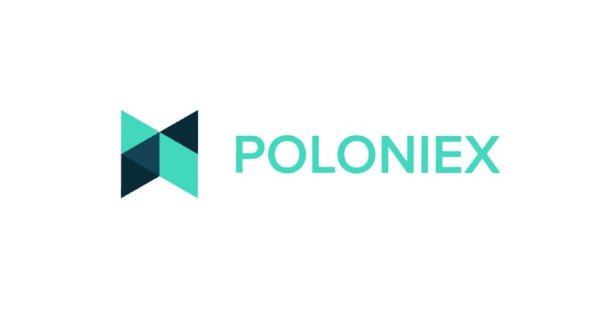

## Table of Contents

## What is Poloniex and what services does it offer?

Poloniex is a cryptocurrency exchange where people can buy, sell, and trade different types of digital currencies. It started in 2014 and has become popular among people who want to trade cryptocurrencies like Bitcoin, Ethereum, and many others. The platform is known for having a lot of different cryptocurrencies available to trade, which makes it a good choice for people who want to explore different types of digital money.

Poloniex offers several services to make trading easier for its users. One of the main services is the ability to trade one cryptocurrency for another directly, without needing to convert to traditional money first. They also have tools like charts and graphs to help users understand how the prices of cryptocurrencies are changing. Additionally, Poloniex provides a lending service where users can lend their cryptocurrencies to other traders and earn interest on them. This can be a good way for people to make some extra money while they are not actively trading.

## How can someone sign up for a Poloniex account?

To sign up for a Poloniex account, you need to go to their website and click on the "Sign Up" button. You will be asked to enter your email address and create a strong password. Make sure your password is hard to guess and includes a mix of letters, numbers, and symbols. After entering your email and password, you will need to agree to Poloniex's terms of service and privacy policy. Once you do that, Poloniex will send a confirmation email to the address you provided.

Open the confirmation email and click on the link inside it to verify your email address. This step is important to make sure your account is secure. After you verify your email, you can log into your new Poloniex account. You might want to set up two-[factor](/wiki/factor-investing) authentication (2FA) for extra security. This means you'll need a code from your phone to log in, which makes it harder for someone else to get into your account. Once you're all set up, you can start exploring the different cryptocurrencies and trading options available on Poloniex.

## What are the basic steps to start trading on Poloniex?

To start trading on Poloniex, first make sure you have signed up for an account and verified your email. Once logged in, you need to deposit some [cryptocurrency](/wiki/cryptocurrency) into your Poloniex account. Go to the "Balances" section, find the cryptocurrency you want to deposit, and click on the "Deposit" button. You'll get a unique address where you can send your cryptocurrency from your personal wallet. Wait for the deposit to be confirmed on the blockchain, which might take a few minutes or longer depending on the cryptocurrency.

After your deposit is confirmed, you can start trading. Go to the "Exchange" section on Poloniex and choose the trading pair you want to trade, like Bitcoin to Ethereum. You'll see a chart showing the current price and trading [volume](/wiki/volume-trading-strategy). To make a trade, decide if you want to buy or sell, enter the amount you want to trade, and set your price if you're making a limit order. If you're making a market order, it will be executed at the current market price. Once you're happy with your order, click "Buy" or "Sell" to complete the trade. Keep an eye on your trades and the market to make smart trading decisions.

## What types of cryptocurrencies can be traded on Poloniex?

Poloniex offers a wide variety of cryptocurrencies for trading. You can find popular ones like Bitcoin, Ethereum, and Litecoin, which are well-known and widely used. They also have many other cryptocurrencies that might be newer or less common, like Cardano, Stellar, and XRP. This variety makes Poloniex a good place for people who want to explore different types of digital money.

In addition to these, Poloniex also lists some more unique cryptocurrencies. These can include tokens from smaller projects or newer coins that are just starting to gain attention. Because Poloniex has so many options, traders can try different strategies and find opportunities that might not be available on other exchanges. This wide selection is one of the reasons why many people choose Poloniex for their trading needs.

## How does Poloniex handle security and what measures are in place to protect users?

Poloniex takes security very seriously to keep users' money and information safe. They use strong encryption to protect data and have systems in place to watch for any strange activity on accounts. They also encourage users to use two-factor authentication (2FA), which adds an extra step to log in, making it harder for someone else to get into your account. This means you need a code from your phone to log in, which helps keep your account secure.

Another important part of Poloniex's security is keeping most of the money in "cold storage." This means the money is kept offline, away from the internet, where it's much harder for hackers to reach. They only keep a small amount of money online for quick trades. Poloniex also has a team that works to find and fix any security problems quickly. They do regular checks to make sure everything is safe and secure.

## What are the fee structures for trading and withdrawing on Poloniex?

Poloniex charges fees for trading and withdrawing money. For trading, they use a maker-taker fee model. If you add money to the market, you're a maker and you pay a lower fee, usually around 0.1%. If you take money out of the market, you're a taker and you pay a higher fee, usually around 0.2%. The exact fee can change depending on how much you trade in a month. The more you trade, the lower your fees can be.

For withdrawing money, Poloniex charges a fee that depends on which cryptocurrency you're taking out. Each cryptocurrency has its own fee, and these fees can change. For example, withdrawing Bitcoin might cost a different amount than withdrawing Ethereum. The fees are set to cover the costs of processing the withdrawal on the blockchain. It's a good idea to check the current withdrawal fees on Poloniex's website before you make a withdrawal.

## Can you explain the difference between Poloniex's order types and how to use them effectively?

Poloniex has different kinds of orders that you can use to trade cryptocurrencies. The two main types are market orders and limit orders. A market order is when you want to buy or sell a cryptocurrency right away at the current price. It's fast and easy, but the price you get might be a little different from what you see on the chart because the price can change quickly. A limit order is when you set a specific price at which you want to buy or sell. Your order will only happen if the price reaches the number you set. This can be good if you want to control the price you pay or get, but it might take longer for your order to go through if the price doesn't reach your limit.

To use these orders effectively, think about what you want to do with your trade. If you need to buy or sell quickly, a market order is the best choice because it happens right away. But if you want to get a better price and are okay with waiting, a limit order can help you do that. For example, if you think the price of a cryptocurrency will go down before it goes up again, you can set a limit order to buy at a lower price. On the other hand, if you want to sell at a higher price than what it is now, you can set a limit order to sell at that higher price. Using both types of orders can help you trade smarter and get the best deals.

## How does Poloniex's margin trading work and what are the risks involved?

Margin trading on Poloniex lets you borrow money to trade more than you have. You can use this borrowed money, called leverage, to try to make bigger profits. To start, you need to put up some of your own money as a deposit, which is called collateral. If the price moves in your favor, you can make more money than if you just used your own money. But if the price goes against you, you could lose more than you put in. Poloniex has rules about how much you can borrow and how much you need to keep in your account to keep trading.

The big risk with margin trading is that you can lose a lot of money quickly. If the price of the cryptocurrency you're trading goes down a lot, you might get a "margin call." This means you need to add more money to your account right away or Poloniex will sell your cryptocurrencies to pay back the loan. This can happen fast and you might not have time to react. It's important to understand these risks and only use margin trading if you know what you're doing and can handle the possibility of losing more than you started with.

## What advanced trading features does Poloniex offer to experienced traders?

Poloniex offers some cool tools for people who really know how to trade. One of these is called margin trading. This means you can borrow money to trade more than you have. It can help you make more money if the prices go the way you want, but it can also make you lose more if they don't. Another feature is called stop-loss orders. These let you set a price where your trade will stop if the price goes down too much. This can help you not lose too much money. Poloniex also has a lending feature where you can lend your cryptocurrencies to other traders and earn interest on them. This can be another way to make money while you're not trading.

There's also something called advanced charting tools on Poloniex. These tools help you see how prices are moving and make better guesses about what might happen next. You can use different lines and shapes on the charts to help you decide when to buy or sell. Poloniex also lets you use something called API trading. This means you can connect your trading to computer programs that can trade for you automatically. This can be really helpful if you want to trade a lot or at times when you can't watch the market yourself. All these features can help experienced traders do better, but they need to be careful and know what they're doing because trading can be risky.

## How does Poloniex comply with regulations and what is its approach to KYC/AML?

Poloniex works hard to follow the rules set by different countries to keep trading safe and fair. They have a team that makes sure they are doing everything right according to the laws. This includes checking where their users are from and making sure they are not breaking any rules. Poloniex also works with other companies and government groups to help stop bad things like money laundering and fraud.

To make sure they are following the rules, Poloniex has a system called KYC, which stands for "Know Your Customer." This means they ask users to give them some personal information, like their name and where they live, to make sure they know who is using their platform. They also have an AML system, which stands for "Anti-Money Laundering." This system helps them watch for any strange activity that might be someone trying to hide where their money came from. By using these systems, Poloniex tries to keep their platform safe and trusted by everyone.

## What are some common strategies used by traders on Poloniex to maximize profits?

Traders on Poloniex often use a strategy called "[day trading](/wiki/day-trading-spy)" to try and make money. This means they buy and sell cryptocurrencies many times in one day, hoping to make small profits each time. They watch the price charts closely and use tools like stop-loss orders to limit their losses if the price goes down. Another common strategy is "swing trading," where traders hold onto their cryptocurrencies for a few days or weeks, trying to catch bigger price swings. They might use technical analysis, which is looking at charts and patterns, to decide when to buy and sell.

Another strategy traders use is "[arbitrage](/wiki/arbitrage)," which means buying a cryptocurrency on one exchange where it's cheaper and selling it on another exchange where it's more expensive. This can be tricky because the prices can change fast, but if done right, it can make a profit with less risk. Some traders also use "margin trading" on Poloniex, where they borrow money to trade more than they have. This can lead to bigger profits if the prices go the right way, but it's also riskier because they can lose more than they started with if the prices go against them.

## How can users leverage Poloniex's API for automated trading and what are the best practices for doing so?

Poloniex's API lets users connect their trading to computer programs that can buy and sell cryptocurrencies automatically. This is really helpful if you want to trade a lot or at times when you can't watch the market yourself. To use the API, you need to get an API key from Poloniex. This key lets your program talk to Poloniex and do things like checking prices, making trades, and getting information about your account. You can set up your program to follow certain rules, like buying a cryptocurrency when its price goes down to a certain level or selling it when it goes up to another level.

When using Poloniex's API for automated trading, it's important to follow some best practices to keep your trading safe and effective. First, always keep your API key secret and safe. If someone else gets your key, they could use it to trade with your money. It's also a good idea to set limits on what your program can do, like how much money it can spend on each trade. This helps you not lose too much money if something goes wrong. Lastly, test your program a lot before you use it with real money. This way, you can make sure it works the way you want it to and doesn't make mistakes that could cost you money.

## References & Further Reading

[1]: Bergstra, J., Bardenet, R., Bengio, Y., & Kégl, B. (2011). ["Algorithms for Hyper-Parameter Optimization."](https://dl.acm.org/doi/10.5555/2986459.2986743) Advances in Neural Information Processing Systems 24.

[2]: ["Advances in Financial Machine Learning"](https://www.amazon.com/Advances-Financial-Machine-Learning-Marcos/dp/1119482089) by Marcos Lopez de Prado

[3]: ["Evidence-Based Technical Analysis: Applying the Scientific Method and Statistical Inference to Trading Signals"](https://www.amazon.com/Evidence-Based-Technical-Analysis-Scientific-Statistical/dp/0470008741) by David Aronson

[4]: ["Machine Learning for Algorithmic Trading"](https://github.com/stefan-jansen/machine-learning-for-trading) by Stefan Jansen

[5]: ["Quantitative Trading: How to Build Your Own Algorithmic Trading Business"](https://books.google.com/books/about/Quantitative_Trading.html?id=j70yEAAAQBAJ) by Ernest P. Chan