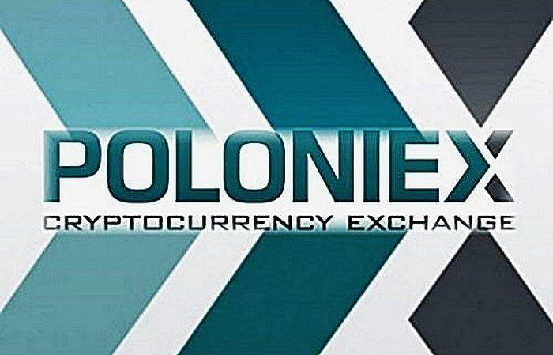

Cryptocurrency trading has transformed the financial landscape, offering a decentralized and digital approach to asset exchange. This innovation involves trading digital currencies like Bitcoin, Ethereum, and others. It has gained considerable traction due to its potential for high returns and its operation outside traditional banking systems. The 24/7 nature of the cryptocurrency market, coupled with significant price volatility, provides both opportunities and challenges for traders worldwide.

Amidst a plethora of cryptocurrency exchanges, Poloniex has emerged as a significant player. Founded in 2014, Poloniex quickly gained popularity for its comprehensive trading services and a broad selection of cryptocurrencies. Its platform caters to both novice and experienced traders, offering tools essential for efficient trading. As a well-established exchange, Poloniex provides a trusted environment that emphasizes security, a critical aspect for traders concerned with the safety of their digital assets.



Choosing the right trading platform is crucial for success in the cryptocurrency market. Factors such as user interface, security, fees, and the variety of trading options play important roles. A platform like Poloniex that excels in these areas can significantly impact a trader's experience and profitability. This choice impacts how effectively traders can buy, sell, and manage their portfolios.

Algorithmic trading, a method of executing trades using pre-programmed software, offers notable benefits in this dynamic market. By leveraging algorithms, traders can execute high-frequency trades, capture minute price fluctuations, and implement complex strategies with precision and speed unattainable by humans. The advantages of algorithmic trading are particularly pronounced in the highly volatile cryptocurrency market, where rapid decision-making and execution are paramount.

This article's primary objective is to examine Poloniex's capabilities in supporting algorithmic trading. By understanding Poloniex's offerings, tools, and advantages, traders can better navigate the intricacies of automated trading and potentially enhance their trading performance in the cryptocurrency market.

## Table of Contents

## Understanding Poloniex

Poloniex is a prominent cryptocurrency exchange known for its role in facilitating the trading of various digital assets. Established in 2014 by Tristan D'Agosta, Poloniex quickly became a favored platform due to its extensive range of assets and intuitive interface. Initially based in the United States, the platform rose to prominence because of its broad selection of altcoins and advanced trading features, appealing to both novice and seasoned traders.

The journey of Poloniex in the [cryptocurrency](/wiki/cryptocurrency) market has been marked by significant milestones. In 2018, Circle, a Goldman Sachs-backed consortium, acquired Poloniex, aiming to expand its capabilities and ensure regulatory compliance. However, in 2019, Poloniex detached from Circle and formed a new parent company, Polo Digital Assets, Ltd., which allowed it to focus more independently on international market expansion and customer-centric improvements.

**Key Features and Offerings**

Poloniex offers a plethora of features that cater to both individual and institutional investors. Some of the platform's standout offerings include:

1. **Diverse Asset Range**: Poloniex supports a wide array of cryptocurrencies, enabling traders to access numerous altcoins alongside mainstream digital currencies such as Bitcoin, Ethereum, and Litecoin.

2. **Margin Trading and Lending**: The platform provides margin trading facilities that allow users to trade with leverage, as well as a peer-to-peer lending market where users can offer and borrow funds at competitive rates.

3. **Futures Trading**: For traders looking to hedge their positions or capitalize on market fluctuations, Poloniex offers futures trading, enabling access to contracts with various leverage options.

4. **API Access**: Poloniex provides robust API tools for algorithmic traders, including REST and WebSocket APIs, facilitating programmatic access to market data and account management.

**Comparison with Other Exchanges**

When comparing Poloniex to other popular cryptocurrency exchanges such as Binance, Coinbase, and Kraken, several factors stand out. While Binance is renowned for its enormous trading [volume](/wiki/volume-trading-strategy) and extensive selection of cryptocurrencies, Poloniex historically offered a greater variety of altcoins earlier in its development. In terms of user accessibility, Coinbase is often preferred for its ease of use, especially for beginners, whereas Poloniex offers more advanced trading features that cater to experienced traders.

Kraken, known for its strong focus on security and regulatory compliance, offers fiat-to-crypto trading pairs, a feature Poloniex struggled with due to its international focus post-2019. Nonetheless, Poloniex remains competitive through its specialized offerings such as margin trading and comprehensive API support.

**User Experience and Interface Design**

Poloniex's web interface is designed to offer a seamless user experience, balancing complexity and ease of use. The trading dashboard is equipped with intuitive charts, market depth data, and analytical tools, allowing users to make informed trading decisions. Poloniex also features a mobile application, providing on-the-go access to trading, account management, and market monitoring, catering to the dynamic needs of modern traders.

**Security Measures and Trustworthiness**

Security is a pivotal concern for any cryptocurrency exchange, and Poloniex has implemented several measures to safeguard user assets. The platform employs two-[factor](/wiki/factor-investing) authentication (2FA) and IP whitelisting to enhance account security. Furthermore, the majority of user funds are stored in cold wallets, reducing exposure to potential cyber threats. Despite facing a security breach in 2014, Poloniex has since strengthened its security protocols and focused on building user trust through transparency and responsive customer service. 

Overall, Poloniex's evolution and key offerings underscore its standing as a substantial player in the cryptocurrency trading landscape, providing comprehensive tools and resources for a diverse trading community.

## Algo Trading Explained

Algorithmic trading, often referred to as algo trading, involves utilizing computer programs to execute trading orders at high speeds and with minimal human intervention. In the context of cryptocurrency, algo trading harnesses the volatile nature of digital assets to optimize trading strategies and enhance profitability. The primary advantage of algo trading is its ability to analyze vast datasets and execute trades at precise times, which is especially beneficial in the fast-paced environment of cryptocurrency markets.

### Advantages of Algo Trading in Volatile Markets

Volatility, a hallmark of cryptocurrency markets, presents significant opportunities and risks for traders. Algorithmic trading capitalizes on this [volatility](/wiki/volatility-trading-strategies) by allowing for rapid decision-making and execution that is not feasible for human traders. The main advantages include:

1. **Speed and Efficiency**: Algorithms can process market data and execute trades in fractions of a second, providing a critical edge in dynamic markets.
2. **Minimized Emotional Impact**: Automated trading strategies eliminate emotional decisions, which can be detrimental during significant market swings.
3. **Consistency**: Algorithms adhere to a predefined set of rules, ensuring consistent execution that is not affected by market sentiment.

### Strategies in Algorithmic Trading

Several strategies are employed in [algorithmic trading](/wiki/algorithmic-trading), each tailored to different aspects of market analysis and execution:

- **Arbitrage**: This strategy exploits price differences of a cryptocurrency across different exchanges. For example, if Bitcoin is priced lower on one exchange and higher on another, an algorithm can buy it at the lower price and sell it at the higher price, capturing the spread.

- **Trend Following**: This strategy involves algorithms that analyze historical price trends and trading volumes to make predictions about future price movements. When a trend is identified, the algorithm executes trades in the same direction as the market trend.

- **Market Making**: In this strategy, algorithms place both buy and sell orders to profit from the spread in a particular cryptocurrency. The goal is to earn small profits on each trade while providing liquidity to the market.

### Technical Requirements for Algo Trading

Implementing algorithmic trading requires a sound understanding of both market mechanics and technology. Key technical requirements include:

- **Programming Knowledge**: Familiarity with programming languages such as Python is vital for developing and modifying trading algorithms. Python is particularly popular due to its extensive libraries for data analysis and machine learning.

- **Robust Software**: Algorithms require specialized trading software that can interface with cryptocurrency exchanges via application programming interfaces (APIs). These platforms facilitate order placement, data retrieval, and strategy implementation.

- **Reliable Hardware and Internet Connectivity**: High-frequency trading necessitates low-latency internet connections and reliable hardware to effectively manage and execute trades.

### Common Misconceptions and Risks

While algorithmic trading offers numerous benefits, there are common misconceptions and inherent risks:

- **"Set and Forget" Fallacy**: Many believe that once an algorithm is set, it can operate indefinitely without oversight. In reality, algorithms require continuous monitoring and adjustment to respond to market changes and unexpected events.

- **Technical Failures**: Algorithms can malfunction due to software bugs or unanticipated market conditions, leading to significant losses. As such, rigorous testing and fail-safe mechanisms are crucial.

- **Market Impact**: While algorithms are designed to avoid significant market impact, high volumes of automated trading can sometimes lead to increased volatility or crash scenarios, impacting liquidity and pricing.

In summary, algo trading in cryptocurrency markets has revolutionized the way trades are executed and strategies are developed. By understanding and leveraging the various strategies and tools, traders can better navigate the complexities of these volatile markets. However, the successful implementation of algo trading requires comprehensive knowledge and a cautious approach to mitigating risks.

## Algo Trading on Poloniex

Poloniex, a prominent cryptocurrency exchange, offers robust support for algorithmic trading, enabling traders to execute automated trading strategies efficiently. The platform provides a variety of tools and APIs that facilitate the seamless implementation and operation of algorithmic trading systems.

### Tools and APIs Available for Algo Traders on Poloniex

Poloniex offers a comprehensive set of APIs that allow traders to interact programmatically with the exchange. These APIs support both REST and WebSocket protocols, providing functionalities for accessing market data, historical data, account management, order placement, and real-time updates.

- **REST API**: The REST API is suitable for most operations, including fetching market tickers, account balances, and order histories. It is optimal for less latency-sensitive tasks.

- **WebSocket API**: For traders requiring real-time data, the WebSocket API offers a persistent connection, ideal for receiving instant updates on trades, order books, and market depths. This API is crucial for executing strategies that depend on live data and require rapid adjustments.

Here’s a basic example of how to use the Poloniex REST API in Python to fetch ticker data:

```python
import requests

def get_ticker_data():
    url = 'https://poloniex.com/public?command=returnTicker'
    response = requests.get(url)
    data = response.json()
    return data

ticker_data = get_ticker_data()
print(ticker_data)
```

### Setting Up an Algo Trading Environment on Poloniex

To set up an algorithmic trading environment on Poloniex, traders need to follow these essential steps:

1. **API Key Generation**: First, generate API keys from the Poloniex account settings to securely interact with the APIs.

2. **Environment Configuration**: Set up a development environment with necessary libraries such as `requests` or `websocket-client` for Python. It is recommended to use virtual environments or Docker containers for isolation and easier management.

3. **Strategy Development**: Develop and backtest trading algorithms using historical data. Common strategies include arbitrage, market making, and trend following.

4. **Execution and Monitoring**: Deploy the strategy leveraging the API connections. Ensure there's a mechanism for real-time monitoring and logging to track performance and anomalies.

### Successful Case Studies or Examples of Algo Trading on Poloniex

Several algorithmic trading strategies have been successfully implemented on Poloniex. For instance, [arbitrage](/wiki/arbitrage) strategies that exploit price differences between Poloniex and other exchanges have proven effective. Additionally, trend-following algorithms that capitalize on upward or downward tendencies in cryptocurrency prices have yielded profitable outcomes due to the volatility of digital assets.

### Tips and Best Practices for Algo Trading on Poloniex

For optimal performance in algorithmic trading on Poloniex, consider the following best practices:

- **Thorough Testing**: Before live deployment, rigorously test strategies in simulated environments that utilize historical data to ensure robustness.

- **Latency Optimization**: Utilize the WebSocket API for actions requiring minimal latency, such as rapid order placements or market condition monitoring.

- **Risk Management**: Implement stop-loss mechanisms and adjust position sizes based on risk tolerance and market conditions.

- **Continuous Adjustment**: Regularly review and refine strategies in response to market shifts and performance data.

In conclusion, Poloniex provides a comprehensive suite of tools and resources that empower traders to integrate algorithmic strategies effectively. Through careful environment setup, strategic planning, and diligent monitoring, algorithmic trading on Poloniex can be both a highly efficient and potentially lucrative endeavor.

## Benefits of Using Poloniex for Algo Trading

Poloniex offers several significant benefits that make it an attractive choice for algorithmic traders. Its unique features, cost-efficient fee structure, robust community support, and reliable trading infrastructure are key elements that enhance the algo trading experience on this platform.

### Unique Features of Poloniex
Poloniex differentiates itself by providing a comprehensive suite of features tailored for algorithmic trading. The platform supports a wide array of cryptocurrencies, allowing traders to create diversified algo strategies. Poloniex also offers advanced charting tools and technical analysis metrics which can be crucial for fine-tuning trading algorithms. Additionally, the platform’s API is highly customizable, enabling traders to design and implement their algorithms efficiently.

### Cost Efficiency and Fee Structure
Poloniex's fee structure is particularly beneficial for high-frequency and algorithmic traders. The platform uses a maker-taker fee model where fees can be as low as 0% for makers and 0.05% for takers, depending on the trading volume. This structure incentivizes [liquidity](/wiki/liquidity-risk-premium) provision and reduces costs for traders who engage in large volumes of transactions, a common trait in algorithmic trading.

### Community Support and Resources
Poloniex fosters a strong community of traders and developers, which is invaluable for algo traders who may require assistance or seek collaboration. The exchange supports forums and community discussions where users can share insights, strategies, and troubleshooting tips. Furthermore, Poloniex occasionally hosts webinars and educational content, further enhancing the knowledge base available to its users.

### Reliability and Uptime
The reliability and uptime of Poloniex's trading infrastructure are crucial for the success of algorithmic trading, where uninterrupted data flow and order execution are vital. Poloniex has a track record of maintaining high uptime and efficient system performance, minimizing the risk of disruptions that could affect algorithmic operations. This reliability ensures that traders can execute their strategies seamlessly without concern for unexpected downtime.

### Feedback from Experienced Algo Traders
Feedback from experienced algo traders who use Poloniex underscores the platform’s advantages. Traders often highlight the efficiency of the API, the competitive fees that allow for greater profitability, and the robust security measures that safeguard their trading activities. Testimonials also note the helpfulness of the Poloniex support team, particularly in resolving issues swiftly, which is crucial for maintaining the [momentum](/wiki/momentum) of algorithmic trading strategies.

In summary, Poloniex's unique features, cost-efficient fee structure, active community support, and reliable infrastructure position it as a formidable platform for algorithmic trading. Its commitment to providing a conducive environment for algo traders continues to attract both novice and experienced users seeking to leverage technology for optimal trading outcomes.

## Challenges and Considerations

Poloniex, while a noteworthy platform for algorithmic trading, presents several challenges and considerations that both novice and seasoned traders must address.

### Potential Limitations of Poloniex in Algo Trading

Poloniex has been commended for various features, but users may face limitations specifically tied to the platform’s trading volume and liquidity. Compared to larger platforms, Poloniex might not provide the same breadth of liquidity, especially for less traded cryptocurrency pairs. This can impact the efficacy of certain algorithmic strategies that rely on high-frequency transactions or considerable liquidity, such as [market making](/wiki/market-making) or arbitrage.

### Handling Market Volatility and Disruptions

Cryptocurrency markets are notorious for their volatility. Algo trades on Poloniex, like on any platform, are susceptible to sudden market swings that can lead to substantial slippage and spread variations. While algorithms can be designed to monitor and react quickly, unexpected disruptions—such as flash crashes or [order book](/wiki/order-book-trading-strategies) irregularities—pose risks that traders must account for. Ensuring algorithms have built-in risk management protocols, such as stop-loss orders or volatility filters, is crucial to mitigating such events.

### Regulatory and Compliance Concerns

Regulation in the cryptocurrency space is evolving, and algorithmic trading on Poloniex must navigate these waters conscientiously. Traders need to be aware of the regulatory landscape in their jurisdiction, which may affect not only how they trade but also the types of data they handle and the algorithms they deploy. Adhering to Anti-Money Laundering (AML) and Know Your Customer (KYC) standards is essential for compliance and to avoid potential legal challenges.

### Technical Challenges for New Users

Algorithmic trading requires a significant understanding of both market mechanics and technical implementation. New algo traders on Poloniex may find challenges in setting up their trading environment, choosing the right programming language or strategy, and integrating Poloniex’s APIs into their systems. Developing robust, error-free algo trading systems demands a steep learning curve where a proper understanding of programming and statistical analysis is crucial.

### Continuous Monitoring and Strategy Adjustment

Even with a well-designed algorithm, continuous monitoring of performance and market conditions is imperative. Markets evolve, and strategies that once performed well may become obsolete or less effective. Regular evaluation and adjustment of strategies ensure they remain aligned with current market dynamics. This process often includes [backtesting](/wiki/backtesting) on recent data and iterative calibration. Traders should also be prepared to deactivate their algorithms quickly should they exhibit undesirable behavior or performance during extreme market conditions.

In conclusion, while Poloniex offers a viable platform for algorithmic trading, successful participation requires a thorough understanding of its potential limitations, technical requirements, and the volatile environment of cryptocurrency markets. Emphasizing regulatory compliance, equipped with robust risk management, and maintaining flexibility in strategy adjustments are key components for success in this dynamic field.

## Conclusion

Poloniex has emerged as a significant player in cryptocurrency trading, known for its robust platform and extensive market offerings. By providing a comprehensive trading environment, it caters to a broad spectrum of traders, from novices to seasoned professionals. One of the standout features of Poloniex is its support for algorithmic trading, which aligns with the growing trend of automation in financial markets. Algorithmic trading on Poloniex offers numerous benefits, such as increased efficiency, precision, and the ability to execute complex strategies without human intervention. For traders seeking to capitalize on market opportunities in a rapidly changing environment, Poloniex provides the necessary tools and resources to succeed.

There are ample opportunities for traders interested in exploring algo trading on Poloniex. The platform's user-friendly APIs and advanced trading tools offer traders the flexibility to develop and deploy sophisticated trading algorithms. Furthermore, Poloniex’s community support and educational resources make it a conducive environment for both learning and executing algo trading strategies with confidence.

Looking ahead, Poloniex is well-positioned to continue its growth alongside the evolving landscape of cryptocurrency trading. As algorithmic trading becomes even more integral to market ecosystems, platforms like Poloniex are expected to expand their capabilities, enhancing their infrastructure and tools to meet the demands of complex trading operations.

In conclusion, the integration of technology in modern trading, particularly through platforms such as Poloniex, underscores the transformative impact of digital advancements on financial markets. As traders increasingly embrace algorithmic strategies, the role of innovative trading platforms will become ever more crucial in ensuring efficient and successful market participation. Poloniex stands as a testament to how technology can empower traders, optimize strategies, and push the boundaries of what is possible in cryptocurrency trading.

## References & Further Reading

[1]: Bergstra, J., Bardenet, R., Bengio, Y., & Kégl, B. (2011). ["Algorithms for Hyper-Parameter Optimization."](https://dl.acm.org/doi/10.5555/2986459.2986743) Advances in Neural Information Processing Systems 24.

[2]: ["Advances in Financial Machine Learning"](https://www.amazon.com/Advances-Financial-Machine-Learning-Marcos/dp/1119482089) by Marcos Lopez de Prado

[3]: ["Evidence-Based Technical Analysis: Applying the Scientific Method and Statistical Inference to Trading Signals"](https://www.amazon.com/Evidence-Based-Technical-Analysis-Scientific-Statistical/dp/0470008741) by David Aronson

[4]: ["Machine Learning for Algorithmic Trading"](https://github.com/stefan-jansen/machine-learning-for-trading) by Stefan Jansen

[5]: ["Quantitative Trading: How to Build Your Own Algorithmic Trading Business"](https://books.google.com/books/about/Quantitative_Trading.html?id=j70yEAAAQBAJ) by Ernest P. Chan