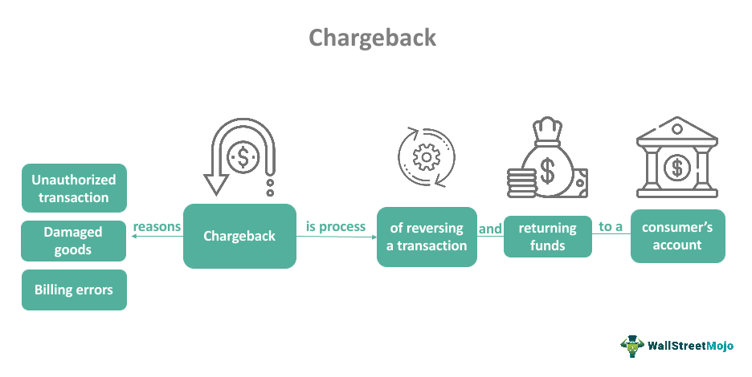

Algorithmic trading, commonly referred to as 'algo trading,' is an integral element of today's financial landscape, affecting how markets operate on a global scale. This method utilizes complex computer algorithms to carry out trading decisions autonomously with high efficiency, speed, and precision. As financial markets grow and evolve, algo trading has become a key strategy for traders seeking to optimize their operations by leveraging technology.

This article examines the intriguing intersection of algorithmic trading with both historical financial concepts and contemporary legal issues, particularly focusing on the so-called 'Polybius' phenomenon. Polybius represents a cautionary chapter in the exploration of financial technologies, highlighting the potential misuse and fraudulent manipulation that can arise even with the most innovative technological applications.



The discussion will center on the meanings and implications of algorithmic mechanisms, specifically examining how these mechanisms are used within the infamous Polybius project. This blockchain initiative ambitiously aimed to merge traditional banking practices with cutting-edge cryptocurrency technologies. Despite its noble ambitions, the project became notorious for its downfall, exacerbated by fraudulent activities and regulatory scrutiny.

In exploring these themes, the article seeks to provide a comprehensive understanding of both the capabilities and risks associated with algo trading. The experience of Polybius serves as a pivotal example within this context, offering insight into how advanced algorithms can be applied, both beneficially and detrimentally, within the financial technology sector. By scrutinizing these elements, we aim to shed light on the potential ramifications and ethical considerations imperative for those engaged in algorithmic trading.

## Table of Contents

## Understanding Algo Trading

Algorithmic trading, commonly referred to as "algo trading," involves using computer algorithms to automate trading processes, allowing for the execution of orders at speeds and volumes that surpass human capabilities. These algorithms, driven by complex mathematical models, are designed to identify and capitalize on market inefficiencies, often referred to as arbitrage opportunities, which are typically fleeting and minuscule.

At the core of algorithmic trading are three critical components:

1. **Data Input**: Successful algo trading heavily relies on accurate and vast datasets, which fuel the algorithms' decision-making processes. This data can include historical price patterns, trading volumes, economic indicators, and real-time market conditions. Traders employ techniques such as data mining and preprocessing to ensure the quality and relevance of the dataset. Advanced algorithms may incorporate machine learning to improve their predictive capabilities based on this data.

2. **Algorithm Analysis**: Algorithms process incoming market data to identify trading signals—actionable insights into price movements—by analyzing this data through predetermined rules and conditions. These algorithms may use techniques from statistical arbitrage, mean reversion, momentum trading, or others depending on the strategy employed. For example, a basic mean reversion strategy might operate under the hypothesis that prices fluctuate around their historical mean and use statistical tools to quantify this behavior.

   An example Python snippet for a simple moving average crossover strategy could be:

   ```python
   def moving_average(data, window_size):
       return data.rolling(window=window_size).mean()

   def generate_signals(prices, short_window, long_window):
       short_ma = moving_average(prices, short_window)
       long_ma = moving_average(prices, long_window)
       signals = pd.DataFrame(index=prices.index)
       signals['signal'] = 0.0
       signals['signal'][short_window:] = np.where(short_ma[short_window:] > long_ma[short_window:], 1.0, 0.0)
       signals['positions'] = signals['signal'].diff()
       return signals
   ```

3. **Automatic Trade Execution**: Once a trading signal is generated, the automated systems execute buy or sell orders seamlessly. This automation is critical for taking advantage of opportunities that may only exist for a fraction of a second. Speed and efficiency are paramount, as delays could lead to missed opportunities. The execution mechanisms integrate directly with trading platforms, often using advanced communication protocols to ensure prompt order fulfillment.

Algor trading reduces the psychological and emotional impact on trading decisions by following a systematic and rules-based approach. However, participants must continuously monitor these systems to mitigate risks such as unforeseen market conditions, software failures, or erroneous data input, which can lead to substantial financial losses.

In summary, [algorithmic trading](/wiki/algorithmic-trading) leverages technology and data to enhance trading efficiency and effectiveness, representing a fusion of finance and advanced computing. Understanding and maintaining the systems involved, through rigorous testing and validation, ensures that algo trading strategies remain robust and aligned with ever-changing market dynamics.

## The Polybius Project: A Failed Promise

The Polybius project, launched in 2017, was envisioned as a revolutionary blockchain-based financial platform that sought to unify the worlds of traditional banking and cutting-edge [cryptocurrency](/wiki/cryptocurrency) technologies. The project's concept was aligned with the growing interest in decentralized finance (DeFi) and aimed to establish a bank that operated entirely within the digital sphere, leveraging blockchain for enhanced security and efficiency. However, despite its promising premise, Polybius gained notoriety due to its association with fraudulent activities.

Branded as a futuristic financial institution, Polybius aimed to attract a significant amount of investment from the cryptocurrency community. It promised high returns through the issuance of Polybius Tokens, which were marketed as representing a share of the project's future profits. The project launched an Initial Coin Offering (ICO) intending to raise capital to fund its ambitious endeavors. The ICO was a significant success initially, attracting millions of dollars from investors eager to participate in what was presented as a groundbreaking financial innovation.

Despite its initial success, the Polybius project eventually became mired in controversy, as allegations of fraudulent activity surfaced. The project's founders were later accused of orchestrating what essentially amounted to a Ponzi scheme. In such schemes, returns for earlier investors are generated from the capital of newer investors rather than from profit earned by the operation of the business. This structure is inherently unsustainable and inevitably leads to collapse once the influx of new investors dries up.

As the project unraveled, it became apparent that the ambitious promises made by the Polybius team were largely unattainable. The collapse of Polybius underscored the potential risks associated with the rapid proliferation of cryptocurrency ventures, where regulatory frameworks are often lacking, and investor protections are minimal. The downfall of Polybius serves as a cautionary tale about the dangers of investing in seemingly revolutionary projects without sufficient oversight and transparency.

## How Polybius Represents Algorithmic Mechanisms

Polybius was an ambitious blockchain initiative that aimed to revolutionize traditional banking by integrating modern financial technologies, notably by utilizing algorithmic mechanisms and blockchain frameworks. Central to its approach was the leveraging of smart contracts on the Ethereum platform to create 'Polybius Tokens.' These tokens were designed to act as a digital representation of shares or a portion of the profits anticipated from the project's activities, essentially transforming the way financial equities could be managed and traded digitally.

Smart contracts, which are self-executing contracts with terms directly written into code, enabled Polybius to automate financial transactions and organizational processes. By using the Ethereum network, these contracts could execute trades and distribute profits automatically when certain conditions were met, ostensibly reducing the need for intermediary institutions and increasing transaction efficiency. In an algorithmic trading context, such automation offered a glimpse into how trading and profit-sharing could be digitized, enhancing transparency and operational efficiency.

Despite its theoretical promise, Polybius highlighted both the potential applications and the shortcomings of integrating algorithmic mechanisms into financial systems. These smart contracts function based on complex algorithms, making decisions with little to no human intervention. In a rapidly changing financial landscape, the ability to execute large volumes of transactions at high speed can create significant advantages but also entails substantial risk. This includes over-reliance on the software's flawlessness and the challenges associated with coding errors or potential exploitation.

Ultimately, while Polybius failed to deliver on its promises due to fraudulent practices, its architectural design illustrated an innovative use of algorithmic trading principles within the blockchain sector. This case serves as an important study in the capabilities and vulnerabilities associated with using sophisticated algorithms and smart contracts in financial technology. Understanding these mechanisms is crucial for developing resilient systems that leverage algorithmic efficiency while effectively managing associated risks.

## Key Lessons from Polybius for Algo Traders

Algorithmic traders should be aware of the unique risks present in the digital finance landscape, as demonstrated by the rise and fall of the Polybius project. One of the foremost lessons from Polybius is the importance of recognizing the potential for fraudulent schemes that may present themselves as legitimate ventures. These schemes can significantly undermine trust and lead to considerable financial losses.

To mitigate such risks, traders must prioritize comprehensive due diligence. This process involves thoroughly evaluating potential investments or ventures to identify any signs of fraud or mismanagement. It includes scrutinizing the project's leadership, underlying technology, and financial backings. Conducting thorough background checks on the team members and examining any past projects for irregularities can also provide insight into the credibility of a venture.

Transparent governance is another critical aspect that algo traders must consider. Projects that operate with clear and open governance structures are generally more reliable. Transparency not only fosters trust but also ensures that all stakeholders are kept informed about the project's activities and any potential risks involved. This contrasts sharply with opaque projects where information is sparse or inaccessible, often a red flag for potential fraudulent activities.

Robust risk management practices are also essential for the safety of algorithmic trading. A comprehensive risk management strategy might involve setting clear parameters for trading algorithms, such as stop-loss orders and diversification strategies to minimize exposure to single points of failure. This helps in safeguarding assets against unforeseen market [volatility](/wiki/volatility-trading-strategies) and potential misconduct.

The experience of the Polybius project, which ended as a cautionary tale, underscores the importance of credibility and sustainability within crypto ventures. Legitimate projects should prioritize long-term goals over short-term gains and exhibit consistent growth backed by solid fundamentals. This focus on sustainability not only benefits traders but also contributes towards the overall stability and maturation of the crypto market.

In conclusion, algorithmic traders must engage with projects that demonstrate integrity, transparency, and robust governance structures. The story of Polybius serves as a stark reminder of the consequences of neglecting these fundamental aspects, and highlights the necessity for traders to remain vigilant, informed, and prepared to navigate the complex world of digital finance.

## The Future of Algo Trading

As technology evolves, algorithmic trading continues to undergo transformative changes, largely driven by the integration of [artificial intelligence](/wiki/ai-artificial-intelligence) (AI) and [machine learning](/wiki/machine-learning). These advancements are not only refining trading strategies but also enhancing decision-making processes. AI's ability to process massive datasets and identify patterns beyond human perception makes it an invaluable asset in optimizing trading algorithms. Machine learning, in particular, empowers systems to learn from historical data, enabling the prediction of market trends and adjustment of strategies accordingly.

The adoption of AI and machine learning in trading algorithms also presents new challenges. One of the significant issues is ensuring that these advanced technologies operate within ethical boundaries and comply with regulatory standards. Algorithmic trading, when left unchecked, can contribute to market volatility and raise concerns over market fairness. As such, it is imperative that developers and regulators collaborate to establish frameworks that mitigate risks while promoting innovation. This includes implementing mechanisms for transparency, accountability, and regular audits of AI-driven trading systems.

Reflecting on projects such as the Polybius venture underscores the necessity of these frameworks. While Polybius attempted to capitalize on disruptive technologies, its descent into fraudulent operations serves as a cautionary example. Learning from such past missteps is essential for creating robust systems that safeguard against unethical practices.

Looking ahead, the future of algorithmic trading will likely see a deeper symbiosis between technology and finance. Innovations will not only focus on speed and efficiency but will also prioritize ethical considerations. By understanding previous failures and successes, the trading community can harness the full potential of algorithms while ensuring their alignment with societal values and regulatory requirements. Ultimately, this approach will pave the way for a more secure and effective implementation of technology in the financial markets.

## Conclusion

Polybius, representing both innovation and challenge, underscores the delicate balance between technological advancement and financial integrity. In a landscape where algorithmic trading continually reshapes markets, the lessons from Polybius prompt traders to maintain vigilance and an informed perspective on the intricate processes and inherent risks. The swift execution and data-driven decisions afforded by algorithmic trading reflect the immense promise technology holds. However, it is crucial to approach these opportunities with caution, ensuring that due diligence and ethical considerations guide innovation.

The trajectory of algorithmic trading signifies a transformative period in finance, characterized by the synthesis of cutting-edge technology and traditional systems. While the benefits of algorithmic trading are clear, including increased efficiency and market accessibility, the risks of mismanagement and fraudulent practices, as highlighted by Polybius, present significant challenges. As we look toward the future, the financial industry must draw from historical lessons, recognizing the need for regulatory frameworks and transparent protocols alongside technological sophistication.

Ultimately, the future of finance will depend not only on embracing technological advancements but also on the continuous application of lessons learned from past challenges. By fostering a culture of responsibility and innovation, the industry can navigate the complex landscape of modern finance more effectively, ensuring that the benefits of algorithmic trading are maximized while minimizing potential pitfalls.

## References & Further Reading

[1]: Marcos Lopez de Prado, ["Advances in Financial Machine Learning"](https://www.amazon.com/Advances-Financial-Machine-Learning-Marcos/dp/1119482089).

[2]: David Aronson, ["Evidence-Based Technical Analysis: Applying the Scientific Method and Statistical Inference to Trading Signals"](https://www.amazon.com/Evidence-Based-Technical-Analysis-Scientific-Statistical/dp/0470008741).

[3]: Stefan Jansen, ["Machine Learning for Algorithmic Trading"](https://github.com/stefan-jansen/machine-learning-for-trading).

[4]: Ernest P. Chan, ["Quantitative Trading: How to Build Your Own Algorithmic Trading Business"](https://www.amazon.com/Quantitative-Trading-Build-Algorithmic-Business/dp/0470284889).

[5]: Bergstra, J., Bardenet, R., Bengio, Y., & Kégl, B. (2011). ["Algorithms for Hyper-Parameter Optimization."](https://dl.acm.org/doi/10.5555/2986459.2986743) Advances in Neural Information Processing Systems 24.