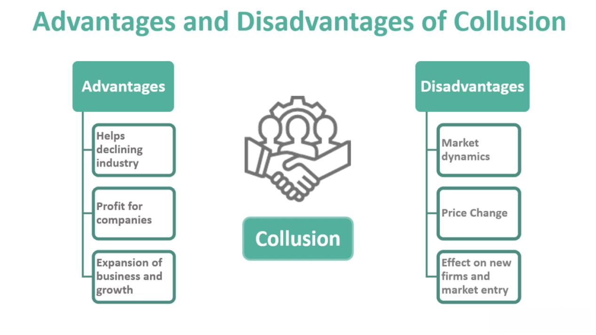

The landscape of cryptocurrency trading continues to evolve with the integration of automated solutions and diverse blockchain platforms. In this article, we will explore the convergence of two significant trends: the Polygon blockchain and algorithmic cryptocurrency trading.

Polygon, a blockchain platform aimed at enhancing Ethereum-compatible networks, offers solutions that improve scalability and efficiency. Initially known as the Matic Network, Polygon serves as a layer 2 scaling solution for Ethereum, focusing on reducing transaction fees and increasing transaction speed without compromising security. By enabling developers to build and connect blockchain networks compatible with Ethereum, Polygon introduces a robust framework to overcome common challenges seen in decentralized networks, such as high gas fees and limited throughput.



Algorithmic trading, on the other hand, employs automation and data analysis to execute trades based on predetermined criteria and strategies. This methodological approach has revolutionized financial markets by increasing transaction speed and precision while eliminating emotional bias. Its incorporation into cryptocurrency markets has been a growing trend, enabling traders to execute transactions strategically and efficiently.

The potential for optimizing cryptocurrency strategies through the amalgamation of Polygon’s unique features and algorithmic trading is vast. With a keen eye on how Polygon can benefit crypto traders, we explore the key advantages and drawbacks posed by this blockchain. Moreover, we examine how algorithmic trading systems can be deployed effectively on Polygon, leveraging its scalable and cost-effective solutions for competitive advantage in the fast-evolving crypto markets.

## Table of Contents

## Understanding Polygon Blockchain

Polygon, originally known as the Matic Network, is a critical layer 2 scaling solution designed to enhance the efficiency of the Ethereum blockchain. By addressing Ethereum's limitations in transaction speed and cost, Polygon significantly reduces transaction fees and increases throughput while maintaining high levels of security. To achieve these improvements, Polygon employs a diverse set of technologies and frameworks that contribute to Ethereum's capability to handle a broader range of applications without congesting the network.

At its core, Polygon aims to act as a protocol and a framework for building and connecting Ethereum-compatible blockchain networks. One of its key features is the use of sidechains, which operate parallel to the main Ethereum chain. These sidechains handle transactions independently, which alleviates congestion on the Ethereum mainnet and results in faster and cheaper transactions. By using a Proof-of-Stake (PoS) consensus mechanism, Polygon ensures that transactions are validated efficiently, and security is maintained across the network.

Furthermore, Polygon introduces a modular set of components that developers can use to customize their blockchain networks, offering flexibility and interoperability with Ethereum. This modular approach includes features such as the Plasma framework for fast and scalable transactions, and the Polygon SDK, which enables the development of standalone networks or the creation of secured chains utilizing the shared security model of the Ethereum mainnet.

For [cryptocurrency](/wiki/cryptocurrency) traders, these enhancements have significant implications. By leveraging Polygon's infrastructure, traders can execute transactions at a much lower cost and with greater speed compared to the Ethereum mainnet alone. High-frequency trading operations benefit from Polygon's efficiency, as the reduced latency and cost make it feasible to implement complex trading algorithms that would be prohibitively expensive on the main Ethereum network.

Additionally, Polygon's compatibility with Ethereum ensures that traders and developers can easily integrate existing Ethereum-based tools and decentralized applications (dApps) into Polygon, thereby enhancing their operational efficiency. The ability to interact with Ethereum's rich ecosystem extends to smart contracts, decentralized exchanges, and non-fungible tokens (NFTs), providing a broader landscape for both innovation and trading opportunities.

In summary, by addressing critical limitations of the Ethereum blockchain, Polygon not only improves transaction speed and cost-efficiency but also empowers developers and traders with a versatile platform for building advanced blockchain solutions. This positions Polygon as a pivotal player in the development of scalable and interconnected blockchain ecosystems.

## Algorithmic Cryptocurrency Trading

Algorithmic trading employs computer algorithms to automatically execute trades according to pre-defined strategies and criteria. This technology has revolutionized traditional financial markets by increasing the efficiency of trade execution and is becoming increasingly significant in the world of cryptocurrencies due to its capacity to handle the fast-paced and volatile nature of these markets.

The fundamental principle behind [algorithmic trading](/wiki/algorithmic-trading) is the automation of the trading process. This involves creating algorithms that analyze various market data, identify trading opportunities, and execute trades with minimal human intervention. By doing so, algorithmic trading eliminates emotional bias, which can often lead to suboptimal decision-making by human traders. For instance, the fear of losses or the greed for more profits can cause traders to react unpredictably in volatile markets. An algorithm, however, adheres strictly to its programmed rules, ensuring consistency in trading decisions.

Moreover, algorithmic trading enhances transaction speed and precision. Traditional manual trading is often limited by the trader's ability to analyze market conditions and execute orders swiftly. Algorithms, on the other hand, can process vast amounts of data and execute corresponding trades in milliseconds, a capability critical in markets where prices can change rapidly. This speed not only helps in capitalizing on short-lived trading opportunities but also reduces the risk of slippage, where the executed trade differs from the intended trade price.

Several strategies can be implemented using algorithmic trading in the cryptocurrency markets:

1. **Trend Following**: This strategy involves using technical indicators such as moving averages to identify market trends and make buy or sell decisions. The algorithm tracks price movements and aims to capture gains by following the trend direction until signs of reversal.

   ```python
   def trend_following(data, short_window=40, long_window=100):
       short_mavg = data['Close'].rolling(window=short_window, min_periods=1).mean()
       long_mavg = data['Close'].rolling(window=long_window, min_periods=1).mean()
       signals = (short_mavg > long_mavg).astype(int)
       return signals
   ```

2. **Arbitrage**: This involves exploiting price inefficiencies between different markets or exchanges. For instance, if Bitcoin is being traded at different prices on two exchanges, an algorithm can simultaneously buy and sell on the respective exchanges to make a profit from the price discrepancy.

3. **Market Making**: Algorithms provide liquidity by placing buy and sell orders for a financial instrument at different prices around the current market price. This strategy takes advantage of the spread between bid and ask prices, profiting from the small differences earned on each transaction.

4. **Mean Reversion**: The strategy is based on the assumption that asset prices will revert to their historical mean. Algorithms monitor price deviations from this mean and execute trades anticipating a reversion.

5. **Machine Learning Models**: Modern algorithmic trading also integrates machine learning, where algorithms learn from historical data to improve predictions of price movements. Techniques like Bayesian models, neural networks, and decision trees are often employed to optimize trading strategies over time.

In conclusion, algorithmic cryptocurrency trading offers substantial benefits by standardizing decision-making, enhancing speed and accuracy, and deploying advanced analytical techniques. As cryptocurrency markets grow and evolve, the sophistication and applicability of algorithmic trading are likely to increase, providing traders with innovative tools to navigate these complex landscapes.

## How Polygon Can Enhance Cryptocurrency Algo Trading

Integrating algorithmic trading with the Polygon blockchain offers distinct advantages, particularly in terms of cost and speed, factors crucial for optimizing trading strategies. Polygon is positioned as an attractive option for high-frequency trading algorithms due to its low transaction fees and faster transaction speeds compared to other blockchain networks, particularly Ethereum.

### Cost Efficiency

Polygon's architecture significantly reduces transaction costs, a [factor](/wiki/factor-investing) of considerable importance for algorithmic traders. Frequent transactions, characteristic of high-frequency trading ([HFT](/wiki/high-frequency-trading-strategies)), incur considerable costs on networks with high transaction fees. Polygon mitigates this issue by providing a more cost-effective environment. This is particularly beneficial for market-making strategies and [arbitrage](/wiki/arbitrage), which demand quick execution across multiple markets. For instance, a typical transaction on Polygon costs a fraction of a cent, compared to the significantly higher costs on Ethereum, where gas fees can vary considerably and inflate quickly during high network congestion periods.

### Speed and Scalability

Transaction speed is a critical component in algorithmic trading. Polygon dramatically increases throughput compared to Ethereum, by processing transactions off-chain and batching them for finalization on the main Ethereum network. This mechanism results in faster transaction confirmations, important for HFT strategies that rely on rapid order execution to capitalize on small price movements. The increased transaction throughput reduces latency, which is a critical factor for maintaining competitive edge in trading algorithms.

### Use Cases and Scenarios

1. **Arbitrage Opportunities**: Traders can exploit price discrepancies between different exchanges or within different trading pairs with minimal delay and cost. These opportunities become more viable on Polygon due to the rapid execution and low transaction costs.

2. **Market Making**: Algorithmic trading systems can create orders to buy and sell, aiming to profit from the bid-ask spread. The reduced fees and increased speeds offered by Polygon are particularly advantageous in maintaining tight spreads, thus enhancing profitability.

3. **Scalable Decentralized Exchanges (DEXs)**: Polygon's infrastructure supports decentralized exchanges, enabling algorithms to operate efficiently without the bottlenecks and high costs typically associated with on-chain transaction processing. This can be crucial for traders leveraging automated strategies in DeFi environments.

### Leveraging Polygon's Features

To leverage Polygon's features effectively, traders need to align their strategies with the platform's strengths. Implementing strategies that capitalize on low latency and transaction cost can result in significant performance improvements. Deploying trading bots on platforms within the Polygon ecosystem, such as QuickSwap or Aave, allows traders to benefit directly from the reduced costs and improved efficiency. Additionally, the interoperability of Polygon with Ethereum provides a seamless transition for existing Ethereum-based strategies and smart contracts, optimizing performance without a complete overhaul of trading systems.

In summary, the enhancement of cryptocurrency algorithmic trading through the integration with Polygon results primarily from cost savings and increased transaction speeds, allowing for more efficient execution of complex trading algorithms. This capability can lead to more profitable trading strategies, highlighting Polygon as a formidable platform for advancing algorithmic trading in cryptocurrency markets.

## Challenges and Considerations

Polygon, while providing significant benefits in terms of scalability and cost-efficiency for cryptocurrency trading, also presents several challenges and considerations for traders. One of the primary concerns is its dependency on the Ethereum network. As a layer 2 scaling solution, Polygon operates adjacent to Ethereum, leveraging its security and network effects but also inheriting its limitations. When Ethereum experiences network congestion, it can indirectly impact Polygon's performance, potentially leading to increased latency or reduced throughput.

Another important aspect to consider is the nascent stage of Polygon's ecosystem. Although rapidly growing, it is still developing compared to more established blockchains. This maturation phase can result in less [liquidity](/wiki/liquidity-risk-premium) and fewer trading pairs, which could pose challenges for executing large trades without significant price slippage.

Traders must also be aware of possible network congestion within Polygon itself. Despite its enhanced capability for managing transactions, times of high demand can strain the network. During these peak periods, transaction speeds may decrease, and fees, albeit lower than Ethereum’s, might increase. This can impact high-frequency trading strategies where timing and cost predictability are essential.

Scalability, while one of Polygon's strengths, also presents a challenge particularly tied to its long-term sustainability. As with any blockchain aiming to scale, maintaining decentralization while increasing throughput is a significant hurdle. The balance between these factors will determine Polygon’s reliability and attractiveness to algo traders as the ecosystem grows.

To address these challenges, traders should incorporate risk management strategies that account for the [volatility](/wiki/volatility-trading-strategies) and operational risks associated with network dependency and congestion. Monitoring the Ethereum network’s status can provide insights into potential periods of strain for Polygon. Furthermore, diversifying trading strategies across multiple platforms can mitigate reliance on any single network.

Developing adaptive algorithms that can respond to network conditions can enhance trading efficiency. For instance, algorithms could be adjusted to reduce trading frequency during periods of high congestion to minimize costs. Additionally, setting specific parameters within trading algorithms to manage slippage and liquidity risk can safeguard against unexpected market conditions.

In conclusion, while Polygon offers distinct advantages for algorithmic trading, awareness and management of its challenges are crucial. By understanding these risks and implementing robust strategies, traders can better position themselves to leverage Polygon's innovative solutions effectively.

## The Future of Algo Trading on Polygon

Polygon has emerged as a prominent player in the blockchain landscape, demonstrating its potential to further transform algorithmic cryptocurrency trading. Recent technological upgrades have broadened its applications within Web3 development and decentralized finance (DeFi). These advancements are expected to reinforce Polygon's standing and drive future innovations in this space.

One potential future direction for Polygon involves enhancing interoperability among various blockchain networks. By providing seamless connectivity with other blockchains, Polygon could facilitate more complex and diversified trading strategies, thereby fostering a more robust trading ecosystem. This multi-chain compatibility could become a cornerstone for traders who seek to diversify their portfolios and reduce risk exposure across different networks.

Another promising development for Polygon is its potential utilization of zero-knowledge proofs (ZKPs) to enhance privacy and security in algorithmic trading. ZKPs enable one party to prove to another that a statement is true without revealing any additional information. Incorporating ZKPs could ensure that sensitive trading strategies remain confidential while still ensuring transaction validity. This feature would be particularly advantageous for institutional traders who need to safeguard their competitive trading strategies.

The transition towards Ethereum 2.0 and the proliferation of Ethereum-compatible solutions underscore the importance of Polygon’s role as a layer 2 scaling solution. Its continued evolution aims to capitalize on these trends, offering faster and cheaper transactions than those available on Ethereum's main chain. As high-frequency trading becomes more prevalent, Polygon's ability to handle high transaction volumes efficiently will be critical. 

Moreover, the rise of decentralized autonomous organizations (DAOs) and their integration within DeFi and trading platforms align with Polygon’s future aspirations. Supporting DAOs could provide algorithmic traders with decentralized governance frameworks, fostering innovation and participation within the community and potentially leading to the development of new and innovative trading strategies.

To position itself for future success, Polygon is expected to continue enhancing its infrastructure to support broader blockchain applications. This strategic growth is aligned with ongoing trends such as increased demand for DeFi solutions and the integration of [artificial intelligence](/wiki/ai-artificial-intelligence) and [machine learning](/wiki/machine-learning) in trading algorithms. By harnessing AI and machine learning, traders could exploit large datasets to identify patterns and improve decision-making processes.

In summary, the ongoing advancements and strategic vision for Polygon indicate a promising future for algorithmic trading on its blockchain. The combination of advanced technological features, growing interoperability, and integration into broader blockchain developments positions Polygon as a formidable platform in the evolving crypto markets. Traders who can adeptly navigate this ecosystem and leverage its capabilities are likely to gain significant competitive advantages.

## Conclusion

Polygon presents a promising platform for enhancing the efficiency of cryptocurrency algorithmic trading through its scalable and cost-effective solutions. Its architecture significantly reduces transaction fees and increases processing speeds, crucial elements for high-frequency trading algorithms. This makes Polygon a strategic choice for traders seeking to optimize their operations on the blockchain, lowering overhead costs while maintaining secure transactions.

Despite certain challenges, such as dependency on Ethereum's network and the relatively young stage of Polygon's ecosystem, traders can strategically manage these risks through comprehensive planning and risk management techniques. This involves staying vigilant about network updates and being prepared for potential scalability issues or network congestion. The implementation of monitoring tools and adaptive trading algorithms can assist in navigating any disruptions, ensuring that trading operations remain efficient and cost-effective.

As the cryptocurrency landscape continues to change, staying informed about platforms like Polygon and their technological developments will be crucial for success. This involves keeping track of software updates, new tools, and enhancements within the ecosystem that could further optimize trading strategies. By remaining adaptable and informed, traders can harness Polygon's full potential, gaining a competitive edge in the fast-evolving crypto markets. Thus, diligent monitoring and continual learning are essential components of a successful trading strategy in the dynamic world of cryptocurrencies.

## References & Further Reading

[1]: ["Polygon (MATIC): A Deep Dive into the Layer-2 Solution."](https://medium.com/@caesararsetya/polygon-matic-the-layer-2-solution-for-ethereums-problems-4afcc44beb7a) Binance Academy.

[2]: ["Algorithmic Trading and DMA: An Introduction to Direct Access Trading Strategies"](https://www.amazon.com/Algorithmic-Trading-DMA-introduction-strategies/dp/0956399207) by Barry Johnson

[3]: ["Scaling Ethereum with Polygon"](https://polygon.technology/blog/layer-2-demystified-how-polygon-scales-ethereum) Ethereum.org

[4]: Buterin, V. (2021). ["The Limits to Blockchain Scalability."](https://vitalik.eth.limo/general/2021/05/23/scaling.html) Vitalik.ca.

[5]: Lee, T., & Sabry, E. (2022). ["Understanding Zero-Knowledge Proofs and Their Applications in Blockchain."](https://link.springer.com/chapter/10.1007/978-981-19-8877-6_5) Journal of Cryptocurrencies and Blockchain Technologies.