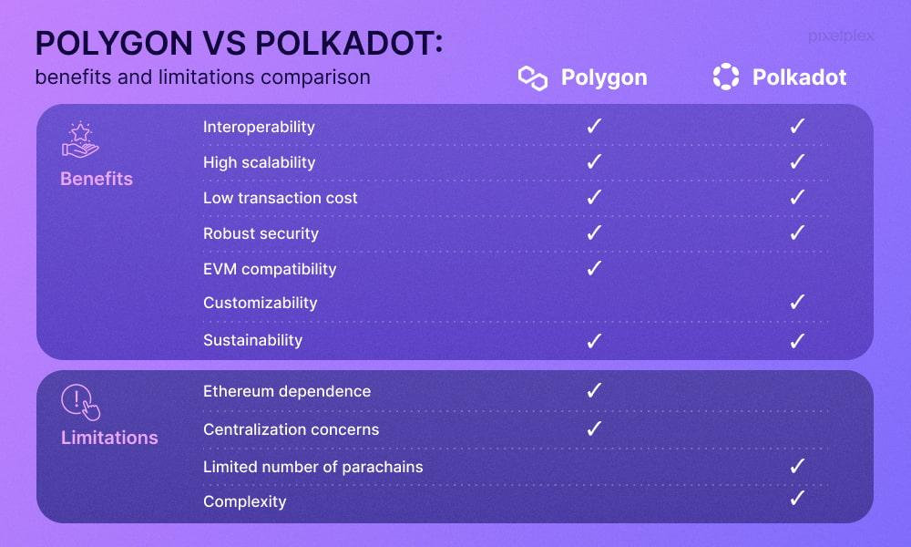

## Table of Contents

## What is Polygon (POL) and what is its primary purpose?

Polygon, also known as POL, is a platform that helps make blockchain technology easier to use and more efficient. It's like a helper for other blockchains, especially Ethereum. Polygon lets developers build and connect different blockchain projects more easily. It does this by providing tools and services that make transactions faster and cheaper.

The main purpose of Polygon is to solve some of the big problems that blockchains like Ethereum face, such as slow transaction times and high costs. By using Polygon, developers can create apps and services that work smoothly and don't cost a lot of money to use. This makes it easier for more people to use blockchain technology for things like games, finance, and other apps.

## How does Polygon aim to solve the scalability issues of Ethereum?

Polygon helps solve Ethereum's scalability issues by creating a system where transactions can happen faster and cheaper. It does this by using something called "sidechains." These are like separate roads that run alongside the main Ethereum road. When there's too much traffic on Ethereum, some of it can move to these sidechains, making everything run smoother. This means that instead of waiting a long time for a transaction to go through on Ethereum, it can happen quickly on a Polygon sidechain.

Another way Polygon helps is by using a technology called "Layer 2 scaling solutions." These are like extra layers that sit on top of Ethereum and help handle more transactions without slowing down the main network. By using these layers, Polygon can process many more transactions per second than Ethereum can on its own. This makes it possible for more people to use blockchain apps without running into the problems of slow speeds and high costs that often happen on Ethereum.

## What are the main components of the Polygon network?

The Polygon network has a few main parts that work together to make it useful. One important part is the Polygon SDK, which is like a set of tools that developers can use to build their own blockchains that work well with Ethereum. This means they can create new projects that are fast and cheap to use. Another key part is the Polygon PoS (Proof of Stake) chain, which is a special blockchain that helps keep everything secure and running smoothly. It uses a method where people can "stake" their [cryptocurrency](/wiki/cryptocurrency) to help run the network and earn rewards.

Another main component is the Polygon Plasma chains, which are like smaller, faster blockchains that connect to Ethereum. They help with handling lots of transactions quickly and cheaply. The last important part is the Polygon Bridges, which are like special roads that let you move your cryptocurrency and data between Ethereum and the Polygon network. These bridges make sure everything can work together smoothly and securely.

## How does Polygon's layer 2 scaling solution work?

Polygon's layer 2 scaling solution works by creating extra layers on top of Ethereum. These layers help handle more transactions without slowing down the main Ethereum network. Imagine Ethereum as a busy highway. When too many cars are on it, traffic gets slow. Polygon's layer 2 solutions are like adding more lanes or side roads where cars can travel faster. This way, more transactions can happen quickly and cheaply, making it easier for people to use blockchain apps without waiting a long time or paying high fees.

One way Polygon does this is by using something called "Plasma chains." These are smaller, faster blockchains that connect to Ethereum. They take some of the traffic off the main Ethereum road and handle it on their own. This means that transactions can happen much faster and at a lower cost. Another way is through "ZK-Rollups," which bundle many transactions together and process them off the main Ethereum chain. This makes the whole system more efficient and able to handle more users at once.

## What are the different types of Polygon's sidechains and their functions?

Polygon uses different types of sidechains to help make Ethereum work better. One type is called Plasma chains. These are smaller blockchains that connect to Ethereum. They help by taking some of the work off the main Ethereum chain. This means that transactions can happen faster and cost less money. Plasma chains are good for things like games or apps where you need to do a lot of transactions quickly.

Another type of sidechain Polygon uses is called the Polygon PoS (Proof of Stake) chain. This is a special blockchain that helps keep everything secure and running smoothly. It uses a method where people can "stake" their cryptocurrency to help run the network and earn rewards. The PoS chain is good for handling a lot of transactions and making sure they are safe and reliable. It's like a strong backbone that supports the whole Polygon network.

Lastly, Polygon also uses something called ZK-Rollups. These are a bit different from the other sidechains. ZK-Rollups bundle many transactions together and process them off the main Ethereum chain. This makes the system more efficient and able to handle more users at once. ZK-Rollups are good for making transactions even faster and cheaper, and they help keep the main Ethereum chain from getting too busy.

## How can developers build and deploy decentralized applications (dApps) on Polygon?

Developers can build and deploy decentralized applications (dApps) on Polygon by using the Polygon SDK. This is like a set of tools that helps them create their own blockchains that work well with Ethereum. They can start by setting up a new project using the SDK, which gives them everything they need to build their dApp. Once they have their project ready, they can use the Polygon PoS chain to make sure their dApp is secure and runs smoothly. They can also use Plasma chains if they need to handle a lot of transactions quickly and cheaply.

After building their dApp, developers can deploy it on the Polygon network. They do this by using the Polygon Bridges, which are like special roads that let them move their dApp from Ethereum to Polygon. This makes it easy to get their dApp up and running on the Polygon network. Once deployed, users can interact with the dApp on Polygon, enjoying faster transactions and lower costs. Developers can also use tools like ZK-Rollups to make their dApp even more efficient, helping it handle more users without slowing down.

## What are the transaction fees like on Polygon compared to Ethereum?

Transaction fees on Polygon are much lower than on Ethereum. When you use Ethereum, you might have to pay a lot of money just to send a simple transaction. This is because Ethereum can get very busy, and when it's busy, the fees go up. On Polygon, the fees are usually just a few cents. This makes it a lot cheaper to use for things like games, trading, or any app where you need to do a lot of transactions.

The reason Polygon has lower fees is because it uses sidechains and other special technologies to handle transactions. These sidechains take some of the work off the main Ethereum network, so there's less traffic and the fees stay low. This makes it easier for more people to use blockchain apps without worrying about high costs. So, if you want to save money on transaction fees, Polygon is a good choice compared to Ethereum.

## What are the security measures implemented by Polygon to protect the network?

Polygon uses a few different ways to keep its network safe. One important way is through the Polygon PoS (Proof of Stake) chain. This is a special blockchain that helps keep everything secure. People can "stake" their cryptocurrency to help run the network. This means they put their money into the system to help it work, and in return, they get rewards. This method makes it hard for anyone to attack the network because it would cost them a lot of money.

Another way Polygon keeps things safe is by using something called checkpoints. These are like regular check-ins that make sure everything is running correctly. Every now and then, the Polygon network takes a snapshot of its state and sends it to the Ethereum main chain. This helps make sure that if anything goes wrong on Polygon, Ethereum can step in and fix it. This connection to Ethereum adds an extra layer of security to the Polygon network.

## How does Polygon facilitate interoperability with other blockchains?

Polygon helps different blockchains work together by using something called Polygon Bridges. These bridges are like special roads that let you move your cryptocurrency and data from one blockchain to another. For example, you can move your tokens from Ethereum to Polygon easily. This makes it simple for developers to build apps that can use different blockchains at the same time, which is really helpful for making their apps work better and reach more people.

Another way Polygon helps with interoperability is by using the Polygon SDK. This set of tools lets developers create their own blockchains that can connect with Ethereum and other networks. By using the SDK, developers can make sure their apps can talk to different blockchains without any trouble. This means that users can use the same app on different blockchains, making everything more connected and easier to use.

## What are the environmental impacts of using Polygon compared to other blockchains?

Polygon is better for the environment than some other blockchains like Bitcoin. Bitcoin uses a lot of energy because it needs powerful computers to solve hard math problems to keep the network safe. This is called "Proof of Work." Polygon, on the other hand, uses a different way called "Proof of Stake." With Proof of Stake, you don't need as much energy because you just need to hold some cryptocurrency to help run the network. This makes Polygon a lot more eco-friendly.

Even though Polygon is better than Bitcoin, it's still not perfect. It's built on top of Ethereum, which used to use Proof of Work but has now switched to Proof of Stake too. This change makes Ethereum and Polygon even better for the environment. But, every time you use Polygon, you're still using some energy. So, while Polygon is a good choice if you care about the environment, it's important to keep looking for even better ways to make blockchain technology greener.

## What are the potential limitations and challenges faced by Polygon?

Polygon helps Ethereum work better, but it still has some problems. One big issue is that it depends a lot on Ethereum. If something goes wrong with Ethereum, it can affect Polygon too. Also, even though Polygon makes things faster and cheaper, it's not perfect. Sometimes, moving things between Ethereum and Polygon can be tricky and might take some time. This can be a problem if you need to do things quickly.

Another challenge for Polygon is keeping the network safe. While it uses good security measures like Proof of Stake and checkpoints, there's always a risk that someone might try to attack the system. Also, as more people use Polygon, it might get busier, which could slow things down or make fees go up a bit. So, while Polygon is a good helper for Ethereum, it still has to work hard to stay fast, cheap, and safe.

## How does Polygon plan to evolve and what are its future development goals?

Polygon wants to keep getting better and help more people use blockchain technology. One of their big goals is to make it even easier for developers to build apps on their network. They plan to do this by adding more tools and making their system work even faster and cheaper. They also want to connect with more blockchains, so that apps can work across different networks without any trouble. This will help make the whole blockchain world more connected and useful for everyone.

Another thing Polygon is working on is making their network even more secure. They want to keep finding new ways to protect the system from attacks and make sure everything runs smoothly. They also want to keep improving how they handle transactions, so that even as more people use Polygon, it stays fast and the fees stay low. By doing all these things, Polygon hopes to become an even better helper for Ethereum and other blockchains, making it easier for people to use and enjoy blockchain apps.

## References & Further Reading

[1]: ["Polygon (MATIC): A Deep Dive into the Layer-2 Solution."](https://medium.com/@caesararsetya/polygon-matic-the-layer-2-solution-for-ethereums-problems-4afcc44beb7a) Binance Academy.

[2]: ["Algorithmic Trading and DMA: An Introduction to Direct Access Trading Strategies"](https://www.amazon.com/Algorithmic-Trading-DMA-introduction-strategies/dp/0956399207) by Barry Johnson

[3]: ["Scaling Ethereum with Polygon"](https://polygon.technology/blog/layer-2-demystified-how-polygon-scales-ethereum) Ethereum.org

[4]: Buterin, V. (2021). ["The Limits to Blockchain Scalability."](https://vitalik.eth.limo/general/2021/05/23/scaling.html) Vitalik.ca.

[5]: Lee, T., & Sabry, E. (2022). ["Understanding Zero-Knowledge Proofs and Their Applications in Blockchain."](https://link.springer.com/chapter/10.1007/978-981-19-8877-6_5) Journal of Cryptocurrencies and Blockchain Technologies.