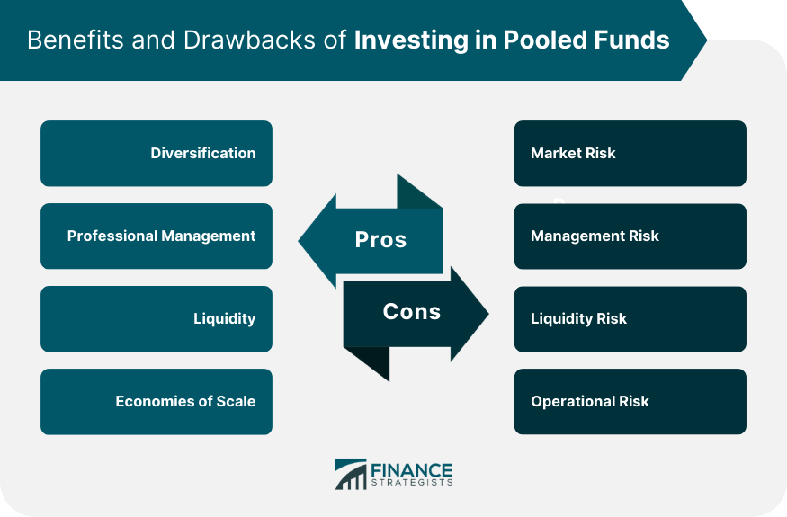

## Table of Contents

## What are pooled funds?

Pooled funds are a type of investment where money from many people is put together into one big pot. This big pot of money is then used to buy different investments like stocks, bonds, or real estate. By pooling their money, investors can own a small part of a larger, more diverse set of investments than they could afford on their own.

These funds are managed by professionals who decide where to invest the money. This can be helpful for people who don't have the time or knowledge to manage their own investments. Pooled funds can be found in different forms, like mutual funds or pension funds. They offer a way for people to invest together and share in the profits or losses of the investments.

## How do pooled funds work?

Pooled funds work by collecting money from lots of different people and putting it all into one big fund. This big fund is then used to buy different kinds of investments, like stocks, bonds, or real estate. When you put your money into a pooled fund, you own a small piece of everything the fund buys. This is good because it lets you invest in a lot of different things without having to buy each one separately, which can be expensive.

The people who run the pooled fund, called fund managers, decide where to invest the money. They use their knowledge to try to pick the best investments. If the investments do well, everyone who put money into the fund can make money. But if the investments don't do well, everyone might lose money. The fund managers charge a fee for their work, which comes out of the money in the fund. This way, everyone in the fund shares the costs and the results of the investments.

## What are some common examples of pooled funds?

Some common examples of pooled funds are mutual funds and pension funds. A mutual fund is a type of pooled fund where many people put their money together to buy a mix of stocks, bonds, or other investments. When you invest in a mutual fund, you own a small part of all the investments the fund holds. This makes it easier for you to have a diverse set of investments without having to buy each one on your own.

Another example is a pension fund. This is a type of pooled fund where money from employees and sometimes their employers is collected to provide retirement benefits. The money in the pension fund is invested in things like stocks, bonds, and real estate. When people retire, they get money from the fund based on how well the investments have done. Both mutual funds and pension funds help people invest together and share the risks and rewards of their investments.

## What are the benefits of investing in pooled funds?

Investing in pooled funds has many benefits. One big benefit is that it lets you spread your money across many different investments. This is called diversification, and it can help lower your risk. If one investment does badly, it won't hurt your whole investment as much because you have others that might do well. Pooled funds make it easier to have a diverse set of investments without having to buy each one separately, which can be expensive.

Another benefit is that pooled funds are managed by professionals. These fund managers know a lot about investing and make decisions about where to put the money. This can be really helpful if you don't have the time or knowledge to manage your own investments. By investing in a pooled fund, you can let the experts handle it and hopefully make your money grow. Plus, the costs of managing the fund are shared among all the investors, which can make it more affordable for everyone.

## What are the potential drawbacks of pooled funds?

One potential drawback of pooled funds is that you have less control over your investments. When you put your money into a pooled fund, you're trusting the fund managers to make the right choices. If they make bad decisions, your money could lose value. Also, you can't pick and choose which specific investments you want to be part of the fund. You have to accept whatever the fund managers decide to buy.

Another issue is that pooled funds come with fees. These fees pay for the fund managers' work and other costs of running the fund. While these fees are shared among all the investors, they can still eat into your returns. If the fund doesn't perform well enough to cover these fees, you might end up with less money than you started with. It's important to understand these costs before you invest in a pooled fund.

Lastly, pooled funds might not be as flexible as other types of investments. If you need to get your money out quickly, you might find it harder with some pooled funds. They often have rules about when and how you can take your money out. This can be a problem if you need your money in a hurry. So, it's good to think about how long you can leave your money in the fund before you invest.

## How do pooled funds differ from individual investment accounts?

Pooled funds and individual investment accounts are different in how they work and what they offer. With a pooled fund, many people put their money together into one big pot. This money is then used to buy a mix of investments like stocks, bonds, or real estate. When you invest in a pooled fund, you own a small part of all these investments. This is good because it helps spread your risk across many different things. On the other hand, an individual investment account is just for you. You put your own money in and you pick and choose what to buy. This gives you more control over your investments, but it can be harder to spread your risk as widely as with a pooled fund.

Another big difference is who manages the investments. In a pooled fund, professional fund managers make the decisions about where to invest the money. They use their knowledge to try to pick the best investments for the fund. This can be helpful if you don't have the time or know-how to manage your own investments. But, you have to pay fees for their work, which can eat into your returns. With an individual investment account, you are in charge. You decide what to buy and sell, and you don't have to pay someone else to manage your money. This can save you money on fees, but it also means you need to know what you're doing to make good choices.

## What types of investors are pooled funds most suitable for?

Pooled funds are most suitable for people who want to invest but don't have a lot of money to start with. Because many people put their money together, you can own a small part of a big mix of investments. This is good if you want to spread your risk without having to buy a lot of different things on your own. It's also great for people who don't have the time or knowledge to pick their own investments. The fund managers do the work for you, so you can just put your money in and let them handle it.

Another group that might like pooled funds are people saving for the long term, like for retirement. Pooled funds like pension funds are set up to help people save over many years. They can be a good choice if you want to invest your money and let it grow over time. But, it's important to remember that pooled funds might not be the best choice for everyone. If you want more control over your investments or need your money quickly, you might want to look at other options.

## How are pooled funds regulated?

Pooled funds are watched over by government groups to make sure they are fair and safe for people who invest in them. In the United States, the main group that does this is called the Securities and Exchange Commission (SEC). The SEC makes rules that pooled funds have to follow. These rules say things like how much the fund managers can charge in fees, what they have to tell investors about the fund, and how they should handle the money. This helps keep the funds honest and protects people's investments.

Other countries have their own groups that do similar things. For example, in the United Kingdom, the Financial Conduct Authority (FCA) looks after pooled funds. They also have rules to make sure funds are run well and that people who invest in them are treated fairly. No matter where you are, these rules are important because they help make sure that pooled funds are a safe place for people to put their money.

## What are the fees associated with pooled funds?

When you put your money into a pooled fund, you usually have to pay some fees. These fees help pay for the work of the fund managers and other costs of running the fund. The main fee you'll see is called the management fee. This is what the fund managers charge for picking the investments and making sure the fund is doing well. Another common fee is the expense ratio, which covers other costs like legal fees, accounting, and marketing. These fees can add up, so it's good to know what you're paying before you invest.

The fees can affect how much money you make from the fund. If the fees are high and the fund doesn't do well, you might end up with less money than you started with. Some funds also charge a fee when you buy or sell shares, called a load fee. There are front-end loads, which you pay when you buy shares, and back-end loads, which you pay when you sell shares. It's important to look at all these fees and think about how they might impact your investment over time.

## How can one evaluate the performance of a pooled fund?

To evaluate the performance of a pooled fund, you need to look at a few key things. One important thing is the fund's return, which is how much money the fund has made over time. You can compare this return to other funds or to a standard like the stock market to see if the fund is doing well. Another thing to check is the risk the fund is taking. Some funds might make more money but also have a higher chance of losing money. You can look at something called the standard deviation to see how much the fund's returns go up and down.

It's also a good idea to see how the fund has done over different time periods, like one year, three years, or five years. This helps you understand if the fund's good or bad performance is just a short-term thing or if it's been consistent. Don't forget to look at the fees you're paying, because high fees can eat into your returns. By looking at all these things together, you can get a good picture of how well a pooled fund is doing and if it's a good choice for your money.

## What are the tax implications of investing in pooled funds?

When you invest in pooled funds, you need to think about taxes. The money you make from the fund can be taxed, but how much you pay depends on where you live and the type of fund you're in. In the United States, for example, you might have to pay taxes on any money the fund makes, like dividends or interest. If you sell your shares in the fund and make a profit, you might have to pay capital gains tax. Some funds, like retirement accounts, have special tax rules that can help you save money on taxes.

It's also good to know that some pooled funds, like mutual funds, can give you something called a capital gains distribution. This happens when the fund sells investments and makes a profit. Even if you don't sell your own shares, you might still have to pay taxes on this money. It's important to look at the tax rules for the specific fund you're thinking about and maybe talk to a tax advisor. They can help you understand how much you might have to pay and find ways to lower your taxes.

## How do global economic conditions affect pooled funds?

Global economic conditions can have a big impact on pooled funds. When the world economy is doing well, like when countries are growing and people are spending more money, pooled funds often do better too. This is because the investments the funds hold, like stocks and bonds, usually go up in value. But if the global economy is struggling, like during a recession, pooled funds can lose money. This happens because the value of the investments can go down when people are worried and not spending as much.

Different types of pooled funds can be affected in different ways by global economic conditions. For example, a fund that invests a lot in one country or region might be hit harder if that area has economic problems. On the other hand, a fund that spreads its investments across many different countries might be safer because it's not as dependent on any one place. It's important for people who invest in pooled funds to keep an eye on what's happening in the world economy and understand how it might affect their money.

## References & Further Reading

[1]: [Koeppel, D. (2019). "What You Need to Know About Pooled Funds." Investopedia.](https://www.investopedia.com/articles/mutualfund/06/pooledasp)

[2]: Lopez de Prado, M. (2018). ["Advances in Financial Machine Learning."](https://www.amazon.com/Advances-Financial-Machine-Learning-Marcos/dp/1119482089) John Wiley & Sons.

[3]: Chan, E. P. (2009). ["Quantitative Trading: How to Build Your Own Algorithmic Trading Business."](https://github.com/ftvision/quant_trading_echan_book) Wiley Trading.

[4]: Jansen, S. (2020). ["Machine Learning for Algorithmic Trading."](https://github.com/stefan-jansen/machine-learning-for-trading) Packt Publishing.

[5]: [Bodie, Z., Kane, A., & Marcus, A. J. (2014). "Investments."](https://books.google.com/books/about/EBOOK_Investments_Global_edition.html?id=BMsvEAAAQBAJ) McGraw-Hill Education.