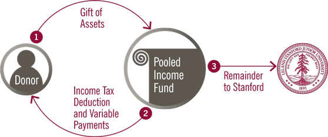

## Table of Contents

## What is a Pooled Income Fund?

A Pooled Income Fund is a type of investment where many people put their money together to earn income. It's like a big pot where everyone contributes, and the money is used to buy things like stocks or bonds that can make money. The income that comes from these investments is shared among all the people who put money into the fund, based on how much each person contributed.

These funds are often used by charities to attract donations. When someone gives money to a Pooled Income Fund run by a charity, they get to enjoy the income it generates during their lifetime. After they pass away, the remaining money in the fund goes to the charity. This way, people can support a cause they care about while also getting some financial benefits for themselves.

## How does a Pooled Income Fund work?

A Pooled Income Fund works by collecting money from many people and using it to buy things like stocks or bonds that can earn money. Everyone who puts money into the fund gets a share of the income it makes, depending on how much they contributed. It's like everyone pooling their money together to make bigger investments that they might not be able to make on their own.

These funds are often set up by charities to encourage donations. When you give money to a Pooled Income Fund run by a charity, you get to receive the income it generates for as long as you live. After you pass away, the money that's left in the fund goes to the charity. This way, you can help support a cause you believe in while also getting some money back during your lifetime.

## What are the benefits of investing in a Pooled Income Fund?

One benefit of investing in a Pooled Income Fund is that you can support a charity you care about while also getting some money back. When you put money into a Pooled Income Fund run by a charity, you get to receive the income it earns for your whole life. This means you can help a good cause and still get some financial help for yourself.

Another benefit is that you can be part of bigger investments. When many people put their money together, the fund can buy things like stocks or bonds that might be too expensive for one person to buy alone. This can lead to more income for everyone in the fund, based on how much each person contributed.

## Who can invest in a Pooled Income Fund?

Anyone can invest in a Pooled Income Fund if they want to help a charity and get some income back. These funds are often set up by charities to attract donations. So, if you care about a certain cause and want to support it, you can put your money into a Pooled Income Fund run by that charity.

When you invest, you get to receive the income the fund makes for as long as you live. After you pass away, the money that's left goes to the charity. This way, you can help a cause you believe in and also get some money back while you're alive.

## How is income distributed in a Pooled Income Fund?

In a Pooled Income Fund, the income is shared among all the people who put money into it. The way it works is that the fund uses the money to buy things like stocks or bonds that can earn money. When these investments make income, it is collected and then divided up among everyone in the fund. The amount of income each person gets depends on how much money they put in compared to everyone else. So, if you put in more money, you get a bigger share of the income.

This kind of fund is often run by charities. When you give money to a Pooled Income Fund set up by a charity, you get to receive the income it makes for your whole life. This means you can help support the charity while also getting some money back. After you pass away, the money that's left in the fund goes to the charity. This way, you can help a cause you care about and still get some income during your lifetime.

## What are the tax implications of investing in a Pooled Income Fund?

When you invest in a Pooled Income Fund, you get some tax benefits. You can get a tax deduction right away for the part of your donation that the charity will get after you pass away. This can lower the amount of taxes you have to pay that year. Also, the income you get from the fund each year is taxed, but it might be taxed at a lower rate than other types of income. This is because the income from the fund is usually taxed as ordinary income, but it might be less than what you would pay on other investments.

There's another tax advantage to think about. When you put money into a Pooled Income Fund, you don't have to pay capital gains tax on the investments the fund makes. This means that if the fund sells stocks or bonds and makes a profit, you won't have to pay taxes on that profit right away. This can be a big help if you want to keep more of your money working for you and the charity you care about.

## How does a Pooled Income Fund differ from other types of investment funds?

A Pooled Income Fund is different from other types of investment funds because it is set up by charities to attract donations. When you put money into a Pooled Income Fund, you get to receive the income it makes for your whole life. After you pass away, the money that's left goes to the charity. This is different from other funds where you might just get money back based on how well the investments do, and there's no charity involved.

Another way a Pooled Income Fund is different is how it handles taxes. When you invest in a Pooled Income Fund, you can get a tax deduction right away for the part of your donation that will go to the charity after you're gone. Also, the income you get each year is taxed, but it might be at a lower rate than other types of income. Plus, you don't have to pay capital gains tax on the investments the fund makes, which is different from many other investment funds where you might have to pay taxes on profits from selling investments.

In summary, a Pooled Income Fund is unique because it combines the benefits of supporting a charity with getting income during your lifetime, and it offers special tax advantages that you might not get with other types of investment funds.

## What are the risks associated with Pooled Income Funds?

Investing in a Pooled Income Fund comes with some risks. One big risk is that the investments the fund makes might not do well. If the stocks or bonds the fund buys go down in value, the income you get could be less than you expected. This means you might not get as much money back as you hoped for, which can be a problem if you were counting on that income.

Another risk is that the charity running the fund might not manage it well. If they make bad choices about what to invest in, it could hurt the fund's performance. Also, since the money left in the fund after you pass away goes to the charity, you have to trust that they will use it in a way that matches your values and goals. If the charity changes its mission or how it operates, it might not be what you wanted to support anymore.

## How can one set up a Pooled Income Fund?

Setting up a Pooled Income Fund is something that charities do because they want to get donations and help people at the same time. If you're part of a charity and want to start a Pooled Income Fund, you need to work with a financial expert or a lawyer who knows about these kinds of funds. They can help you make sure everything is set up the right way. You'll need to decide how the fund will work, like what kinds of investments it will make and how the income will be shared among the people who put money in. You also need to make sure the fund follows all the rules and laws that apply to it.

Once the fund is set up, you can start telling people about it and inviting them to invest. People who want to support your charity can put money into the fund, and they'll get to enjoy the income it makes for their whole life. After they pass away, the money that's left in the fund will go to the charity. It's important to explain all this clearly to anyone who might want to invest, so they know what to expect. With the right setup and clear communication, a Pooled Income Fund can be a great way for a charity to attract donations and help its supporters at the same time.

## What are the management and administrative costs of a Pooled Income Fund?

The management and administrative costs of a Pooled Income Fund can vary depending on who is running it and how big it is. Usually, these costs include paying for people to manage the investments, like choosing what stocks or bonds to buy. There are also costs for keeping track of all the money and making sure it's shared correctly among the people who put money in. Sometimes, there are fees for lawyers or accountants who help make sure everything is done right and follows the rules.

These costs can affect how much income the people in the fund get. If the costs are high, there might be less money left over to share as income. That's why it's important for the charity running the fund to keep these costs as low as they can. They need to find a good balance between spending enough to manage the fund well and not taking too much away from the income that goes to the people who invested.

## How does the performance of a Pooled Income Fund compare to other investment vehicles?

The performance of a Pooled Income Fund can be different from other investment vehicles because it depends on what the fund invests in and how well those investments do. For example, if the fund buys stocks or bonds that go up in value, the income it makes can be good. But if those investments go down, the income might be less than expected. Compared to other funds like mutual funds or ETFs, a Pooled Income Fund might not focus as much on getting the highest returns because it also has to think about giving money to a charity after the investors pass away.

Another thing to think about is that Pooled Income Funds have special tax benefits that other investment vehicles might not have. When you invest in a Pooled Income Fund, you can get a tax deduction right away, and the income you get each year might be taxed at a lower rate. This can make the after-tax performance of a Pooled Income Fund better than other investments, even if the before-tax returns are similar. So, while the raw performance might be similar to other funds, the tax advantages can make a big difference in what you actually keep in your pocket.

## What are the legal and regulatory considerations for managing a Pooled Income Fund?

Managing a Pooled Income Fund means following a lot of rules and laws. These funds are set up by charities, so they have to follow the rules that apply to charities. They also need to follow the rules about investments and taxes. For example, the charity has to make sure the fund is set up the right way and that it follows all the rules about how to share the income and what to do with the money after the investors pass away. They might need to work with lawyers and accountants to make sure everything is done correctly.

Another thing to think about is that the charity has to be open and honest about how the fund works. They need to tell people who want to invest all about the risks and how the income will be shared. They also have to keep good records and report to the government about the fund's activities. This helps make sure the fund is run fairly and that everyone knows what's going on.

## What are the strategies for successful charitable and investment outcomes?

To successfully combine pooled income funds and [algorithmic trading](/wiki/algorithmic-trading) for optimal charitable and investment outcomes, contributors can follow several strategic approaches. 

Firstly, diversifying contributions is critical. This involves allocating resources to a variety of pooled income funds, each with different investment portfolios and strategies. By doing so, contributors can align their investments with specific charitable goals, potentially maximizing both their financial returns and social impact. Diversification minimizes risk by spreading investments across different asset classes, industries, or geographical locations. This approach can be mathematically expressed through optimization models that aim to balance risk and return, such as Modern Portfolio Theory (MPT). The basic goal in MPT is to build a portfolio that provides the highest expected return for a defined level of risk. The optimization problem can be defined as:

$$
\max \left( \mu_p = \sum_{i=1}^{n} w_i \mu_i \right)
$$

Subject to:

$$
\sigma_p^2 = \sum_{i=1}^{n} \sum_{j=1}^{n} w_i w_j \sigma_{ij}
$$

$$
\sum_{i=1}^{n} w_i = 1
$$

where $\mu_p$ is the portfolio expected return, $w_i$ are the weights of each asset in the portfolio, $\mu_i$ are the expected returns of each asset, $\sigma_p^2$ is the portfolio variance, and $\sigma_{ij}$ is the covariance between assets.

Consulting with financial advisors is paramount to tailor these strategies to individual circumstances, ensuring that investments align with both financial and philanthropic goals. Advisors can provide insights into tax implications, legal considerations, and best practices for utilizing algorithmic trading models within pooled funds. Algorithmic trading, characterized by the use of computer algorithms to execute trades at optimal times, can enhance the performance of pooled funds. It uses historical data and statistical analysis to predict market trends, presenting both opportunities and risks. Therefore, expert advice is crucial to effectively integrate these complex systems into pooled income funds.

Future market trends could significantly impact pooled income funds and charitable giving. Economic conditions, regulatory changes, and technological advancements will shape the landscape for these financial instruments. For instance, increased market [volatility](/wiki/volatility-trading-strategies) or shifts in interest rates could affect investment returns within pooled funds. Staying informed about these trends and adapting strategies accordingly can enhance the resilience and effectiveness of charitable contributions.

Finally, contributors should actively pursue emerging trends in finance and philanthropy. The intersection of technology, such as blockchain for transparent charitable transactions, and financial innovation, like socially responsible investing, is continuously evolving. Maintaining an adaptive strategy will position contributors to make informed decisions that align with both their financial objectives and their desire to contribute positively to society. Engaging with current literature, attending financial seminars, and leveraging educational resources are practical ways to remain knowledgeable about these developments.

## References & Further Reading

[1]: Bergstra, J., Bardenet, R., Bengio, Y., & Kégl, B. (2011). ["Algorithms for Hyper-Parameter Optimization."](https://dl.acm.org/doi/10.5555/2986459.2986743) Advances in Neural Information Processing Systems 24.

[2]: ["Advances in Financial Machine Learning"](https://www.amazon.com/Advances-Financial-Machine-Learning-Marcos/dp/1119482089) by Marcos Lopez de Prado

[3]: ["Evidence-Based Technical Analysis: Applying the Scientific Method and Statistical Inference to Trading Signals"](https://www.amazon.com/Evidence-Based-Technical-Analysis-Scientific-Statistical/dp/0470008741) by David Aronson

[4]: ["Machine Learning for Algorithmic Trading"](https://github.com/stefan-jansen/machine-learning-for-trading) by Stefan Jansen

[5]: ["Quantitative Trading: How to Build Your Own Algorithmic Trading Business"](https://www.amazon.com/Quantitative-Trading-Build-Algorithmic-Business/dp/1119800064) by Ernest P. Chan