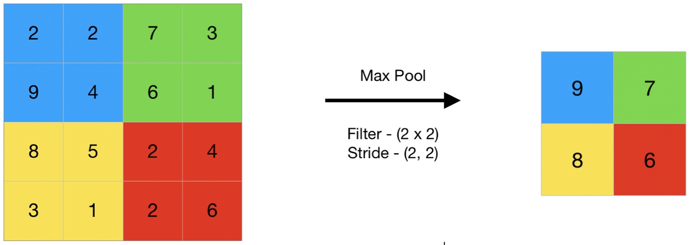

## Table of Contents

## What is a pooling operation in the context of machine learning?

In machine learning, especially in the field of deep learning and convolutional neural networks (CNNs), a pooling operation is a technique used to reduce the spatial dimensions of the input data. This process helps to decrease the computational load, the number of parameters, and the risk of overfitting. Pooling works by sliding a window over the input data and applying a function, like max or average, to the values within that window. For example, if you use max pooling, the highest value in the window is taken as the output for that section of the data.

Imagine you have a large image that you want to process with a neural network. The image might be too big to handle efficiently, so you use pooling to make it smaller. By doing this, you not only speed up the processing but also make the model more robust to small changes in the input, like slight shifts or rotations of the image. This is because pooling helps the network focus on the most important features rather than the exact location of those features in the image.

## What is the primary purpose of using pooling operations in neural networks?

The main goal of using pooling operations in neural networks is to make the network work better and faster. Pooling helps by making the data smaller, which means the computer has less work to do. This is important because big data can slow down the network and make it hard to train. By reducing the size of the data, pooling also helps the network learn the most important parts of the image or data, instead of getting stuck on tiny details.

Another important reason for using pooling is to make the network more able to handle changes in the input. For example, if you're looking at pictures, pooling helps the network recognize the same thing even if the picture is moved a little bit or turned slightly. This makes the network more flexible and better at understanding what it sees. In the end, pooling helps the network perform better and be more useful for tasks like recognizing objects in pictures or understanding spoken words.

## How does Max Pooling work, and what are its advantages?

Max Pooling is a type of pooling operation used in neural networks, especially in convolutional neural networks (CNNs). It works by taking a small window, often called a "pooling window," and sliding it over the input data. For each position of the window, Max Pooling selects the highest value within that window and uses it as the output for that section. For example, if you have a 4x4 grid of numbers and use a 2x2 pooling window with a stride of 2, the window will move across the grid, and for each position, it will pick the largest number in the 2x2 section. This process reduces the size of the data while keeping the most important features.

The main advantage of Max Pooling is that it helps the network focus on the most important parts of the data. By selecting the highest values, it ensures that the network pays attention to strong features, like edges or patterns in an image. This makes the network more robust to small changes in the input, such as shifts or rotations, because it cares more about whether a feature is present rather than its exact location. Additionally, Max Pooling reduces the amount of data the network needs to process, which speeds up training and reduces the risk of overfitting. This makes the network more efficient and better at generalizing to new data.

## What is Average Pooling, and in what scenarios might it be preferred over Max Pooling?

Average Pooling is another type of pooling operation used in neural networks. It works by taking a small window and sliding it over the input data. For each position of the window, Average Pooling calculates the average of all the values within that window and uses it as the output for that section. For example, if you have a 4x4 grid of numbers and use a 2x2 pooling window with a stride of 2, the window will move across the grid, and for each position, it will calculate the average of the numbers in the 2x2 section. This process also reduces the size of the data but focuses on the overall level of the values rather than just the highest ones.

Average Pooling might be preferred over Max Pooling in scenarios where you want to keep more information about the overall data rather than just the most prominent features. For instance, if you're working with data where the average value is more important than the peak values, like in some types of signal processing or when analyzing textures in images, Average Pooling can be more useful. It helps smooth out the data and can be less sensitive to noise or small changes in the input, which can be beneficial in certain applications where preserving the general trend of the data is more important than highlighting specific peaks.

## Can you explain Global Average Pooling and its benefits in reducing model complexity?

Global Average Pooling is a type of pooling operation used in neural networks, especially in the final layers of a [convolutional [neural network](/wiki/neural-network)](/wiki/convolutional-neural-network) (CNN). Instead of using a small window that moves across the data like in regular pooling, Global Average Pooling takes the entire feature map and calculates the average of all the values in it. This results in just one number for each feature map. For example, if you have a feature map that is 7x7 in size, Global Average Pooling will turn it into a single number by averaging all 49 values.

One of the main benefits of Global Average Pooling is that it greatly reduces the complexity of the model. By turning each feature map into a single number, it removes the need for fully connected layers at the end of the network, which can have a lot of parameters. This makes the model simpler and faster to train, and it also helps prevent overfitting because there are fewer parameters to learn. Additionally, Global Average Pooling helps the network focus on the overall presence of features across the entire image, rather than their specific locations, which can improve the model's ability to generalize to new data.

## What is Spatial Pyramid Pooling, and how does it help in handling variable input sizes?

Spatial Pyramid Pooling (SPP) is a technique used in neural networks to handle images of different sizes without having to resize them. It works by dividing the image into different levels of grids, from coarse to fine, and then pooling the values in each grid. For example, at the coarsest level, the image might be divided into a 1x1 grid, and at the finest level, it might be divided into a 4x4 grid. Each grid level uses pooling to turn the values into a fixed number of outputs, which are then combined. This way, no matter the size of the input image, SPP can produce a fixed-length output that can be fed into the next layer of the network.

The main benefit of SPP is that it allows the network to work with images of any size, which is important in many real-world applications where images might come in different dimensions. By using different levels of grids, SPP captures both local and global features of the image, which can improve the network's understanding of the content. This flexibility makes the network more robust and easier to use with diverse datasets, without the need for cropping or resizing images, which can sometimes lose important information.

## How does Center Pooling differ from other pooling methods, and where is it typically applied?

Center Pooling is a type of pooling operation that focuses on the center part of the input data. Unlike Max Pooling or Average Pooling, which look at all values in a window, Center Pooling only takes the value at the center of the window. This means if you have a 3x3 window, Center Pooling will just use the value in the middle. This can be useful when you want to keep the most important part of the data without looking at the surrounding values.

Center Pooling is often used in tasks where the center of an image or feature map is more important than the edges. For example, in object detection, the center of an object might be more critical for identifying what the object is. By focusing on the center, Center Pooling can help the network pay attention to the key parts of the data, making it more efficient and effective for certain applications.

## What are the mechanics and advantages of using Cascade Corner Pooling in object detection tasks?

Cascade Corner Pooling is a special kind of pooling used in object detection tasks. It works by looking at the corners of an object's bounding box and using the information from these corners to better understand where the object is. Imagine you have a picture with a car in it. Cascade Corner Pooling would focus on the four corners of the box around the car. It starts by pooling the values at each corner and then combines these values in a way that helps the network see the whole shape of the object more clearly. This is different from regular pooling, which might look at the whole area inside the box, because it pays special attention to the edges and corners.

The main advantage of using Cascade Corner Pooling is that it helps the network detect objects more accurately, especially when the objects are small or close together. By focusing on the corners, the network can better understand the exact shape and location of the object. This is really helpful in busy scenes where there are many objects, like in a crowded street or a busy store. Cascade Corner Pooling makes the network better at telling objects apart, even if they are touching or overlapping. This leads to more precise object detection, which is important for tasks like self-driving cars or security systems where knowing exactly where things are can make a big difference.

## How does Adaptive Feature Pooling adjust to different feature map sizes, and what are its applications?

Adaptive Feature Pooling is a way to make sure that different sizes of feature maps in a neural network can be handled easily. It works by changing the size of the pooling window depending on the size of the input. So, if you have a big feature map, Adaptive Feature Pooling will use a bigger window to pool the values, and if you have a small feature map, it will use a smaller window. This means the network can work with different sizes of images or data without needing to change the structure of the network. It's like having a flexible tool that can adapt to whatever size of data you throw at it.

This method is really useful in tasks where you might have images or data of different sizes. For example, in medical imaging, the size of the scans can vary a lot, and Adaptive Feature Pooling helps the network process all these different sizes without trouble. It's also helpful in tasks like object detection in videos, where the size of objects can change from frame to frame. By using Adaptive Feature Pooling, the network can keep working well no matter the size of the input, making it more versatile and easier to use in real-world situations.

## What is Generalized Mean Pooling, and how does it generalize over Max and Average Pooling?

Generalized Mean Pooling, often called GeM Pooling, is a way to combine the best parts of Max Pooling and Average Pooling. It does this by using a special formula that can change how it works. The formula is $$ P = \left( \frac{1}{n} \sum_{i=1}^{n} x_i^p \right)^{\frac{1}{p}} $$. Here, $$ x_i $$ are the values in the window, $$ n $$ is the number of values, and $$ p $$ is a number that you can change. When $$ p $$ is very big, GeM Pooling acts a lot like Max Pooling, focusing on the highest values. When $$ p $$ is 1, it works just like Average Pooling, taking the average of all the values. By changing $$ p $$, you can make GeM Pooling do something in between Max and Average Pooling, which can be really helpful.

This flexibility makes GeM Pooling useful in many different situations. For example, in image recognition tasks, you might want to focus on the most important features like Max Pooling does, but also keep some information about the overall picture like Average Pooling does. By choosing the right value for $$ p $$, you can get the best of both worlds. GeM Pooling has been shown to work well in tasks like image retrieval and classification, where it helps the network understand the images better and perform better overall.

## Can you describe the function of Strip Pooling and its impact on capturing long-range dependencies?

Strip Pooling is a type of pooling used in neural networks to help the network see things that are far apart in an image. It works by taking long, thin slices of the image, either horizontally or vertically, and then pooling the values in these slices. This way, the network can understand how things are connected across the whole image, not just in small areas. For example, if you have a picture of a road that goes from one side to the other, Strip Pooling can help the network see the whole road, not just parts of it.

The main benefit of Strip Pooling is that it helps the network capture long-range dependencies. This means it can understand how different parts of the image are related, even if they are far away from each other. This is really helpful in tasks like understanding scenes in pictures or detecting objects that might be spread out. By using Strip Pooling, the network can get a better overall picture of what's going on, which can make it perform better in real-world situations where things are not always close together.

## What advanced pooling techniques like SoftPool or Hopfield Layer offer over traditional pooling methods in terms of performance and flexibility?

SoftPool and Hopfield Layer are advanced pooling techniques that offer improvements over traditional methods like Max Pooling or Average Pooling. SoftPool, for example, uses a soft selection process instead of [picking](/wiki/asset-class-picking) the highest or average value in a window. It looks at all the values in the window and gives each one a weight based on how important it is. This means SoftPool can keep more information from the input, making the network better at understanding the whole picture. SoftPool helps the network be more flexible because it can adapt to different kinds of data without losing important details.

The Hopfield Layer, on the other hand, uses ideas from Hopfield networks, which are good at remembering patterns. In pooling, the Hopfield Layer helps the network find and keep important features in the data by using a special kind of memory. This can make the network better at tasks like recognizing objects in images, even when the objects are in different positions or slightly changed. Both SoftPool and the Hopfield Layer give the network more flexibility and better performance by keeping more of the original data's information and being able to handle different kinds of inputs more effectively.

## References & Further Reading

[1]: LeCun, Y., Bottou, L., Bengio, Y., & Haffner, P. (1998). ["Gradient-based learning applied to document recognition."](https://ieeexplore.ieee.org/document/726791) Proceedings of the IEEE, 86(11), 2278-2324.

[2]: Zeiler, M. D., & Fergus, R. (2014). ["Visualizing and understanding convolutional networks."](https://arxiv.org/abs/1311.2901) In European Conference on Computer Vision (pp. 818-833). Springer, Cham.

[3]: Krizhevsky, A., Sutskever, I., & Hinton, G. E. (2012). ["ImageNet classification with deep convolutional neural networks."](https://dl.acm.org/doi/10.1145/3065386) Advances in neural information processing systems, 25.

[4]: Szegedy, C., Liu, W., Jia, Y., Sermanet, P., Reed, S., Anguelov, D., ... & Rabinovich, A. (2015). ["Going deeper with convolutions."](https://ieeexplore.ieee.org/document/7298594) In Proceedings of the IEEE conference on computer vision and pattern recognition (pp. 1-9).

[5]: He, K., Zhang, X., Ren, S., & Sun, J. (2015). ["Delving deep into rectifiers: Surpassing human-level performance on imagenet classification."](https://arxiv.org/abs/1502.01852) In Proceedings of the IEEE international conference on computer vision (pp. 1026-1034).

[6]: Lin, M., Chen, Q., & Yan, S. (2013). ["Network in network."](https://arxiv.org/abs/1312.4400) arXiv preprint arXiv:1312.4400.

[7]: He, K., Zhang, X., Ren, S., & Sun, J. (2014). ["Spatial pyramid pooling in deep convolutional networks for visual recognition."](https://ieeexplore.ieee.org/document/7005506) IEEE Transactions on Pattern Analysis and Machine Intelligence, 37(9), 1904-1916.