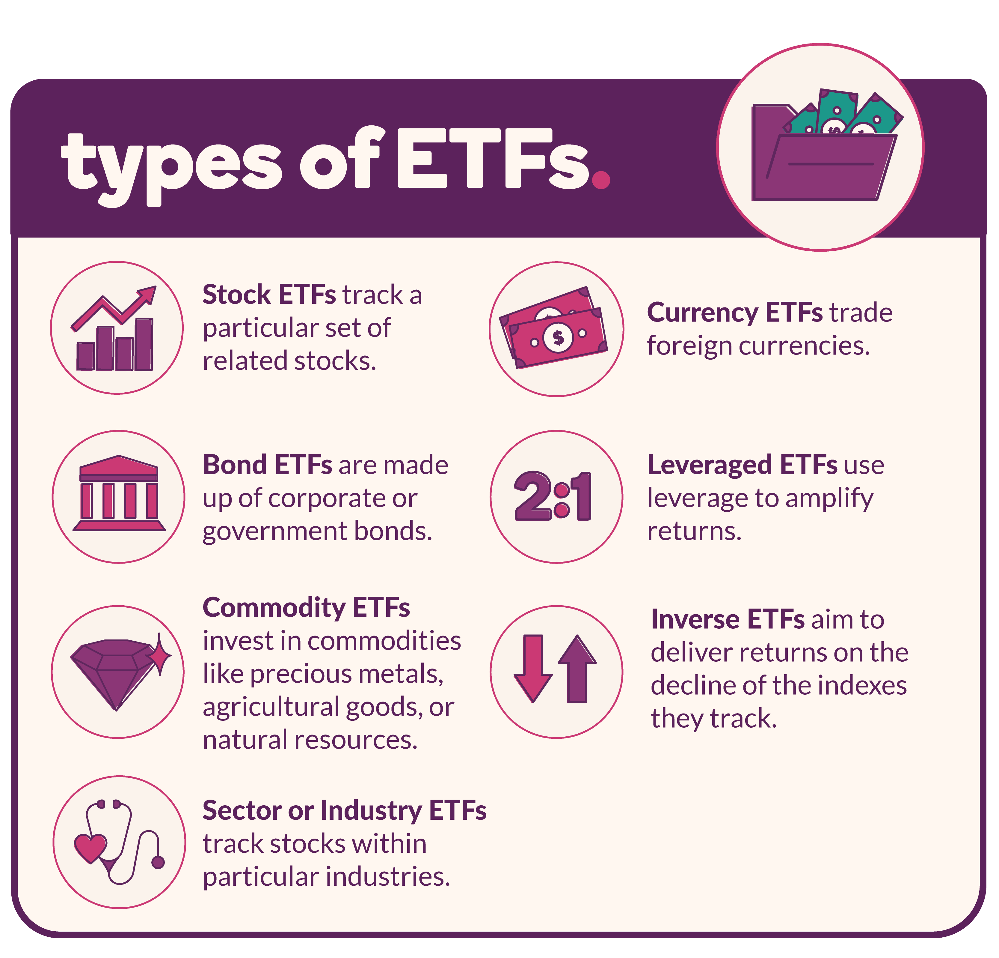

Creating a well-balanced investment portfolio is essential for optimizing returns while minimizing risks. Among the numerous investment vehicles available, Exchange-Traded Funds (ETFs) have gained substantial traction for their ability to provide diversification, liquidity, and cost-effectiveness. ETFs, which trade like individual stocks on exchanges, offer investors the opportunity to gain exposure to a diverse mix of assets and market sectors with generally lower expense ratios compared to mutual funds. This has made them an attractive option for both individual and institutional investors seeking to enhance their portfolio diversification strategies.

Advancements in technology, particularly algorithmic trading, have increasingly influenced ETF trading and management. Algorithmic trading employs sophisticated computer programs to execute trades at speeds and efficiencies unattainable by human traders. This technological integration has revolutionized the ETF landscape by improving market liquidity, reducing transaction costs, and stabilizing prices. The impact of algorithmic trading extends beyond simple trade execution, reshaping how ETFs are approached and incorporated into investment strategies.

This article examines the key types of ETFs available and their significance in crafting robust investment portfolios. Furthermore, it investigates the transformative role of algorithmic trading in ETF management and trading strategies, highlighting its benefits and challenges. By understanding these dynamics, investors can better navigate the complexities of modern financial markets to optimize their portfolios.

## Table of Contents

## Understanding ETFs

An Exchange-Traded Fund (ETF) is a type of investment fund that aggregates a diverse collection of assets, such as stocks, bonds, or commodities. This aggregation is structured to provide a singular investment vehicle that trades on stock exchanges, in the same manner as individual stocks. This trading framework offers a robust degree of liquidity, as investors can buy and sell ETF shares throughout the trading day at market prices, unlike mutual funds which are only traded at their net asset value (NAV) at the end of the trading day.

ETFs are designed to replicate the performance of a specific index or sector, thereby allowing investors to gain exposure to a broad range of assets without the need to purchase each asset individually. This feature of ETFs makes them inherently diversified, as they typically hold a collection of different assets aligned with the index they aim to track. Consequently, they provide a cost-effective alternative to directly investing in all the securities that make up an index.

The structural advantage of ETFs over mutual funds is pronounced in the context of expense ratios. ETFs generally have lower expense ratios than mutual funds due to their passive management style, which seeks to mirror the performance of a given index rather than actively outperform it. This passive nature often results in reduced management and operational costs. Furthermore, the unique in-kind creation and redemption mechanism of ETFs helps to minimize capital gains distributions, potentially leading to tax-efficiency benefits for the investor.

In summary, ETFs serve as a flexible, liquid, and low-cost investment option, offering diversification across a range of asset classes and sectors. This makes them a valuable tool for both individual and institutional investors aiming for efficient portfolio diversification with reduced management expenses.

## Types of ETFs

An Exchange-Traded Fund ([ETF](/wiki/etf-trading-strategies)) is a versatile investment vehicle that provides exposure to a wide range of assets through different types and structures. Each type of ETF is designed to cater to specific investment strategies and objectives, making them valuable tools for asset diversification.

**Equity ETFs** are among the most common types and are designed to track a specific index, sector, or industry within the stock market. These funds replicate the performance of benchmarks such as the S&P 500 or Nasdaq-100, providing investors with diversified exposure to equities. They are ideal for those looking to invest in broad market trends or specific stock sectors without having to purchase individual stocks.

**Bond or Fixed-Income ETFs** are focused on bonds or other fixed-income investments. They are attractive to investors seeking regular income and interested in managing interest rate risk. Bond ETFs can include government bonds, municipal bonds, corporate bonds, and other debt instruments. These funds offer the liquidity and tradability of stocks while providing income through interest payments.

**Commodity ETFs** grant investors the ability to invest in physical goods like gold, oil, or agricultural products without the need to buy the actual commodity. This type of ETF is beneficial for portfolio diversification and hedging against inflation or currency risk. Commodity ETFs may invest directly in the physical commodities or in futures contracts based on them.

**Currency ETFs** offer exposure to foreign exchange markets and serve as a hedging tool against currency volatility. These funds can be used by investors looking to gain from changes in exchange rates or hedge existing currency exposures in their portfolios. Currency ETFs may track single currencies, such as the Euro or Yen, or a basket of currencies.

**Real Estate ETFs** invest in real estate investment trusts (REITs) and other publicly traded companies in the real estate sector. These funds aim to generate income from property-related assets, providing investors with access to the real estate market's potential returns without having to directly own or manage property.

**Specialty ETFs** encompass unique investment strategies that do not fit neatly into the categories mentioned above. This category includes leveraged ETFs, which aim to amplify the returns of an index through the use of financial derivatives and debt, and inverse ETFs, which seek to profit from declines in the value of an index. These funds are more suitable for short-term investment strategies due to their higher risk and complexity.

In summary, each type of ETF serves a distinct purpose and can be utilized to meet various investment goals. By understanding the different ETF types, investors can strategically allocate their resources to build a well-rounded and diversified portfolio.

## Algorithmic Trading and ETFs

Algorithmic trading is a technology-driven investment approach that leverages computer programs to automate the execution of trades according to pre-defined criteria or algorithms. This method has significantly transformed the trading of Exchange-Traded Funds (ETFs), enhancing both efficiency and effectiveness. By automating the trading process, [algorithmic trading](/wiki/algorithmic-trading) reduces the time and costs associated with manual trading, leading to increased market [liquidity](/wiki/liquidity-risk-premium) and more stable prices for ETFs.

A key feature of algorithmic trading is its ability to swiftly analyze vast datasets and execute trades at speeds impossible for human traders. This capability is crucial for maintaining liquidity in the ETF markets, as it ensures that trades are executed quickly and at the best possible prices. The enhanced liquidity provided by algorithmic trading allows investors to buy and sell ETF shares with minimal price impact, which is particularly important in markets characterized by high [volatility](/wiki/volatility-trading-strategies).

High-frequency trading ([HFT](/wiki/high-frequency-trading-strategies)), a subset of algorithmic trading, plays a notable role in the ETF landscape. HFT strategies involve the use of sophisticated algorithms to trade large volumes of shares at high speed. This trading approach can significantly reduce discrepancies between the market prices of ETFs and their underlying net asset values (NAVs). By continuously adjusting to price movements, high-frequency traders help to keep ETF prices aligned with the actual value of their holdings, enhancing price stability and reliability for investors.

The algorithms used in ETFs' trading are designed to capitalize on short-term market inefficiencies, providing liquidity and tight bid-ask spreads, which are crucial for maintaining fair and efficient markets. For instance, a strategy might involve [arbitrage](/wiki/arbitrage) opportunities where the ETF's listed price diverges from its calculated NAV. Algorithms can automatically execute trades to exploit these deviations, thereby correcting the mispricing.

In summary, algorithmic trading has revolutionized the ETF market by augmenting the speed and accuracy of trading activities, facilitating better liquidity and price stability. High-frequency trading, in particular, ensures that ETF prices remain closely tied to their underlying asset values, benefiting both individual and institutional investors. As technology continues to advance, the role of algorithmic trading in ETF markets is likely to expand, offering new opportunities for market participants.

## Advantages and Disadvantages of Algorithmic Trading in ETFs

Algorithmic trading, particularly in Exchange-Traded Funds (ETFs), offers several advantages that have reshaped the landscape of financial markets. Among its primary benefits is the improvement in market liquidity. Algorithms facilitate increased trading volumes and tighter bid-ask spreads, making ETFs more accessible to a wide range of investors. By automating trade processes, algorithmic trading significantly reduces transaction costs. The enhanced precision and speed of trade execution allow investors to take advantage of minute price differentials, contributing to overall cost efficiency.

Moreover, algorithmic trading enhances trade execution efficiency. Complex algorithms can process vast amounts of market data at speeds unattainable by human traders. This capability ensures trades are executed at optimal prices, improving the average execution price for investors. High-frequency trading (HFT), a subset of algorithmic trading, is instrumental in minimizing discrepancies between ETF prices and their net asset values (NAVs). By rapidly buying and selling ETF shares, HFT strategies help align prices with underlying values, ensuring fair pricing in the market.

However, algorithmic trading is not without its challenges. One significant drawback is the technical risk associated with trading algorithms. These systems are susceptible to software bugs, system failures, and cyber-attacks that could lead to substantial financial losses. Market conditions can rapidly evolve, and algorithms that perform well under certain conditions might fail in unanticipated market shifts. Furthermore, the speed with which algorithms execute trades can exacerbate market volatility during periods of stress, potentially leading to flash crashes.

There is also the risk of market manipulation. Algorithms can be exploited for manipulative practices like spoofing—where fictitious orders are placed and then canceled to influence prices. The opacity of algorithmic strategies can make it difficult to detect such activities, posing a threat to market integrity.

Implementing successful algorithmic trading strategies in the ETF space requires a considerable understanding of market trends and technical analysis. Traders need to develop and maintain sophisticated algorithms that adapt to changing market dynamics. This level of complexity demands substantial technical expertise and resources, posing barriers to entry for smaller investors. Despite these challenges, algorithmic trading continues to play a crucial role in enhancing market dynamics, contributing to the overall growth and maturation of ETF trading.

## Building an Investment Portfolio with ETFs

Exchange-Traded Funds (ETFs) serve as a strategic tool in constructing an investment portfolio, providing the advantage of diversified exposure to a variety of sectors and asset classes. By investing in ETFs, individuals can efficiently distribute their investments across multiple markets like equities, fixed income, commodities, and more, facilitating robust asset allocation. This diversification can potentially mitigate risks and optimize returns over time.

When integrating ETFs into an investment portfolio, investors must first clearly define their investment objectives. This involves establishing the expected rate of return, the timeline for achieving financial goals, and the level of risk they are willing to tolerate. For instance, an investor with a long-term horizon and higher risk tolerance might focus on equity ETFs that promise growth, while a conservative investor seeking stable income might prioritize bond or dividend-focused ETFs.

A crucial step in building a portfolio with ETFs is selecting funds that align with the investor’s goals and risk profile. Investors should consider factors such as the ETF's underlying index, historical performance, expense ratio, and liquidity. Since ETFs are tradable on exchanges like stocks, it's important to assess the trading [volume](/wiki/volume-trading-strategy) to ensure ease of buying or selling shares without significant price impact.

Moreover, regular portfolio evaluation is essential to maintain alignment with financial objectives. Changes in the market environment, shifts in personal circumstances, or altered financial goals may necessitate portfolio adjustments. Periodic rebalancing, for example, involves adjusting the portfolio’s asset allocation back to the intended targets to account for asset value fluctuations. This process helps in managing risk and ensuring the portfolio continues to reflect the investor's strategic plan.

Finally, the incorporation of algorithmic trading strategies can further enhance the efficiency of managing ETF-based portfolios. Tools like rebalancing algorithms or [momentum](/wiki/momentum) strategies can help automate parts of the investment management process, potentially increasing returns while minimizing human error. However, investors should approach such strategies with caution, understanding the underlying mechanics and risks involved.

In summary, ETFs offer investors a versatile mechanism to construct a diversified and balanced portfolio that aligns with their financial goals and risk tolerance. Regular monitoring and adjustment of the portfolio are essential to respond to evolving market conditions and ensure ongoing alignment with strategic objectives.

## Conclusion

Exchange-Traded Funds (ETFs) offer a flexible and economical method for investors to diversify their investment portfolios. By allowing exposure to a broad range of asset classes, sectors, and geographies, ETFs enable investors to mitigate risk and enhance potential returns. The advent of algorithmic trading has revolutionized the ETF trading landscape by improving trade execution efficiency, lowering transaction costs, and offering enhanced liquidity. These advancements have made ETFs more accessible and appealing to a broader range of investors, facilitating their integration into sophisticated investment strategies.

The integration of algorithmic trading into ETF markets has not only increased the speed and accuracy of transactions but has also helped stabilize ETF pricing by reducing the discrepancies between market prices and their underlying net asset values (NAVs). As such, algorithmic trading has played a significant role in improving the overall efficiency and effectiveness of ETF investments.

Investors aiming to optimize their portfolios through ETFs should maintain an awareness of the ever-evolving landscape of these financial instruments and the technological advancements driving their trade. Understanding these dynamics is crucial for leveraging ETFs to their fullest potential and ensuring alignment with their financial goals and risk tolerance. While ETFs provide a powerful tool for portfolio diversification and strength, continuous learning and adaptation to market trends and trading technologies remain essential for investment success.

## References & Further Reading

[1]: ["Advances in Financial Machine Learning"](https://www.amazon.com/Advances-Financial-Machine-Learning-Marcos/dp/1119482089) by Marcos Lopez de Prado

[2]: ["Evidence-Based Technical Analysis: Applying the Scientific Method and Statistical Inference to Trading Signals"](https://www.amazon.com/Evidence-Based-Technical-Analysis-Scientific-Statistical/dp/0470008741) by David Aronson

[3]: ["Machine Learning for Algorithmic Trading"](https://github.com/PacktPublishing/Machine-Learning-for-Algorithmic-Trading-Second-Edition) by Stefan Jansen

[4]: ["Quantitative Trading: How to Build Your Own Algorithmic Trading Business"](https://www.amazon.com/Quantitative-Trading-Build-Algorithmic-Business/dp/1119800064) by Ernest P. Chan

[5]: Poterba, J. M., & Shoven, J. B. (2002). ["Exchange-Traded Funds: A New Investment Option for Taxable Investors"](https://www.nber.org/papers/w8781). National Bureau of Economic Research.