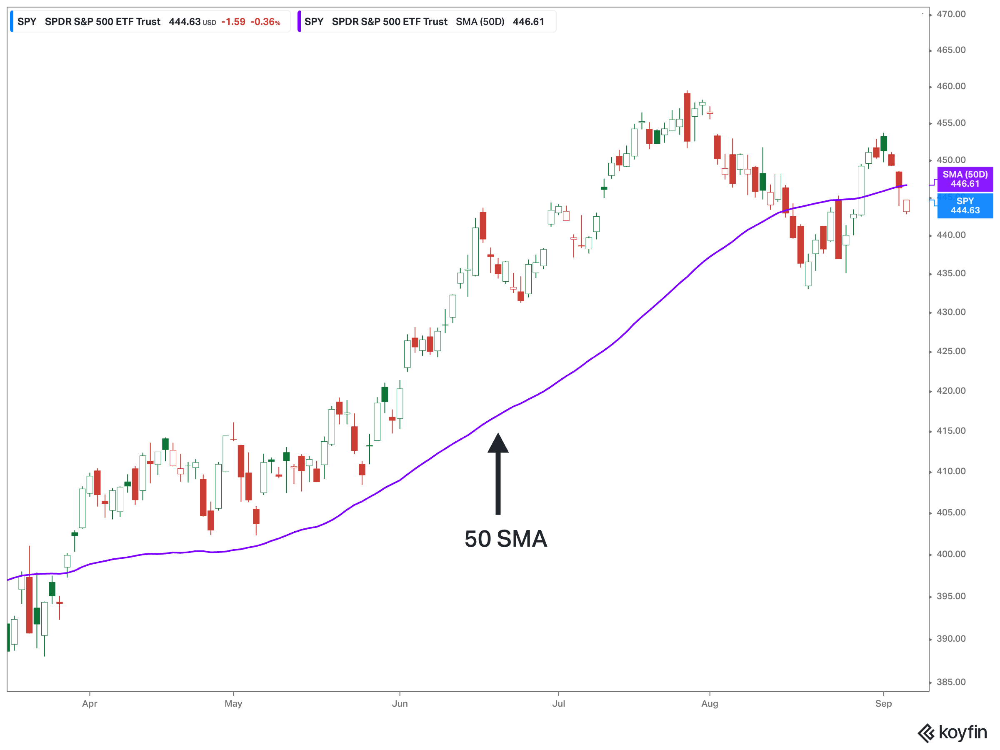

## Table of Contents

## What is a Simple Moving Average (SMA)?

A Simple Moving Average (SMA) is a way to smooth out price data over a certain period of time. It's calculated by adding up the closing prices of a stock or other asset over a set number of time periods and then dividing that total by the number of time periods. For example, if you want a 10-day SMA, you would add up the closing prices for the last 10 days and divide by 10.

SMAs are used by investors and traders to help them understand trends and make decisions. They can show if a stock's price is generally going up or down over time. By comparing the current price to the SMA, people can see if the stock is trading above or below its average price, which can help them decide whether to buy or sell. SMAs are easy to calculate and understand, making them a popular tool in technical analysis.

## How is the 50-day Simple Moving Average calculated?

The 50-day Simple Moving Average (SMA) is calculated by adding up the closing prices of a stock or asset for the past 50 days and then dividing that total by 50. For example, if the closing prices over the last 50 days were $10, $11, $12, and so on, you would add all these numbers together and then divide by 50 to get the average.

This average helps investors see the general trend of the stock's price over the last 50 days. If the current price of the stock is higher than the 50-day SMA, it might mean the stock is doing well and could keep going up. If the current price is lower than the 50-day SMA, it might mean the stock is not doing as well and could keep going down. This information helps people decide when to buy or sell the stock.

## Why is the 50-day period specifically used in trading?

The 50-day period is used in trading because it gives a good picture of how a stock has been doing over a medium amount of time. It's not too short, so it smooths out the small ups and downs that happen every day. It's also not too long, so it can show changes in the stock's price more quickly than a longer average like the 200-day SMA. This makes it helpful for traders who want to see trends without being distracted by daily price changes.

Traders often use the 50-day SMA to decide when to buy or sell a stock. If a stock's price goes above its 50-day SMA, it might be a sign that the stock is starting to do better and could be a good time to buy. On the other hand, if the price drops below the 50-day SMA, it might mean the stock is starting to do worse and could be a good time to sell. Because the 50-day period is a good balance between short and long-term trends, many traders find it very useful.

## What does the 50-day SMA indicate about market trends?

The 50-day Simple Moving Average (SMA) helps show what's happening with a stock's price over about two months. It's like a middle line that smooths out the small ups and downs you see every day. By looking at where the current price is compared to this line, traders can see if the stock is doing better or worse than it has been recently. If the price is above the 50-day SMA, it might mean the stock is in a good spot and could keep going up. If it's below, it might mean the stock is not doing as well and could go down more.

Traders use the 50-day SMA to help them decide when to buy or sell. If a stock's price moves above the 50-day SMA, it can be a sign that the stock is starting to do better. This might be a good time to buy. On the other hand, if the price falls below the 50-day SMA, it could be a sign that the stock is starting to do worse. This might be a good time to sell. The 50-day SMA is popular because it gives a good balance between showing short-term changes and longer-term trends.

## How do traders use the 50-day SMA to make buy or sell decisions?

Traders use the 50-day Simple Moving Average (SMA) to help them decide when to buy or sell a stock. They look at where the stock's current price is compared to the 50-day SMA. If the price goes above the 50-day SMA, it can be a sign that the stock is starting to do better. This might be a good time to buy the stock because it could keep going up. Traders think that if the price is above the average, it means more people want to buy the stock, which could push the price higher.

On the other hand, if the stock's price drops below the 50-day SMA, it might be a sign that the stock is starting to do worse. This could be a good time to sell the stock because it might keep going down. Traders believe that if the price is below the average, it means more people want to sell the stock, which could push the price lower. By watching where the price is compared to the 50-day SMA, traders can make decisions based on whether the stock is doing better or worse than its recent average.

## Can the 50-day SMA be used effectively in all types of markets?

The 50-day Simple Moving Average (SMA) can be used in many types of markets, but it works best in markets that have clear trends. In a trending market, where prices are going up or down over time, the 50-day SMA helps traders see if the stock is doing better or worse than its recent average. If the price is above the 50-day SMA, it might be a good time to buy because the stock could keep going up. If the price is below, it might be a good time to sell because the stock could keep going down.

However, in markets that move sideways, where prices don't go up or down much, the 50-day SMA might not be as helpful. In these markets, the price can move above and below the 50-day SMA a lot, making it hard to tell if the stock is really getting better or worse. So, while the 50-day SMA is a good tool for many markets, it works best when there's a clear trend in the market.

## What are the limitations of relying solely on the 50-day SMA?

Relying only on the 50-day Simple Moving Average (SMA) can have some problems. One big problem is that the 50-day SMA can be slow to show changes in the market. It takes time for the average to catch up with new price changes, so by the time the 50-day SMA shows a new trend, the market might have already moved on. This means traders could miss out on good times to buy or sell if they only look at the 50-day SMA.

Another problem is that the 50-day SMA doesn't work well in markets that don't have a clear up or down trend. If the market is moving sideways, the price can go above and below the 50-day SMA a lot, making it hard to tell if the stock is really getting better or worse. This can lead to wrong decisions about when to buy or sell. So, while the 50-day SMA is helpful, it's best to use it with other tools to get a fuller picture of what's happening in the market.

## How does the 50-day SMA compare to other moving averages like the 200-day SMA?

The 50-day Simple Moving Average (SMA) and the 200-day SMA are both used to see trends in a stock's price, but they look at different time periods. The 50-day SMA looks at the last 50 days, which is about two months. This makes it good for seeing medium-term trends. It can show changes in the stock's price more quickly than the 200-day SMA. Traders often use the 50-day SMA to decide when to buy or sell a stock based on how the current price compares to this average.

The 200-day SMA, on the other hand, looks at the last 200 days, which is about eight months. This makes it better for seeing long-term trends. It's slower to show changes in the stock's price because it takes a longer time period into account. Traders use the 200-day SMA to get a bigger picture of how the stock has been doing over a longer time. Both the 50-day and 200-day SMAs are useful, but they give different information about the stock's trend, so traders often use them together to make better decisions.

## What are some common strategies that incorporate the 50-day SMA?

One common strategy that uses the 50-day SMA is called the "Golden Cross." This happens when the 50-day SMA moves above the 200-day SMA. Traders see this as a strong sign that the stock's price is starting to go up and might keep going up. They might buy the stock when they see a Golden Cross because they think it's a good time to make money. On the other hand, if the 50-day SMA moves below the 200-day SMA, it's called a "Death Cross." This is a sign that the stock's price might start going down, so traders might sell the stock to avoid losing money.

Another strategy is using the 50-day SMA as a support or resistance level. If the stock's price is above the 50-day SMA, traders might see it as a good time to buy because they think the stock's price will keep going up. The 50-day SMA acts like a floor that the price bounces off of. If the stock's price is below the 50-day SMA, traders might see it as a good time to sell because they think the price might keep going down. The 50-day SMA acts like a ceiling that the price can't break through easily.

## How can the 50-day SMA be combined with other technical indicators for better results?

Traders often use the 50-day SMA along with other tools to get a better idea of what's happening with a stock's price. One popular tool to use with the 50-day SMA is the Relative Strength Index (RSI). The RSI helps traders see if a stock is being bought or sold too much. If the RSI is over 70, it might mean the stock is being bought too much and could go down soon. If it's under 30, it might mean the stock is being sold too much and could go up soon. By looking at both the 50-day SMA and the RSI, traders can see if the stock's price is in a good spot and if it's a good time to buy or sell.

Another tool that works well with the 50-day SMA is the Moving Average Convergence Divergence (MACD). The MACD helps traders see when a stock's price might start to change direction. It does this by looking at the difference between two moving averages. If the MACD line crosses above the signal line, it might be a good time to buy because the stock's price could go up. If it crosses below, it might be a good time to sell because the price could go down. By using the 50-day SMA and the MACD together, traders can get a fuller picture of the stock's trend and make better decisions about when to buy or sell.

## What historical examples show the effectiveness of the 50-day SMA in trading?

One well-known example of the 50-day SMA's effectiveness is the performance of Apple Inc. (AAPL) stock in 2019. Throughout that year, the stock's price often moved around the 50-day SMA. When the price went above the 50-day SMA in early January, it signaled a strong upward trend, and the stock price continued to rise for several months. Traders who bought the stock when it crossed above the 50-day SMA would have seen good returns. Later in the year, when the price dipped below the 50-day SMA in May, it indicated a possible downturn. Those who sold the stock at this point avoided some of the losses that followed.

Another example is the S&P 500 index in 2020. During the early stages of the COVID-19 pandemic, the index's price fell sharply, dropping below its 50-day SMA in March. This move below the 50-day SMA was a clear sign of a bearish trend, and many traders sold their positions to limit losses. As the market began to recover in April, the S&P 500 crossed back above its 50-day SMA, signaling a bullish trend. Traders who bought back into the market at this point benefited from the subsequent recovery. These examples show how the 50-day SMA can be a useful tool for making buy and sell decisions based on market trends.

## How have algorithmic traders and quantitative analysts utilized the 50-day SMA in their models?

Algorithmic traders and quantitative analysts often use the 50-day SMA in their models to help them make decisions about when to buy or sell stocks. They look at how the stock's price moves around the 50-day SMA to see if the stock is in a good spot or not. If the price goes above the 50-day SMA, it can be a sign that the stock might keep going up, so they might set their models to buy the stock at that time. On the other hand, if the price goes below the 50-day SMA, it can be a sign that the stock might keep going down, so their models might tell them to sell the stock.

These traders also use the 50-day SMA with other tools in their models to get a better picture of what's happening with the stock's price. For example, they might use the 50-day SMA along with the Relative Strength Index (RSI) or the Moving Average Convergence Divergence (MACD) to see if the stock is being bought or sold too much, or if the price might start to change direction. By combining the 50-day SMA with these other tools, algorithmic traders and quantitative analysts can make their models more accurate and help them make better trading decisions.

## What is the 50-day Moving Average?

The 50-day moving average is a widely utilized tool in technical analysis, designed to calculate the mean closing price of a security over the past 50 trading days. This moving average serves multiple purposes for traders and investors who are keen on evaluating the performance of an asset and generating potential buy or sell signals. Its significance lies in its capacity to smooth out short-term fluctuations and reveal trends over a medium-term horizon.

Mathematically, the 50-day moving average is expressed as:

$$
MA_{50} = \frac{1}{50} \sum_{i=1}^{50} P_i
$$

where $P_i$ represents the closing price of the security on day $i$.

This metric is characterized as a medium-term indicator because it strikes a balance between short-term daily volatilities and long-term trends, allowing traders to identify sustained movements in the asset’s price. By providing insight into both upward and downward trends, the 50-day moving average helps traders to observe areas of support and resistance, which can indicate potential entry or [exit](/wiki/exit-strategy) points in the market.

To effectively apply the 50-day moving average in trading, understanding its construction and implications is essential. Traders often look for crossovers, where the price moves above or below the moving average, as significant signals. An upward crossover might suggest a buying opportunity, while a downward one could warn of a potential sell-off. However, potential users must consider that the 50-day average, being a lagging indicator, might not immediately respond to abrupt market changes, hence requiring complementary tools for robust analysis.

## References & Further Reading

[1]: Bergstra, J., Bardenet, R., Bengio, Y., & Kégl, B. (2011). ["Algorithms for Hyper-Parameter Optimization."](https://dl.acm.org/doi/10.5555/2986459.2986743) Advances in Neural Information Processing Systems 24.

[2]: ["Advances in Financial Machine Learning"](https://www.amazon.com/Advances-Financial-Machine-Learning-Marcos/dp/1119482089) by Marcos Lopez de Prado

[3]: ["Evidence-Based Technical Analysis: Applying the Scientific Method and Statistical Inference to Trading Signals"](https://www.amazon.com/Evidence-Based-Technical-Analysis-Scientific-Statistical/dp/0470008741) by David Aronson

[4]: ["Machine Learning for Algorithmic Trading"](https://github.com/stefan-jansen/machine-learning-for-trading) by Stefan Jansen

[5]: ["Quantitative Trading: How to Build Your Own Algorithmic Trading Business"](https://www.amazon.com/Quantitative-Trading-Build-Algorithmic-Business/dp/1119800064) by Ernest P. Chan