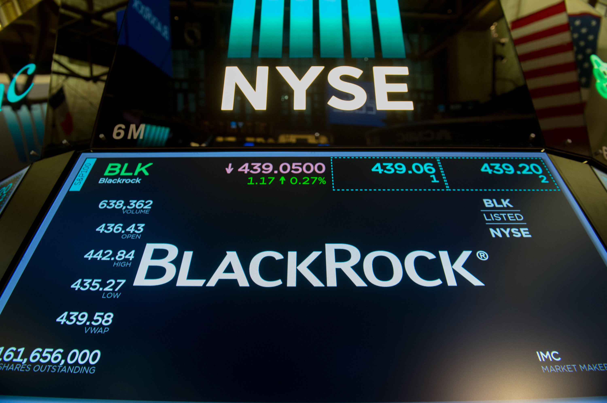

The financial landscape is undergoing a transformation characterized by rapid technological advancements and evolving investment strategies. As digital innovations continue to permeate the financial world, two significant trends have emerged, capturing the attention of both institutional and individual investors: mutual funds and algorithmic trading. These tools are shaping modern investment trends, offering unique advantages while presenting new challenges and opportunities for investors. 

Mutual funds have become a popular investment vehicle due to their ability to offer professional management and diversification. They allow investors to pool their resources into a single portfolio of stocks, bonds, or other securities, effectively spreading the risk across various asset classes. This approach not only appeals to novice investors seeking a straightforward entry into the financial markets but also attracts seasoned investors looking to diversify their holdings further. The accessibility and variety of mutual funds available today mean that investors can tailor their portfolio to match specific financial goals and risk profiles.



On the other hand, algorithmic trading represents a technological leap that redefines trade execution. By leveraging complex computer algorithms, this trading method executes orders at speeds and frequencies that surpass human capabilities. Algorithmic trading offers the promise of efficiency and precision, critical components in the fast-paced financial markets. It plays a crucial role in high-frequency trading where fractions of a second can make a significant difference in the outcome of trades.

As these trends gain momentum, they influence each other, creating a dynamic intersection of traditional and modern investment methodologies. Understanding the implications of mutual funds and the technologies driving algorithmic trading is essential for investors looking to navigate this evolving landscape successfully. Staying informed about these innovations will equip investors to leverage these tools effectively and adapt to emerging market conditions. As financial technology continues to evolve, mutual funds and algorithmic trading are likely to play an increasingly integral role in shaping the future of investment strategies.

## Table of Contents

## The Popularity of Mutual Funds

Mutual funds have emerged as a favored investment vehicle for a broad spectrum of investors, owing to their inherent advantages of professional management and diversification. These funds pool capital from multiple investors to purchase a diverse array of securities, thereby spreading risk and minimizing the impact of adverse movements in individual securities on the overall portfolio. This characteristic makes mutual funds particularly appealing to both novice investors, who may lack the expertise to construct and manage a diversified portfolio independently, and seasoned investors seeking to streamline their investment process.

The appeal of mutual funds is further enhanced by the wide variety they offer, encompassing different asset classes, sectors, and regions. Investors can choose from funds that align with their specific financial goals, such as growth-oriented funds for those seeking capital appreciation or income-focused funds that prioritize dividend and interest payouts. Additionally, the varying risk profiles of mutual funds cater to investors with different risk tolerances, ranging from conservative funds that invest in low-risk securities like government bonds to more aggressive funds targeting high-growth equities.

The proliferation of mutual funds can be attributed to their ability to provide investors with convenient access to professionally managed investment strategies. Managed by experienced fund managers, mutual funds utilize research and analysis to make informed investment decisions, aiming to maximize returns while managing risk. This approach allows investors to benefit from expert insights without having to devote significant time and resources to portfolio management themselves.

The structure and benefits of mutual funds align with the principles of modern portfolio theory, which emphasizes the importance of diversification in reducing risk while optimizing returns. By investing in a mutual fund, individuals can gain exposure to a wide range of assets without the need to make multiple individual investments, thereby simplifying the investment process.

In summary, the popularity of mutual funds is driven by their ability to offer diversification, professional management, and a wide range of investment options tailored to various financial goals and risk appetites. These factors collectively enhance the appeal of mutual funds to investors seeking an efficient and strategic approach to investing in financial markets.

## Investment Strategies for Mutual Funds

Investment strategies are fundamental in determining the performance and viability of mutual funds. These strategies can be broadly categorized into active and passive management, each offering distinct approaches and benefits to investors.

Active management involves a hands-on approach where fund managers actively make investment decisions with the goal of outperforming a benchmark index. This strategy relies heavily on the expertise of fund managers, who use their skills to analyze market trends, economic data, and individual securities to make investment choices. The main advantage of active management is the potential to achieve higher returns than the market average. However, it comes with higher management fees and transaction costs, which can reduce overall returns. It also assumes that managers can consistently identify and capitalize on market inefficiencies, a challenging task.

In contrast, passive management follows a buy-and-hold strategy, aiming to replicate the performance of a specific index or benchmark. This approach minimizes transaction costs and typically results in lower management fees since there are fewer transactions and less need for active oversight. Index funds and exchange-traded funds (ETFs) are common examples of passive strategies. While they may not outperform the market, they often deliver returns that closely match the index after fees, providing a predictable investment outcome. Passive management is attractive to investors seeking cost efficiency and a long-term focus.

Understanding risk-return trade-offs is crucial in mutual fund investment. Investors must assess their risk tolerance and financial goals to choose between active and passive strategies. An essential aspect of this is the concept of portfolio diversification, which involves spreading investments across various asset classes, sectors, or geographical regions. Diversification aims to reduce unsystematic risk, which is specific to individual assets, thereby stabilizing returns over time. The mathematical foundation for this concept is rooted in Modern Portfolio Theory, which posits that an optimal portfolio is one that offers the highest expected return for a given level of risk, or conversely, the lowest risk for a given level of return. 

To illustrate, consider the Python code below that demonstrates a simple calculation of portfolio expected return and [volatility](/wiki/volatility-trading-strategies), given the returns and standard deviations of individual assets:

```python
import numpy as np

# Expected returns and standard deviations of assets
returns = np.array([0.08, 0.12, 0.10])
std_devs = np.array([0.15, 0.20, 0.18])

# Correlation matrix
correlation_matrix = np.array([
    [1.0, 0.9, 0.8],
    [0.9, 1.0, 0.85],
    [0.8, 0.85, 1.0]
])

# Portfolio weights
weights = np.array([0.3, 0.4, 0.3])

# Expected portfolio return
portfolio_return = np.dot(weights, returns)

# Portfolio variance
portfolio_variance = np.dot(weights.T, np.dot(correlation_matrix * np.outer(std_devs, std_devs), weights))
portfolio_std_dev = np.sqrt(portfolio_variance)

print(f"Portfolio Expected Return: {portfolio_return:.2%}")
print(f"Portfolio Volatility (Standard Deviation): {portfolio_std_dev:.2%}")
```

This code calculates the expected return and volatility of a portfolio, demonstrating the potential impact of diversification on reducing risk. By adjusting weights and considering correlations among assets, investors can tailor their portfolios to align with their risk tolerance and return objectives.

In conclusion, the choice between active and passive management strategies, alongside a thorough understanding of risk-return trade-offs and diversification, is central to the success of mutual fund investments. Each strategy offers unique benefits, and the optimal choice depends on individual investor circumstances, goals, and market conditions.

## The Rise of Algorithmic Trading

Algorithmic trading, often known as algo trading, utilizes computer algorithms to execute transactions based on pre-set criteria and strategies, delivering execution speed and precision that surpass human capabilities. The core advantage lies in its ability to process multiple variables and execute high-frequency trades within milliseconds, exploiting tiny price discrepancies across markets that would be nearly impossible for individual traders to identify. 

Globally, [algorithmic trading](/wiki/algorithmic-trading) has emerged as a pivotal force in financial markets. It accounts for a substantial share of trading volumes on major exchanges. For instance, a report by the Bank for International Settlements estimated that in the United States, algorithmic trading is responsible for over 60% of equity market transactions. Such dominance illustrates the profound impact of technology on trade execution within financial markets.

The efficiency of algorithmic trading stems from its ability to continuously analyze a vast array of market data, patterns, and trends to automate complex trading activities without human intervention. This automation results in significant cost reductions in trading, as it minimizes manual errors and curtails the need for human traders. For instance, algorithms can adjust to market conditions dynamically, optimizing the price of each buy or sell order to secure better spreads and lower transaction costs.

Despite these advantages, the rise of algorithmic trading introduces concerns related to market stability and regulatory oversight. The rapid execution of trades can contribute to market volatility, as seen in incidents such as the Flash Crash of May 6, 2010, when major financial indices in the United States plummeted and recovered in a matter of minutes. This event highlighted the potential drawbacks of high-frequency trading, which is a subset of algorithmic trading that executes a large number of orders at extremely high speeds.

Furthermore, the opaque nature of complex algorithms presents challenges in regulatory monitoring and compliance. Regulators are tasked with ensuring that algorithms do not manipulate markets, inadvertently create unfair advantages, or increase systemic risks. This has led to calls for stricter regulatory frameworks and transparency measures to mitigate these risks and protect market integrity.

In summary, while algorithmic trading significantly enhances trading efficiency and reduces costs, it also necessitates vigilant regulation to prevent market disruptions and ensure fair trading practices. As markets continue to evolve, finding a balance between innovation and regulation will be critical to leveraging the full potential of algorithmic trading.

## Integrating Mutual Funds with Algorithmic Trading

The integration of algorithmic trading into mutual fund management represents a transformative approach in modern finance. By leveraging sophisticated computer algorithms, mutual funds can enhance their portfolio performance through precise, data-driven decision-making. This process involves assessing vast amounts of market data to identify optimal trading opportunities and execute trades with high efficiency.

Automated trading systems play a crucial role in the management of large investment portfolios. These systems are designed to execute orders at speeds and frequencies that are beyond human capabilities. For mutual funds, this means the ability to manage large volumes of trades efficiently, minimizing the impact of market fluctuations and taking advantage of fleeting trading opportunities. For instance, high-frequency trading algorithms can analyze numerous data points such as price movements, trading volumes, and other market indicators to make split-second trading decisions.

This integration not only improves execution speed but also reduces transaction costs. By automating the trade execution process, mutual funds can avoid the inefficiencies typically associated with manual trading, such as delays and human error. This cost-efficiency is particularly beneficial for mutual funds, which often handle substantial capital and require precise timing to maximize returns.

Furthermore, combining traditional investment strategies with algorithmic approaches offers mutual funds a competitive edge. Traditional investment wisdom, such as value investing or growth investing, can be enhanced through algorithmic models that provide deeper market insights and back-test strategies against a wide historical dataset. This combination allows for more adaptive asset allocation and risk management practices, which are crucial for maximizing returns in varying market conditions.

For example, an algorithm might be programmed to adjust a mutual fund's portfolio allocation dynamically based on predefined risk tolerance levels and market conditions. This could involve shifting assets between equities and bonds depending on market volatility and forecasted economic trends, thereby optimizing the risk-return profile of the portfolio.

In summary, the blending of algorithmic trading with mutual fund management is a powerful innovation that enhances investment performance by combining traditional investment knowledge with cutting-edge technology. As technology continues to evolve, the potential for further integration increases, promising even more sophisticated strategies and improved outcomes for investors.

## Challenges and Considerations

Mutual funds and algorithmic trading, while providing substantial benefits, also present several challenges that investors and market participants must carefully consider. One of the primary concerns is regulatory scrutiny. Financial markets are subject to extensive regulation to ensure transparency, fairness, and stability, and both mutual funds and algorithmic trading must operate within these regulatory frameworks. Mutual funds, being collective investment vehicles, are monitored to protect investors from excessive risk-taking or mismanagement. Regulatory bodies, such as the U.S. Securities and Exchange Commission (SEC), impose strict compliance requirements that affect how mutual funds are structured and managed.

Algorithmic trading, characterized by its high-speed trade execution, faces its own regulatory challenges. The complexity and opacity of algorithms can make it difficult for regulators to fully understand and monitor these systems. This has led to concerns over algorithm-induced market volatility, as has been observed in events like the 2010 "Flash Crash." The potential for market manipulation through high-frequency trading is another issue that regulatory bodies are actively examining. Regulators are continually developing more sophisticated methods to oversee and control algorithmic trading practices, ensuring that they do not destabilize financial markets.

Investors must also be wary of technological dependencies inherent in these investment approaches. The infrastructure supporting algorithmic trading and mutual fund operations involves complex software and highly available hardware systems. Failures in these systems can lead to significant financial losses. Moreover, the reliance on historical data and algorithmic models may not always accurately predict future market movements, leading to unforeseen risks.

Market volatility is an inherent risk in trading and investment activities, exacerbated by the speed and [volume](/wiki/volume-trading-strategy) of trades facilitated by algorithms. Rapid changes in market conditions can lead to significant price swings, affecting both algorithmic traders and mutual funds, especially those with high exposure to volatile asset classes.

To successfully navigate these complexities, continuous education and adaptation are crucial for investors and fund managers. Staying informed about technological advancements, regulatory changes, and market dynamics is vital. Building a robust understanding of the strengths and limitations of both mutual funds and algorithmic trading strategies can help investors make informed decisions that align with their risk tolerance and financial goals.

Furthermore, integrating risk management practices, such as stress testing and scenario analysis, can aid in anticipating potential impacts of market shocks. Investors should also consider diversification strategies to mitigate risks associated with specific asset classes or trading strategies. As these investment tools continue to evolve, maintaining flexibility and awareness will be key to leveraging their potential while safeguarding against their risks.

## Conclusion

The blend of mutual funds with algorithmic trading represents a pivotal development in the landscape of modern investment strategies. This synthesis offers considerable advantages, such as enhanced portfolio management through data-driven insights and precise execution of trades. By leveraging complex algorithms, investors can achieve optimized asset allocation tailored to specific financial goals and risk appetites. This technological integration not only enhances decision-making but also improves the efficiency of executing trades, crucial for managing the dynamics of diverse investment portfolios.

Staying well-informed and adaptable is essential for investors aiming to capitalize on these innovations. As the financial landscape is continuously reshaped by technological advancements, maintaining awareness of emerging trends and tools is indispensable for successful investment outcomes. This proactive approach is necessary to navigate the volatility and regulatory shifts that accompany the use of algorithmic trading within mutual fund management.

Looking ahead, the continued evolution of technology will likely redefine traditional methods of asset allocation and risk management. Investors who embrace these tools are positioned to harness their potential fully, benefiting from streamlined operations and improved risk assessment. The synergy between mutual funds and algorithmic trading promises to transform investment practices, setting a new standard for efficiency and precision in capital markets.

## References & Further Reading

[1]: Malkiel, B. G. (1973). ["A Random Walk Down Wall Street"](https://en.wikipedia.org/wiki/A_Random_Walk_Down_Wall_Street). W. W. Norton & Company.

[2]: Bodie, Z., Kane, A., & Marcus, A. J. (2018). ["Investments"](https://www.amazon.com/Investments-Zvi-Bodie/dp/1260013839). McGraw-Hill Education.

[3]: ["Algorithmic Trading: Winning Strategies and Their Rationale"](https://books.google.com/books/about/Algorithmic_Trading.html?id=WAlFDwAAQBAJ) by Ernest Chan

[4]: Poterba, J. M., & Shoven, J. B. (2002). ["Exchange-Traded Funds: A New Investment Option for Taxable Investors"](https://www.nber.org/papers/w8781). American Economic Review.

[5]: Andersen, T. G., & Benzoni, L. (2008). ["Realized Volatility"](https://papers.ssrn.com/sol3/papers.cfm?abstract_id=1092203). In Handbook of Financial Econometrics (Vol. 1).