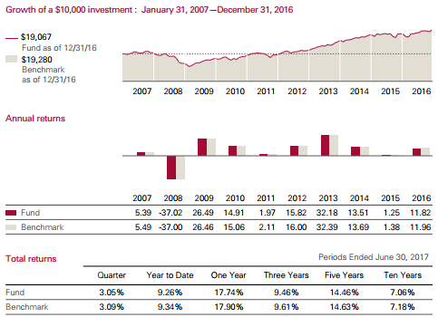

## Table of Contents

## What are mutual funds?

Mutual funds are a type of investment where many people pool their money together to buy a variety of stocks, bonds, or other assets. This is managed by a professional who decides what to buy and sell. When you invest in a mutual fund, you own a small part of the entire fund, not just one stock or bond. This makes it easier for people to invest in a diverse range of assets without needing a lot of money or knowledge about the market.

The main advantage of mutual funds is that they help spread out risk. Because the money is invested in many different things, if one investment does poorly, it might be balanced out by others that do well. This is called diversification. However, mutual funds also have fees, which are costs you pay for the management of the fund. These fees can affect how much money you make from your investment, so it's important to understand them before you invest.

## Why are mutual funds popular among investors?

Mutual funds are popular among investors because they offer an easy way to diversify investments. Instead of buying many different stocks or bonds on their own, which can be expensive and time-consuming, investors can put their money into a mutual fund. This fund then buys a mix of different investments, spreading out the risk. If one company or bond does badly, it might not hurt the overall value of the fund too much because other investments might do well.

Another reason mutual funds are popular is that they are managed by professionals. Many people don't have the time or knowledge to pick individual stocks or bonds. By investing in a mutual fund, they can rely on experts to make those decisions for them. This can be comforting for people who want to invest but feel unsure about doing it themselves.

Lastly, mutual funds are accessible to a wide range of investors. You don't need a lot of money to start investing in them, which makes them attractive to people who are just beginning to save or invest. This accessibility, combined with the benefits of diversification and professional management, makes mutual funds a popular choice for many investors.

## How do mutual funds work?

Mutual funds work by pooling money from many investors to buy a variety of stocks, bonds, or other assets. When you invest in a mutual fund, you're not buying a single stock or bond; instead, you're buying a piece of the entire fund. The fund is managed by a professional who decides which investments to buy and sell. This manager aims to grow the fund's value over time, which in turn increases the value of your investment.

The value of your investment in a mutual fund changes every day based on the performance of the assets the fund holds. If the stocks or bonds in the fund go up in value, the price of the mutual fund goes up too. If they go down, so does the value of the fund. You can usually buy or sell shares of the mutual fund at the end of each trading day at the fund's net asset value (NAV), which is the total value of all the fund's assets minus any liabilities, divided by the number of shares outstanding.

Mutual funds also have fees, which are costs you pay for the management and operation of the fund. These fees can include an expense ratio, which is a percentage of your investment that goes toward paying the fund's operating expenses. There might also be sales charges, known as loads, which you pay when you buy or sell shares. It's important to understand these fees because they can affect how much money you make from your investment in the mutual fund.

## What are the different types of mutual funds?

There are several types of mutual funds, each designed to meet different investment goals. One common type is the equity fund, which mainly invests in stocks. These funds can focus on different things, like large companies, small companies, or companies in certain industries. Another type is the bond fund, which invests in bonds. These funds can be safer than stock funds but usually offer lower returns. There are also balanced funds, which mix stocks and bonds to balance risk and reward.

Another type of mutual fund is the money market fund, which invests in safe, short-term investments like government securities. These funds aim to keep your money safe and provide a small, steady return. Index funds are another popular type, which try to match the performance of a specific market index, like the S&P 500. They usually have lower fees because they don't need a lot of active management. Sector funds focus on a specific part of the economy, like technology or healthcare, which can be riskier but offer the chance for higher returns.

Finally, there are target-date funds, which are designed for people saving for a specific goal, like retirement. These funds automatically adjust their mix of investments over time, becoming safer as you get closer to your target date. International funds invest in companies outside your home country, which can add diversity to your portfolio but also comes with more risk due to things like currency changes. Each type of mutual fund has its own risks and rewards, so it's important to choose one that fits your investment goals and how much risk you're willing to take.

## What are the benefits of investing in mutual funds?

Investing in mutual funds has several benefits. One big advantage is that they help you spread out your risk. When you put your money into a mutual fund, it gets divided among many different stocks, bonds, or other investments. This means if one investment does badly, it might not hurt your overall investment too much because other investments could do well. This is called diversification, and it's like not putting all your eggs in one basket. Another benefit is that mutual funds are managed by professionals. If you don't know a lot about investing or don't have time to pick individual stocks, a mutual fund lets you rely on experts to make those choices for you.

Another benefit of mutual funds is that they are easy to get into. You don't need a lot of money to start investing in them, which makes them a good choice for people who are just beginning to save or invest. This accessibility means more people can take part in the market and grow their money over time. Also, mutual funds are easy to buy and sell. You can usually trade them at the end of each trading day, which gives you flexibility if you need to get your money out quickly. Overall, mutual funds offer a simple way to invest in a diverse range of assets, managed by professionals, and accessible to almost anyone.

## What are the risks associated with mutual funds?

Investing in mutual funds comes with some risks. One big risk is that the value of your investment can go down. This happens if the stocks, bonds, or other things the fund owns lose value. Since mutual funds invest in many different things, if the whole market goes down, your fund might go down too. Another risk is that you might not make as much money as you hoped. Even if the market does well, the fees you pay to the fund manager can eat into your profits. These fees can be high, especially for actively managed funds, and they can make a big difference in how much money you end up with.

Another thing to think about is that mutual funds are not guaranteed. Unlike a savings account, there's no promise that you'll get your money back if things go wrong. If the fund does badly, you could lose some or all of your investment. Also, some mutual funds can be riskier than others. For example, funds that focus on one industry or country can be more up and down than funds that spread their investments across many different areas. It's important to understand these risks and think about how much risk you're okay with before you invest in a mutual fund.

## How can someone start investing in mutual funds?

To start investing in mutual funds, you first need to decide on your investment goals and how much risk you're comfortable with. Are you saving for a big goal like buying a house or for retirement? Or are you just looking to grow your money over time? Once you know your goals, you can choose the right type of mutual fund for you. There are lots of different kinds, like stock funds, bond funds, or balanced funds, each with its own level of risk and potential reward.

Next, you'll need to open an account with a brokerage firm or directly with a mutual fund company. Many people use online brokerages because they're easy to use and often have lower fees. Once your account is set up, you can pick the mutual funds you want to invest in. You'll need to put some money into your account to buy the funds. Some funds let you start with as little as $50 or $100, while others might need more. After you've bought your shares, you can keep an eye on how your investment is doing and add more money over time if you want. Remember, it's a good idea to talk to a financial advisor if you're not sure about anything, as they can help guide you through the process.

## What should investors consider when choosing a mutual fund?

When choosing a mutual fund, investors should first think about their investment goals and how much risk they're okay with. Are you saving for something big like a house or for when you retire? Or do you just want to grow your money over time? Different mutual funds have different levels of risk and reward. For example, stock funds can go up and down a lot but might give you bigger returns, while bond funds are usually safer but don't grow as fast. It's important to pick a fund that matches what you want to achieve and how much risk you can handle.

Another thing to consider is the fees you'll have to pay. Mutual funds charge fees for managing your money, and these can eat into your profits. Look at the expense ratio, which is a percentage of your investment that goes toward running the fund. Some funds also have sales charges, called loads, that you pay when you buy or sell shares. Lower fees mean more money stays in your pocket, so it's a good idea to compare fees when choosing a fund. Also, think about the fund's performance over time. Has it done well compared to similar funds? Past performance isn't a guarantee of future results, but it can give you an idea of how the fund has been managed.

## How do mutual fund fees and expenses impact returns?

Mutual fund fees and expenses can really affect how much money you make from your investment. When you put money into a mutual fund, you have to pay fees for the fund to be managed and run. These fees are usually shown as an expense ratio, which is a percentage of your investment that goes toward paying for things like the fund manager's salary and other costs. The higher the expense ratio, the less money you get to keep. For example, if a fund has a 1% expense ratio, that means for every $100 you invest, $1 goes toward fees every year. Over time, these fees can add up and make a big difference in your returns.

It's also important to know about other fees, like sales charges or loads. These are costs you might have to pay when you buy or sell shares of the fund. Some funds have front-end loads, which you pay when you buy the shares, and others have back-end loads, which you pay when you sell. These fees can take a big chunk out of your investment right away. So, when you're choosing a mutual fund, it's a good idea to look at all the fees and think about how they might affect your returns. Lower fees mean more of your money stays invested and working for you.

## What is the role of a fund manager in a mutual fund?

The fund manager of a mutual fund is like the captain of a ship. They are in charge of making all the important decisions about what to buy and sell in the fund. Their main job is to pick the best stocks, bonds, or other investments that will help the fund grow and meet its goals. They keep a close eye on the market and use their knowledge and experience to make smart choices. This means they are always working to make sure the fund performs well for all the investors who have put their money into it.

The fund manager also has to balance the risks and rewards of the investments they choose. They need to think about how different investments might affect the overall value of the fund and make sure it stays in line with what the fund is supposed to do. For example, if the fund is meant to be safe and steady, the manager will pick more conservative investments. But if the fund is meant to grow quickly, they might choose riskier options. Their decisions can really affect how much money investors make, so it's a big responsibility.

## How do economic conditions affect the performance of mutual funds?

Economic conditions can really change how well mutual funds do. When the economy is doing well, like when people are working and spending money, companies usually make more money. This can make the stocks in a mutual fund go up in value, which is good for the fund. But if the economy is not doing well, like during a recession, companies might struggle, and their stock prices can go down. This can hurt the value of a mutual fund that invests in those stocks. Also, things like interest rates can affect bond funds. If interest rates go up, the value of existing bonds usually goes down, which can make bond funds lose money.

Another way economic conditions affect mutual funds is through inflation and currency changes. If inflation is high, it can eat away at the value of money, which can make it harder for mutual funds to grow. And if a fund invests in companies from other countries, changes in currency values can make a big difference. If the currency of the country where the fund invests gets weaker compared to your own currency, it can lower the value of your investment. So, it's important for investors to keep an eye on the economy and understand how these big changes can affect their mutual funds.

## What advanced strategies can be used to optimize a mutual fund portfolio?

One advanced strategy to optimize a mutual fund portfolio is called rebalancing. This means you check your investments from time to time and make sure they still match your goals. If some of your funds have grown a lot and others haven't, your portfolio might be too focused on one type of investment. Rebalancing helps you sell some of the funds that have grown too big and buy more of the ones that haven't, keeping your investments spread out the way you want. This can help you manage risk and maybe even make more money over time.

Another strategy is to use tax-efficient investing. This means you think about how taxes can affect your returns and try to keep them as low as possible. For example, you might put funds that pay a lot of dividends into a tax-sheltered account like an IRA, where you don't have to pay taxes on the dividends right away. You could also use a strategy called tax-loss harvesting, where you sell funds that have lost value to offset the taxes you owe on the funds that have made money. By being smart about taxes, you can keep more of your investment returns.

Lastly, you might consider using a strategy called dollar-cost averaging. Instead of putting all your money into mutual funds at once, you invest a fixed amount of money at regular times, like every month. This can help you buy more shares when prices are low and fewer when prices are high, which can lower the average price you pay for your investments. Over time, this can help you build a bigger portfolio and maybe even get better returns.

## References & Further Reading

[1]: Malkiel, B. G. (1973). ["A Random Walk Down Wall Street"](https://en.wikipedia.org/wiki/A_Random_Walk_Down_Wall_Street). W. W. Norton & Company.

[2]: Bodie, Z., Kane, A., & Marcus, A. J. (2018). ["Investments"](https://www.amazon.com/Investments-Zvi-Bodie/dp/1260013839). McGraw-Hill Education.

[3]: ["Algorithmic Trading: Winning Strategies and Their Rationale"](https://books.google.com/books/about/Algorithmic_Trading.html?id=WAlFDwAAQBAJ) by Ernest Chan

[4]: Poterba, J. M., & Shoven, J. B. (2002). ["Exchange-Traded Funds: A New Investment Option for Taxable Investors"](https://www.nber.org/papers/w8781). American Economic Review.

[5]: Andersen, T. G., & Benzoni, L. (2008). ["Realized Volatility"](https://papers.ssrn.com/sol3/papers.cfm?abstract_id=1092203). In Handbook of Financial Econometrics (Vol. 1).