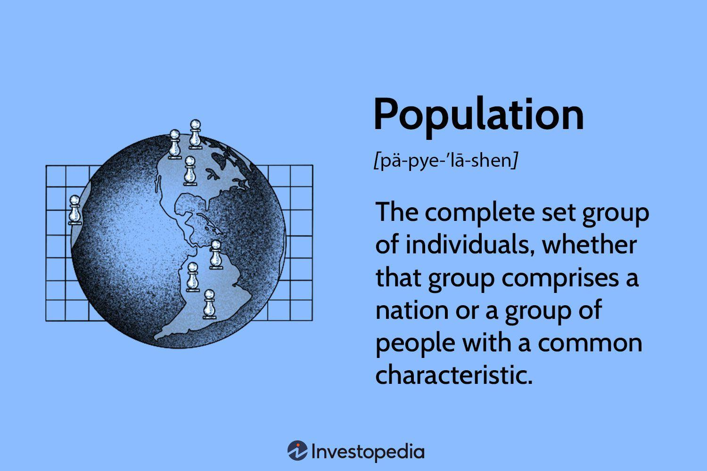

## Table of Contents

## What is population in the context of statistics?

In statistics, population refers to the entire group of people, objects, or events that you want to study. Imagine you want to know the average height of all students in a school. The population in this case would be all the students in that school. It's important because it helps us understand the whole group we are interested in.

However, studying the entire population can be difficult and time-consuming. That's why statisticians often use a smaller group called a sample to make estimates about the population. For example, instead of measuring the height of every student, you might measure the height of just a few students and use that information to guess the average height of all students. This method helps save time and resources while still giving useful information about the population.

## Why is it important to define the population in statistical studies?

Defining the population in statistical studies is really important because it tells us exactly who or what we are studying. Imagine you want to find out how many people in a city like pizza. If you don't clearly say that your population is all the people in that city, you might accidentally study only a small group, like kids at a school. This could give you the wrong idea about how much the whole city likes pizza.

Also, knowing the population helps us pick the right sample. A sample is a smaller group from the population that we study instead of the whole group. If we know our population is all the people in the city, we can make sure our sample includes different kinds of people from the city, not just one type. This way, our study will give us a good guess about the whole city's pizza preferences.

## What are the different methods to measure population in statistics?

One way to measure population in statistics is through a census. A census is when you try to count and gather information about every single member of the population. For example, a country might do a census to find out how many people live there, their ages, and other details. This method gives very accurate information because it includes everyone, but it can be expensive and take a lot of time.

Another way is by using a sample survey. Instead of studying everyone, you pick a smaller group, called a sample, from the population. You study this sample and then use the information to make guesses about the whole population. This method is quicker and cheaper than a census, but it's not as accurate because you're not looking at everyone. It's important to choose a good sample that represents the whole population well.

Sometimes, you might use administrative data, which is information collected by government or other organizations for their own purposes. For example, schools keep records of how many students they have. You can use this data to estimate the population of students. This method can be useful because the data is already collected, but it might not have all the information you need for your study.

## How does sampling relate to population in statistical analysis?

Sampling is a way to study a population in statistics without looking at every single member. Imagine you want to know the favorite ice cream flavor of everyone in your town. Instead of asking every single person, which would take forever, you can ask a smaller group of people, called a sample. If you choose your sample carefully, it can give you a good idea about what the whole town likes. The key is to make sure your sample represents the whole population well, so it includes different kinds of people from the town.

In statistical analysis, sampling helps us save time and money while still getting useful information about the population. If your sample is good, you can make accurate guesses about the whole population. For example, if 60% of your sample likes chocolate ice cream, you might guess that around 60% of the whole town likes it too. But if your sample isn't chosen well, like if it only includes kids, your guess might be wrong. So, choosing the right sample is really important to make sure your study tells you something true about the whole population.

## What are the challenges of measuring an entire population?

Measuring an entire population can be really hard. It takes a lot of time and money to count and gather information about every single person or thing in a big group. For example, if you want to know how many people live in a whole country, you have to go to every house and ask everyone. This means you need a lot of people to help, and it can cost a lot of money to pay them and cover other costs like travel and equipment.

Another challenge is that people might not want to share their information. Some people might not answer your questions, or they might give wrong answers on purpose. This can make your data less accurate. Also, it can be hard to reach everyone, especially if they live in remote areas or move around a lot. If you miss some people, your count won't be right.

Because of these challenges, many times researchers use a smaller group, called a sample, to study instead of the whole population. This can be quicker and cheaper, but it's important to pick a good sample that represents the whole group well. If the sample isn't chosen carefully, the results might not tell you the truth about the entire population.

## What is the difference between a population and a sample?

In statistics, a population is the whole group of people, things, or events that you want to study. For example, if you want to know how many people in a city like ice cream, the population would be everyone in that city. Studying the entire population can be hard because it takes a lot of time and money to gather information about every single person.

A sample, on the other hand, is a smaller group from the population that you actually study. Instead of asking everyone in the city about their ice cream preferences, you might ask just a few people. This is quicker and cheaper, but it's important to choose a sample that represents the whole population well. If your sample is good, you can use it to make good guesses about what the entire population thinks or does.

## How can bias affect population measurement in statistics?

Bias can make population measurement in statistics go wrong. It happens when the way you collect data or choose your sample makes it so that your results don't show the true picture of the whole population. For example, if you're trying to find out what people in a town think about a new park, but you only ask people who live near the park, your results might show that everyone loves the park. But that's not fair to the people who live far away and might not like it as much.

This kind of bias can make your study's results not accurate. If you don't include different kinds of people from the whole population in your sample, you might miss out on important information. For instance, if you're studying how many people in a city like to read books, and you only ask people at a library, your results will be biased because people at the library are more likely to enjoy reading. To get a true picture of the population, you need to make sure your sample is chosen in a way that gives everyone a fair chance to be included.

## What statistical techniques are used to estimate population parameters?

To estimate population parameters, statisticians often use a method called sampling. This means they take a smaller group from the population, called a sample, and study it instead of the whole population. By carefully choosing this sample to represent the whole population, they can make good guesses about things like the average or the total number in the population. For example, if you want to know the average height of all students in a school, you could measure the height of a few students and use that to estimate the average height of all students. This method is quicker and cheaper than studying everyone, but it's important to pick a good sample to make sure the estimates are accurate.

Another technique used is called confidence intervals. This helps statisticians say how sure they are about their estimates. When they study a sample, they can calculate a range of values that they think the true population parameter falls within. For example, they might say that they are 95% confident that the average height of all students is between 5 feet and 5 feet 2 inches. This gives a way to understand how much the estimate might be off, which is really helpful when making decisions based on the data. By using these techniques, statisticians can make good guesses about the whole population even when they can't study everyone.

## How do confidence intervals help in understanding population measurements?

Confidence intervals help us understand how sure we can be about our guesses about a whole group of people or things, which we call the population. Imagine you want to know the average height of all students in a school. Instead of measuring everyone, you measure a smaller group, called a sample. From this sample, you can guess the average height of all students, but you also want to know how accurate your guess is. That's where confidence intervals come in. They give you a range of values that you think the true average height falls within. For example, you might say you're 95% sure that the average height of all students is between 5 feet and 5 feet 2 inches.

This range, or confidence interval, helps you understand the uncertainty in your guess. If the interval is small, it means your guess is pretty precise. If it's big, it means there's more uncertainty. Knowing this helps you make better decisions based on your data. For instance, if you're planning to buy desks for the school, knowing the confidence interval for the average height can help you choose the right size. So, confidence intervals are a useful tool in statistics because they show how confident you can be in your estimates about the whole population.

## What advanced methods exist for handling large populations in statistical analysis?

When you have a really big group of people or things to study, like all the people in a country, it can be hard to gather and analyze all the information. One advanced method to handle this is called big data analytics. This method uses powerful computers and special software to quickly process and analyze huge amounts of data. For example, if you want to know how people's health is affected by their environment, you can use big data analytics to look at health records and environmental data from millions of people all at once. This helps you find patterns and make guesses about the whole population faster and more accurately than older methods.

Another method is called stratified sampling. This is a way to pick a smaller group, or sample, from the big population that still represents everyone well. You divide the big group into smaller groups, or strata, based on things like age, income, or location. Then, you pick a sample from each of these smaller groups. This makes sure your sample includes different kinds of people from the whole population, which helps your study be more accurate. For example, if you want to know what people think about a new law, you can use stratified sampling to make sure you hear from young people, old people, rich people, and poor people, instead of just one type of person.

## How do you assess the accuracy of population estimates in statistical studies?

To assess the accuracy of population estimates in statistical studies, you can use something called a margin of error. This tells you how much your estimate might be off from the real number. For example, if you guess that 50% of people in a city like ice cream, and your margin of error is 5%, the real number could be between 45% and 55%. The smaller the margin of error, the more accurate your estimate is likely to be. You can calculate the margin of error using the size of your sample and how varied the answers are within it.

Another way to check the accuracy of population estimates is by using confidence intervals. A confidence interval gives you a range of values that you think the true population number falls within. For instance, you might say you're 95% sure that the average height of all students in a school is between 5 feet and 5 feet 2 inches. The narrower the confidence interval, the more precise your estimate is. By looking at these intervals, you can see how much uncertainty there is in your guess about the whole population.

Sometimes, you can also compare your estimates to other studies or official data, like a census, to see if they match up. If your estimate is close to what other reliable sources say, it's a good sign that your estimate is accurate. But if your numbers are very different, you might need to look at how you collected your data or chose your sample to find out why.

## What are the latest trends and technologies in population measurement and analysis?

The latest trends in population measurement and analysis involve using big data and advanced technology to gather and process information more quickly and accurately. One big trend is the use of big data analytics, which allows researchers to handle huge amounts of data from sources like social media, health records, and mobile devices. This helps them understand large populations in real-time and find patterns that were hard to see before. For example, during a health crisis, big data can help track how a disease is spreading across different groups of people, which can guide public health decisions.

Another important technology is machine learning, which is a type of artificial intelligence. Machine learning can help analyze population data by finding patterns and making predictions without needing people to tell it exactly what to look for. This can be really useful for things like predicting population growth or understanding how different factors affect people's behavior. For instance, machine learning can look at data from millions of people to predict how many will move to a new city or how many will need certain services. These technologies make population studies more powerful and help us learn more about large groups of people in ways that were not possible before.

## What is Understanding Population Statistics?

Population statistics, often referred to as demographics, are a cornerstone of data analysis, providing critical insights into the composition, characteristics, and dynamics of populations. Such statistics are essential in various domains, including economic forecasting, public policy, and business strategy. The primary objective of population statistics is to quantify and analyze data related to population features such as age, gender, ethnicity, educational attainment, employment, income, and migration patterns.

### Key Metrics and Data Sources in Population Statistics

Population [statistics](/wiki/bayesian-statistics) use a variety of metrics, including but not limited to:

- **Population Size**: The total number of individuals in a specific area.
- **Population Density**: Individuals per unit area, indicating population concentration.
- **Growth Rate**: The rate at which a population is increasing or decreasing.
- **Age Distribution**: The distribution of various age groups within a population.
- **Dependency Ratio**: A measure indicating the ratio of dependents (aged below 15 and over 64) to the working-age population.

Data sources for population statistics include national censuses, household surveys, registration systems (e.g., birth and death registries), and international databases such as those from the United Nations and the World Bank. These sources provide a comprehensive overview of demographic variables necessary for detailed analysis.

### How Population Dynamics Affect Economic Indicators

Population dynamics are closely linked to economic indicators like GDP growth, labor market conditions, and consumer spending. For instance, an aging population might lead to a higher dependency ratio, affecting labor supply and increasing demand for healthcare services. Conversely, a younger demographic can drive economic growth through an abundant workforce and increased consumption.

The formula to calculate the Dependency Ratio is:

$$
\text{Dependency Ratio} = \left(\frac{\text{Number of people aged 0-14} + \text{Number of people aged 65+}}{\text{Number of people aged 15-64}}\right) \times 100
$$

This ratio is critical for understanding the pressures on productive resources and social services.

### Recent Trends in Population Statistics and Demographic Changes

Recent global demographic trends include declining birth rates, increasing life expectancy, urbanization, and migration. Developed countries are experiencing slower population growth due to aging, whereas many developing nations are witnessing rapid urbanization and significant youth bulges. Migration, driven by economic opportunities, conflicts, and climate change, also significantly alters demographic landscapes.

### Implications of Demographic Information for Market Analysis

Demographic information is indispensable for market analysis, influencing everything from product development to marketing strategies. Companies leverage population statistics to identify target markets, tailor products to specific demographic groups, and forecast demand trends. For example, understanding a country's median age can help businesses strategize around millennial preferences or retirement services.

Market analysts use population statistics to predict shifts in economic power and consumer behavior. A rising middle class in emerging markets may lead to increased demand for luxury goods, while a growing elderly population in developed countries might raise the need for healthcare products and services.

In summary, population statistics provide a vital foundation for interpreting economic trends and formulating strategic business and policy decisions. They enable a nuanced understanding of the evolving socio-economic landscape, offering a competitive edge in analysis and decision-making.

## References & Further Reading

[1]: Poterba, J.M. (2001). ["Demographic Structure and Asset Returns."](https://economics.mit.edu/sites/default/files/publications/3211752.pdf) National Bureau of Economic Research, Working Paper No. 8682.

[2]: Chan, E. (2009). ["Quantitative Trading: How to Build Your Own Algorithmic Trading Business."](https://github.com/ftvision/quant_trading_echan_book) Wiley.

[3]: Kissell, R. (2013). ["The Science of Algorithmic Trading and Portfolio Management."](https://www.sciencedirect.com/book/9780124016897/the-science-of-algorithmic-trading-and-portfolio-management) Academic Press.

[4]: United Nations Department of Economic and Social Affairs. ["World Population Prospects 2022."](https://population.un.org/wpp/) United Nations.

[5]: World Bank. ["World Development Indicators."](https://databank.worldbank.org/reports.aspx?source=2&country=ARE) World Bank Data Catalog.