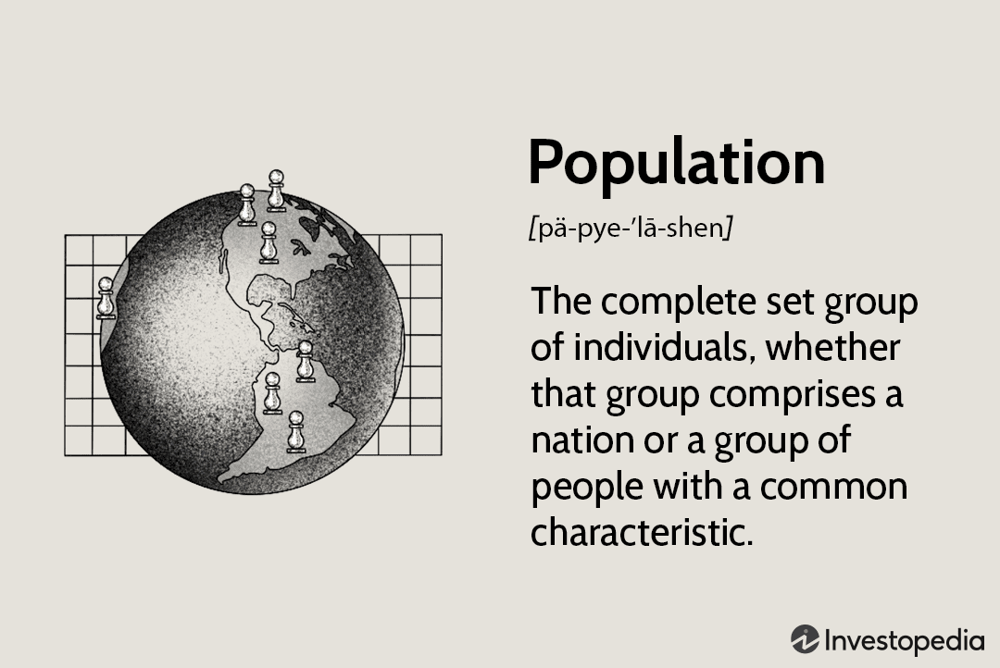

Population statistics play a pivotal role in modern analysis, providing insights into the dynamics that shape societies, economies, and markets. These statistics encompass data related to the size, growth, density, distribution, and demographic characteristics of populations. By analyzing these metrics, analysts can discern patterns and predict future outcomes in various sectors. In finance, for example, understanding population trends can help in assessing consumer behavior, labor market developments, and regional economic prospects, potentially influencing investment decisions and risk assessments.

Algorithmic trading, or algo trading, is a method of executing trades using pre-programmed strategies on a computer. These strategies are designed to exploit market inefficiencies, react to market changes with speed, and execute trades at the best possible prices. The importance of algorithmic trading stems from its ability to handle large volumes of data and speed in execution, which are both critical in today's fast-paced financial markets. Algorithms can be designed to follow systematic approaches, reducing the emotional and psychological elements that often complicate trading decisions.



Leveraging population statistics within the framework of algorithmic trading presents unique opportunities. Demographic data can enrich trading algorithms by identifying emerging markets or forecasting economic conditions based on population trends. For instance, an aging population in a developed country may lead to increased demand for healthcare products, which could inform trading decisions in related sectors.

This article discusses several key themes, including the integration of demographic data into trading models and the potential benefits of doing so. We explore the tools and technologies that facilitate this integration, alongside real-world applications and case studies. Furthermore, we highlight future trends and developments, particularly how evolving demographic patterns and technological advancements may shape the landscape of algorithmic trading.

Understanding both population statistics and algorithmic trading is crucial for those seeking to enhance their trading strategies. By aligning demographic insights with sophisticated trading algorithms, traders can gain a competitive edge, optimizing their decision-making processes for better financial outcomes. This comprehensive understanding underscores the importance of continuous learning and adaptation, as both population dynamics and trading technologies are ever-evolving domains.

## Table of Contents

## Understanding Population Statistics

Population statistics, often referred to as demographics, are a cornerstone of data analysis, providing critical insights into the composition, characteristics, and dynamics of populations. Such statistics are essential in various domains, including economic forecasting, public policy, and business strategy. The primary objective of population statistics is to quantify and analyze data related to population features such as age, gender, ethnicity, educational attainment, employment, income, and migration patterns.

### Key Metrics and Data Sources in Population Statistics

Population [statistics](/wiki/bayesian-statistics) use a variety of metrics, including but not limited to:

- **Population Size**: The total number of individuals in a specific area.
- **Population Density**: Individuals per unit area, indicating population concentration.
- **Growth Rate**: The rate at which a population is increasing or decreasing.
- **Age Distribution**: The distribution of various age groups within a population.
- **Dependency Ratio**: A measure indicating the ratio of dependents (aged below 15 and over 64) to the working-age population.

Data sources for population statistics include national censuses, household surveys, registration systems (e.g., birth and death registries), and international databases such as those from the United Nations and the World Bank. These sources provide a comprehensive overview of demographic variables necessary for detailed analysis.

### How Population Dynamics Affect Economic Indicators

Population dynamics are closely linked to economic indicators like GDP growth, labor market conditions, and consumer spending. For instance, an aging population might lead to a higher dependency ratio, affecting labor supply and increasing demand for healthcare services. Conversely, a younger demographic can drive economic growth through an abundant workforce and increased consumption.

The formula to calculate the Dependency Ratio is:

$$
\text{Dependency Ratio} = \left(\frac{\text{Number of people aged 0-14} + \text{Number of people aged 65+}}{\text{Number of people aged 15-64}}\right) \times 100
$$

This ratio is critical for understanding the pressures on productive resources and social services.

### Recent Trends in Population Statistics and Demographic Changes

Recent global demographic trends include declining birth rates, increasing life expectancy, urbanization, and migration. Developed countries are experiencing slower population growth due to aging, whereas many developing nations are witnessing rapid urbanization and significant youth bulges. Migration, driven by economic opportunities, conflicts, and climate change, also significantly alters demographic landscapes.

### Implications of Demographic Information for Market Analysis

Demographic information is indispensable for market analysis, influencing everything from product development to marketing strategies. Companies leverage population statistics to identify target markets, tailor products to specific demographic groups, and forecast demand trends. For example, understanding a country's median age can help businesses strategize around millennial preferences or retirement services.

Market analysts use population statistics to predict shifts in economic power and consumer behavior. A rising middle class in emerging markets may lead to increased demand for luxury goods, while a growing elderly population in developed countries might raise the need for healthcare products and services.

In summary, population statistics provide a vital foundation for interpreting economic trends and formulating strategic business and policy decisions. They enable a nuanced understanding of the evolving socio-economic landscape, offering a competitive edge in analysis and decision-making.

## Basics of Algorithmic Trading

Algorithmic trading, often referred to as algo trading, involves the use of computer algorithms or programs to execute trading orders based on predefined strategies. These algorithms leverage quantitative models and take advantage of electronic trading platforms to execute trades rapidly and accurately. The automation of trading processes allows investors to maximize profits and optimize execution by minimizing manual intervention.

### Strategies in Algorithmic Trading

Algo trading strategies vary widely, with some of the most common including:

1. **Trend Following**: This strategy involves algorithms designed to identify market trends and make trades based on the strength and direction of these trends. Moving averages and channel breakouts are frequently used indicators.

2. **Arbitrage**: This involves the simultaneous buying and selling of an asset in different markets to exploit price discrepancies. Algorithms can quickly identify and act on these opportunities, making arbitrage a popular strategy.

3. **Market Making**: Here, algorithms are used to provide liquidity to the market by continuously buying and selling a large number of stocks and offering a small spread between buy and sell prices. This strategy profits from the bid-ask spread.

4. **Mean Reversion**: This strategy is based on the hypothesis that asset prices will revert to their mean or average after deviating from it. Algorithms monitor asset prices and execute trades when prices have sufficiently diverged from established averages.

5. **Statistical Arbitrage**: Often a more advanced form of pairs trading, this strategy uses statistical models to discover potential mispricings among securities. Algorithms identify pairs or groups of securities that historically move together, executing trades when they infrequently diverge.

### Role of Data Analysis

Data analysis is integral in developing trading algorithms. Algorithms rely on vast amounts of historical and real-time data to back-test strategies, optimize parameters, and make informed trading decisions. Techniques such as time-series analysis, [machine learning](/wiki/machine-learning), and econometric modeling help analysts in constructing algorithms that can accurately predict market movements or price inefficiencies.

### Importance of Speed and Accuracy

In [algorithmic trading](/wiki/algorithmic-trading), speed and accuracy are crucial factors. Markets can move quickly, and the ability to execute trades in a fraction of a second can be the difference between profit and loss. Therefore, the latency of data transmission and execution speed is often minimized through co-location services, where trading systems are physically located close to exchange servers.

Accuracy ensures that the algorithms execute precisely as intended without deviating from the specified conditions or parameters. This involves rigorous testing and validation of code to prevent unexpected behavior or errors during live trading.

### Basic Requirements for Setting Up an Algo Trading System

To set up an algo trading system, several fundamental requirements need to be met:

1. **Infrastructure**: A robust computer system with high processing speed and minimal latency is essential. Access to reliable data feeds and trading platforms is equally important.

2. **Programming Skills**: Proficiency in programming languages such as Python, C++, or Java is necessary to write and maintain trading algorithms. Knowledge of libraries and frameworks such as NumPy, pandas, and backtrader for Python can help in the efficient development of algorithms.

3. **Statistical and Mathematical Expertise**: A strong understanding of statistical methods and financial mathematics helps in designing models and strategies that are effective and resilient in varying market conditions.

4. **Risk Management and Compliance**: Integrated risk management tools and adherence to regulatory standards ensure that trading activities do not expose investors to undue risk and adhere to financial laws.

5. **Strategy and Model Development**: This involves market research, identifying potential strategies, and formulating models. Successful algorithms require continuous improvement and adaptation to evolving market conditions through iterative testing and refinement.

Algorithmic trading's aim is to improve efficiency, reduce costs, and capitalize on market opportunities that are impractical to exploit through manual trading, ultimately providing a competitive edge in financial markets.

## Integrating Population Statistics into Algo Trading

The integration of population statistics into algorithmic trading involves leveraging demographic data to enhance trading strategies and improve financial decision-making. Demographic data, which encompasses various metrics such as age distributions, migration patterns, birth and death rates, and population growth, serves as a crucial input in identifying market trends and consumer behavior. This integration provides a more comprehensive understanding of economic variables, potentially leading to more informed trading decisions.

**Using Demographic Data to Inform Trading Algorithms**

Demographic data offers a unique perspective on market trends that financial metrics alone may not capture. For instance, an increase in the working-age population might indicate potential growth in consumer spending, thus signaling a bullish market for retail stocks. Conversely, an aging population might lead to increased healthcare demand, suggesting investment opportunities in the healthcare sector. Trading algorithms can be fine-tuned to detect these shifts and capitalize on emerging opportunities by incorporating demographic indicators.

Implementing demographic data involves preprocessing such data to standardize metrics and resolve any inconsistencies. Algorithmically, this can be represented in Python using libraries like pandas and numpy, where demographic variables can be added as features to the trading model.

```python
import pandas as pd
import numpy as np

# Load demographic data
demographic_data = pd.read_csv('demographic_data.csv')
# Load financial data
market_data = pd.read_csv('market_data.csv')

# Merge datasets on time or location
merged_data = pd.merge(market_data, demographic_data, on='time_column')

# Analyze relationships and incorporate into model
# Example using a linear regression model
from sklearn.linear_model import LinearRegression

# Features include financial and demographic indicators
features = merged_data[['financial_metric_1', 'financial_metric_2', 'age_distribution']]

# Target variable
target = merged_data['market_price']

model = LinearRegression().fit(features, target)
```

**Case Studies of Successful Integration**

Several firms have successfully integrated demographic insights into their trading models. For example, a [hedge fund](/wiki/hedge-fund-trading-strategies) might track urbanization trends to predict real estate stock movements. Another case could involve assessing birth rates to forecast long-term demands for educational services and related markets. These strategies are particularly relevant in emerging markets where demographic changes are pronounced.

**Technical Considerations**

Integrating population statistics into trading algorithms requires careful management of data quality and timeliness. Demographic data often originates from different sources than financial data, leading to discrepancies in data format and update frequency. Traders must address these challenges by employing data cleaning and transformation techniques to ensure compatibility. Furthermore, the temporal alignment of demographic data with market data is crucial to maintain relevance in trading decisions.

**Potential Benefits and Challenges**

Incorporating demographic trends into algorithmic trading can lead to more robust strategies that anticipate market changes ahead of traditional financial indicators. This integration allows traders to create diversified portfolios and mitigate risks associated with relying solely on financial data. However, challenges include the complexity of modeling demographic data due to its often non-linear nature and long-term implications. Also, demographic data may contain noise due to reporting errors or delays, which requires sophisticated filtering techniques.

**Conclusion**

For traders, incorporating demographic data into algorithmic models offers a substantial edge in understanding and predicting market movements. By addressing the technical complexities and focusing on reliable data sources, traders can enhance the precision and adaptability of their trading strategies. This integration represents a forward-looking approach in a rapidly evolving financial landscape.

## Tools and Technologies

Software tools for analyzing population statistics have become increasingly sophisticated, offering expansive datasets and advanced modeling capabilities. Prominent among these are statistical packages like R and Python libraries, such as Pandas and NumPy, which provide robust frameworks for handling and analyzing large-scale demographic data. R, with its comprehensive range of packages like `demography`, is particularly suited for demographic analysis, offering tools for population projections and life table calculations. Similarly, Python’s Pandas library is renowned for its capability to manipulate numerical tables and time series data, making it invaluable for demographic trend analysis.

Platforms and resources for algorithmic trading have evolved, providing tools that support strategy development, [backtesting](/wiki/backtesting), and execution. Popular platforms include MetaTrader, QuantConnect, and [Interactive Brokers](/wiki/interactive-brokers-api). MetaTrader offers a user-friendly interface and supports algorithmic trading through its MQL5 language, allowing traders to automate trading strategies. QuantConnect provides a cloud-based environment where developers can code in Python, supporting strategy optimization and live trading. Furthermore, Interactive Brokers offers a robust API, enabling users to implement custom trading algorithms in various programming languages, including Python and Java.

Data analytics technologies play a crucial role in bridging population statistics and algo trading, facilitating the integration of demographic data into trading models. Data visualization tools like Tableau and Power BI help traders explore demographic trends visually, offering insights into potential market impacts. Machine Learning (ML) libraries such as Scikit-learn and TensorFlow in Python are instrumental in developing predictive models that incorporate demographic factors. These technologies aid in processing large datasets, identifying patterns, and creating actionable trading signals.

Advancements in AI and Machine Learning have significantly enhanced the integration of diverse datasets in algorithmic trading. AI-driven algorithms can process complex demographic data to predict market trends more accurately. Deep Learning models, such as Recurrent Neural Networks (RNNs) and Long Short-Term Memory Networks (LSTMs), are effective at modeling time series data, capturing both historical patterns and future projections. These models can ingest demographic information to refine trading strategies based on potential population-driven market changes.

The importance of continuous data monitoring and algorithm adjustment cannot be overstated. Market conditions and demographic trends are dynamic, necessitating the need for adaptive algorithms. Real-time data feeds and automated rebalancing strategies are critical to maintaining the relevance of trading models. Tools like Apache Kafka provide high-throughput, low-latency data streaming capabilities, enabling traders to respond to changes swiftly. Continuous monitoring allows for the ongoing assessment of algorithm performance, facilitating timely adjustments to maintain competitive advantage in frequently shifting markets.

## Real-World Applications and Case Studies

Population statistics have increasingly become a crucial component in the development of strategic algorithmic trading models. In this section, we explore real-world applications and case studies illustrating how firms have successfully leveraged demographic insights to gain a competitive edge in financial markets.

### Examples of Firms and Industries

Several forward-thinking companies have taken advantage of demographic data to enhance their trading strategies. Large investment firms and hedge funds have been at the forefront, utilizing population statistics to predict economic trends and consumer behavior, which in turn affect stock prices and asset valuations. For instance, firms like Renaissance Technologies and Two Sigma incorporate a wide array of data, including demographic information, into their quantitative models to forecast market movements.

### Case Studies and Financial Outcomes 

One notable case study involves a hedge fund that analyzed age distribution data to predict consumer preferences and retail stock performances. By understanding the spending patterns of different age groups, the fund could anticipate which sectors, such as technology or healthcare, would likely see increased investment. This demographic insight allowed the firm to adjust its portfolio in anticipation of these trends, resulting in a significant increase in returns.

Moreover, a financial institution leveraged urbanization rates and migration patterns to anticipate real estate market shifts. As populations moved towards metropolitan areas, demand for housing and related services increased. By positioning itself ahead of these demographic-driven trends, the institution reported a substantial improvement in its market share and profitability.

### Lessons Learned and Future Applications

From these studies, it is evident that demographic insights can provide a substantial edge in trading. However, the integration of such data must be precise and contextually relevant. One lesson learned is the importance of continuously updating demographic data, as shifts can be rapid and impactful. Additionally, firms must consider the socio-economic factors that accompany demographic changes to fully understand their market implications.

Future potential applications could see even more nuanced uses of population statistics, such as blending demographic data with real-time social media trends to capture immediate market sentiment changes. For example, retailers might use population density metrics alongside online consumer feedback to optimize product launches.

### Effective Adoption Strategies

For companies looking to adopt these strategies effectively, several key steps are recommended. Firstly, establishing a robust data collection mechanism is essential for gathering accurate and timely demographic information. Secondly, firms should invest in advanced analytics platforms capable of processing large datasets and uncovering meaningful patterns. Data scientists and trading strategists must work closely to integrate demographic insights into algorithmic models.

Finally, it's important for companies to maintain flexibility in their trading systems, allowing for frequent recalibration as new data becomes available. This adaptive approach will help ensure that demographic insights remain relevant and that trading strategies can evolve alongside market conditions.

In conclusion, the integration of population statistics into algorithmic trading presents a powerful opportunity for enhanced financial returns. Through careful application and strategic innovation, firms can harness demographic data to inform more sophisticated and successful trading strategies.

## Future Trends and Developments

Emerging trends in population analytics are poised to significantly impact trade markets. As the availability and granularity of demographic data improve, markets can integrate these insights to better predict economic behaviors and trends. Technologies such as remote sensing and mobile tracking increasingly offer real-time data on population movements and density. When applied, such insights enable traders to predict consumer demand and supply chain needs with greater accuracy. For instance, understanding the migration patterns within and between countries can inform projections about real estate demands, resource allocation, and geopolitical risks.

Advancements in algorithmic trading are anticipated to be driven by the availability of new datasets, including those derived from population statistics. Machine learning models, for example, can leverage vast demographic datasets to forecast market movements and identify trading opportunities that are informed by social and economic shifts. The ability to integrate unconventional datasets presents opportunities for a competitive advantage, mitigating risks associated with market speculation based primarily on historical financial data.

Potential regulatory changes are on the horizon, prompted by increased data utilization and privacy concerns. Governments and regulatory bodies are becoming more attuned to the implications of big data on financial markets, potentially leading to tighter controls and compliance requirements for data use in trading activities. Regulations may evolve to address ethical considerations surrounding the use of demographic data, necessitating greater transparency and accountability in algorithmic operations.

Global demographic shifts are expected to play an influential role in future financial markets. Aging populations in developed countries and youthful demographics in emerging markets can create differing economic pressures and investment opportunities. For example, markets might see augmented interest in healthcare or retirement-related financial products spurred by aging populations, whereas regions with younger demographics could experience growth in technology and education sectors.

Opportunities for innovation lie at the intersection of data science and finance, with advanced analytics providing the tools needed to decode complex demographic trends and their implications. The confluence of fields such as AI, machine learning, and big data analytics can transform traditional trading strategies by delivering insights that were previously unattainable. This burgeoning synthesis of disciplines could foster novel trading algorithms that adapt dynamically to population shifts and their economic impacts. The capability to harness real-time demographic data and incorporate it into financial models represents a frontier for innovation and competitive advantage in global markets.

## Conclusion

The integration of population statistics into algorithmic trading represents a promising frontier in data-driven financial strategies. By leveraging demographic data, traders and data scientists can enhance predictive models and improve trading outcomes. Key takeaways from this intersection include the recognition that population trends can significantly influence market dynamics and stock performance. For instance, shifts in age demographics or migration patterns might correlate with changes in consumer behavior, presenting opportunities for developing more nuanced trading algorithms.

Maintaining an updated understanding of both population statistics and technological advancements is critical. The rapid pace of innovation in data science and algorithmic trading necessitates continuous education and adaptation. With demographic data becoming increasingly accessible and sophisticated analytic tools available, traders who remain informed about these developments are better positioned to exploit new market opportunities.

There is ample scope for further exploration and research in this area. The potential applications of population statistics in trading algorithms are vast, ranging from macroeconomic forecasting to consumer sentiment analysis. Researchers and practitioners are encouraged to investigate these possibilities, contributing to a deeper understanding of how demographic insights can drive financial success.

In conclusion, aligning data insights with trading success requires a thoughtful integration of multidisciplinary knowledge. By bridging the gap between demographics and trading systems, market participants can create a competitive advantage, optimize decision-making processes, and anticipate future market shifts more effectively. This synthesis of data science with financial market strategies offers a powerful toolset for those willing to explore its full potential.

## References

List of [books](/wiki/algo-trading-books), articles, and papers on population statistics:

1. **"Demographics and the Stock Market: The Effects of Aging on the Equity Premium"** by James M. Poterba - This paper explores the relationship between demographic trends and stock market fluctuations.

2. **"Population Dynamics and Economic Growth"** by Nico Keilman - A comprehensive study that discusses the impact of population statistics on economic development and macroeconomic variables.

3. **"International Handbook of Population and Environment"** edited by Lori M. Hunter - This handbook offers an extensive overview of how population statistics interact with environmental and economic indicators.

Significant publications on algorithmic trading:

1. **"Algorithmic Trading: Winning Strategies and Their Rationale"** by Ernie Chan - A detailed explanation of various algo trading strategies with a focus on statistical and mathematical models.

2. **"Quantitative Trading: How to Build Your Own Algorithmic Trading Business"** by Ernie Chan - This book provides practical insights into setting up algorithmic trading systems and implementing effective strategies.

3. **"The Science of Algorithmic Trading and Portfolio Management"** by Robert Kissell - A comprehensive resource on the methodologies and fundamentals that underpin algorithmic trading.

Links to industry reports and case studies cited in the article:

1. **World Economic Forum Reports** - Provides insightful analyses on global economic trends, including demographic data.

2. **McKinsey Global Institute Reports** - Offers in-depth reports on the interplay of demographic shifts and market dynamics.

Recommended reading for beginners and experts in both fields:

1. **For Beginners**: "The Basics of Population Dynamics" by A. Smith - A beginner-friendly exploration of population statistics and its implications.

2. **For Experts**: "Advanced Algorithmic Trading in R" by Harry Georgakopoulos - This book offers advanced techniques and strategies for experienced traders.

Online resources and tools for further exploration:

1. **Population Reference Bureau (PRB) Website** - An online resource offering data and analysis on global population trends.

2. **QuantConnect** - An open-source cloud-based platform for quantitative trading that provides a rich library for developing trading algorithms.

3. **Kaggle** - A platform offering datasets for both population statistics and trading, along with competitions and collaborative projects.

These references serve as a foundation for those interested in the interaction between population statistics and algorithmic trading, providing a basis for further research and exploration.

## References & Further Reading

[1]: Poterba, J.M. (2001). ["Demographic Structure and Asset Returns."](https://economics.mit.edu/sites/default/files/publications/3211752.pdf) National Bureau of Economic Research, Working Paper No. 8682.

[2]: Chan, E. (2009). ["Quantitative Trading: How to Build Your Own Algorithmic Trading Business."](https://github.com/ftvision/quant_trading_echan_book) Wiley.

[3]: Kissell, R. (2013). ["The Science of Algorithmic Trading and Portfolio Management."](https://www.sciencedirect.com/book/9780124016897/the-science-of-algorithmic-trading-and-portfolio-management) Academic Press.

[4]: United Nations Department of Economic and Social Affairs. ["World Population Prospects 2022."](https://population.un.org/wpp/) United Nations.

[5]: World Bank. ["World Development Indicators."](https://databank.worldbank.org/reports.aspx?source=2&country=ARE) World Bank Data Catalog.