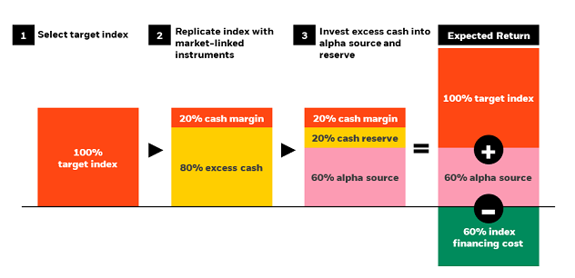

## Table of Contents

## What is Portable Alpha?

Portable Alpha is a way of investing that helps you earn more money by mixing two different strategies. The first part is called "alpha," which is the extra return you get from picking good investments that do better than the overall market. The second part is called "beta," which is the return you get from the market as a whole. By separating these two, you can move the alpha part to different investments, like bonds or other assets, to try and make more money.

This method is useful because it lets you take the skill of picking winning investments and use it in different markets. For example, if you're good at picking stocks, you can use that skill to make money in the bond market too. It's like taking your winning strategy and making it work in more places, which can help you earn more overall.

## How does Portable Alpha work?

Portable Alpha works by splitting your investment strategy into two parts: alpha and beta. Alpha is the extra return you get from picking investments that do better than the market. Beta is the return you get from the market itself. Usually, when you invest in stocks, your alpha and beta are tied together. But with Portable Alpha, you can separate them. This means you can take your alpha, the skill of picking good investments, and use it in different markets, like bonds or commodities.

For example, let's say you're really good at [picking](/wiki/asset-class-picking) stocks that beat the market. With Portable Alpha, you can use that skill in the bond market. You might invest in a bond fund to get your beta, the market return, and then use derivatives or other tools to add your alpha. This way, you're not limited to just the stock market. You can take your winning strategy and apply it to other places, which can help you earn more money overall.

## What are the main components of a Portable Alpha strategy?

The main components of a Portable Alpha strategy are alpha and beta. Alpha is the extra return you get from choosing investments that do better than the market. This could be from picking stocks that outperform or using other investment strategies that beat the market. Beta, on the other hand, is the return you get from the market itself. For example, if you invest in a stock index fund, the return you get from that fund is your beta.

To use a Portable Alpha strategy, you separate your alpha from your beta. You might invest in a broad market index or a bond fund to get your beta. Then, you use derivatives, like futures or options, or other investment tools to add your alpha to this beta. This way, you can take the skill of picking winning investments and apply it to different markets, not just the stock market. By doing this, you can try to earn more money overall.

## Why would an investor use a Portable Alpha strategy?

An investor might use a Portable Alpha strategy to try and make more money. This strategy lets them take the skill of picking good investments, which is called alpha, and use it in different markets. For example, if someone is good at picking stocks, they can use that skill to make money in the bond market too. By doing this, they can spread their winning strategy across more places and possibly earn more overall.

Another reason to use Portable Alpha is to manage risk better. By separating the alpha from the beta, investors can choose where to get their market return from, like bonds or a stock index. This means they can pick a safer place for their beta while still using their alpha to try and beat the market. This can help them balance the risk and reward of their investments.

## What are the risks associated with Portable Alpha?

Using a Portable Alpha strategy can be riskier than other ways of investing. One big risk is using derivatives, like futures or options, to add alpha to your investments. These tools can be hard to understand and can lead to big losses if the market moves against you. Also, if you're wrong about your alpha strategy, you could lose money even if the overall market does well.

Another risk is that Portable Alpha can make your investments more complicated. When you separate your alpha from your beta, you have to keep track of more things. This can be hard to manage and might lead to mistakes. Plus, the costs of using derivatives and other tools to add alpha can add up, which might eat into your returns. So, while Portable Alpha can help you make more money, it also comes with more risks and costs.

## Can you provide an example of a Portable Alpha strategy in practice?

Imagine you're good at picking stocks that do better than the market. You want to use this skill to make more money, but you also want to invest in bonds because they're safer. With a Portable Alpha strategy, you can do both. First, you invest in a bond fund to get your beta, which is the return you get from the bond market. This gives you a steady, safer return.

Next, you use your skill at picking stocks to add alpha to your bond investment. You might use futures or options to bet on the stocks you think will do well. This way, you're taking the extra return from your stock-picking skill and adding it to your bond investment. So, even though you're mainly invested in bonds, you're still using your stock-picking skill to try and make more money. This is how Portable Alpha works in practice.

## How does Portable Alpha differ from traditional investment strategies?

Portable Alpha is different from traditional investment strategies because it lets you separate the skill of picking good investments, called alpha, from the return you get from the market, called beta. In traditional investing, these two are usually tied together. For example, if you buy stocks, your alpha and beta are both coming from the stock market. But with Portable Alpha, you can take your alpha and use it in different markets, like bonds or commodities. This means you can spread your winning strategy across more places and possibly make more money.

Another big difference is that Portable Alpha often uses tools like derivatives, such as futures or options, to add alpha to your investments. Traditional strategies might not use these tools as much. Using derivatives can be riskier and more complicated, but it also gives you more ways to try and beat the market. So, while traditional investing might be simpler and safer, Portable Alpha can offer more chances to earn higher returns if you're willing to take on more risk and complexity.

## What are the key considerations when implementing a Portable Alpha strategy?

When you want to use a Portable Alpha strategy, you need to think about a few important things. First, you have to be good at picking investments that do better than the market. This is your alpha. If you're not good at this, the strategy won't work well. You also need to choose where to get your beta from, like bonds or a stock index. This should be a safe place that gives you a steady return. It's also important to understand how to use tools like futures or options to add your alpha to your beta. These tools can be tricky, so you need to know what you're doing.

Another thing to consider is the risk and cost. Using derivatives can be risky because they can lead to big losses if the market moves against you. Also, these tools can be expensive, so you need to make sure the extra returns you're trying to get are worth the costs. Lastly, managing a Portable Alpha strategy can be complicated because you're dealing with more things at once. You need to keep track of your alpha and beta separately, which takes more work and can lead to mistakes if you're not careful.

## How can performance of a Portable Alpha strategy be measured?

To measure the performance of a Portable Alpha strategy, you need to look at both your alpha and your beta. Alpha is the extra return you get from picking good investments. You can measure this by comparing the returns of your chosen investments to the overall market return. If your investments do better than the market, that's your alpha. Beta is the return you get from the market itself, like from a bond fund or a stock index. You can measure this by looking at the returns of the market you've invested in.

It's also important to look at the overall return of your Portable Alpha strategy. This is the total return you get from combining your alpha and beta. You can compare this total return to what you would have gotten from a simpler investment strategy, like just investing in the market. This helps you see if the extra work and risk of using Portable Alpha were worth it. By looking at these different parts, you can get a good idea of how well your Portable Alpha strategy is doing.

## What role do derivatives play in a Portable Alpha strategy?

In a Portable Alpha strategy, derivatives like futures and options are important tools. They help you add your alpha, which is the extra return from picking good investments, to your beta, which is the return from the market. For example, if you're good at picking stocks, you can use stock futures to bet on those stocks while your main investment is in a safer place like bonds. This way, you can take the skill of picking winning stocks and use it to make more money in the bond market.

Using derivatives can be tricky and risky. They can lead to big losses if the market moves against you. But if you know what you're doing, they can also help you make more money. The costs of using derivatives can add up, so you need to make sure the extra returns you're trying to get are worth it. Overall, derivatives are key to making a Portable Alpha strategy work, but they need to be used carefully.

## How has the use of Portable Alpha evolved over time?

Portable Alpha started as a way for big investors like pension funds to make more money. They used their skill in picking good investments, called alpha, and moved it to different markets like bonds. This was helpful because it let them use their winning strategies in more places, not just in stocks. Over time, more investors started using Portable Alpha because they saw how it could help them earn more money. They used tools like futures and options to add alpha to their investments, which made the strategy more popular.

As Portable Alpha became more common, people started to see its risks too. Using derivatives can be tricky and can lead to big losses if the market moves the wrong way. Also, the costs of using these tools can add up. But even with these risks, Portable Alpha kept growing because it offered a way to try and beat the market. Today, many investors use Portable Alpha, but they have to be careful and know what they're doing to make it work well.

## What advanced techniques can be used to enhance a Portable Alpha strategy?

To make a Portable Alpha strategy even better, you can use advanced techniques like better risk management. This means using tools to watch how much risk you're taking and making sure it's not too high. You can also use something called "dynamic asset allocation," which means changing where you put your money based on what's happening in the market. This can help you take advantage of good times and protect your money during bad times. Another technique is using more types of derivatives, like swaps or structured products, to add alpha in new ways. These tools can be more complicated, but they can also help you make more money if you know how to use them right.

Another advanced technique is using [machine learning](/wiki/machine-learning) and big data to pick your investments. This can help you find patterns in the market that are hard to see with just human eyes. By using computers to help you pick stocks or other investments, you can make better choices and hopefully get a higher alpha. Also, you can use something called "multi-strategy alpha," where you combine different ways of picking investments to get the best results. This can spread out your risk and help you make more money overall. These advanced techniques can make Portable Alpha more powerful, but they also need more skill and careful management.

## What is Understanding Portable Alpha?

Portable alpha is an investment strategy aimed at maximizing returns by separating the components of portfolio returns into alpha and beta. Alpha represents the return on an investment that is attributable to the skill of the investment manager, independent of market movements, while beta refers to the portion of the return that can be attributed to the market as a whole. This distinction is crucial in understanding the portable alpha strategy.

In a typical investment portfolio, returns are often influenced by both market movements (beta) and the manager’s individual investment choices (alpha). Portable alpha strategies endeavor to isolate the alpha component, effectively detaching it from the traditional beta exposure. This allows investors to benefit from a manager's skill without being tied to a particular market or asset class.

Mathematically, the total return $R$ of an investment can be expressed as:

$$
R = \alpha + \beta \times M + \epsilon
$$

where:
- $\alpha$ is the return derived from active management,
- $\beta$ is the sensitivity of the investment to market movements,
- $M$ is the market return, and
- $\epsilon$ is the idiosyncratic risk component.

Portable alpha takes advantage of derivatives or similar instruments to hedge or neutralize the beta component of traditional asset classes, effectively "porting" the alpha onto a different beta exposure that aligns with an investor’s market outlook or risk preference. This portability offers an opportunity to overlay alpha on any desired beta, enhancing potential diversification and return opportunities.

There are several benefits to incorporating portable alpha strategies into investment portfolios. Firstly, they provide flexibility, enabling investors to maintain exposure to markets of choice while benefiting from active management returns. Secondly, they enhance diversification by reducing dependency on traditional market movements, potentially leading to more stable, risk-adjusted returns. This is particularly valuable during periods of market [volatility](/wiki/volatility-trading-strategies) when beta returns may suffer.

Additionally, portable alpha strategies can potentially improve the efficiency of capital use, by allowing investment managers to leverage their unique skills across multiple asset classes without being constrained by traditional allocation boundaries. This ability to decouple skills from specific asset class performance can lead to better resource allocation and optimization.

Overall, portable alpha is a strategic approach that emphasizes the separation of skill-generated returns from market-driven ones, opening pathways for enhanced diversification, flexibility, and the potential for superior risk-adjusted returns. As investment landscapes continue to evolve, leveraging the benefits of portable alpha remains a compelling consideration for forward-thinking investors.

## How can risk management be integrated into an investment strategy?

Risk management is a critical component of financial investments, essential for safeguarding assets and ensuring long-term profitability. The financial markets are inherently volatile, subject to a myriad of influences, including economic data releases, geopolitical events, and market sentiment. Effective risk management strategies enable investors to mitigate potential losses while optimizing returns.

Traditional risk management strategies include diversification, asset allocation, and hedging. Diversification involves spreading investments across various asset classes, sectors, or geographies to mitigate unsystematic risk. This reduces the impact of any single asset's poor performance on the overall portfolio. Asset allocation, the process of distributing investments among different categories such as equities, bonds, and cash, helps balance risk and reward based on an individual's financial goals and risk tolerance. Hedging involves using financial instruments like options and futures to protect against adverse price movements, effectively locking in prices or guaranteeing the right to sell assets at a predetermined price.

The integration of portable alpha strategies has enhanced risk management by allowing investors to separate alpha (excess returns attributable to managerial skill) from beta (market returns). Portable alpha strategies involve investing in alpha-generating assets while neutralizing market exposure through derivatives. This separation enables the pursuit of excess returns independent of market movements, thereby improving the risk-adjusted performance of a portfolio. For instance, an investor can use index futures to hedge the beta component, allowing them to focus on generating alpha without exposing themselves to market volatility.

Risk-adjusted returns are crucial for evaluating the success of an investment strategy. They provide a more comprehensive view of an investment's performance by adjusting the returns for the risk taken. Common metrics include the Sharpe Ratio, which measures the excess return per unit of risk, and the Sortino Ratio, which adjusts returns for downside volatility. These metrics are essential tools for investors to compare the attractiveness of different investment strategies. Calculating the Sharpe Ratio, for example, involves:

$$
\text{Sharpe Ratio} = \frac{E[R_p] - R_f}{\sigma_p}
$$

where $E[R_p]$ is the expected portfolio return, $R_f$ is the risk-free rate, and $\sigma_p$ is the standard deviation of the portfolio's excess return.

Incorporating risk-adjusted metrics allows investors to make more informed decisions, balancing potential returns with the associated risks. This approach ensures that strategies yielding higher returns without disproportionately increased risks are prioritized, aligning investments with the investor's risk tolerance and financial objectives.

## How can we evaluate and monitor performance?

Evaluating and monitoring the performance of portable alpha strategies is crucial to ensure their effectiveness and sustainability in investment portfolios. This process encompasses the definition of key metrics, the application of advanced tools and technologies for analysis, and the strategic adjustments based on performance evaluations.

### Key Metrics for Evaluating Performance

To evaluate portable alpha strategies, several key metrics are utilized:

1. **Alpha Generation**: The core aim of portable alpha is to generate returns independent of market movements. Alpha ($\alpha$) is calculated as the excess return of an investment relative to the return of a benchmark index. It is expressed as:
$$
   \alpha = R_i - R_f - \beta \times (R_m - R_f)

$$
   Where $R_i$ is the return of the investment, $R_f$ is the risk-free rate, $\beta$ is the beta of the investment, and $R_m$ is the market return.

2. **Sharpe Ratio**: This measures the risk-adjusted return and is defined as the ratio of excess return (return over the risk-free rate) to the standard deviation of the investment returns:
$$
   \text{Sharpe Ratio} = \frac{R_i - R_f}{\sigma_i}

$$
   where $\sigma_i$ is the standard deviation of the investment return.

3. **Information Ratio**: This ratio assesses the returns of the portfolio relative to a benchmark and the volatility of those returns. It is calculated as:
$$
   \text{Information Ratio} = \frac{\alpha}{\omega}

$$
   where $\omega$ is the tracking error, or the standard deviation of the difference between the portfolio returns and the benchmark returns.

4. **Drawdown**: This metric evaluates the decline from a peak in the portfolio's value to the lowest value, providing insights into potential risks and recovery capabilities.

### Role of Ongoing Monitoring

Continuous monitoring is vital to maintain the effectiveness of portable alpha strategies. This involves regularly assessing the strategy's alignment with predetermined goals, analyzing deviations, and making necessary adjustments. Monitoring helps in identifying underperformance early, driven by changes in market conditions or strategy drift, allowing managers to take corrective actions promptly.

### Tools and Technologies for Performance Analysis

Modern performance evaluation benefits from sophisticated tools and technologies, including:

- **Portfolio Management Software**: Platforms like Bloomberg PORT and FactSet offer comprehensive analytics, real-time data access, and performance reporting.
- **Data Analytics**: Advanced analytics platforms, such as Python libraries (NumPy, pandas, matplotlib), enable detailed statistical analysis and visualization of performance metrics.
- **Machine Learning Tools**: Algorithms and models can be used to predict future performance trends, optimize strategies, and automate adjustments based on historical data and market forecasts.

### Strategic Adjustments from Performance Evaluation

Evaluating performance is not an end in itself but a step towards strategic realignment. Performance metrics reveal whether the portable alpha strategy is meeting its objectives or if there are discrepancies needing redress. Strategic adjustments may include:

- Rebalancing the portfolio to align with target beta or alpha.
- Modifying the algorithmic trading models to improve execution efficiency.
- Revisiting risk management frameworks to better control for volatility and drawdowns.

By systematically applying these evaluation techniques, investors can refine their portable alpha strategies, enhance risk-adjusted returns, and ensure that their investment goals are consistently met, adapting to evolving market conditions as needed.

## References & Further Reading

[1]: Andretta, M., & Capablanca, J. (2019). ["Mathematical Techniques in Finance: Tools for Incomplete Markets and Portable Alpha Strategies."](https://www.france.fr/en/article/discover-cuisine-ile-de-france/) Springer.

[2]: Ang, A. (2014). ["Asset Management: A Systematic Approach to Factor Investing."](https://www.tandfonline.com/doi/full/10.1080/14697688.2014.983540) Oxford University Press.

[3]: Yin, R. & Zheng, W. (2019). ["Algorithmic Trading: Winning Strategies and Their Rationale."](https://www.wiley.com/en-us/Algorithmic+Trading%3A+Winning+Strategies+and+Their+Rationale-p-9781118460146) Wiley.

[4]: Lopez de Prado, M. (2018). ["Advances in Financial Machine Learning."](https://www.amazon.com/Advances-Financial-Machine-Learning-Marcos/dp/1119482089) Wiley.

[5]: Jacobs, B. I., & Levy, K. N. (2017). ["Investing: The Chain Reaction Between Returns, Risk, and Portable Alpha."](https://www.semanticscholar.org/paper/Factor-Modeling%3A-The-Benefits-of-Disentangling-for-Bruce-I.-Jacobs-Levy/b09b103af04c0c76242a58f41d19efe1eb1faa60) The Journal of Fixed Income.

[6]: Brown, S. & Nielsen, E. (2014). ["Alpha as a Net Zero-Sum Game: Portable Alpha and Hedge Fund Capacity."](https://www.proquest.com/scholarly-journals/alpha-as-net-zero-sum-game/docview/195597016/se-2) Financial Analysts Journal.