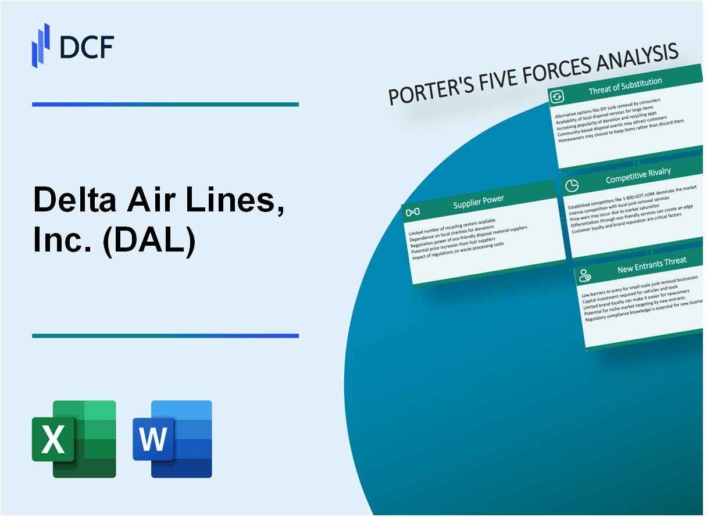

## Table of Contents

## What is Porter's Five Forces Analysis?

Porter's Five Forces Analysis is a tool used to understand how competitive a business environment is. It was created by Michael E. Porter, a professor at Harvard Business School. The analysis looks at five different factors that can affect a company's ability to make a profit. These factors help businesses see where their strengths and weaknesses are in the market.

The five forces are: the threat of new entrants, the bargaining power of suppliers, the bargaining power of buyers, the threat of substitute products or services, and the intensity of competitive rivalry. Each force can influence how much profit a company can make. For example, if there are many similar products that customers can choose from, a company might have to lower its prices to stay competitive, which can reduce profits.

By using Porter's Five Forces, companies can make better decisions about their strategies. They can figure out how to protect themselves from new competitors, find ways to have more power over suppliers or buyers, and understand how to deal with substitutes and rivals. This helps them to plan for the future and stay successful in their industry.

## Who is Michael E. Porter and why is his model important?

Michael E. Porter is a famous business professor and thinker from Harvard Business School. He's well-known for coming up with ideas that help businesses understand how to make more money and be more successful. One of his most famous ideas is the Five Forces model, which helps companies see what's going on in their market and how to deal with competition.

Porter's model is important because it gives businesses a clear way to look at their industry. It helps them figure out who their real competition is, how strong their customers and suppliers are, and what other products might take away their customers. By using this model, companies can make smarter choices about how to grow, how to set their prices, and how to keep their business strong even when things get tough. This model is used all over the world by big and small businesses to stay ahead in their markets.

## What is Delta Air Lines and what industry does it operate in?

Delta Air Lines is a big company that flies airplanes. It is one of the biggest airlines in the United States. People use Delta to travel to many different places around the world. Delta has a lot of airplanes and flies to many cities.

Delta operates in the airline industry. This industry is all about flying people and things from one place to another. Airlines like Delta compete with each other to offer the best service and prices to their customers. The airline industry can be hard because it costs a lot of money to run airplanes, and there are always new challenges like changing fuel prices and new rules from the government.

## How does the threat of new entrants affect Delta Air Lines?

The threat of new entrants can make things harder for Delta Air Lines. Starting an airline is really expensive because you need to buy airplanes, hire people, and follow a lot of rules. This means it's not easy for new airlines to start up and become a big problem for Delta right away. But, if a new airline does manage to start and offer cheaper tickets or better service, it could take some of Delta's customers away.

Even though it's tough for new airlines to get started, Delta still has to keep an eye on them. If a new airline starts flying to the same places Delta does, Delta might need to lower its prices or offer more to keep its customers happy. This can make it harder for Delta to make as much money as before. So, Delta always needs to be ready for new competition and keep working to be the best airline it can be.

## What are the barriers to entry in the airline industry?

Starting an airline is really hard because it costs a lot of money. You need to buy airplanes, which are very expensive. You also need to pay for things like fuel, maintenance, and hiring trained pilots and staff. On top of that, there are a lot of rules and regulations from the government that you have to follow. These rules can be about safety, how you treat your passengers, and even how you advertise your flights. All these costs and rules make it tough for new airlines to get started.

Another big barrier is that the airline industry already has big, well-known companies like Delta, American Airlines, and United. These big airlines have been around for a long time and have loyal customers. They also have deals with airports for the best times to fly and the best spots at the airport. It's hard for a new airline to compete with these big companies because they have to spend a lot of money to get noticed and to offer flights at good times and places. So, the big airlines make it even harder for new ones to enter the market.

## How does the bargaining power of suppliers impact Delta Air Lines?

The bargaining power of suppliers can make things harder for Delta Air Lines. One big supplier for Delta is airplane makers like Boeing and Airbus. If these companies decide to raise their prices or if there are not many airplane makers to choose from, Delta might have to pay more for new airplanes. Also, Delta needs fuel to fly its planes, and the companies that sell fuel can change their prices a lot. If fuel prices go up, it can cost Delta a lot more money to run its flights.

Another important group of suppliers for Delta are the people who work at the airline, like pilots and flight attendants. If these workers want higher pay or better benefits, and they are hard to replace, they can ask for more, which can make Delta's costs go up. Delta has to work hard to keep good relationships with all its suppliers so that it can keep its costs down and keep flying its planes. If suppliers have a lot of power, it can make it harder for Delta to make money.

## What is the bargaining power of buyers in relation to Delta Air Lines?

The bargaining power of buyers, or customers, can have a big impact on Delta Air Lines. When customers have a lot of choices for airlines, they can choose to fly with someone else if Delta's prices are too high or if they don't like the service. This means Delta has to keep its prices and service good to keep its customers happy. If a lot of people start flying with other airlines instead, Delta might have to lower its prices or offer more to get them back.

Also, big customers like travel agencies or companies that book a lot of flights can have a lot of power. They can ask for cheaper prices because they buy a lot of tickets. If Delta says no, these big customers might take their business to another airline. So, Delta has to think about what these big customers want and try to keep them happy without losing too much money.

## How does the threat of substitute products or services influence Delta Air Lines?

The threat of substitute products or services can make things harder for Delta Air Lines. A big substitute for flying is traveling by train or bus, especially for shorter trips. If these other ways of traveling become cheaper or faster, more people might choose them instead of flying with Delta. Also, with video calls and online meetings becoming more popular, some people might decide they don't need to fly for business anymore. This means fewer people might buy tickets from Delta.

Delta has to think about these substitutes and try to stay ahead. They might need to offer cheaper tickets or better service to make sure people still want to fly with them instead of choosing other ways to travel. If Delta doesn't keep up with these changes, they could lose customers to substitutes, which would make it harder for them to make money.

## What is the intensity of competitive rivalry within the airline industry for Delta Air Lines?

The airline industry is very competitive, and Delta Air Lines feels this competition every day. There are many other airlines like American Airlines, United Airlines, and Southwest Airlines that are all trying to get passengers to fly with them instead of Delta. These airlines often have sales and special deals to attract customers. They also try to offer better service, more flights, or more comfortable planes. This means Delta has to work hard to keep its prices good and its service even better to stay ahead.

Delta also faces competition from low-cost carriers, which can make things even tougher. These smaller airlines, like Spirit and Frontier, offer very cheap tickets, which can pull customers away from Delta. To compete, Delta might have to lower its prices or find other ways to make flying with them more attractive. This competition can make it hard for Delta to make as much money as they want, because they have to spend more to keep their customers happy and loyal.

## How has Delta Air Lines strategically responded to the forces identified in the analysis?

Delta Air Lines has taken several steps to deal with the competition and challenges in the airline industry. To handle the threat of new entrants and the intense rivalry, Delta focuses on offering great service and a good flying experience. They've made their cabins more comfortable and added things like free Wi-Fi and better food options. Delta also has loyalty programs like SkyMiles to keep their customers coming back. By doing these things, Delta makes it harder for new airlines to take away their customers and helps them stay ahead of other big airlines.

To manage the bargaining power of suppliers and buyers, Delta works on building strong relationships. They have long-term deals with airplane makers like Boeing and Airbus to get better prices and make sure they always have planes to fly. Delta also tries to keep fuel costs down by using fuel-efficient planes and sometimes buying fuel ahead of time. For big customers like travel agencies, Delta offers special deals and services to keep them happy without losing too much money. By doing these things, Delta can keep their costs down and their prices competitive, which helps them stay strong in the market.

Delta also pays attention to the threat of substitutes by making sure flying with them is the best choice. They offer a lot of flights to many places, which makes it easier for people to choose Delta over trains or buses. Delta also focuses on business travelers by offering things like fast check-ins and priority boarding, which can be important for people who need to get to meetings quickly. By making flying with Delta a good experience, they help keep people from choosing other ways to travel or using video calls instead of flying.

## What are the key trends and future outlooks affecting Delta Air Lines based on Porter's Five Forces?

The airline industry is always changing, and Delta Air Lines has to keep up with new trends to stay competitive. One big trend is the move towards more sustainable travel. People are more worried about the environment, so Delta is trying to use more fuel-efficient planes and find ways to reduce their carbon footprint. Another trend is the growing use of technology, like online booking and mobile apps, which makes it easier for customers to plan their trips. Delta is also looking at how to use data and artificial intelligence to make their service better and more personalized. These trends can help Delta stay ahead of new airlines that might try to enter the market and keep their customers happy.

In the future, Delta will need to keep an eye on the bargaining power of suppliers and buyers. Fuel prices can change a lot, and if they go up, Delta might have to pay more to fly their planes. They need to keep good relationships with airplane makers and other suppliers to get the best deals. Big customers like travel agencies will also keep asking for lower prices, so Delta has to find ways to offer good deals without losing too much money. The threat of substitutes, like video calls and other ways of traveling, will also be important. Delta needs to make sure flying with them is the best choice by offering great service and lots of flights. By paying attention to these trends and forces, Delta can plan for the future and keep growing in the competitive airline industry.

## How can Delta Air Lines use the insights from Porter's Five Forces to enhance its competitive strategy?

Delta Air Lines can use the insights from Porter's Five Forces to make their business stronger and stay ahead of the competition. By understanding the threat of new entrants, Delta can focus on what makes them special, like their great service and loyalty programs. This makes it harder for new airlines to take away their customers. Delta can also keep a close eye on the bargaining power of suppliers by making long-term deals with airplane makers and finding ways to save on fuel costs. This helps them keep their prices down and stay competitive. By knowing how much power their big customers have, Delta can offer special deals to keep them happy without losing too much money.

Looking at the threat of substitutes and the intensity of competitive rivalry, Delta can find ways to make flying with them the best choice. They can offer more flights to more places, making it easier for people to choose Delta over trains or buses. Delta can also focus on making the flying experience better, with things like comfortable cabins, good food, and fast check-ins for business travelers. This helps keep people from choosing other ways to travel or using video calls instead of flying. By using these insights, Delta can plan smart strategies to keep growing and stay strong in the competitive airline industry.

## What is the threat of new entrants?

High capital requirements and stringent regulatory barriers significantly limit the entry of new competitors into the airline industry. Establishing an airline demands substantial financial investment to procure aircraft, secure airport slots, and build a robust operational infrastructure. Moreover, compliance with comprehensive safety and environmental regulations imposes additional hurdles for newcomers.

Delta Air Lines holds a distinct advantage due to its established brand equity and economies of scale. Being one of the largest airlines in the world, Delta has the ability to leverage its extensive resources to maintain competitive pricing and service levels. The brand loyalty cultivated over decades further consolidates its market position, making it difficult for potential new entrants to lure away Delta's customer base.

Economies of scale play a crucial role in Delta's defense against new competitors. By operating a vast network that covers both domestic and international destinations, Delta achieves cost efficiencies that smaller or emerging players cannot easily replicate. These efficiencies extend to areas like aircraft maintenance, bulk purchasing of fuel, and global distribution systems, which allow Delta to spread fixed costs over a larger revenue base. For example, the average cost, $C$, for operating an aircraft can be expressed mathematically as:

$$
C = \frac{F + V}{Q}
$$

where:
- $F$ represents fixed costs,
- $V$ represents variable costs, 
- $Q$ represents the quantity of service output (e.g., flights or seat miles).

An established airline like Delta typically benefits from a lower $C$, given its high $Q$.

Furthermore, Delta's economies of scale enable it to enter into strategic long-term arrangements with suppliers, reinforcing supply chain stability and cost predictability. These coverage agreements are advantageous when negotiating terms with aircraft manufacturers and fuel suppliers, contributing to a formidable barrier for new entrants who cannot match such favorable terms.

In summary, the combination of significant capital investment, regulatory complexity, Delta's brand equity, and economies of scale create powerful deterrents for new entrants considering entering the airline industry. These factors collectively sustain Delta's competitive edge and fortify its position against potential competitors.

## References & Further Reading

[1]: Porter, M. E. (1979). ["How Competitive Forces Shape Strategy"](https://hbr.org/1979/03/how-competitive-forces-shape-strategy). Harvard Business Review.

[2]: Porter, M. E. (2008). ["The Five Competitive Forces That Shape Strategy."](https://hbr.org/2008/01/the-five-competitive-forces-that-shape-strategy) Harvard Business Review, 86(1), 78-93.

[3]: Ciliberto, F., Murry, C., & Tamer, E. (2016). ["Market Structure and Competition in Airline Markets."](https://www.ftc.gov/system/files/documents/public_events/945353/ciliberto_murry_tamer.pdf) American Economic Journal: Microeconomics, 8(3), 1-45.

[4]: Button, K., & Stough, R. (2000). ["The Benefits of Being a Hub Airport."](https://books.google.com/books/about/Air_Transport_Networks.html?id=rbq4AAAAIAAJ) Journal of Air Transport Management, 6(2), 177-183.

[5]: ["Algorithmic Trading: Winning Strategies and Their Rationale"](https://www.amazon.com/Algorithmic-Trading-Winning-Strategies-Rationale-ebook/dp/B00CY5HC0U) by Ernest P. Chan

[6]: Wu, J., & Zhang, Y. (2010). ["Fuel Hedging and Firm Value: Evidence from the Airline Industry."](https://msutexas.contentdm.oclc.org/digital/api/collection/thesis_coll/id/598/download) Journal of Corporate Finance, 16(2), 113-152.

[7]: Tretheway, M. W., & Markhvida, K. (2010). ["The Aviation Value Chain: Economic Returns and Policy Issues."](https://www.sciencedirect.com/science/article/pii/S0969699714000854) Journal of Air Transport Management, 16(1), 15-21.