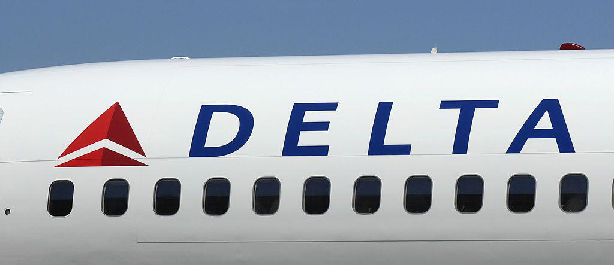

The airline industry is a highly competitive and dynamic sector characterized by significant external and internal forces that directly impact profitability and operational efficiency. This environment challenges companies to continuously adapt and innovate to maintain viability and success. One effective analytical framework for assessing this competitive landscape is Porter's Five Forces, developed by Michael E. Porter. This model provides valuable insights by examining five critical forces that shape industry dynamics: industry rivalry, the threat of new entrants, the threat of substitutes, and the bargaining power held by buyers and suppliers. By understanding these forces, companies can identify both potential threats and opportunities, allowing them to strategically position themselves for sustainable growth.

Delta Air Lines, established in 1928 and headquartered in Atlanta, Georgia, stands as a significant player in the global airline industry. As one of the leading carriers, Delta Air Lines must navigate these forces strategically to maintain its competitive market position. This article explores Delta's approaches and strategies in response to these environmental pressures and challenges.

Moreover, technology's role in enhancing operational strategies cannot be overstated. Delta Air Lines has incorporated advanced technologies, notably algorithmic trading, as part of its overall strategy. Algorithmic trading, which automates complex processes associated with buying and selling assets, serves as a critical tool for Delta. This technology aids in optimizing fuel purchases and managing financial risks, thus significantly improving operational efficiency and cost management. By leveraging such innovations, Delta Air Lines not only strengthens its operational framework but also enhances its ability to compete effectively in an ever-evolving industry landscape.

## Table of Contents

## Overview of Porter's Five Forces

Porter's Five Forces framework, introduced by Michael E. Porter in 1979, is a strategic tool used to analyze the intensity of competition and the profitability potential of an industry. The model helps businesses understand the structural underpinnings of any market, thereby allowing them to devise strategies that will enhance their competitive position.

The framework includes three horizontal forces: industry rivalry, the threat of new entrants, and the threat of substitutes. These forces shape the competitive environment by influencing market saturation levels, potential market disruptors, and alternative products or services:

1. **Industry Rivalry**: This force examines the degree of competition between existing firms. Factors influencing competitiveness include the number of competitors, rate of industry growth, product or service differentiation, and overall market capacity.

2. **Threat of New Entrants**: This force considers the possibility and impact of new competitors entering the market. High entry barriers, such as substantial capital requirements, strong brand loyalty, strict regulations, and access to distribution channels, make it difficult for new entrants to penetrate, thus lowering this threat.

3. **Threat of Substitutes**: This evaluates the likelihood of customers finding alternative ways to fulfill the same need, often for a lower price or better performance. Substitutes limit industry profitability by placing a ceiling on price levels and encouraging firms to enhance product differentiation.

Additionally, the model incorporates two vertical forces: the bargaining power of buyers and suppliers.

1. **Bargaining Power of Buyers**: Buyers exert pressure on firms to offer higher quality products, better customer service, and lower prices. The buying power increases if many substitute products are available, switching costs are low, or the buyer purchases in large quantities and is price-sensitive.

2. **Bargaining Power of Suppliers**: Suppliers can influence price, quality, and availability of materials or components. Supplier power is stronger if there are few substitutes, if the suppliers serve multiple industries, or if the supplying industry has high switching costs or concentration.

Understanding these forces helps companies and investors strategically position themselves to exploit opportunities and counter threats within an industry. Through strategic decision-making based on these insights, businesses can aim for a sustainable competitive advantage and enhanced profitability in their respective markets.

## Delta Air Lines: Company Overview

Delta Air Lines, established in 1928, holds the distinction of being the oldest airline in continuous operation in the United States. As one of the leading carriers, Delta has its headquarters in Atlanta, Georgia, a strategic location that contributes to its significant domestic market share. Over the years, Delta has developed an extensive operational scale, enabling it to exert considerable leverage in navigating market pressures and competition effectively. This extensive network not only reinforces Delta's presence in key domestic markets but also enhances its ability to compete on an international scale.

Delta's strategic positioning is supported by its robust infrastructure and integrated operations. By maintaining hubs in major cities such as Atlanta, Detroit, Minneapolis-St. Paul, and Salt Lake City, Delta efficiently manages traffic and optimizes routes, thereby maximizing operational efficiencies. This network not only ensures connectivity across the United States but also provides access to international destinations, bolstering Delta's competitive advantage.

In recent years, Delta Air Lines has made significant strides in integrating advanced technologies to enhance operational efficiency and improve financial performance. A notable innovation is the use of [algorithmic trading](/wiki/algorithmic-trading) to optimize various aspects of its operations, particularly in fuel purchase management. Algorithmic trading allows for dynamic adjustment to fuel procurement strategies based on real-time market data, mitigating risks associated with price [volatility](/wiki/volatility-trading-strategies). This approach not only reduces costs but also ensures a stable and predictable fuel supply, a critical component given the volatility in fuel prices.

The adoption of advanced algorithmic tools reflects Delta's commitment to harnessing technology for strategic gains. As the airline industry becomes increasingly data-driven, Delta's proactive incorporation of technology underscores its focus on maintaining competitiveness and operational excellence. By leveraging these advanced systems, Delta not only enhances its overall efficiency but also positions itself as an innovative leader within the airline industry.

## Industry Competition

The airline industry is marked by intense competition, primarily due to the homogeneity in the services offered by airlines. Delta Air Lines confronts this competition from established carriers such as United Airlines and American Airlines, as well as from low-cost carriers like Southwest Airlines. This competition arises because most airlines provide similar core services, such as seat selection, in-flight entertainment, and comparable flight routes. Therefore, differentiating products and services becomes challenging, leading to reliance on pricing, loyalty programs, and customer service for competitive advantage.

Delta employs several strategic measures to maintain its market position and edge over rivals. Brand marketing plays a crucial role in Delta's strategy, focusing on establishing a strong brand presence that resonates with consumers. This is achieved through ad campaigns, sponsorships, and strategic partnerships that enhance brand visibility and consumer perception.

In addition to marketing, Delta prioritizes customer service improvements as a strategy to retain customer loyalty. The airline invests in training programs for its staff to ensure high levels of service quality, addressing customer needs with efficiency and courtesy. Enhanced customer service is often a distinguishing [factor](/wiki/factor-investing) that encourages repeat business and fosters loyalty in a crowded market.

Furthermore, Delta leverages its SkyMiles loyalty program to attract and retain frequent fliers. By offering rewards such as free flights, seat upgrades, and access to exclusive lounges, the airline creates added value for customers, subtly differentiating itself from competitors. This customer-centric approach not only strengthens client retention but also enhances Delta's attractiveness as a carrier, augmenting its competitive stature in an industry characterized by minimal differentiation.

## Bargaining Power of Buyers

Buyers in the airline industry possess considerable influence largely due to the abundance of choices available in the market. The presence of multiple airlines offering similar services intensifies their power, as does the relatively low cost associated with switching from one carrier to another. This competitive environment ensures that carriers such as Delta Air Lines must continuously strive to differentiate themselves to retain customer loyalty.

In recent years, the emergence of third-party booking platforms has significantly bolstered the bargaining power of buyers. Platforms like Expedia, Kayak, and Google Flights enable consumers to effortlessly compare prices and services across a multitude of airlines. This transparency places additional pressure on airlines to offer competitive pricing and enhanced service offerings to attract and retain customers. For Delta Air Lines, maintaining appeal amidst heightened buyer power involves implementing strategic measures that go beyond pricing.

Delta effectively counters this increased buyer power through the strategic development of unique loyalty programs and frequent flyer benefits. The SkyMiles program, for instance, encourages repeat business by rewarding customers with miles that can be redeemed for various perks, including free flights and upgrades. These incentives create an added layer of value that can outweigh mere price considerations for many travelers.

Moreover, Delta's partnerships with credit card companies extend additional benefits to consumers who choose to align their spending habits with the airline. These partnerships often offer exclusive benefits such as priority boarding, free checked baggage, and access to airport lounges. Such strategies serve to create a more holistic experience that nurtures brand loyalty and reduces the likelihood of customer attrition.

In conclusion, while the bargaining power of buyers is undeniably strong, Delta Air Lines' proactive approach in cultivating customer loyalty through value-added programs and strategic partnerships enables the airline to mitigate potential challenges. By focusing not just on competitive pricing but also on enhancing the overall customer experience, Delta maintains a robust customer base in an industry where buyers have numerous options.

## Threat of New Entrants

High capital requirements and stringent regulatory barriers significantly limit the entry of new competitors into the airline industry. Establishing an airline demands substantial financial investment to procure aircraft, secure airport slots, and build a robust operational infrastructure. Moreover, compliance with comprehensive safety and environmental regulations imposes additional hurdles for newcomers.

Delta Air Lines holds a distinct advantage due to its established brand equity and economies of scale. Being one of the largest airlines in the world, Delta has the ability to leverage its extensive resources to maintain competitive pricing and service levels. The brand loyalty cultivated over decades further consolidates its market position, making it difficult for potential new entrants to lure away Delta's customer base.

Economies of scale play a crucial role in Delta's defense against new competitors. By operating a vast network that covers both domestic and international destinations, Delta achieves cost efficiencies that smaller or emerging players cannot easily replicate. These efficiencies extend to areas like aircraft maintenance, bulk purchasing of fuel, and global distribution systems, which allow Delta to spread fixed costs over a larger revenue base. For example, the average cost, $C$, for operating an aircraft can be expressed mathematically as:

$$
C = \frac{F + V}{Q}
$$

where:
- $F$ represents fixed costs,
- $V$ represents variable costs, 
- $Q$ represents the quantity of service output (e.g., flights or seat miles).

An established airline like Delta typically benefits from a lower $C$, given its high $Q$.

Furthermore, Delta's economies of scale enable it to enter into strategic long-term arrangements with suppliers, reinforcing supply chain stability and cost predictability. These coverage agreements are advantageous when negotiating terms with aircraft manufacturers and fuel suppliers, contributing to a formidable barrier for new entrants who cannot match such favorable terms.

In summary, the combination of significant capital investment, regulatory complexity, Delta's brand equity, and economies of scale create powerful deterrents for new entrants considering entering the airline industry. These factors collectively sustain Delta's competitive edge and fortify its position against potential competitors.

## Bargaining Power of Suppliers

In the airline industry, suppliers wield considerable influence, primarily due to the limited number of aircraft manufacturers and the critical nature of fuel provision. The primary aircraft manufacturers, Boeing and Airbus, are dominant players, which limits airlines' ability to switch suppliers or negotiate lower prices. This oligopolistic nature of aircraft manufacturing gives these suppliers significant bargaining power, as airlines depend heavily on their products for fleet management and expansion.

Fuel suppliers also play a crucial role in the industry, given that fuel costs make up a substantial portion of an airline's operating expenses. Fluctuations in fuel prices can impact an airline's cost structure and profitability. Fuel price volatility is influenced by geopolitical factors and market dynamics, exacerbating the bargaining power of fuel suppliers.

Despite these challenges, Delta Air Lines' considerable size provides leverage in negotiations with suppliers. Delta has historically been able to secure favorable long-term contracts through strategic relationships and bulk purchasing agreements. These contracts often include provisions that help mitigate the impact of price fluctuations, ensuring a more predictable cost base for the airline.

Furthermore, Delta’s strategic investment in its own oil refinery, acquired in 2012, showcases its innovative approach to managing supplier power. By controlling part of its fuel supply chain, Delta can potentially lower its fuel costs and reduce reliance on traditional suppliers. This vertical integration strategy serves as a buffer against fuel price volatility, directly impacting Delta's operational costs and bargaining power.

Such negotiations and strategic maneuvers exemplify Delta's ability to manage supplier power effectively, ensuring cost efficiencies and competitive advantages in a challenging economic environment.

## Threat of Substitutes

The airline industry faces minimal threat from substitute products primarily due to the unique advantages air travel offers in terms of speed and convenience, particularly for long-distance travel. While other modes of transportation, such as trains, buses, and cars, are available, they typically cannot compete with airlines when it comes to reducing travel time over large distances. This inherent advantage makes it difficult for alternatives to capture substantial market share from the airline industry.

Rail travel, although popular in densely populated regions with well-developed infrastructure, like parts of Europe and Asia, generally serves shorter distances compared to airlines. High-speed trains can provide competitive alternatives in certain corridors, yet they remain limited by geographical and infrastructural constraints. For instance, while high-speed rail can cover distances efficiently up to approximately 500 miles, airlines can effortlessly surpass this range with higher speeds and fewer logistical limitations.

Buses and cars, similarly, face significant limitations for longer routes. Buses are often used as cost-effective solutions for intercity travel, but they sacrifice speed for lower fares. Automobiles offer flexibility and the convenience of door-to-door travel, yet they are constrained by lengthy travel times and potential fatigue over expansive journeys. Furthermore, the costs associated with long-distance driving, including fuel, tolls, and vehicle maintenance, may not always provide a significant financial advantage over flying, especially when considering low-cost air travel options.

Moreover, technological advancements in the airline sector further diminish the viability of substitutes. Aircraft manufacturers continue to innovate, enhancing fuel efficiency and reducing travel times, which in turn supports the competitive position of airlines. This continuous improvement cycle further elevates the perceived value of air travel in comparison to other modes of transportation.

Ultimately, despite the existence of alternative travel solutions, the unique proposition of air travel, featuring unmatched speed and a continually optimized cost structure, maintains its dominance for long-haul and international routes. Thus, the threat of substitutes remains a relatively minor concern for Delta Air Lines and other carriers within the airline industry.

## Algorithmic Trading in Airline Industry

Algorithmic trading has become an integral tool in the airline industry, primarily utilized to optimize fuel purchases and mitigate risks associated with volatile fuel prices. For airlines like Delta Air Lines, which consume vast quantities of fuel, even minor fluctuations in fuel prices can significantly impact operating costs. Leveraging algorithms allows Delta to analyze extensive datasets, forecast price trends, and execute trades at the most opportune times, thereby enhancing financial efficiency.

Delta employs algorithmic trading strategies to streamline its resource management processes. Through sophisticated algorithms, Delta is able to predict fuel price movements by analyzing historical data, market trends, and external economic indicators. These algorithms can be programmed to automatically execute buy orders when predicted trends indicate an upcoming rise in prices or sell orders when a price drop is anticipated. This preemptive approach to fuel purchasing ensures that Delta secures fuel at competitive prices, thus reducing overall operational costs.

Moreover, algorithmic trading facilitates risk management by allowing Delta to hedge against unfavorable price movements. By setting up predefined risk parameters within the algorithms, Delta can limit its exposure to price volatility. This hedging strategy protects the airline's profit margins, providing a buffer against sharp price increases which can arise from geopolitical tensions or supply chain disruptions. 

The use of algorithmic trading extends Delta's competitive advantage by enabling precise and timely decision-making, optimizing cost management, and safeguarding against financial uncertainties. As the airline industry becomes increasingly data-driven, the continued evolution and implementation of algorithmic trading will be pivotal for Delta in maintaining its operational edge and enhancing profitability amidst fluctuating market conditions.

## Conclusion

Porter's Five Forces model offers critical insights into the competitive environment confronting Delta Air Lines. Despite facing intense rivalry and substantial buyer power, Delta demonstrates resilience through strategic initiatives. By fostering robust brand marketing and enhancing customer service, Delta strengthens its market position and achieves customer loyalty.

The airline's integration of algorithmic trading exemplifies its dedication to innovation and operational prowess. By employing advanced algorithms for optimizing fuel purchases and managing financial risks, Delta enhances its financial efficiency and reduces operational costs. Through such technological leverage, Delta secures a formidable competitive advantage in resource management.

Understanding and strategically addressing these forces, coupled with the adoption of cutting-edge technologies, are pivotal for sustaining a competitive edge in the airline industry. Delta's continuous adaptation and strategic foresight underscore its ability to navigate an evolving and challenging market landscape effectively.

## References & Further Reading

[1]: Porter, M. E. (1979). ["How Competitive Forces Shape Strategy"](https://hbr.org/1979/03/how-competitive-forces-shape-strategy). Harvard Business Review.

[2]: Porter, M. E. (2008). ["The Five Competitive Forces That Shape Strategy."](https://hbr.org/2008/01/the-five-competitive-forces-that-shape-strategy) Harvard Business Review, 86(1), 78-93.

[3]: Ciliberto, F., Murry, C., & Tamer, E. (2016). ["Market Structure and Competition in Airline Markets."](https://www.ftc.gov/system/files/documents/public_events/945353/ciliberto_murry_tamer.pdf) American Economic Journal: Microeconomics, 8(3), 1-45.

[4]: Button, K., & Stough, R. (2000). ["The Benefits of Being a Hub Airport."](https://books.google.com/books/about/Air_Transport_Networks.html?id=rbq4AAAAIAAJ) Journal of Air Transport Management, 6(2), 177-183.

[5]: ["Algorithmic Trading: Winning Strategies and Their Rationale"](https://www.amazon.com/Algorithmic-Trading-Winning-Strategies-Rationale-ebook/dp/B00CY5HC0U) by Ernest P. Chan

[6]: Wu, J., & Zhang, Y. (2010). ["Fuel Hedging and Firm Value: Evidence from the Airline Industry."](https://msutexas.contentdm.oclc.org/digital/api/collection/thesis_coll/id/598/download) Journal of Corporate Finance, 16(2), 113-152.

[7]: Tretheway, M. W., & Markhvida, K. (2010). ["The Aviation Value Chain: Economic Returns and Policy Issues."](https://www.sciencedirect.com/science/article/pii/S0969699714000854) Journal of Air Transport Management, 16(1), 15-21.